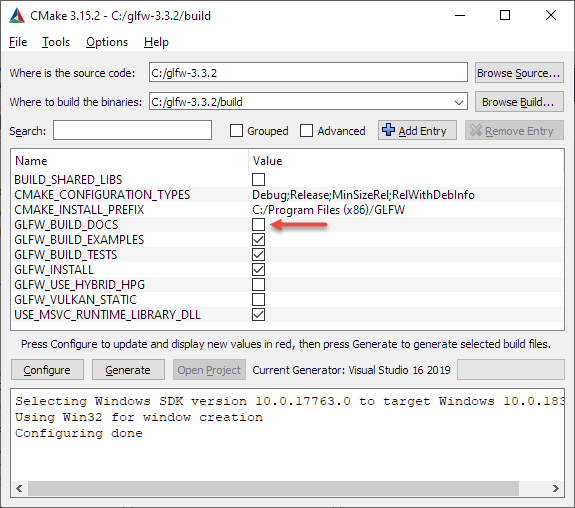

# Часть 1.2 — Создание окна

Первое, что нам нужно сделать, прежде чем мы начнем создавать потрясающую графику, - это создать контекст OpenGL и окно приложения для рисования. Однако эти операции специфичны для каждой операционной системы, и OpenGL целенаправленно пытается абстрагироваться от этих операций. Это означает, что мы должны создать окно, определить контекст и обработать пользовательский ввод самостоятельно.

К счастью, существует довольно много библиотек, которые предоставляют нужную нам функциональность, некоторые специально предназначены для OpenGL. Эти библиотеки экономят нам всю работу, связанную с операционной системой, и дают нам окно и контекст OpenGL для рендеринга. Некоторые из наиболее популярных библиотек - GLUT, SDL, SFML и GLFW. На LearnOpenGL мы будем использовать GLFW . Не стесняйтесь использовать любые другие библиотеки, настройка для большинства из них аналогична настройке GLFW.

## GLFW

GLFW — это библиотека, написанная на C, специально нацеленная для предоставления OpenGL самого необходимого для отрисовки контента на экран. Она позволяет нам создать контекст, определить параметры окна и работать с пользовательским вводом, а это все что там сейчас нужно.

В основном в этом и следующем уроке мы будем заставлять GLFW нормально работать, проверять правильность создания OpenGL контекста и производить отрисовку окна в котором мы будет рисовать графику. Этот урок пошагово расскажет о сборке и линковке GLFW библиотеки. Для этого урока мы будем использовать Microsoft Visual Studio 2019 \(заметьте, что процесс будет мало отличаться для других версий VS\). Если вы не используете VS — то не волнуйтесь, этот процесс очень похож для всех IDE.

### Сборка GLFW

GLFW можно скачать со страницы загрузки официального [сайта](http://www.glfw.org/download.html). GLFW уже имеет предварительно скомпилированные двоичные файлы и файлы заголовков для Visual Studio 2012 до 2019 года, но для полноты картины мы сами скомпилируем GLFW из исходного кода. Это должно дать вам представление о процессе компиляции библиотек с открытым исходным кодом, поскольку не в каждой библиотеке будут доступны предварительно скомпилированные двоичные файлы. Итак, давайте загрузим пакет Source.

> Мы будем собирать все библиотеки как 64-битные двоичные файлы, поэтому убедитесь, что вы получили 64-битные двоичные файлы, если вы используете их предварительно скомпилированные двоичные файлы.

После того, как вы скачаете пакет — разархивируйте его. Нам интересны следующие элементы:

- Результат компиляции
- Папка **include**

Сборка библиотеки из исходного кода гарантирует, что результирующая библиотека будет идеально работать на вашем CPU/OS, чего нельзя сказать про поставляемые прекомпилированные библиотеки \(иногда они даже просто недоступны для вашей системы\). Основная проблема предоставления исходного кода миру, что далеко не все используют одну и ту же IDE для разработки их приложения, что означает, что Проектные файлы могут быть просто несовместимы с другими IDE. И из за этого людям приходится руками собирать собственные проекты, что, очевидно, не очень удобно. Специально для того, чтобы избежать этой проблемы был придуман CMake.

### CMake

CMake — это инструмент для генерации файлов Проекта/Решения для IDE, выбранного пользователем \(Visual Studio, Code::Blocks, Eclipse\)  из коллекции файлов исходного кода с использованием предварительно определенных сценариев CMake. Это позволяет нам генерировать файл проекта Visual Studio 2019 из исходного пакета GLFW, который мы можем использовать для компиляции библиотеки. Сначала нам нужно скачать и установить CMake, который можно найти на их странице [загрузки](http://www.cmake.org/cmake/resources/software.html).

Как только CMake установится, вы сможете выбрать запуск CMake из консоли или в качестве графического приложения. Так как мы стараемся не перегружать уроки — то мы выберем графическое приложение. CMake требует указать директорию с исходным кодом и папку, куда будет записан результат в виде бинарных файлов. В качества директории с исходным кодом мы укажем корневую папку разархивированного GLFW пакета с исходным кодом, а в качестве папки для бинарных файлов мы укажем новую директорию *build*.


После установки требуемых директорий, нажмите **Configure**, что бы CMake считал требуемые настройки и исходный код. Затем нам требуется выбрать генератор для проекта. Так как мы собираемся использовать Visual Studio 2019 мы выбираем Visual Studio 16 \(Visual Studio 2019 также известна как Visual Studio 16\). Далее CMake отобразит возможные настройки сборки, их можно оставить без изменения, нажав еще раз на **Configure** для их сохранения. После сохранения настроек можем приступать к генерации проекта, для этого нажмите на **Generate** и в папке **build** будут созданы файлы проекта.

### Компиляция

В папке **build** появился файл **GLFW.sln**, открываем его Visual Studio. CMake должен был сгенерировать проект со всеми требуемыми настройками, поэтому просто начинаем сборку, нажимая на **Build Solution** и в качестве результата мы получае **glfw3.lib** \(мы используем 3 версию\) в папке **src/Debug**.

После того, как библиотека сгенерировалась надо удостовериться, что IDE знает где искать библиотеку и заголовочные файлы. Есть 2 способа сделать это:

1. Мы ищем **/lib** и **/include** папки IDE или Компилятора и добавляем туда папку **include** и **lib** из GLFW. Это будет работать, но так лучше не делать. Такой метод сложно отследить и вы потеряете все файлы при переустановке или смене компилятора/IDE.

2. Рекомендованный способ — это создать набор директорий, содержащие все заголовочные файлы и библиотеки от третьих лиц к которым вы могли бы обращаться при использовании вашего IDE или Компилятора. Лично я использую одну папку, содержащую папки **Libs** и **Include** где я храню все свои заголовочные файлы и библиотеки для OpenGL проектов. Теперь все мои библиотеки от третьих лиц собраны в одном месте \(и их легко перемещать между разными PC\). Единственный недостаток — необходимость для каждого нового проекта указывать местоположение этой папки.

По завершению выбранного вами действия можно перейти к созданию нашего первого OpenGL проекта с GLFW.

## Наш первый проект

Для начала давайте откроем Visual Studio и создадим новый проект. Выберите Visual C++ и Пустой проект \(не забудьте выдать проекту приемлемое имя\). Теперь у нас есть рабочее пространство для создания нашего первого приложения с использованием OpenGL.

### Линковка

Для использования GLFW нам также требуется его связать с нашим проектом. Это делаеться, указанием, что мы хотим использовать **glfw3.lib** в настройках линковщика, но наш проект все еще не знает, где искать **glfw3.lib** \(если вы не выбрали 1 вариант во время решения проблемы с местонахождением файлов библиотек\), соответственно нам надо добавить эти директории в проект.

Мы можем добавить те директории, для этого перейдите в **VC++ Directories**, как показано на изображении ниже:


И оттуда вы можете добавить собственные директории, чтобы проект знал где искать требуемые файлы. Это можно сделать ручным способом, просто вставив путь в текстовое поле, либо нажав на **Edit...**, где вы сможете добавить значения в специальном окне.



Здесь вы можете добавить такое количество директорий, какое вам захочется, а IDE также будет искать требуемые файлы там. Теперь, когда **Include** папка указана для среды вы сможете найти все требуемые заголовочные файлы GLFW в <GLFW/..>. Тоже самое применимо и для директории с библиотеками.

И уже после того, как Visual Studio узнал, где искать требуемые библиотеки, мы наконец можем связать GLFW и наш проект:


Здесь требуется указать название линкуемой библиотеки, в нашем случае это **glfw3.lib** и добавляем мы ее в поле **Additional Dependencies** \(сделать это также можно изменив руками или использовав кнопку **<Edit…>**\) и теперь GLFW будет линковаться к проекту во время компиляции. Также требуется указать OpenGL библиотеки, но этот процесс отличается для разных ОС.

### OpenGL библиотека для Windows

Если вы используете Windows — то библиотека, называющаяся **opengl32.lib** поставляется с Microsoft SDK, которая ставится по умолчанию при установке Visual Studio. Так как в этом уроке мы и так использует Visual Studio — то здесь будет достаточно просто добавить **opengl32.lib** в настройки линковщика.

### OpenGL библиотека для Linux

На Linux системах вам требуется использовать **libGL.so** библиотеку, использовав флаг **-lGL** в настройках линковщика. Если вы не можете найти эту библиотеку — то вам, вероятно, требуется поставить Mesa, NVidia или AMD dev пакеты, но я не буду вдаваться в подробности, так как это очень специфично для платформы \(плюс я не являюсь Linux экспертом\).

По окончанию добавления GLFW и OpenGL библиотеки в настройки линковщика вы можете подключать GLFW следующим образом:

```cpp
#include <GLFW\glfw3.h>
```

Это финальный этап установки и настройки OpenGL.

## GLAD

Но мы еще не закончили с настройкой OpenGL. Кое что еще придется сделать. Поскольку OpenGL — это лишь спецификация — то реализация ложится на плечи разработчиков видеокарт. По этой причине, поскольку существует множество реализаций OpenGL реальное расположение OpenGL функций не доступно на этапе компиляции и их приходится получать на этапе исполнения. Фактически получение адресов функций ложится на плечи программиста. Процесс получения адресов специфичес для каждой платформы, для Windows это выглядит примерно так:

```cpp
// Определяем прототип функции
typedef void (*GL_GENBUFFERS) (GLsizei, GLuint*);
// Находим эту функцию в реализации и сохраняем указатель на нее
GL_GENBUFFERS glGenBuffers  = (GL_GENBUFFERS)wglGetProcAddress("glGenBuffers");
// Теперь мы можем нормально вызвать эту функцию
GLuint buffer;
glGenBuffers(1, &buffer);
```

Как вы можете заметить код выглядит довольно запутанным, а необходимость производить получение адреса для каждой OpenGL функции делает этот процесс просто мучительным. Но к счастью существуют библиотеки реализующие эту динамическую линковку и одной из самых популярных библиотек является **GLEW**

### Настройка GLAD

GLAD - это библиотека с [открытым исходным кодом](https://github.com/Dav1dde/glad), которая управляет всей той громоздкой работой, о которой мы говорили. GLAD имеет немного другую конфигурацию конфигурации, чем большинство распространенных библиотек с открытым исходным кодом. GLAD использует [веб-сервис](http://glad.dav1d.de/), где мы можем сообщить GLAD, для какой версии OpenGL мы хотели бы определить и загрузить все соответствующие функции OpenGL в соответствии с этой версией.

Перейдите в [веб-сервис](http://glad.dav1d.de/) GLAD, убедитесь, что язык установлен на C ++, и в разделе API выберите версию OpenGL 3.3 \(что мы и будем использовать; более высокие версии также подойдут\). Также убедитесь, что в профиле установлено значение Core и установлен флажок "Generate a loader" . Не обращайте внимания на расширения (пока) и нажмите "Generate", чтобы создать файлы библиотеки.

К настоящему времени GLAD должен был предоставить вам zip-файл, содержащий две папки и один файл glad.c Скопируйте обе папки \(glad и KHR\) в директорию include \(или добавьте дополнительный элемент, указывающий на эти папки\) и добавьте файл glad.c в свой проект.

После предыдущих шагов вы сможете добавить следующую директиву include:

```cpp
#include <glad/glad.h> 
```

Нажатие на кнопку компиляции не должно давать вам никаких ошибок, и в этот момент мы собираемся перейти к [следующей главе](part%201/chapter%203/text.md), где мы обсудим, как мы можем фактически использовать GLFW и GLAD для настройки контекста OpenGL и создания окна. Убедитесь, что все ваши каталоги include и библиотеки правильные и что имена библиотек в настройках компоновщика соответствуют соответствующим библиотекам.

## Дополнительные ресурсы

- [Сборка приложений](http://www.opengl-tutorial.org/miscellaneous/building-your-own-c-application/): предоставляет подробную информацию о процессе линковки и компиляции приложения с большим количеством различных возможных ошибок;
- [GLFW с Code::Blocks](http://wiki.codeblocks.org/index.php?title=Using_GLFW_with_Code::Blocks): сборка GLFW в Code::Blocks IDE;
- [Запуск CMake](http://www.cmake.org/runningcmake/): небольшой урок о запуске CMake под Windows и Linux;
- [Написание сборочной системы под Linux](http://learnopengl.com/demo/autotools_tutorial.txt): урок по autotools от Wouter Verholds описывающий процесс написания системы сборки в Linux специально настроенных для этих уроков;
- [Polytonic/Glitter](https://github.com/Polytonic/Glitter): простой шаблонный проект, который поставляется пред-настроенным со всемы требуемыми библиотеками; идеален, если вы хотите увидеть пример полностью работающего LearnOpenGL проекта.
