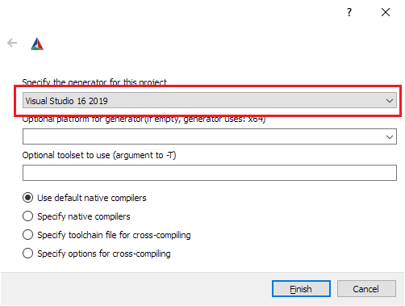
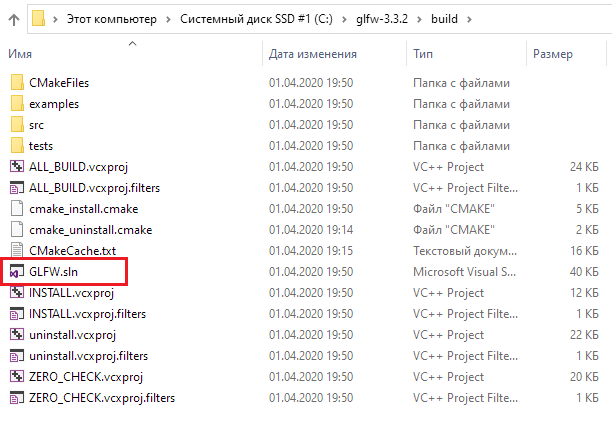

# Подготовка к первому проекту OpenGL: настройка GLFW, CMake и GLAD

Первое, что нам нужно сделать, прежде чем мы начнем программировать графику, — это создать контекст OpenGL и окно приложения для рисования. Однако данные операции являются специфичными для каждой операционной системы, поэтому OpenGL целенаправленно пытается абстрагироваться от них. Это означает, что мы самостоятельно должны создать окно, определить контекст и обрабатывать пользовательский ввод.

К счастью, существует довольно много библиотек, которые обеспечивают необходимый нам функционал, при этом некоторые из них специально нацелены на работу с OpenGL. Эти библиотеки избавят нас от всей специфической работы, связанной с особенностями конкретной операционной системы. Одними из наиболее популярных библиотек являются: GLUT, SDL, SFML и GLFW. На этих уроках мы будем использовать библиотеку GLFW. Вы также можете использовать и любую другую библиотеку из предоставленного списка, т.к. установка и настройка для большинства из них аналогична установке и настройке GLFW.

## Библиотека GLFW

**GLFW** \(англ. "Graphics Library FrameWork"\) — это библиотека, написанная на языке Си, специально предназначенная для работы с OpenGL. Библиотека GLFW предоставит нам все необходимые инструменты, которые потребуется для рендеринга на экран различных объектов. Благодаря этому мы сможем создавать контексты OpenGL, определять параметры окна и обрабатывать пользовательский ввод, что вполне коррелирует с нашими целями.

Основное внимание на этом и следующем уроках уделяется тому, чтобы разобраться с библиотекой GLFW, создать корректный контекст OpenGL и простое окно, в котором мы и будем рисовать наши объекты. На этом уроке мы пошагово рассмотрим установку библиотеки GLFW, а также процесс сборки и компиляции программы в связке с GLFW.

> **Примечание**: На момент написания данной статьи в качестве среды разработки мы будем использовать **Microsoft Visual Studio 2019** \(обратите внимание, что наши действия будут аналогичными и с более старыми версиями Visual Studio\). Если же вы используете более старую версию Visual Studio \(или вообще другую среду разработки\), то можете быть спокойны, т.к. процесс установки и настройки GLFW аналогичен в большинстве IDE.

## Сборка GLFW

Библиотеку GLFW можно скачать с [официального сайта](https://www.glfw.org/download.html). Стоит отметить, что GLFW уже имеет предварительно скомпилированные бинарные и заголовочные файлы для Visual Studio 2010-2019, но для полноты картины их мы использовать не будем, а вместо этого вручную скомпилируем GLFW из исходного кода. Это делается для того, чтобы вы сами прочувствовали процесс компиляции библиотек с открытым исходным кодом, поскольку не каждая подобная библиотека будет предоставлять возможность скачать предварительно скомпилированные бинарные файлы. Итак, давайте загрузим пакет с исходным кодом.

> **Примечание**: Мы будем собирать все библиотеки в формате 64-битных бинарных файлов, поэтому убедитесь, что скачиваете и используете именно 64-битные бинарные файлы.

После загрузки пакета с файлами исходного кода, извлеките и откройте его содержимое. Нас интересуют следующие вещи:

- библиотека, которая будет получена в результате компиляции;
- папка `include`.

Компиляция библиотек из исходного кода гарантирует, что полученная нами библиотека идеально подойдет для нашего процессора и операционной системы, в то время как предварительно скомпилированные бинарные файлы не всегда могут этим похвастаться \(иногда они вообще недоступны для вашей системы\). Однако проблема проектов, распространяющихся под эгидой открытого программного обеспечения, заключается в том, что не все используют одну и ту же IDE или систему сборки для разработки своего приложения, а это значит, что предоставленные файлы проекта\/решения могут быть несовместимы с настройками IDE у других людей. Следовательно, каждый конечный пользователь должен настроить свой собственный проект\/решение с учетом полученных `*.с`\/`*.cpp` и `*.h`\/`*.hpp` файлов, что почти всегда является довольно трудоемким и громоздким процессом. Но не спешите расстраиваться, для решения данной проблемы уже существует удобный инструмент сборки проектов под названием CMake.

## CMake

**CMake** — это инструмент, который, с использованием заранее определенных сценариев, может из коллекции файлов исходного кода сгенерировать файлы проектов/решений под выбранную пользователем IDE (например, для Visual Studio, Code::Blocks или Eclipse). Он позволит нам из исходного пакета файлов GLFW создать файл проекта под среду разработки Visual Studio 2019, а затем данный файл мы сможем использовать для компиляции библиотеки. Но сначала нам нужно его [скачать](https://cmake.org/download/), а затем установить.

После установки CMake у вас будет 2 варианта:

- запустить CMake из командной строки;
- запустить Cmake через графический интерфейс.

Поскольку мы не стремимся всё усложнять, то остановимся на варианте с использованием графического интерфейса. Для работы с CMake нам потребуется указать папку с файлами исходного кода проекта \(в нашем случае `glfw-3.3.2`\) и папку назначения для бинарных файлов. Для папки исходного кода мы собираемся выбрать корневую папку загруженного исходного пакета GLFW, а для папки сборки мы создадим новый каталог `build`:


После того, как мы прописали пути для исходной и целевой папок, нам нужно нажать кнопку `Configure`, чтобы CMake cмог просмотреть исходные файлы GLFW и выбрать необходимые параметры для сборки.

В следующем окне необходимо задать используемую версию Visual Studio. Т.к. работать мы будем в Visual Studio 2019, то выбираем опцию `Visual Studio 16 2019`:



Далее CMake отобразит возможные варианты сборки библиотеки. Можно оставить значения по умолчанию и снова нажать кнопку `Configure`, чтобы сохранить настройки:


После установки параметров мы нажимаем кнопку `Generate`, в результате чего в папке `build будут` созданы необходимые файлы проекта.

## Компиляция проекта

Теперь, зайдя в папку `build`, среди всего прочего можно увидеть файл с именем `GLFW.sln`, открываем его с помощью Visual Studio 2019:



Поскольку CMake сгенерировал файл проекта, который уже содержит соответствующие параметры конфигурации, нам остается лишь построить решение. При этом CMake должен был автоматически настроить вариант компилирования решения в виде 64-битной библиотеки. Благодаря этому мы получим скомпилированный файл библиотеки с именем `glfw3.lib`, который будет находиться в папке `build/src/Debug`.

После того, как мы создали библиотеку, нужно убедиться, что IDE знает, где найти данный файл, а также другие подключаемые файлы нашей программы OpenGL. Решить этот вопрос можно двумя способами:

- **Способ №1**: Можно скопировать содержимое папки `include` проекта GLFW в соответствующую папку `include` вашей IDE или компилятора, а также скопировать полученный файл `glfw3.lib` в соответствующую папку `/lib` вашей IDE или компилятора. Данный способ вполне рабочий, но мы его не рекомендуем, так как новая установка IDE или компилятора приведет к тому, что вам заново придется подключать необходимые файлы.
- **Способ №2**: Вы можете создать новую папку, которая будет содержать все заголовочные файлы и файлы из сторонних библиотек, на которую вы впоследствии сможете ссылаться из своей IDE или компилятора. Например, можно создать папку, в которой будут находиться папки `Lib` и `Includ`e. В них мы будем хранить все наши библиотечные и подключаемые файлы, которые собираемся использовать для наших OpenGL-проектов. Получается, что все сторонние библиотеки будут организованы в одном месте (и их можно будет совместно использовать на нескольких компьютерах). Однако, каждый раз при создании нового проекта, мы должны будем указывать IDE соответствующие пути к этим папкам.

Как только необходимые файлы будут сохранены в выбранном вами месте, мы сможем приступить к созданию нашего первого OpenGL-GLFW-проекта.

## Наш первый проект

Для начала давайте откроем Visual Studio и создадим новый проект. Для этого нужно выбрать тип проекта `C++`, а далее — `Пустой проект` \(не забудьте дать проекту подходящее имя\):


Теперь у нас есть рабочее пространство для создания нашего самого первого OpenGL-приложения!

## Линковка проекта

Для того, чтобы наш проект мог использовать GLFW, нам нужно связать с ним полученную библиотеку. Это можно сделать, указав в настройках линкера, что мы хотим использовать библиотеку `glfw3.lib`, но проект пока не знает где её искать, т.к. все подобные файлы мы переместили в другую папку. Таким образом, сначала мы должны добавить эту папку в наш проект.

Для этого нажмите правой кнопкой мышки на имя проекта в `Обозреватель Решений` > `Свойства`. В появившемся окне выберите `Каталоги VC++` > `Каталоги библиотек`":


Здесь вы можете добавить свои собственные каталоги, чтобы проект знал, где искать необходимые файлы. Это можно сделать, вставив вручную путь до каталога или щелкнув по соответствующей строке и выбрав пункт `<Изменить…>`, в результате чего откроется следующее окно:


Здесь вы можете добавить столько дополнительных каталогов, сколько захотите, и с этого момента IDE при поиске файлов библиотек также будет просматривать и эти директории. Поэтому, как только вы подключите папку `Lib` из проекта GLFW, вы сможете использовать все файлы библиотек из этой папки. Аналогично обстоят дела и с добавлением папки `Include` для заголовочных файлов.

Поскольку для VS были указаны все необходимые файлы, то мы, наконец, можем связать GLFW с нашим проектом, перейдя в раздел `Компоновщик` > `Ввод`:


Чтобы связать библиотеку нам нужно указать для компоновщика её имя. Так как библиотека называется `glfw3.lib`, то мы добавляем название этого файла в раздел `Дополнительные зависимости` \(вручную или же через пункт `<Изменить…>`\) и с этого момента при запуске процесса компиляции GLFW будет связан с нашим проектом. В дополнение к GLFW мы также должны добавить ссылки на библиотеку OpenGL, но данные действия будут отличаться в зависимости от \(вашей\) используемой операционной системы:

- **Библиотека OpenGL в Windows**. Если вы используете операционную систему Windows, то необходимый нам файл библиотеки `opengl32.lib`, входящий в пакет Microsoft SDK, уже есть вместе с Visual Studio и не требует отдельной установки. Поскольку мы используем компилятор VS и работаем под операционной системой Windows, то всё, что вам нужно сделать — это добавить название файла `opengl32.lib` к общему списку параметров компоновщика.
- **Библиотека OpenGL в Linux**. Если вы работаете в операционной системе Linux, то вам нужно подключить библиотеку `libGL.so` с помощью ключей `–lGL`, добавляемых к параметрам вашего компоновщика. Если вы не можете найти данную библиотеку, то вам, вероятно, необходимо установить любой из пакетов Mesa, NVidia или AMD dev.

Затем, после добавления библиотек GLFW и OpenGL в настройки компоновщика, вы сможете подключить заголовочные файлы GLFW следующей строкой кода:

```cpp
#include <GLFW\glfw3.h>
```

>Примечание: Для пользователей Linux, использующих компилятор GCC, помочь скомпилировать проект помогут следующие параметры командной строки:
>
>```cpp
>-lglfw3 -lGL -lX11 -lpthread -lXrandr -lXi –ldl
>```
>
>Неправильное линкование соответствующих библиотек приведет к возникновению ошибок.

На этом установка и настройка GLFW завершена.

## GLAD

Поскольку OpenGL на самом деле является лишь стандартом/спецификацией, то производитель драйверов должен реализовать спецификацию для драйвера, поддерживаемого конкретной видеокартой. Из-за того, что существует множество различных версий драйверов OpenGL, расположение большинства OpenGL-функций во время компиляции не известно и должно быть запрошено во время выполнения программы. Задача разработчика состоит в том, чтобы получить расположение нужных ему функций и сохранить их в виде указателей на функции для последующего использования. Получение мест расположений этих функций зависит от [конкретной операционной системы](https://www.khronos.org/opengl/wiki/Load_OpenGL_Functions).

В Windows это выглядит примерно следующим образом:

```cpp
// Определение прототипа функции
typedef void (*GL_GENBUFFERS) (GLsizei, GLuint*);

// Поиск функции и её присваивание указателю на функцию
GL_GENBUFFERS glGenBuffers  = (GL_GENBUFFERS)wglGetProcAddress("glGenBuffers");

// Теперь функцией можно пользоваться как обычно
unsigned int buffer;
glGenBuffers(1, &buffer);
```

Как вы наверняка могли заметить, данный код выглядит несколько сложным, к тому же разработчикам придется каждый раз проходить через этот громоздкий процесс, совершая эти действия для каждой функции, которая может понадобиться, и которая еще не была объявлена. К счастью, есть решение — библиотека GLAD.

## Установка GLAD

GLAD — это библиотека с открытым [исходным кодом](https://github.com/Dav1dde/glad), которая управляет всей той громоздкой работой, о которой мы говорили выше. GLAD имеет несколько иную настройку конфигурации, чем большинство распространенных библиотек с открытым исходным кодом. Она использует веб-сервис, где мы можем сообщить GLAD, для какой версии OpenGL мы хотели бы определить и загрузить все соответствующие функции OpenGL.

Перейдите в [веб-сервис](https://glad.dav1d.de/) GLAD, убедитесь, что в поле `Language` выбран язык `C/C++` и в разделе `API` выберите версию `OpenGL — 3.3` \(именно её мы и будем использовать; хотя более новые версии также подойдут\). Кроме того, убедитесь, что в поле `Profile` установлено `Core`:


Также параметр `Generate a loader` должен быть отмечен галочкой. Пункт `Extensions` мы пока пропустим, остается нажать кнопку `Generate`, чтобы создать нужные нам файлы библиотеки:


К этому моменту GLAD предоставит вам возможность скачать zip-архив, содержащий в себе две подключаемые папки и файл `glad.c`. Вам нужно скопировать обе эти папки \(`glad` и `KHR`\) в свою папку с подключаемыми файлами \(или добавьте дополнительный элемент, указывающий на эти папки в свойствах проекта\), а также добавить файл `glad.c` в свой проект.

После выполнения этих шагов вы сможете использовать следующую директиву include:

```cpp
#include <glad/glad.h>
```

Теперь, при попытке скомпилировать проект, у вас не должно возникать никаких ошибок.

На следующем уроке мы рассмотрим использование GLFW, настройку контекста OpenGL и создание окна. Обязательно убедитесь, что все ваши `include` и `library` каталоги являются корректными и что имена библиотек в настройках компоновщика соответствуют указанным библиотекам.

## Дополнительные ресурсы

- [GLFW: Window Guide](https://www.glfw.org/docs/latest/window_guide.html): официальное руководство GLFW по настройке и конфигурации окна GLFW.
- [Создание приложений](http://www.opengl-tutorial.org/miscellaneous/building-your-own-c-application/): предоставляет отличную информацию о процессе компиляции/линкинга вашего приложения и большой список возможных ошибок \(+ решения\), которые могут возникнуть.
- [GLFW с Code::Blocks](http://wiki.codeblocks.org/index.php?title=Using_GLFW_with_Code::Blocks): использование GLFW с Code::Blocks.
- [Использование CMake](https://cmake.org/runningcmake/): краткий обзор того, как запустить CMake в Windows и в Linux.
- [Polytonic/Glitter](https://github.com/Polytonic/Glitter): простой шаблонный проект, который предварительно настроен со всеми соответствующими библиотеками; отлично подойдет, если вам нужен пример того, что можно сделать при помощи OpenGL, без необходимости компилировать все библиотеки самостоятельно.
