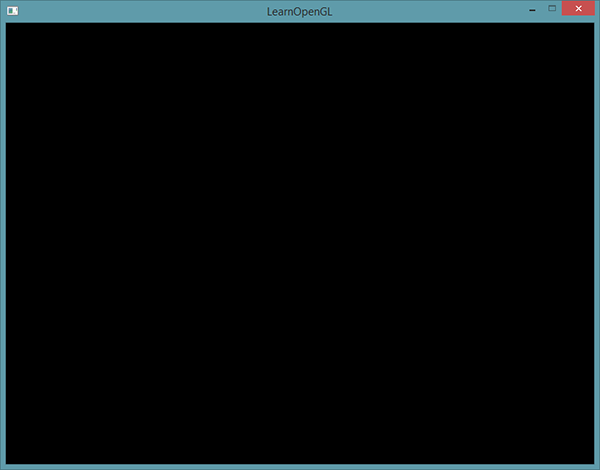
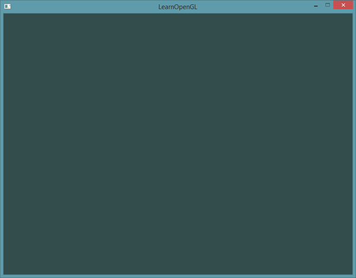

# Часть 1.3. Hello Window

Давайте посмотрим, сможем ли мы запустить GLFW и запустить его. Сначала создайте файл .cpp и добавьте следующие элементы в начало вновь созданного файла.

```cpp
#include <glad/glad.h>
#include <GLFW/glfw3.h>
```

> Не забудьте включить GLAD перед GLFW. GL/gl.h файл для GLAD включает в себя необходимые заголовки OpenGL за кулисами \(например, GL/gl.h\), поэтому обязательно GL/gl.h GLAD перед другими заголовочными файлами, для которых требуется OpenGL \(например, GLFW\).

Далее напишем функцию main, пока что в ней будет создаваться окно GLFW. Она будет иметь следующий вид:

```cpp
int main()
{
    glfwInit();
    glfwWindowHint(GLFW_CONTEXT_VERSION_MAJOR, 3);
    glfwWindowHint(GLFW_CONTEXT_VERSION_MINOR, 3);
    glfwWindowHint(GLFW_OPENGL_PROFILE, GLFW_OPENGL_CORE_PROFILE);
    //glfwWindowHint(GLFW_OPENGL_FORWARD_COMPAT, GL_TRUE);
    return 0;
}
```

В данной функции мы сначала инициализируем **GLFW** вызывом функции **glfwInit**, после чего приступаем к его настройке, используя функцию **glfwWindowHint**. **glfwWindowHint** имеет очень простую сигнатуру, первым аргументом необходимо передать идентификатор параметра, который подвергается изменению, а вторым параметром передается значение, которое устанавливается соответствующему параметру. Идентификаторы параметров, а также некоторые их значения находятся в общем перечислении с префиксом **GLFW_**. Больше подробностей о настройке контекста GLFW можно найти в [официальной документации GLFW](http://www.glfw.org/docs/latest/window.html#window_hints). Если при запуске этого примера вы получаете ошибки, сильно похожие на неопределенное поведение, это значит то, что вы неправильно подключили библиотеку GLFW.

Поскольку основное внимание в этом тексте уделяется OpenGL версии 3.3, мы хотели бы сообщить GLFW, что 3.3 - это версия OpenGL, которую мы хотим использовать. Таким образом, GLFW может принять правильные меры при создании контекста OpenGL. Это гарантирует, что когда у пользователя нет правильной версии OpenGL, GLFW не будет работать. Мы устанавливаем основную и вспомогательную версию как 3 . Мы также сообщаем GLFW, что хотим явно использовать core-profile. Это приведет к ошибке в случае использования устаревших функций OpenGL. Если вы используете Mac OS X, то необходимо добавить следующий вызов функции `glfwWindowHint(GLFW_OPENGL_FORWARD_COMPAT, GL_TRUE)` к вашему коду инициализации.

> Убедитесь в наличии поддержки OpenGL версии 3.3 и выше вашим железом и наличие установленного OpenGL соответствующей версии в ОС. Для того, чтобы узнать версию OpenGL на вашем компьютере под Linux используйте glxinfo в консоли. Для Windows можно использовать программу [OpenGL Extension Viewer](http://download.cnet.com/OpenGL-Extensions-Viewer/3000-18487_4-34442.html). Если версия OpenGL ниже необходимой убедитесь в том что ваше железо поддерживает его и/или попробуйте обновить драйвера.

Теперь нужно создать объект окна. Этот объект содержит всю необходимую информацию об окне и используется функциями GLFW.

```cpp
GLFWwindow* window = glfwCreateWindow(800, 600, "LearnOpenGL", nullptr, nullptr);
if (window == nullptr)
{
	std::cout << "Failed to create GLFW window" << std::endl;
	glfwTerminate();
	return -1;
}
glfwMakeContextCurrent(window);
```

Сигнатура функции glfwCreateWindow требует следующие аргументы: "Высота окна", "Ширина окна", "Название окна" \(оставшиеся аргументы нам не понадобятся\). Возвращает указатель на объект типа GLFWwindow, который нам потом понадобится. Далее мы создаем контекст окна, который будет основным контекстом в данном потоке.

## GLAD

В предыдущем уроке мы упоминали, что GLAD управляет указателями функций для OpenGL, поэтому мы хотим инициализировать GLAD перед вызовом любой функции OpenGL:

```cpp
if (!gladLoadGLLoader((GLADloadproc)glfwGetProcAddress))
{
    std::cout << "Failed to initialize GLAD" << std::endl;
    return -1;
}
```

Мы передаем GLAD функцию для загрузки адреса указателей на функции OpenGL, которая зависит от ОС. GLFW дает нам *glfwGetProcAddress* это определяет правильную функцию в зависимости от того, для какой ОС мы компилируем.

## Viewport

Прежде чем мы начнем что-либо отрисовывать нам надо еще кое что сделать. Нам нужно сообщить OpenGL размер отрисовываемого окна, чтобы OpenGL знал, как мы хотим отображать данные и координаты относительно окна. Мы можем установить эти значения через функцию **glViewport**.

```cpp
int width, height;
glfwGetFramebufferSize(window, &width, &height);
  
glViewport(0, 0, width, height);
```

Первые 2 аргумента функции **glViewport** — это позиция нижнего левого угла окна. Третий и четвертый — это ширина и высота отрисовываемого окна в px, которые мы получаем напрямую из GLFW. Вместо того, чтобы руками задавать значения ширины и высоты в 800 и 600 соответственно мы будем использовать значения из GLFW, поскольку такой алгоритм также работает и на экранах с большим DPI \(как Apple Retina\).

Также мы можем задать меньшие значения для viewport. В таком случае, вся отрисовываемая информация будет меньших размеров, и мы сможем, к примеру, отрисовывать другую часть приложения вне viewport.

> За кулисами OpenGL использует данные, переданные через **glViewport** для преобразования 2D координат в координаты экрана. К примеру позиция **\(-0.5, 0.5\)** в результате будет преобразована в **\(200, 450\)**. Заметьте, что обрабатываемые координаты OpenGL находятся в промежутке от -1 до 1, соответственно мы можем эффективно преобразовывать из диапазона \(-1, 1\) в \(0,800\) и \(0,600\).

Однако, как только пользователь изменяет размеры окна, окно просмотра также должно быть скорректировано. Мы можем зарегистрировать функцию обратного вызова в окне, которое вызывается при каждом изменении размера окна. Эта функция обратного вызова изменения размера имеет следующий прототип:

```cpp
void framebuffer_size_callback(GLFWwindow* window, int width, int height); 
```

Функция размера кадрового буфера принимает GLFWwindow в качестве первого аргумента и двух целых чисел, указывающих размеры нового окна. Всякий раз, когда окно изменяется в размере, GLFW вызывает эту функцию и вводит правильные аргументы для обработки.

```cpp
void framebuffer_size_callback(GLFWwindow* window, int width, int height)
{
    glViewport(0, 0, width, height);
} 
```

Мы должны сообщить GLFW, что хотим вызывать эту функцию при каждом изменении размера окна, зарегистрировав ее:

```cpp
glfwSetFramebufferSizeCallback(window, framebuffer_size_callback);  
```

Когда окно впервые отображается framebuffer_size_callback вызывается также с результирующими размерами окна. Для дисплеев retina ширина и высота будут значительно выше исходных значений.

Есть много функций обратного вызова, которые мы можем установить для регистрации наших собственных функций. Например, мы можем сделать функцию обратного вызова для обработки изменений ввода джойстика, обработки сообщений об ошибках и т. Д. Мы регистрируем функции обратного вызова после того, как создали окно и до того, как цикл рендеринга был инициирован. 

## Подготавливаем двигатели

Мы не хотим, чтобы приложение сразу после отрисовки одного изображения закрылось. Мы хотим, чтобы программа продолжала отрисовывать изображения и обрабатывать пользовательский ввод до тех пор, пока ее не закроют. Для этого мы должны создать цикл, называемый игровым циклом, который будет обрабатываться до тех пор, пока мы не скажем GLFW остановиться. По этой причине мы должны создать цикл while, который мы теперь называем игровой цикл, который продолжает работать, пока мы не скажем GLFW остановиться. Следующий код показывает очень простой цикл рендеринга:

```cpp
while(!glfwWindowShouldClose(window))
{
    glfwPollEvents();
    glfwSwapBuffers(window);
}
```

Функция **glfwWindowShouldClose** проверяет в начале каждой итерации цикла, получил ли GLFW инструкцию к закрытию, если так — то функция вернет true и игровой цикл перестанет работать, после чего мы сможем закрыть наше приложение.

Функция **glfwPollEvents** проверяет были ли вызваны какие либо события \(вроде ввода с клавиатуры или перемещение мыши\) и вызывает установленные функции \(которые мы можем установить через функции обратного вызова \(callback\)\). Обычно мы вызываем функции обработки событий в начале итерации цикла.

Функция **glfwSwapBuffers** заменяет цветовой буфер \(большой буфер, содержащий значения цвета для каждого пикселя в GLFW окне\), который использовался для отрисовки во время текущей итерации и показывает результат на экране.

> **Двойная буферизация**
> Когда приложение отрисовывает в единственный буфер, то результирующее изображение может мерцать. Причина такого поведения в том, что отрисовка происходит не мгновенно, а попиксельно сверху слева, вправо вниз. Поскольку изображение отображается не мгновенно, а постепенно, то оно может иметь немало артефактов. Для избежания этих проблем, оконные приложения используют двойную буферизация. **Передний буфер** содержит результирующее изображение, отображаемое пользователю, в это же время на **задний буфер** ведется отрисовка. Как только отрисовка будет закончена, эти буферы меняются местами и изображение единовременно отображается пользователю.

## Еще кое что

Как только мы вышли из игрового цикла, надо очистить выделенные нам ресурсы. Делается это функцией **glfwTerminate** в конце main функции.

```cpp
glfwTerminate();
return 0;
```

Этот код очистит все ресурсы и выйдет из приложения. Теперь, попробуйте собрать приложение и если проблем с этим не возникнет вы увидите следующее:



Если у вас отобразилась скучнейшая черная картинка — то вы все сделали правильно! Если у вас отрисовывается что-то другое или у вас возникли проблемы с соединением всех примеров в уроке, то попробуйте этот [исходный код](src1.cpp).

Если у вас есть проблемы со сборкой приложения, для начала, удостоверьтесь, что линковщик в вашей IDE настроен верно (как было описано в прошлом уроке). Также удостоверьтесь, что ваш код не имеет ошибок. Вы можете с легкостью сравнить его с исходным кодом, представленным выше. Если у вас все еще возникают проблемы, просмотрите комментарии к исходной статье, возможно там вы найдете решение своей проблемы.

## Ввод

Мы также хотим иметь некоторую форму управления вводом в GLFW, и мы можем достичь этого с помощью нескольких функций ввода GLFW. Мы будем использовать GLFW glfwGetKey функцию, которая принимает окно как ввод вместе с клавишей. Функция возвращает информацию о том, была ли нажата эта клавиша:

```cpp
void processInput(GLFWwindow *window)
{
    if(glfwGetKey(window, GLFW_KEY_ESCAPE) == GLFW_PRESS)
        glfwSetWindowShouldClose(window, true);
}
```

Здесь мы проверяем, нажал ли пользователь клавишу выхода \(если она не нажата, glfwGetKey возвращает GLFW_RELEASE\). Если пользователь нажал клавишу escape, мы закроем GLFW, установив для его свойства WindowShouldClose значение true используя glfwSetwindowShouldClose, следующая проверка условий основного цикла while завершится неудачно, и приложение закроется.

Затем мы будем вызывать ProcessInput каждую итерацию цикла:

```cpp
while (!glfwWindowShouldClose(window))
{
    processInput(window);

    glfwSwapBuffers(window);
    glfwPollEvents();
} 
```
Это дает нам простой способ проверять конкретные нажатия клавиш и реагировать соответственно каждый кадр, итерация цикла рендеринга чаще называется кадром.

## Отрисовка

Нам хотелось бы разместить все команды отрисовки в игровом цикле, так как мы хотим, чтобы отрисовка происходила на каждой итерации цикла. Это должно выглядеть как-то так:

```cpp
// Игровой цикл
while(!glfwWindowShouldClose(window))
{
    // ввод
    processInput(window);
    
    // Команды отрисовки здесь
    ...
    
    // Проверяем события и вызываем функции обратного вызова.
    glfwPollEvents();
    // Меняем буферы местами
    glfwSwapBuffers(window);
}
```

Чтобы просто удостовериться в том, что все работает как надо мы будем очищать экран, заливая его своим цветом. В начале каждой итерации отрисовки зачастую надо очищать экран, иначе мы будем видеть результаты прошлой отрисовки (иногда действительно надо добиться такого эффекта, но зачастую это не так). Мы можем с легкостью очистить буфер, использовав **glClear**, в которую мы передадим специальные биты, чтобы указать какие конкретно буферы надо очистить. Биты, которые мы можем сейчас установить — это **GL_COLOR_BUFFER_BIT**, **GL_DEPTH_BUFFER_BIT** и **GL_STENCIL_BUFFER_BIT**. Сейчас нам надо очистить только цветовой буфер.

```cpp
glClearColor(0.2f, 0.3f, 0.3f, 1.0f);
glClear(GL_COLOR_BUFFER_BIT);
```

Заметьте, что мы также установили требуемый нами цвет, которым будет очищен экран, через **glClearColor**. Как только мы вызываем **glClear** весь буфер будет заполнен указанным цветом. В результату вы получите зелено-голубой цвет.

> Как вы могли понять, **glClearColor** — это функция устанавливающая состояние, а **glClear** — это функция использующая состояние, которая использует состояние для определения цвета заполнения экрана.



Полный исходный код урока можно найти [здесь](src2.cpp).

Теперь у нас есть все, чтобы начать заполнять игровой цикл вызовами функций отрисовки, но мы прибережем это для следующего [урока](part%201/chapter%204/text.md).
