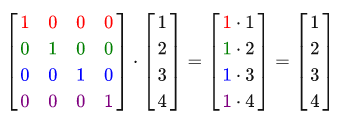

# learnopengl. Урок 1.7 — Трансформации

Теперь мы знаем как создавать объекты, раскрашивать их и накладывать на них текстуры, но они все еще довольно скучны, поскольку являются статическими объектами. Мы можем попробовать заставить их двигаться изменяя координаты вершин для каждого кадра, но это довольно муторно и требует процессорных вычислений. Есть гораздо более удобный способ для совершения трансформаций над объектом — это применение матриц. Но это не значит, что мы сейчас будем разговаривать про кунг фу и искусственный цифровой мир.

Матрицы — это очень мощные математические конструкции, которые поначалу пугают, но стоит к ним привыкнуть и они сразу станут крайне полезными. Во время обсуждения матриц требуется также немного углубиться в математику. Также для более склонных к математике читателей я оставлю ссылки на дополнительные ресурсы по этой теме.

Как бы то ни было, для полного понимания трансформаций мы, во первых, должны разобраться с векторами. Основная задача этой главы — дать вам основные математические знания, которые нам понадобятся позже.

## Вектора

В самом простом определении, вектора — это не более чем направления. У вектора может быть **направление** и **магнитуда** \(также иногда называется модулем или длиной\). Вы можете представлять себе вектора в качестве направлений на карте сокровищ: "Сделайте 10 шагов налево, теперь 3 шага на север и теперь 5 шагов направо". В данном примере "налево" — это направление, а "10 шагов" — это длина вектора. Направления на этой карте сокровищ составляются из 3 векторов. Вектора могут иметь любую размерность, но чаще всего используются двухкомпонентные и четырехкомпонентные вектора. Если вектор двухкомпонентный, то он описывает направление на плоскости \(или на 2D графике\), если вектор трехкомпонентный, то он описывает направление в трехмерном мире.

Ниже вы можете видеть 3 вектора, каждый из которых представлен в виде **\(x, y\)** в качестве стрелок на 2D графике. Поскольку более интуитивно представлять вектора в 2D \(чем в 3D\), то вы можете думать о 2D векторах, как о 3D векторах, но с нулевой z координатой. До тех пор, пока вектор описывает направление — позиция вектора не меняет его значения. На графике можно увидеть, что вектора **v** и **w** одинаковы, хотя из позиции отличаются:


Когда математики описывают вектора, они предпочитают использовать символы нижнего регистра с небольшой черточкой сверху. Пример:


Поскольку вектора зачастую описывают направление — то иногда их тяжело представить в виде позиции. Обычно мы визуализируем вектор следующим образом: мы устанавливаем центр в **\(0, 0, 0\)**, а затем указываем направление, описанное точкой. Таким образом получается **позиционный вектор** \(также мы можем взять за центр другую точку, а потом сказать "Этот вектор указывает на точку в пространстве из этой точки"\). Позиционный вектор **\(3, 5\)** будет указывать на точку **\(3, 5\)** на графе с основанием **\(0, 0\)**. С помощью векторов мы можем описывать как направления так и позиции в двухмерном и трехмерном пространствах.

Также мы можем производить над векторами некоторые математические действия.

### Скалярные векторные операции

Скаляр — это одно число \(или однокомпонентный вектор, если вы хотите продолжать работать с векторами\). Во время сложения/вычитания/умножения или деления вектора на скаляр мы просто складываем/вычитаем/умножаем или делим каждый элемент вектора на этот скаляр. Пример:


Где вместо сложения может быть вычитание, умножение или деление.

### Обратный вектор

Обращение \(отрицание\) вектора — это получение вектора, чье направление противоположно исходному. Обратный вектор для вектора, указывающего на северо-восток, будет вектор, указывающий на юго-запад. Для обращения вектора мы просто умножаем вектор на -1. Пример:


### Сложение и вычитание

Сложение двух векторов производится **покомпонентно**. Пример:


Визуально сумма векторов **v=\(4,2\)** и **k=\(1,2\)** выглядит так:


Также как и с обычным сложением и вычитанием, вычитание векторов — это тоже сложение, но с обратным вторым вектором:


Вычитание векторов друг из друга порождают вектор, который является разницей в позициях операндов:


### Длина

Для получения длины \(модуля\) вектора мы используем **теорему Пифагора**, которые вы, возможно, помните со школы. Вектор образует треугольник, если представить его компоненты в качестве сторон треугольника:


Поскольку длина сторон **\(x, y\)** известна, и мы хотим узнать длину гипотенузы — то мы делаем это следующим образом:


Где ||v|| — это длина вектора v. Такая формула легко расширяется в 3D добалением **z^2**. Пример расчета длины:


Вычисленное значение: 4.47

Также существует специальный вид векторов, называемый **единичными векторами**. Особенность таких векторов в том, что их длина всегда равна 1. Мы можем преобразовать любой вектор в единичный делением этого вектора на его длину:


Такой вектор называется **нормализованным**. Единичные векторы обозначаются с небольшой крышей над буквой. С ними, также, проще работать, поскольку нам приходится заботиться только о направлении такого вектора.

## Умножение вектора на вектор

Умножение двух векторов выполняется довольно странно. Нормальное умножение не применимо, поскольку оно не имеет визуального смысла, но у нас есть 2 специфических подхода, из которых можно выбирать во время умножения: первый — скалярное произведение, которое изображается как точка, а второе — векторное произведение, которое изображается как крест.

### Скалярное произведение

Скалярное произведение двух векторов эквивалентно скалярному произведению длин этих векторов, умноженное на косинус угла между ними. Если это предложение сбило вас с толку, то посмотрите на формулу:


Где угол между векторами описан как **тета**. Почему это может быть интересно? Что же, представим если вектора v и k являются единичными векторами. Соответственно формула сокращается до:


Теперь скалярное произведение определяет только угол между двумя векторами. Вы возможно помните, что функция **cos** становится 0, с углом в 90 градусов ну и 1 с углом 0. Это позволяет легко проверять ортогональны ли вектора или параллельны друг другу \(ортогональность означает, что вектора прямоугольны\). Если хотите узнать больше про **sin** или **cosine**, то рекомендую [видео Khan Academy](https://www.khanacademy.org/math/trigonometry/basic-trigonometry/basic_trig_ratios/v/basic-trigonometry) про базовую тригонометрию.

> Вы также можете вычислить угол между двумя неединичными векторами, но для этого вам придется разделить результат на длины этих векторов, чтобы остаться только с **cos**.

Так как же считать скалярное произведение? Скалярное произведение — это умножение компонентов векторов и последующее сложение результатов. Пример:


Для вычисления угла между векторами нам потребуется обратить функцию косинуса \(cos^-1\) в данном случае — это 143.1 градуса. Таким образом мы эффективно вычислили угол между этими двумя векторами. Скалярное произведение очень полезно во время работы со светом.

### Векторное произведение

Векторное произведение возможно только в трехмерном пространстве и принимает на вход два непараллельных вектора, а возвращает вектор, который ортогонален входным. Если входные вектора ортогональны друг другу, то векторное произведение создаст 3 ортогональных вектора. Далее вы узнаете, почему это может быть полезно. Следующее изображение показывает как это выглядит трехмерном пространстве:


В отличии от других операций, векторное произведение не очень интуитивно без углубления в линейную алгебру, так что лучше просто запомнить формулу. Ниже представлено векторное произведение между двумя ортогональными векторами A и B.


Как вы можете видеть, в этой формуле не очень много смысла. В любом случае после всех этих шагов вы получите вектор, который будет ортогонален входным.

## Матрицы

Теперь, после того как мы обсудили почти все на счет векторов, настало время углубиться в матрицы. Матрица, обычно, это четырехугольних из набора чисел, символов и/или выражений. Вот пример матрицы 2х3:


Доступ к элементам матрицы осуществляется с помощью **\(i,j\)**, где i — это строка, а j — это столбец. Вот почему матрица выше называется 2х3 \(3 столбца и 2 строки\). Такая система — обратна той, что используется в 2D графах **\(x, y\)**. Для получения значения 4 из матрицы выше, мы должны указать индекс **\(2, 1\)** \(вторая строка, первый столбец\).

Матрицы, по факту, ничего более чем четырехугольные массивы математических выражений. Они также обладают очень приятным набором математических свойств и, также как и вектора, имеют несколько операций — сложение, вычитание и умножение.

### Сложение и вычитание

Сложение матрицы со скаляром выполняется следующим образом:


Скаляр просто прибавляется во всем элементам матрицы. Тоже самое происходит и при вычитании:


Сложение и вычитание между двумя матрицами выполняется поэлементно. Таким образом операции сложения и вычитания могут быть применены только к матрицам одинакового размера. Пример:


Тоже самое, только с вычитанием:


### Умножение матрицы на скаляр

Также как сложение и вычитание, умножение матрицы на скаляр производится умножением каждого элемента матрицы на скаляр. Пример:


## Умножение матриц

Умножение матриц не очень сложное, но и не такое простое. Умножение имеет несколько ограничений:

1. Вы можете умножать только матрицы, где число столбцов первой совпадает с числом строк второй матрицы.
2. Умножение матриц не коммутативно. A * B != B * A.

Вот пример умножения двух матриц 2х2:


Сейчас, возможно вы пытаетесь понять, что же тут вообще происходит? Умножение матриц — это комбинация из нормального умножения и сложения с использованием строк левой матрицы со столбцами правой матрицы. Следующее изображение должно внести немного ясности:


В начале мы берем верхнюю строку левой матрицы и левый столбец правой матрицы. Выбранные нами строка и столбец определяет то, какой элемент результирующей матрицы мы собираемся рассчитать. Если бы мы взяли первую строку левой матрицы, то мы собираемся работать с верхней строкой результирующей матрицы, затем мы выбираем столбец в правой матрице, он определяет то, с каким столбцом результирующей матрицы мы работаем. Для вычисления нижнего-правого элемента мы должны выбрать нижнюю строку левой матрицы и правый столбец правой матрицы.

Для вычисления результирующего значения мы перемножаем элементы строки и столбца с помощью обычного умножения. Результаты умножения затем складываются и мы получаем результат. Вот оттуда и идет первое ограничение.

В результате получается матрица размером **\(n, m\)**, где n — количество строк в левой матрице, а m — количество столбцов в правой матрице.

Если у вас возникла проблема — то не волнуйтесь. Просто продолжайте вычислять руками и возвращайтесь к этому уроку, когда возникают сложности. Вскоре умножение матриц будет на автомате.

Давайте закроем вопрос умножения матриц одним большим примером. Для представления алгоритма использованы цвета. Для тренировки попробуйте сами посчитать результат, а затем сравнить с результатом в примере.


Как вы можете видеть умножение матриц довольно муторный процесс с большим количеством мест, где можно ошибиться. И эти проблемы лишь растут при увеличении размеров. Если вы все еще жаждите больше математических свойств матриц я крайне рекомендую [видео Khan Academy](https://www.khanacademy.org/math/algebra2/algebra-matrices).

### Умножение матрицы на вектор

Мы уже использовали вектора в прошлых уроках. Мы использовали их, чтобы представлять позиции, цвета и текстурные координаты. Теперь давайте немного углубимся в кроличью нору и расскажем, что вектор — это на самом деле просто **Nx1** матрица, где **N** — это количество компонентов вектора. Если вы чуть подумаете об этом — это имеет смысл. Вектора, прямо как матрицы — массив чисел, но только с 1 колонкой. И как же нам поможет эта информация? Что же, если у нас есть матрица **MxN** мы сможем ее умножить на Nx1 вектор, так как количество столбцов матрицы равно количеству строк вектора.

Но зачем нам вообще уметь умножать матрицу на вектор? Довольно много различных 3D/2D трансформаций можно выполнить, умножая матрицу на вектор, получая измененный вектор. Если вы все еще не уверены в том, что полностью понимаете текст выше, то вот немного примеров:

## Единичная матрица

В OpenGL обычно работают с матрицами трансформации размерами **4х4** по той причине, что большинство векторов имеет 4 компонента. Самая простая матрица трансформации которую можно обсудить — это **единичная матрица**. Единичная матрица — это NxN матрица, заполненная нулями, но с 1 по диагонали. Как мы можете заметить эта матрица совершенно не изменяет вектор:



Вектор выглядит нетронутым. Это становится очевидно из правил умножения: первый результирующий элемент — это каждый элемент первой строки матрицы, умноженные на каждый элемент вектора. Поскольку каждый элемент строки равен 0, кроме первого — то мы получаем 1 \* 1 + 0 \* 2 + 0 \* 3 + 0 \* 4 = 1. Тоже самое применяется и к остальным 3 элементам вектора.

Вы можете спросить, зачем вообще может понадобится матрица трансформации, которая ничего не трансформирует? Единичная матрица зачастую является отправной точкой для генерации других матриц трансформации и если мы углубимся в линейную алгебру, это также очень удобная матрица для доказательства теорем и решения линейных уравнений.

## Матрица масштабирования

Когда мы масштабируем вектор — мы увеличиваем длину стрелки на величину масштабирования, сохраняя направление. Пока мы работаем в 2 или 3 размерностях мы можем определить масштабирование вектором из 2 или 3 величин, каждая из которых масштабирует одну из осей **\(x, y** или **z\)**.

Давайте попробуем масштабировать вектор **v = \(3,2\)**. Мы будем масштабировать вектор по оси x на **0.5**, что сделает его в 2 раза уже; и масштабируем вектор по оси y на **2**, что увеличит высоту в 2 раза. Давайте посмотрим как будет выглядеть если мы масштабируем вектор на \(0.5, 2\). Запишем результат в виде **s**.


Помните, что OpenGL зачастую работает в 3D пространстве, соответственно для 2D можно оставить Z координату, равную 1. Операция масштабирования, которую мы только что выполнили, является **неоднородной**, поскольку величина масштабирования для каждой оси различается. Если бы величина масштабирования была бы одинаковой — то такое преобразование называется **однородным**.

Давайте построим матрицу трансформации которая выполнит для нас масштабирование. Мы уже увидели на единичной матрице, что диагональный элемент будет умножен на соответствующий элемент вектора. Что если мы заменим единицы в единичной матрице на тройки? В таком случае мы умножим все элементы вектора на это значение. Соответственно если мы представим величины масштабирования как \(S1, S2, S3\) то мы сможем определить матрицу масштабирования для любого вектора **\(x, y, z\)**:


Заметьте, что 4 элемент вектора равняется 1. Этот компонент обозначается как **w** и будет потом использован для других задач.

### Матрица сдвига

Сдвиг — это процесс добавления одного вектора к другому для получения нового вектора с другой позицией, то-есть **сдвиг** вектора на основании вектора сдвига. Мы уже обсуждали сложение векторов, поэтому для вас это не будет чем-то новым.
Также как и с матрицей масштабирования в матрице 4х4 есть несколько позиций для выполнения требуемых операций, для сдвига — это верхние 3 элемента четвертой колонки. Если мы представим вектор сдвига как \(Tx, Ty, Tz\) — то мы можем определить матрицу сдвига следующим образом:


Это работает, потому что все значения вектора умножаются на **w** компонент вектора и складываются с начальным значениями. Это было бы невозможно при использовании матриц 3х3.

> **Гомогенные координаты**
> Компонента вектора **w** также называется **гомогенной координатой**. Для получения 3D вектора из гомогенной координаты мы делим **x**, **y** и **z** координаты на **w**. Обычно этого не замечают, так как **w** большую часть времени равна 1.0. Использование гомогенных координат имеет несколько преимуществ: они позволяют нам выполнять сдвиги на 3D векторах \(без **w** компоненты это было бы невозможно\) и в следующей главе мы используем значение **w** для создания 3D визуализаций.
> Также когда гомогенная координата равна 0 — то вектор считается **вектором направления**, так как вектор с компонентой **w** равной 0 не может быть сдвинут.

С матрицей сдвига мы можем двигать объекты по всем 3 направлениям **\(x, y, z\)**, что делает эту матрицу крайне полезной для наших задач.

### Матрица вращения

Последние пару трансформаций были довольно просты для понимания и представления в 2D или 3D пространстве, но вращения немного более заковыристые. Если вы хотите узнать как же именно эти матрицы формируются — то я рекомендую видео Khan Academy про [линейную алгебру](https://www.khanacademy.org/math/linear-algebra/matrix_transformations).

Для начала давайте определим что вообще такое — вращение вектора. Вращение в 2D и 3D определяется **углом**. Угол может выражаться в углах или в радианах, в которых полный оборот — это 360 градусов или 2Pi соответственно. Я предпочитаю работать с градусами, поскольку они более логичны для меня.

> Большинство вращательных функций требует угол в радианах, но благо преобразование из одной системы в другую выполнить довольно просто:
> - Градусы = радианы \* \(180.0f / PI\)
> - Радианы = градусы \* \(PI / 180.0f\)
> Где PI примерно 3.14159265359

Вращение на половину круга — требует от нас вращения на 360/2 = 180 градусов. Вращение на 1/5 направо требует от нас вращение на 360/5 = 72 градуса направо. Вот пример обычного 2D вектора, где **v** повернут на 72 градуса направо от **k**.


Вращение в 3D описывается углом и **осью вращения**. Угол определяет то насколько вектор будет повернут относительно данной оси. При вращении 2D векторов в 3D мире, к примеру, мы установим ось вращения — Z.

С помощью тригонометрии мы можем преобразовывать вектора в повернутые на определенный угол. Обычно это делается хитрой комбинацией **sin** и **cos** функций. Обсуждение того, как генерируется матрицы трансформации — выходит за пределы нашего урока.

Матрица вращения определена для каждой оси в 3D пространстве, где угол показан как тета.
Матрица вращения вокруг оси X:


Матрица вращения вокруг оси Y:


Матрица вращения вокруг оси Z:


С помощью матриц вращения мы можем вращать наши вектора по одной из трех осей. Также можно совмещать их, например в начале повернуть по X оси, а потом по Y. Правда такой подход быстро приведет к проблеме, называемый проблемой шарнирного замка \(Gimbal Lock\). Мы не будем вдаваться в детали, но лучше использовать вращение по конкретной оси, например **\(0.662, 0.2, 0.722\)** \(заметьте, что это единичный вектор\), вместо того, чтобы совмещать вращения по конкретным осям. Матрица для таких преобразований существует и выглядит она следующим образом, где \(Rx, Ry, Rz\) — это ось вращения:


Математические обсуждения на счет генерации такой матрицы выходят за рамки этого урока. Просто держите в голове, что даже такая матрица не решает проблему шарнирного замка полность \(ее просто сложнее получить\). Для того, чтобы полностью решить эту проблему нам придется работать с вращениями с помощью кватернионов, которые не просто безопаснее, но еще и гораздо дружелюбнее с точки зрения вычислений. Как бы то ни было обсуждение кватернионов отведено в более поздний урок.

### Комбинирование матриц

Для того, чтобы достичь максимальной полезности использования матриц для трансформаций мы должны комбинировать матрицы трансформации в одну матрицу. Давайте посмотрим, сможем ли мы сгенерировать матрицу трансформации, которая будет в себя включать несколько трансформаций. Например у нас есть вектор **\(x, y, z\)** и мы хотим масштабировать его в 2 раза и сдвинуть на **\(1, 2, 3\)**. Для этого нам потребуются матрицы масштабирования и смещения. В результате мы получим что-то вроде:


Заметьте, что во время умножения матриц мы в начале выполняем сдвиг, а потом масштабирование. Умножение матриц не коммутативно, что означает, что порядок умножения важен. Во время умножения матриц правая матрица умножается на вектор, поэтому вам надо читать умножения справа налево. Рекомендуется в начале масштабировать, затем вращать и в конце сдвигать, во время объединения матриц, в ином случае они могут отрицать друг-друга. Например если вы в начале выполните сдвиг, а затем масштабирование, то матрица сдвига тоже будет масштабировать!

В итоге матрица трансформации применяется следующим образом:


Отлично, вектор масштабирован в 2 раза и смещен на **\(1, 2, 3\)**.

## На практике

После того, как мы обсудили всю теорию настало время применять ее на практике. OpenGL не имеет встроенной поддержки матричных или векторных преобразований, поэтому нам придется использовать собственные математические класса и функции. В этих уроках мы абстрагируемся от тонких математических деталей и просто используем готовые математические библиотеки. К счастью уже есть простая в использовании и заточенная под OpenGL математическая библиотека, под названием GLM.

### GLM

GLM это аббревиатура от Open**GL M**athematics. Эта библиотека является заголовочной, что означает, что нам достаточно подключить требуемые заголовочные файлы. Не нужно заморачиваться ни с линковкой ни с компиляцией. GLM можно скачать с [официального сайта](http://glm.g-truc.net/0.9.5/index.html). Скопируйте корневую директорию с заголовочными файлами в вашу папку **includes** и можно начинать.

Большая часть функциональности GLM можно найти в 3 заголовочных файлах:

```cpp
#include <glm/glm.hpp>
#include <glm/gtc/matrix_transform.hpp>
#include <glm/gtc/type_ptr.hpp>
```

Давайте посмотрим, сможем ли мы применить наши знания в преобразованиях для сдвига вектора **\(1, 0, 0\)** на **\(1, 1, 0\)** \(заметьте, что мы обозначили из как **glm::vec4** с гомогенной координатой равной 1.0\):

```cpp
glm::vec4 vec(1.0f, 0.0f, 0.0f, 1.0f);
glm::mat4 trans;
trans = glm::translate(trans, glm::vec3(1.0f, 1.0f, 0.0f));
vec = trans * vec;
std::cout << vec.x << vec.y << vec.z << std::endl;
```

В начале мы создали вектор названный **vec** с помощью встроенного в GLM векторного класса. Затем мы определяем **mat4**, которая является единичной матрицей 4х4. Затем мы создаем матрицу трансформации, передавая нашу единичную матрицу в функцию **glm::translate**, вместе с вектором сдвига.
Затем мы умножаем наш вектор на матрицу трансформации и выводим результат. Если вы все еще помните как работает матрица сдвига — то вы понимаете, что результирующий вектор должен быть **\(1+1, 0+1, 0+0\)**, который равен **\(2, 1, 0\)**. Код выше выводит **210**, что означает, что матрица сдвига сделала свою работу.

Давайте попробуем сделать нечто более интересное и попробуем масштабировать, а затем повернуть объект из прошлого урока. В начале мы повернем контейнер на **90** градусов против часовой стрелки. Затем масштабируем его на **0.5** для того, чтобы уменьшить его в 2 раза. Давайте построим матрицу трансформации для этого.

```cpp
glm::mat4 trans;
trans = glm::rotate(trans, 90.0f, glm::vec3(0.0, 0.0, 1.0));
trans = glm::scale(trans, glm::vec3(0.5, 0.5, 0.5));  
```

В начале мы уменьшаем контейнер на 0.5, по каждой оси, а затем поворачиваем контейнер на 90 градусов по Z координате. Заметьте, что текстура также повернулась. Поскольку мы передаем матрицу в каждую из GLM функций, GLM автоматически перемножает матрицы, в результате получая матрицу трансформации.

> Некоторые версии GLM принимают углы в радианах, а не в градусах. Если у вас такая версия — то преобразуйте градусы в радианы с помощью **glm::radians(90.0f)**.

Следующий большой вопрос — это как передать матрицу трансформации в шейдер? Ранее мы уже говорили, что GLSL имеет тип **mat4**. Так что нам осталось принять **mat4** в качестве uniform переменной и умножить вектор позиции на эту матрицу.

```glsl
#version 330 core
layout (location = 0) in vec3 position;
layout (location = 1) in vec3 color;
layout (location = 2) in vec2 texCoord;

out vec3 ourColor;
out vec2 TexCoord;

uniform mat4 transform;

void main()
{
    gl_Position = transform * vec4(position, 1.0f);
    ourColor = color;
    TexCoord = vec2(texCoord.x, 1.0 - texCoord.y);
} 
```

> В GLSL также имеются типы **mat2** и **mat3**, которые предоставляют такие же операции, что и вектора. Все затронутые в этой статье операции доступны в матричных типах. 

Мы добавили uniform и умножили позиционный вектор на трансформационную матрицу перед тем как передать ее в **gl_Position**. Наш контейнер теперь должен стать меньше в 2 раза и повернуться на 90 градусов. Но нам все еще надо передать трансформационную матрицу в шейдер?

```cpp
GLuint transformLoc = glGetUniformLocation(ourShader.Program, "transform");
glUniformMatrix4fv(transformLoc, 1, GL_FALSE, glm::value_ptr(trans));
```

В начале мы получаем позицию uniform переменной и затем отправляем в нее данные матрицы с помощью функции **glUniform** с постфиксом **Matrix4fv**. Первый аргумент должен быть позицией переменной. Второй аргумент сообщает OpenGL сколько матриц мы собираемся отправлять, в нашем случае 1. Третий аргумент говорит требуется ли транспонировать матрицу. OpenGL разработчики часто используют внутренних матричный формат, называемый column-major ordering, который используется в GLM по умолчанию, поэтому нам не требуется транспонировать матрицы, мы можем оставить **GL_FALSE**. Последний параметр — это, собственно, данные, но GLM не хранит данные точно так как OpenGL хочет их видеть, поэтому мы преобразовываем их с помощью **value_ptr**.

Мы создали матрицу трансформации, объявили uniform в вершинном шейдере, и отправили матрицу в шейдере с помощью которой мы корректируем вершинные координаты. В результате должно получиться что-то вроде этого:


Отлично! Наш контейнер действительно повернут налево и стал в 2 раза меньше, так что трансформация прошла успешно. А теперь давайте заставим вращаться наш контейнер в реальном времени, а также передвинем его в нижний правый угол. Для того, чтобы это сделать придется производить вычисления при каждой итерации основного цикла. Мы используем функцию GLFW для получения времени, чтобы менять угол со временем:

```cpp
glm::mat4 trans;
trans = glm::translate(trans, glm::vec3(0.5f, -0.5f, 0.0f));
trans = glm::rotate(trans,(GLfloat)glfwGetTime() * 50.0f, glm::vec3(0.0f, 0.0f, 1.0f));
```

Держите в голове, что раньше мы могли объявить матрицу трансформации где угодно, но теперь мы создаем ее при каждой итерации, чтобы мы могли обновлять вращение на каждый кадр. Это значит, что мы должны пересоздавать матрицу трансформации на каждой итерации игрового цикла. Обычно, когда на сцене несколько объектов, то их матрицы трансформации пересоздаются с новыми значениями при каждой итерации отрисовки.

Теперь мы вращаем объект вокруг центра **\(0, 0, 0\)**, а после этого сдвигаем повернутую версию в нижний-правый угол экрана. Помните, что реальная последовательность применения трансформаций читается в обратном порядке: даже в коде мы в начале сдвигаем, а потом поворачиваем, то трансформации применяются в обратном порядке, в начале поворот, затем сдвиг. Понимание всех этих трансформаций и того как они влияют на объекты довольно затруднительно. Попробуйте поэкспериментировать с трансформациями и вы быстро с ними свыкнитесь.

Если вы все сделали правильно — то вы получите что-то вроде этого:

[mp4](transformations.mp4)

Вот и все. Сдвинутый контейнер, поворачивающийся с течением времени, и все это выполнено с помощью одной матрицы трансформации! Теперь вы можете видеть, почему матрицы настолько сильны в графическом мире. Мы можем определить безграничное количество трансформаций и совмещать их в одну матрицу для последующего повторного использования. Использование подобных трансформаций в вершинном шейдере позволяет нам не менять вершинные данные, что сохраняет нам процессорное время, поскольку нам не требуется отправлять данные в буфер.

Если вам не удалось получить правильный результат или вы где-то застряли — то взгляните на [исходный код](src1.cpp) вместе с [вершинным](src1.vs) и [фрагментным](src1.fs) шейдерами.

В следующем уроке мы обсудим как использовать матрицы для определения различных координатных пространств для наших вершин. Это будет новым шагом в мир 3D графики в реальном времени!

## Упражнения

1. Поменяйте в последней трансформации последовательности действий, посмотрите что из этого получится, попробуйте обосновать, почему результат именно такой. [Решение](exercise1.cpp)
2. Попробуйте нарисовать еще один контейнер с помощью вызова **glDrawElements**, но только разместите этот контейнер в другом месте с помощью другой трансформации. Пусть он будет находиться в правом верхнем углу и вместо вращения — он менял свой размер \(здесь можно применить функцию sin\): [Решение](exercise2.cpp)
