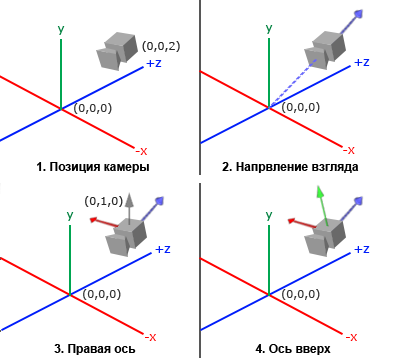
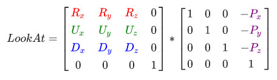
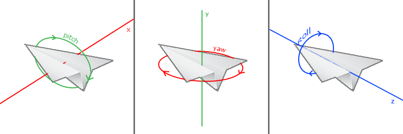
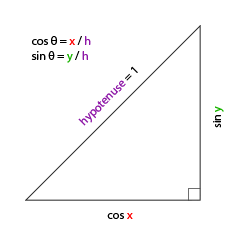
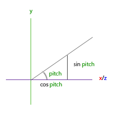
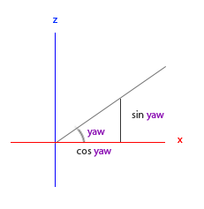

# learnopengl. Урок 1.9 — Камера

В предыдущем уроке обсуждалась матрица вида, и то, как её можно использовать для перемещения по сцене \(мы немного отодвинули назад точку зрения наблюдателя\). В OpenGL отсутствует концепция камеры, но можно попытаться её сымитировать, перемещая все объекты сцены в направлении противоположном движению наблюдателя, и тем самым создать иллюзию, что движемся мы сами.

В этом уроке мы рассмотрим, как можно создать камеру в OpenGL. Мы обсудим камеру типа FPS \(First Person Shooter\), которая позволит вам свободно перемещаться в трехмерной сцене. Кроме того, мы поговорим о вводе с клавиатуры и мыши, а закончим созданием собственного C++ класса камеры.

## Пространство Камеры/Вида

Когда мы говорим о пространстве камеры/вида, мы подразумеваем вид всех вершин с точки зрения камеры, положение которой в этом пространстве является базовой точкой начала координат: матрица вида трансформирует мировые координаты в координаты вида, измеряющиеся относительно расположения и направления камеры. Для однозначного математического описания камеры, нам необходимо ее положение в мировом пространстве, направление в котором она смотрит, вектор указывающий правое направление, и вектор указывающий направление вверх. Внимательный читатель возможно заметит, что на самом деле мы собираемся создать систему координат с 3 перпендикулярными осями и позицией камеры в качестве точки отсчета.



### 1. Позиция камеры

Получить позицию камеры легко. Положение камеры это вектор, содержащий координаты камеры в мировом пространстве. Мы расположим камеру в том же месте, где устанавливали её в предыдущем уроке:

```cpp
glm::vec3 cameraPos = glm::vec3(0.0f, 0.0f, 3.0f);
```

> Не забывайте, что положительное направление оси-Z проходит через плоскость экрана к вам, поэтому, если мы хотим, чтобы камера двигалась назад, то перемещаемся вдоль положительной оси-Z.

### 2. Направление камеры

Следующим необходимым нам вектором, будет вектор направления камеры. Пока что камера нацелена в базовую точку нашей сцены: \(0,0,0\). Вы еще не забыли, что если мы вычтем два вектора друг из друга, то получим вектор, являющийся разностью исходных векторов? Вычитание вектора положения камеры из точки начала координат даст нам вектор направления камеры. Мы знаем, что камера смотрит вдоль отрицательного направления оси-Z, а нам нужен вектор направленный вдоль положительной оси-Z самой камеры. Если при вычитании мы изменим очередность аргументов, то получим вектор, указывающий в положительном направлении оси-Z камеры:

```cpp
glm::vec3 cameraTarget = glm::vec3(0.0f, 0.0f, 0.0f);
glm::vec3 cameraDirection = glm::normalize(cameraPos - cameraTarget);
```

> Название "вектор **направления**" не совсем подходящее, потому что этот вектор фактически указывает в сторону, противоположную направлению камеры.

### 3. Правая ось

Еще один вектор, без которого нам не обойтись, это вектор указывающий в *правую сторону* и представляющий положительное направление оси-X камеры. Чтобы вычислить этот вектор, мы сделаем небольшой трюк, и для этого сначала зададим вектор указывающий направление вверх \(в мировом пространстве\). Затем мы векторно перемножим вычисленное в шаге 2 направление камеры и вектор указывающий вверх. Так как результатом векторного произведения является вектор, перпендикулярный исходным векторам, то мы получим вектор, указывающий в положительном направлении оси-X \(если поменять множители местами, то получим вектор, который будет указывать в отрицательную сторону оси-X\):

```cpp
glm::vec3 up = glm::vec3(0.0f, 1.0f, 0.0f); 
glm::vec3 cameraRight = glm::normalize(glm::cross(up, cameraDirection));
```

### 4. Ось вверх

Теперь, когда у нас есть вектора двух осей X и Z, получить вектор, который бы указывал в положительном направлении оси-Y камеры, будет достаточно просто: мы сделаем векторное умножение правого вектора и вектора направления камеры:

```cpp
glm::vec3 cameraUp = glm::cross(cameraDirection, cameraRight);
```

С помощью векторного произведения и небольших хитростей мы смогли рассчитать все вектора, которые задают пространство Камеры/Вида. Более искушенным в математике читателям, этот алгоритм в линейной алгебре известен как процесс Грама-Шмидта. Используя эти вектора мы теперь можем сформировать матрицу **LookAt**, которая будет нам очень полезна для создания камеры.

## LookAt

Одно из замечательных свойств матриц заключается в том, что если вы зададите координатное пространство с помощью 3 перпендикулярных \(или линейно независимых\) осей, то из векторов этих осей и дополнительного вектора смещений можно сформировать матрицу, умножение на которую будет преобразовывать любые вектора в это определенное вами координатное пространство. Это именно то, что делает матрица **LookAt**, и теперь, когда у нас есть все необходимое для определения пространства Камеры/Вида, т.е. 3 перпендикулярных оси и вектор расположения камеры, мы можем создать нашу собственную матрицу LookAt:



Где R — правый вектор, U — вектор, указывающий вверх, D — вектор направления камеры, а P — позиция камеры. Обратите внимание на то, что вектор положения камеры инвертирован, поскольку в конечном итоге мы будем сдвигать мировые координаты в направлении, противоположном движению камеры. Использование матрицы LookAt в качестве матрицы вида позволяет эффективно преобразовать все мировые координаты в только что заданное нами пространство. Матрица LookAt делает именно то, о чем говорит её название: она создает матрицу вида, которая смотрит на заданную цель.

К счастью, библиотека GLM сделает всю эту работу за нас. Нам нужно только указать положение камеры, координату цели и вектор в мировом пространстве направленный вверх (тот вспомогательный вектор, который мы использовали для вычисления правого вектора). По этим данным GLM самостоятельно создает матрицу LookAt, которую мы сможем использовать в качестве нашей матрицы вида:

```cpp
glm::mat4 view;
view = glm::lookAt(glm::vec3(0.0f, 0.0f, 3.0f), 
  		   glm::vec3(0.0f, 0.0f, 0.0f), 
  		   glm::vec3(0.0f, 1.0f, 0.0f));
```

Функции **glm::LookAt** требуются следующие параметры: позиция камеры, координата цели и вектор направленный вверх. Функция вычислит матрицу вида идентичную той, которую мы использовали в предыдущем уроке.

Прежде чем углубиться в вопросы, связанные с пользовательским вводом, давайте немного развлечёмся и покрутим камеру вокруг нашей сцены. Для простоты будем все время держать камеру направленной на точку \(0,0,0\).

Для вычисления позиции нашей камеры мы применим немного тригонометрии и рассчитаем для каждого кадра координаты X и Z, которые будут представлять собой точку, расположенную на круговой траектории. Пересчитывая в каждом кадре X и Z координаты, мы будем переходить по всем точкам круга и, таким образом, камера станет вращаться вокруг сцены. Давайте зададим размер этой окружности константным значением радиуса и, используя функцию **glfwGetTime** из библиотеки GLFW, вычислим для каждой итерации игрового цикла новую матрицу вида:

```cpp
GLfloat radius = 10.0f;
GLfloat camX = sin(glfwGetTime()) * radius;
GLfloat camZ = cos(glfwGetTime()) * radius;
glm::mat4 view;
view = glm::lookAt(glm::vec3(camX, 0.0, camZ), glm::vec3(0.0, 0.0, 0.0), glm::vec3(0.0, 1.0, 0.0));
```

Если вы запустите этот код, то увидите нечто вроде этого:

[mp4](https://github.com/loginmen/learnopengl/blob/master/part%201/chapter%209/camera_circle.mp4)

Теперь, с помощью этого небольшого фрагмента кода, камера вращается вокруг сцены. Не бойтесь экспериментировать с параметрами радиуса и положения/направления, чтобы понять, как работает матрица *LookAt*. Если у вас что-нибудь не получается, сравните свой код с [исходным кодом](src1.cpp), а шейдеры с текстами [вершинного](src1.vs) и [фрагментного](src1.fs) шейдеров.

## Прогуляемся

Вращать камеру вокруг сцены конечно забавно, но еще интереснее двигать её самим! Сначала нам придется создать «инфраструктуру» камеры, а для этого в начале нашей программы давайте определим несколько переменных:

```cpp
glm::vec3 cameraPos   = glm::vec3(0.0f, 0.0f,  3.0f);
glm::vec3 cameraFront = glm::vec3(0.0f, 0.0f, -1.0f);
glm::vec3 cameraUp    = glm::vec3(0.0f, 1.0f,  0.0f);
```

Теперь вызов функции LookAt станет таким:

```cpp
view = glm::lookAt(cameraPos, cameraPos + cameraFront, cameraUp);
```

Сначала мы устанавливаем камеру в позицию, координата которой хранится в переменной **cameraPos**. Направление камеры вычисляется как её текущая позиция + вектор **cameraFront**, который мы только что объявили и инициализировали. Это гарантирует, что не смотря на перемещение камеры, она всегда будет смотреть в направлении цели. Давайте немного поиграем с этими переменными, изменяя вектор **cameraPos** нажатиями клавиш.

В [уроке 1.3](../chapter%203/text.md) мы создали функцию обратного вызова **key_callback**, необходимую для получения от GLFW ввода c клавиатуры, а теперь давайте добавим несколько новых проверок на нажатия определенных кнопок:

```cpp
void key_callback(GLFWwindow* window, int key, int scancode, int action, int mode)
{
    ...
    GLfloat cameraSpeed = 0.05f;
    if(key == GLFW_KEY_W)
        cameraPos += cameraSpeed * cameraFront;
    if(key == GLFW_KEY_S)
        cameraPos -= cameraSpeed * cameraFront;
    if(key == GLFW_KEY_A)
        cameraPos -= glm::normalize(glm::cross(cameraFront, cameraUp)) * cameraSpeed;
    if(key == GLFW_KEY_D)
        cameraPos += glm::normalize(glm::cross(cameraFront, cameraUp)) * cameraSpeed;  
}
```

Всякий раз, когда мы нажимаем одну из клавиш WASD, положение камеры обновляется в соответствии с её новыми координатами. Если мы хотим двигаться вперед или назад, то добавляем или вычитаем вектор направления из вектора положения камеры. При движении в боковом направлении, мы посредством векторного произведения находим направленный в *право* вектор, и перемещаемся вдоль него. При боковом смещении камеры это создает знакомый геймерам **стрейф**-эффект.

> Обратите внимание, что мы нормализуем получившийся правый вектор. Если бы мы этого не делали, то в зависимости от значения **cameraFront** результатами векторного произведения могли бы быть вектора разной длины. Без нормализации правого вектора скорость движения камеры была бы не постоянной, а ускорялась или замедлялась при изменении направления камеры.

Если вы дополните функцию **key_callback** этим фрагментом кода, то сможете перемещаться по сцене, двигаясь вперед/назад или в сторону.

[mp4](camera_inside.mp4)

Поразвлекавшись с этой простой системой управления камерой, вы вероятно заметили, что не можете двигаться в двух направлениях одновременно \(совершать диагональное перемещение\), а когда вы удерживаете одну из клавиш, то она сначала срабатывает один раз, и только потом, после небольшой задержки, начинается непрерывное движение. Это происходит из-за того, что большинство систем ввода имеют событийно-ориентированную архитектуру \(event-driven architecture, EDA\) способную одновременно обрабатывать только одно нажатие клавиши, которое вызывает соответствующий обработчик. Это неплохо работает во многих системах с графическим интерфейсом, но не очень подходит для плавного движения камеры. Я покажу небольшой трюк, позволяющий решить эту проблему.

Хитрость заключается в том, чтобы в функции обратного вызова **key_callback** отслеживать, какие клавиши были нажаты или отпущены. Затем, в игровом цикле мы считаем эти значения, проверим, какие клавиши активны и, исходя из их состояния, изменим соответствующим образом значение переменной **cameraPos**. Таким образом в функции-обработчике, мы просто сохраняем информацию о том, какие клавиши были нажаты или отпущены, а реагируем на их состояния уже в игровом цикле. Сперва давайте создадим массив переменных логического типа, представляющий нажатые или отпущенные состояния клавиш:

```cpp
bool keys[1024];
```

После этого в функции **key_callback** мы должны установить нажатые клавиши в *true*, а отпущенные в *false*:

```cpp
if(action == GLFW_PRESS)
  keys[key] = true;
else if(action == GLFW_RELEASE)
  keys[key] = false;
```

И еще давайте создадим новую функцию, которую назовем **do_movement**, где будем обновлять координаты камеры, полагаясь на состояние нажатых клавиш:

```cpp
void do_movement()
{
  // Camera controls
  GLfloat cameraSpeed = 0.01f;
  if(keys[GLFW_KEY_W])
  	cameraPos += cameraSpeed * cameraFront;
  if(keys[GLFW_KEY_S])
  	cameraPos -= cameraSpeed * cameraFront;
  if(keys[GLFW_KEY_A])
  	cameraPos -= glm::normalize(glm::cross(cameraFront, cameraUp)) * cameraSpeed;
  if(keys[GLFW_KEY_D])
  	cameraPos += glm::normalize(glm::cross(cameraFront, cameraUp)) * cameraSpeed;
}
```

Код из предыдущего раздела теперь перенесен в функцию **do_movement**. Поскольку GLFW-перечисления идентификаторов клавиш являются просто целыми числами, то мы можем использовать их для индексации массива.

И последнее, но не менее важное, нам нужно добавить вызов новой функции в тело игрового цикла:

```cpp
while(!glfwWindowShouldClose(window))
{
  // Проверка поступивших событий и вызов их обработчиков
  glfwPollEvents();
  do_movement();  
  
  // Визуализация
  ...
}
```

Теперь у вас должно получаться одновременное перемещение в двух направлениях, и непрерывное движение должно начинаться сразу же после нажатия клавиш. Если вы на чём-то застряли, то не стесняйтесь сравнивать свой код с [исходным кодом](src2.cpp).

### Скорость движения

В настоящее время мы используем постоянное значение скорости передвижения при перемещении камеры. В теории это кажется нормальным, но на практике у разных пользователей их вычислительные мощности могут очень сильно отличаться, в результате чего, на одних компьютерах за одно и то же время будет отрисовываться гораздо больше кадров чем на других. А если у одного пользователя рисуется больше кадров, чем у другого, то и функция **do_movement** будет вызываться чаще.
В итоге, в зависимости от конфигурации компьютера, некоторые пользователи будут перемещаться по сцене очень быстро, а другие совсем медленно. Но распространяя свою программу вы наверняка хотите, что бы она одинаково работала на любом "железе".

Графические приложения и игры обычно используют специальную переменную **deltaTime**, в которой они хранят время, затраченное на визуализацию последнего выведенного кадра. А затем, все задаваемые в игре скорости умножают на это значение **deltaTime**. В результате, когда вывод кадра занимает много времени и значение **deltaTime** большое, то и скорость умноженная на эту переменную станет больше, что сбалансирует общую производительность. При использовании этого подхода мощность компьютера перестает влиять на поведение программы и уже не имеет значения, медленный у вас компьютер или очень быстрый, скорость движения камеры в любом случае будет скорректирована, и у всех пользователей будет одинаковый результат.

Чтобы вычислить значение **deltaTime**, нам будут нужны 2 глобальных переменных:

```cpp
GLfloat deltaTime = 0.0f;	// Время, прошедшее между последним и текущим кадром
GLfloat lastFrame = 0.0f;  	// Время вывода последнего кадра
```

Затем, мы в каждом кадре вычисляем новое значение **deltaTime** для последующего использования:

```cpp
GLfloat currentFrame = glfwGetTime();
deltaTime = currentFrame - lastFrame;
lastFrame = currentFrame;
```

Теперь, когда у нас есть **deltaTime**, мы можем учитывать её значение при вычислении скоростей:

```cpp
void do_movement()
{
  GLfloat cameraSpeed = 5.0f * deltaTime;
  ...
}
```

Вместе с кодом из предыдущего раздела у нас должна получиться более плавная и согласованная система перемещения камеры по сцене:

[mp4](camera_smooth.mp4)

И теперь у нас есть камера, которая двигается с одинаковой скоростью на любой системе. Если что-то не получается, снова сверьтесь с [исходным кодом](src3.cpp). Позже мы убедимся, что значение **deltaTime** часто появляется в любом коде, связанном со скоростью и движением.

## Осмотримся

Использовать для перемещения только клавиатуру не очень интересно. Тем более, что отсутствие возможности обернуться делает наши перемещения довольно скованными. Вот где нам пригодится мышь!

Для того, что бы свободно осматривать сцену мы должны изменять вектор направления камеры **cameraFront** руководствуясь вводом мыши. Однако изменение вектора направления на основании поворотов мыши создает определенные трудности и требует некоторых знаний тригонометрии. Если вы не понимаете тригонометрии, не беспокойтесь. Вы можете просто переходить к разделам с исходными кодами и вставлять их в свою программу, а если захотите узнать подробности, то всегда сможете вернуться.

### Углы Эйлера

Углы Эйлера это три величины, описанные Леонардом Эйлером где-то в 1700-х годах, которые могут представлять любое вращение в трехмерном пространстве. Есть 3 угла Эйлера: *тангаж* \(pitch\), *рыскание* \(yaw\) и *крен* \(roll\). Они наглядно изображены на следующем рисунке:



Как видно на первом изображении **тангаж** — это угол, характеризующий величину наклона вверх или вниз. На втором изображении показано **рыскание**, которое представляет собой величину поворота влево или вправо. **Крен** задает поворот вдоль продольной оси, и обычно часто используется в различных симуляторах полёта. Каждый угол Эйлера задается одной скалярной величиной, а совокупность всех трех углов позволяет вычислить любой вектор поворота в трехмерном пространстве.

В нашей системе управления камерой мы будем использовать только углы рыскания и тангажа, поэтому обсуждать здесь значение крена мы не станем. Имея величины рыскания и тангажа мы сможем их преобразовать в 3D-вектор направления камеры. Процесс преобразования значений рыскания и тангажа в вектор направления потребует немного тригонометрических вычислений. Начнем с простого примера:



Если мы зададим длину гипотенузы равной 1, то из основных тригонометрических соотношений \(soh cah toa: Sine Opposite Hypotenuse, Cosine Adjacent Hypotenuse, Tangent Opposite Adjacent, т.е. синус это отношение противолежащего катета к гипотенузе, косинус — это отношение прилежащего катета к гипотенузе, тангенс — отношение противолежащего катета к прилежащему\) известно, что длина прилежащего катета равна cosX/h = cosX/1 = cosX, а длина противолежащей стороны равна sinY/h = sinY/1 = sinY. Эти формулы дают нам возможность рассчитать длину проекции гипотенузы на оси X и Y при заданном угле. Давайте воспользуемся ими для вычисления компонент вектора направления камеры:



Этот треугольник похож на треугольник из предыдущей иллюстрации, и если мы представим, что находимся на плоскости XZ, а смотрим на ось Y, то сможем рассчитать значение Y-компоненты \(задающей ориентацию вверх или вниз\) вектора направления по формуле, приведенной для первого треугольника. Из рисунка видно, что значение Y для данного угла тангажа sin Θ:

```cpp
direction.y = sin(glm::radians(pitch)); // Заметьте, что сначала мы переводим значение угла в радианы
```

Здесь мы посчитали только значение Y, теперь нужно вычислить компоненты X и Z. Глядя на изображение треугольника мы видим, что их значения равны:

```cpp
direction.x = cos(glm::radians(pitch));
direction.z = cos(glm::radians(pitch));
```

Давайте посмотрим, как нам найти соответствующие компоненты вектора направления для угла рыскания:



Так же, как и на рисунке треугольника, построенного для угла тангажа, на этой иллюстрации видна зависимость X-компоненты от значения cos\(yaw\), а Z-компоненты от sin\(yaw\). Объединение этих значений с результатами, вычисленными для угла тангажа, даст нам окончательный вектор направления камеры, построенный на двух углах вращения — тангажа и рыскания:

```cpp
direction.x = cos(glm::radians(pitch)) * cos(glm::radians(yaw));
direction.y = sin(glm::radians(pitch));
direction.z = cos(glm::radians(pitch)) * sin(glm::radians(yaw));
```

Это дает нам формулу для преобразования значений углов тангажа и рыскания в трехмерный вектор направления, который мы можем использовать для ориентации камеры. Наверное вы уже задались вопросом: как же мы получим значения углов рыскания и тангажа?

### Управление при помощи мыши

Углы тангажа и рыскания изменяют свои значения в зависимости от движений мыши \(или игрового контроллера/джойстика\); боковые перемещения мыши влияют на угол рыскания, а движения вперёд/назад воздействуют на угол тангажа. Идея заключается в том, чтобы сохранять координаты мыши для последнего кадра, а в текущем кадре сравнивать их с новыми координатами и вычислять, на сколько пикселей сместился указатель мыши. Чем больше это смещение, тем сильнее оно изменит значение тангажа и/или рыскания, и, соответственно, на больший угол повернет камеру.

Сначала мы скажем библиотеке GLFW, что она должна захватить курсор и скрыть указатель мыши. Захват курсора означает, что после получения приложением фокуса ввода, курсор будет оставаться в границах окна \(до тех пор, пока приложение не потеряет фокус или не завершит свою работу\). Мы можем это сделать с помощью одного простого конфигурационного вызова:

```cpp
glfwSetInputMode(window, GLFW_CURSOR, GLFW_CURSOR_DISABLED);
```

После этого вызова, куда бы мы ни перемещали мышь, её указатель не будет виден и не сможет выйти за границы окна. Это идеально подходит для управления камерой в играх типа FPS.

Для получения данных от мыши, необходимых при вычислениях значений тангажа и рыскания, мы должны сообщить GLFW, что хотим получать уведомления о событиях перемещения мыши. Мы сделаем это \(аналогично вводу с клавиатуры\), создав функцию обратного вызова следующего прототипа:

```cpp
void mouse_callback(GLFWwindow* window, double xpos, double ypos);
```

Здесь **xpos** и **ypos** представляют текущую координату мыши. После того, как мы зарегистрируем в GLFW нашу функцию обратного вызова **mouse_callback**, она станет вызываться при каждом перемещении мыши:

```cpp
glfwSetCursorPosCallback(window, mouse_callback);
```

При обработке ввода мыши для камеры в стиле FPS, прежде чем получить результирующий вектор направления камеры, нам необходимо выполнить еще несколько шагов:

1. Вычислить смещения мыши с момента последнего кадра.
2. Добавить эти смещения к значениям тангажа и рыскания камеры.
3. Применить необходимые ограничения максимальных/минимальных значений рыскания/тангажа
4. Вычислить вектор направления камеры

Первым пунктом в нашем списке идет вычисление смещения мыши с момента последнего кадра. Сначала мы должны сохранить где-то в программе последнюю координату указателя мыши. Для этого объявим две переменные, которые проинициализируем значениями координаты центра экрана \(размер экрана 800 на 600\):

```cpp
GLfloat lastX = 400, lastY = 300;
```

Еще нам понадобятся две глобальные переменные для хранения углов поворота камеры:

```cpp
GLfloat yaw   = -90.0f;
GLfloat pitch = 0.0f;
```

Затем в функции обратного вызова вычислим смещение мыши, произошедшее между последним и текущим кадром:

```cpp
GLfloat xoffset = xpos - lastX;
GLfloat yoffset = lastY - ypos; // Обратный порядок вычитания потому что оконные Y-координаты возрастают с верху вниз 
lastX = xpos;
lastY = ypos;

GLfloat sensitivity = 0.05f;
xoffset *= sensitivity;
yoffset *= sensitivity;
```

Обратите внимание, что мы умножаем значения смещения на коэффициент **sensitivity** \(чувствительности\). Если не делать этого умножения, то движения мыши будут слишком быстрыми; подберите величину чувствительности по своему вкусу.

Теперь добавим смещения к глобальным переменным **pitch** и **yaw**:

```cpp
yaw   += xoffset;
pitch += yoffset;
```

В третьем пункте мы хотели добавить определенные ограничения вращения камеры, чтобы пользователи не могли совершать неестественных поворотов камеры \(заодно это избавит нас от некоторых проблем\). Тангаж будет ограничен таким образом, что бы пользователи не могли поднимать взгляд выше 89 градусов \(косинус угла больше 90 градусов становится отрицательным, поэтому мы остановимся на 89\), и также не могли наклонять камеру ниже -89 градусов. Это обеспечит пользователю возможность смотреть вверх на небо и в низ на свои ноги, но не дальше. Ограничивающие условия сравнивают значение угла с допустимой величиной и меняют результирующее значение в случае нарушения ограничения:

```cpp
if(pitch > 89.0f)
  pitch =  89.0f;
if(pitch < -89.0f)
  pitch = -89.0f;
```

Обратите внимание, что мы не устанавливаем никаких ограничений на значение рыскания, так как не хотим ограничивать пользователя в горизонтальном вращении. Тем не менее, если нам это понадобится, то мы сможем это сделать так же легко, как и ограничение угла тангажа.

Четвертым и заключительным шагом является вычисление результирующего вектора направления камеры по значениям углов рыскания и тангажа, как и собирались это сделать в предыдущем разделе:

```cpp
glm::vec3 front;
front.x = cos(glm::radians(pitch)) * cos(glm::radians(yaw));
front.y = sin(glm::radians(pitch));
front.z = cos(glm::radians(pitch)) * sin(glm::radians(yaw));
cameraFront = glm::normalize(front);
```

Этот вектор направления содержит все вращения, зависящие от движения мыши. Поскольку вектор **cameraFront** уже задействован в игровом цикле в функции **glm::lookAt**, то теперь у нас все готово.

Если вы запустите программу, то заметите, что при первоначальном получении окном фокуса ввода, камера внезапно делает большой скачок. Причина этого резкого скачка в том, что при первом вызове функции **mouse_callback** параметры **xpos** и **ypos** будут содержать координату указателя мыши в момент получения окном фокуса ввода. Обычно эта произвольная позиция находится на значительном расстоянии от центра окна, что приводит к большим смещениям и, как следствию этого, резкому скачку камеры. Мы можем обойти эту проблему определив глобальную переменную-флаг типа *bool*, которая позволит нам определить, является ли этот вызов функции первым и проинициализировать переменные фактическими координатами курсора **xpos** и **ypos**; при всех последующих перемещениях мыши, для вычисления смещений будут использоваться сохраненные прежде значения:

```cpp
if (firstMouse) // эта переменная была проинициализирована значением true
{
  lastX = xpos;
  lastY = ypos;
  firstMouse = false;
}
```

Весь код функции становится таким:

```cpp
void mouse_callback(GLFWwindow* window, double xpos, double ypos)
{
    if(firstMouse)
    {
        lastX = xpos;
        lastY = ypos;
        firstMouse = false;
    }
  
    GLfloat xoffset = xpos - lastX;
    GLfloat yoffset = lastY - ypos; 
    lastX = xpos;
    lastY = ypos;

    GLfloat sensitivity = 0.05;
    xoffset *= sensitivity;
    yoffset *= sensitivity;

    yaw   += xoffset;
    pitch += yoffset;

    if(pitch > 89.0f)
        pitch = 89.0f;
    if(pitch < -89.0f)
        pitch = -89.0f;

    glm::vec3 front;
    front.x = cos(glm::radians(yaw)) * cos(glm::radians(pitch));
    front.y = sin(glm::radians(pitch));
    front.z = sin(glm::radians(yaw)) * cos(glm::radians(pitch));
    cameraFront = glm::normalize(front);
}
```

Вот так! Подвигайте мышкой и вы увидите, что теперь мы можем свободно перемещаться по нашей 3D-сцене! Если вы снова где-то застряли, проверьте [исходный код](src4.cpp).

> От переводчика: не совсем понятно, зачем нужна проверка с переменной *firstMouse*, когда можно было бы воспользоваться функцией **glfwSetCursorPos** или наоборот — инициализировать переменные *lastX* и *lastY* функцией **glfwGetCursorPos**.

### Трансфокация

В дополнение к системе управления камерой мы еще реализуем возможность масштабирования. В предыдущем уроке мы говорили о том, что *поле зрения* или *fov* определяет угол обзора сцены. Когда поле зрения сужается, то уменьшающееся пространство сцены проецируемое на ту же площадь экрана, создает иллюзию увеличения масштаба. Для изменения масштаба мы будем использовать колесо прокрутки мыши. Так же, как для обработки движений мыши и ввода с клавиатуры, мы создадим функцию обратного вызова для колесика мыши:

```cpp
void scroll_callback(GLFWwindow* window, double xoffset, double yoffset)
{
  if(fov >= 1.0f && fov <= 45.0f)
  	fov -= yoffset;
  if(fov <= 1.0f)
  	fov = 1.0f;
  if(fov >= 45.0f)
  	fov = 45.0f;
}
```

Передаваемый параметр *yoffset* представляет собой расстояние, прокрученное по вертикали. При вызове функция **scroll_callback**, мы меняем значение глобальной переменной **fov**. Так как обычная величина **fov** равна 45.0f, то мы ограничим уровень масштабирования между 1.0f и 45.0f.

Теперь, из-за изменяющегося значения **fov**, нам придется на каждом цикле визуализации заново вычислять и передавать в шейдер матрицу перспективной проекции, учитывающей угол поля зрения:

```cpp
projection = glm::perspective(fov, (GLfloat)WIDTH/(GLfloat)HEIGHT, 0.1f, 100.0f);
```

И, наконец, не забудьте зарегистрировать функцию обратного вызова прокрутки:

```cpp
glfwSetScrollCallback(window, scroll_callback);
```

Вот, собственно, и всё. Мы смастерили простую систему управления камерой, которая позволяет свободно перемещаться в трехмерной среде.

[mp4](camera_mouse.mp4)

Не стесняйтесь экспериментировать, и если что-то не работает, сравните свой код с [исходным кодом](src5.cpp).

> Заметка: система управление камерой, использующая углы Эйлера, далека от идеала. В зависимости от налагаемых ограничений и настроек она может привести к так называемому [шарнирному замку](https://ru.wikipedia.org/wiki/%D0%A1%D0%BA%D0%BB%D0%B0%D0%B4%D1%8B%D0%B2%D0%B0%D0%BD%D0%B8%D0%B5_%D1%80%D0%B0%D0%BC%D0%BE%D0%BA). Более совершенную систему можно реализовать с использованием кватернионов, но мы оставим эту тему до лучших времен.

## Класс Camera

В следующих уроках мы всегда будем использовать камеру для удобного обзора сцены и изучения результата с различных ракурсов. Поскольку настройка камеры в каждом уроке может занимать довольно много строк кода, то мы, что бы избежать рутины, создадим класс в котором будет инкапсулирована вся функциональность управления камерой, и объект этого класса сделает за нас наибольшую часть работы. В отличие от урока про шейдеры, мы не будем вдаваться в подробности создания класса камеры, а просто предоставим вам \(полностью прокомментированный\) исходный код, с которым вы можете самостоятельно ознакомиться, если захотите узнать его внутреннее устройство и принципы работы.

Так же, как и класс Shader, мы полностью реализуем класс Camera только в заголовочном файле. Вы можете найти класс Camera [здесь](src6.cpp). Сейчас весь код должен быть вам понятен. Советую хотя бы раз просмотреть код класса, что бы узнать каким образом создавать объекты этого типа и как с ними работать.

> Разработанная нами FPS-подобная система управления камерой подходит для большинства целей и хорошо работает с углами Эйлера, но будьте осторожны при создании камер другого типа, например камеры для симуляции полёта. Каждый тип камеры имеет свои собственные сложности и причуды, поэтому обязательно почитайте о них подробнее. Например, наша FPS-камера не допускает значений тангажа больше 90 градусов, а константный вектор указывающий направление вверх \(0,1,0\) перестанет работать, если к математической модели добавить угол крена.


Обновленную версию исходного кода использующего новый объекта Camera можно найти [здесь](src7.cpp).

## Упражнения

1. Посмотрите, сможете ли вы преобразовать класс камеры таким образом, чтобы он стал настоящей FPS-камерой, в которой вы не cможете летать, а будете только оглядываться, оставаясь на плоскости XZ: [решение](exercise1.cpp).
2. Попробуйте создать свою собственную функцию **LookAt**, в которой вы вручную создадите матрицу вида, как было описано в начале этого урока. Замените функцию **glm::LookAt** своей собственной реализацией и посмотрите, правильно ли она работает: [решение](exercise2.cpp).
