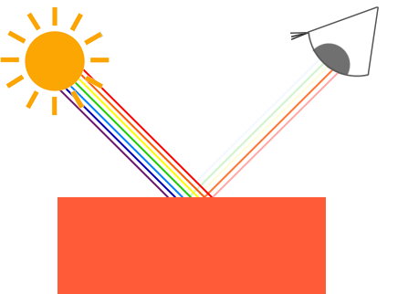
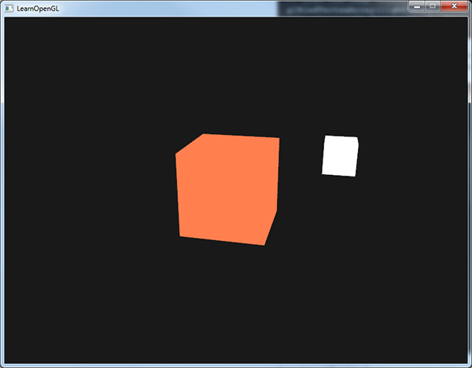

# learnopengl. Урок 2.1 — Цвета

Перевод очередного урока с сайта learnopengl.com. Недавно обнаружил на русском [Уроки по OpenGL с сайта OGLDev](https://triplepointfive.github.io/ogltutor/), но некоторые из них требуют 4 версию opengl, а примеры кода слишком зависимы от предыдущих уроков и объектно-ориентированы. Поэтому, вниманию всех интересующихся opengl'ем новичков со стареньким железом предлагаю коротенькую статью о цвете, с которой начинается вторая часть обучающего курса от Joey de Vries: 

## Цвета

В предыдущих уроках встречались краткие упоминания о том, как работать с цветом в OpenGL, но до сих пор мы касались только самой поверхности этого вопроса. Сейчас мы подробно обсудим, что такое из себя представляет цвет, и начнем построение сцены, которую будем использовать в следующих уроках, посвященных освещению.

В реальном мире у каждого объекта есть свой собственный цвет, который может принимать практически любые значения. В цифровом же мире нам необходимо отобразить \(бесконечные\) цвета реальности посредством \(ограниченного диапазона\) цифровых значений, поэтому в цифровом виде могут быть воспроизведены не все существующие цвета. Однако мы можем отображать настолько огромное количество цветов, что вы, вероятно, все равно не заметите разницы. В цифровой форме цвета представляют совокупностью трех компонент: красного, зеленого и синего, обычно сокращенно называемой RGB \(Red Green Blue\). Используя различные комбинации всего лишь этих трех значений, мы можем передать почти любой существующий цвет. Например, чтобы получить коралловый цвет, мы зададим вектор цвета следующим образом:

```cpp
glm::vec3 coral(1.0f, 0.5f, 0.31f);
```

Цвета, видимые нами в реальной жизни, это цвета не самих объектов, а цвет отраженного ими света; т.е. мы воспринимаем цвета, которые остаются не поглощёнными \(отброшенными\) объектом. Например, свет солнца воспринимается как белый свет, который состоит из всех цветов спектра \(вы можете это видеть на картинке\). Таким образом, если мы посветим белым светом на синюю игрушку, то она будет поглощать все составляющие белый свет цвета, кроме синего. Так как игрушка не поглощает синий цвет, он отразится, и этот отраженный свет, воздействуя на наши органы зрения, создаёт впечатление, что игрушка окрашена в синий цвет. Следующий рисунок иллюстрирует этот феномен на примере объекта кораллового цвета, отражающего исходные цвета с разной интенсивностью:



Вы можете видеть, что белый солнечный свет на самом деле представляет собой совокупность всех видимых цветов, и объект поглощает наибольшую часть этого диапазона. Он отражает только те цвета, комбинация которых воспринимается нами как цвет объекта \(в данном случае коралловый цвет\).

Эти правила отражения света непосредственно применяются в компьютерной графике. Когда в OpenGL мы создаем источник света, то указываем его цвет. В предыдущем абзаце мы говорили о белом солнечном свете, поэтому давайте и нашему источнику света тоже зададим белый цвет. Если затем мы умножим цвет источника света на цвет объекта, то полученное значение будет отраженным цветом объекта \(и, следовательно, цветом в каком мы воспринимаем объект\). Вернемся к нашей игрушке \(на этот раз кораллового цвета\) и посмотрим, как графическими средствами вычислить её цвет, воспринимаемый наблюдателем. Для получения нужного нам цвета, произведем покомпонентное умножение двух цветовых векторов:

```cpp
glm::vec3 lightColor(1.0f, 1.0f, 1.0f);
glm::vec3 toyColor(1.0f, 0.5f, 0.31f);
glm::vec3 result = lightColor * toyColor; // = (1.0f, 0.5f, 0.31f);
```

Игрушка *поглощает* наибольшую часть белого света, а оставшееся количество красного, зеленого и синего излучения она отражает соответственно цвету своей поверхности. Это демонстрация того, как цвета ведут себя в реальном мире. Таким образом, мы можем задать цвет объекта вектором, характеризующим *величины отражения цветовых компонент*, поступающих от источника света. А что бы произошло, если бы для освещения мы использовали зеленый свет?

```cpp
glm::vec3 lightColor(0.0f, 1.0f, 0.0f);
glm::vec3 toyColor(1.0f, 0.5f, 0.31f);
glm::vec3 result = lightColor * toyColor; // = (0.0f, 0.5f, 0.0f);
```

Как мы видим, в источнике света нет красной и синей составляющей, поэтому игрушка не будет их поглощать и/или отражать. Одну половину всего количества зеленого света игрушка поглощает, а вторую отражает. Поэтому цвет игрушки, который мы увидим будет темно-зеленый. Таким образом, если мы используем зеленый источник света, то отражаться и восприниматься будут только зеленые компоненты; никакие красные и синие оттенки не будут видны. В результате объект кораллового цвета неожиданно становится темно-зеленоватым. Давайте проведем еще один эксперимент с темным оливково-зеленым светом:

```cpp
glm::vec3 lightColor(0.33f, 0.42f, 0.18f);
glm::vec3 toyColor(1.0f, 0.5f, 0.31f);
glm::vec3 result = lightColor * toyColor; // = (0.33f, 0.21f, 0.06f);
```

Перед вами пример получения странной окраски объекта из-за использования разноцветного освещения. Оказывается стать оригинальным колористом совсем не сложно.

Но хватит рассуждать о цветах, давайте лучше приступим к созданию сцены, в которой сможем попрактиковаться.

## Освещенная сцена

В следующих уроках, углубленно работая с цветами, мы создадим интересные визуальные эффекты, имитирующие освещение в реальном мире. С этого момента, для имитации освещения мы станем использовать не менее одного источника света, и будем его изображать как видимый объект сцены.

Первое, что нам понадобится — это освещаемый объект, в качестве которого мы будем возьмем уже знакомый нам по предыдущим урокам куб. Нам также будет нужен какой-нибудь яркий объект, для того, чтобы показать, где в 3D-сцене находится источник света. Для простоты источник света мы тоже представим кубом \(ведь у нас уже есть [координаты вершин](src1.cpp), неправда ли?\).

Поскольку создание VBO \(vertex buffer object\), установка указателей атрибутов вершин и выполнение всех остальных мудрёных операций для вас теперь не должно представлять сложности, то мы не будем на этом останавливаться. Если эти темы у вас по-прежнему вызывают трудности, то, прежде чем продолжить, я рекомендую вам ознакомиться с предыдущими уроками и, по возможности, выполнить предлагаемые упражнения.

Итак, давайте начнем с вершинного шейдера для рисования контейнера. Координаты вершин контейнера остаются старыми \(хотя на этот раз текстурные координаты нам не понадобятся\), поэтому в коде не будет ничего нового. Мы используем "урезанную" версию вершинного шейдера из последних уроков:

```glsl
#version 330 core
layout (location = 0) in vec3 position;

uniform mat4 model;
uniform mat4 view;
uniform mat4 projection;

void main()
{
    gl_Position = projection * view * model * vec4(position, 1.0f);
}
```

Убедитесь в том, что вы обновили данные вершин и указатели атрибутов в соответствии с новым вершинным шейдером \(впрочем, если вы хотите, то можете оставить в VAO буфер с текстурными координатами и активный указатель на эти атрибуты; мы просто пока не будем их использовать, но и начать всё "с чистого листа" тоже не такая уж и плохая идея\).

Поскольку мы собираемся добавить в сцену куб-лампу, то для неё нам потребуется создать новый VAO. Мы могли бы изобразить лампу тем же самым VAO, трансформировав матрицу модели, но в будущих уроках мы будем довольно часто менять данные вершин и атрибутов объекта-контейнера и при этом не хотим, чтобы изменения затрагивали объект лампы \(в нём нас интересует только координаты вершин лампы\), поэтому давайте создадим еще один VAO:

```cpp
GLuint lightVAO;
glGenVertexArrays(1, &lightVAO);
glBindVertexArray(lightVAO);
// Так как VBO объекта-контейнера уже содержит все необходимые данные, то нам нужно только связать с ним новый VAO 
glBindBuffer(GL_ARRAY_BUFFER, VBO);
// Настраиваем атрибуты (нашей лампе понадобятся только координаты вершин)
glVertexAttribPointer(0, 3, GL_FLOAT, GL_FALSE, 3 * sizeof(GLfloat), (GLvoid*)0);
glEnableVertexAttribArray(0);
glBindVertexArray(0);
```

Этот код относительно прост. Теперь, когда мы создали и контейнер, и лампу-куб, осталось сделать еще одну вещь — фрагментный шейдер:

```glsl
#version 330 core
out vec4 color;
  
uniform vec3 objectColor;
uniform vec3 lightColor;

void main()
{
    color = vec4(lightColor * objectColor, 1.0f);
}
```

Фрагментный шейдер через uniform-переменные получает два параметра: цвета объекта и цвета источника света. Как мы уже обсуждали в начале этого урока, для получения воспринимаемого \(т.е. отражаемого объектом\) цвета, мы умножаем вектор источника света на вектор цвета объекта. И снова, исходный текст шейдера не должен вызывать вопросов.

Давайте зададим объекту коралловый цвет из предыдущего раздела:

```cpp
// Не забудьте перед установкой uniform-переменных для соответствующей шейдерной программы вызвать glUseProgram 
GLint objectColorLoc = glGetUniformLocation(lightingShader.Program, "objectColor");
GLint lightColorLoc  = glGetUniformLocation(lightingShader.Program, "lightColor");
glUniform3f(objectColorLoc, 1.0f, 0.5f, 0.31f);
glUniform3f(lightColorLoc,  1.0f, 1.0f, 1.0f); // зададим цвет источника света (белый)
```

Остается заметить, что если мы начнем редактировать вершинный и фрагментный шейдеры, то куб лампы тоже измениться, а это совсем не то, чего мы хотим. В следующих уроках появятся лишние неудобства, если вычисление освещенности станет влиять на цвет лампы, поэтому мы предпочтём отделить цвет лампы от всего остального. Сделаем так, что бы лампа была константного яркого цвета, не подверженного воздействию других цветовых изменений \(от этого куб лампы будет выглядеть как будто он действительно является источником света\).

Чтобы этого добиться мы создадим второй набор шейдеров, который будем использовать только для рисования лампы, и тем самым обезопасим себя от любых изменений в шейдерах, вычисляющих освещение сцены. Вершинный шейдер останется без изменений, поэтому вы можете просто скопировать его исходный код в вершинный шейдер лампы. А фрагментный шейдер будет обеспечивать яркость лампы, путем задания константного белого цвета фрагментов:

```glsl
#version 330 core
out vec4 color;

void main()
{
    color = vec4(1.0f); // Устанавливает все 4 компоненты вектора равными 1.0f
}
```

Когда мы будем рисовать наш куб-контейнер \(или, может быть, множество контейнеров\), то воспользуемся созданным в этом уроке шейдером освещения, а когда захотим нарисовать лампу, то применим шейдеры лампы. На других уроках мы займемся постепенным улучшением шейдеров освещения, и в конце концов достигнем более реалистичных результатов.

Основное предназначение куба лампы — показать месторасположение источника света. Мы задаем где-то в сцене положение источника света, но это только координата точки, которая не имеет визуального представления. Чтобы действительно показать лампу, мы нарисуем в месте нахождения источника света куб. Рисование лампы осуществляется с помощью шейдера лампы, и это гарантирует нам, что куб лампы всегда останется белым, вне зависимости от условий освещения сцены.

Итак, давайте объявим глобальную переменную **vec3**, которая будет представлять положение источника света в координатах мирового пространства:

```cpp
glm::vec3 lightPos(1.2f, 1.0f, 2.0f);
```

Теперь, прежде чем нарисовать лампу, сдвинем её в позицию источника света, и немного уменьшим размер куба, чтобы убедиться, что лампа не слишком доминирует в сцене:

```cpp
model = glm::mat4();
model = glm::translate(model, lightPos);
model = glm::scale(model, glm::vec3(0.2f));
```

Получившийся в результате код рисования лампы должен выглядеть примерно так:

```cpp
lampShader.Use();
// Установка uniform-переменных матриц модели, вида и проекции
...
// Рисование куба лампы
glBindVertexArray(lightVAO);
glDrawArrays(GL_TRIANGLES, 0, 36);			
glBindVertexArray(0);
```

Вставка всех приведенных выше фрагментов кода в соответствующие места, даст нам правильно настроенную OpenGL-сцену для дальнейших экспериментов с освещением. При успешной компиляции все должно выглядеть следующим образом:



Да, смотреть пока особо не на что, но обещаю, что в следующих уроках эта сцена станет гораздо более привлекательной.

Если вам сложно разобраться с тем, как все фрагменты кода сочетаются друг с другом и объединяются в готовую программу, тогда тщательно изучите [исходный код](src2.cpp) и внимательно проследите всю последовательность совершаемых в нем действий.

Теперь, когда у нас достаточно знаний о цвете и есть базовая сцена для более интимного знакомства со светом, мы можем перейти к следующему уроку, в котором и начнется настоящее волшебство.
