# Learn OpenGL. Урок 2.5 — Источники света

## Источники света

Вплоть до этой статьи мы довольствовались освещением, исходящим из одной точки в пространстве. И результат был неплох, однако в реальности существует множество источников освещения с различающимся "поведением". В данном уроке рассматриваются несколько таких источников света. Умение имитировать характеристики разных источников света является еще одним инструментом обогащения создаваемых сцен.

Начнем урок с направленного источника света, затем перейдем к точечному источнику, который является развитием упомянутого простого метода освещения. В конце рассмотрим, как устроен источник, имитирующий свойства прожектора \(спотлайт\).

### Направленный источник освещения

Если источник света значительно удален от объекта наблюдения, то приходящие лучи света оказываются практически параллельны друг другу, создавая впечатление, что свет направлен одинаково вне зависимости от расположения объекта и/или наблюдателя. Моделируемый бесконечно удаленный источник света называется направленным, поскольку все его лучи считаются идущими в одном направлении и не зависят от расположения самого источника.
Хорошим примером источника такого типа является наше Солнце. Пусть оно и не бесконечно удалено от нас, но этого расстояния достаточно, чтобы считать его бесконечно удаленным в расчетах освещения. И считать, что лучи солнечного света являются параллельными, что и изображено на рисунке:

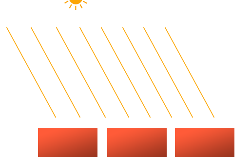

Поскольку мы считаем лучи параллельными взаимное расположение освещаемого объекта и источника не важно – направление лучей будет одинаковым во всей сцене. Соответственно и расчет освещения будет одинаков для всех объектов, поскольку вектор направления освещения один и тот же для любого объекта сцены.

Для моделирования направленного источника мы можем задаться вектором направления освещения, а вектор положения становится не нужен. Модель вычислений в шейдере остается практически неизменной: заменяется вычисление вектора направления источника *lightDir* с использованием вектора положения источника на непосредственное использование заданного вектора направления *direction*.

```glsl
struct Light {
    // vec3 position; //Не требуется для направленного источника.
    vec3 direction;
  
    vec3 ambient;
    vec3 diffuse;
    vec3 specular;
};
...
void main()
{
  vec3 lightDir = normalize(-light.direction);
  ...
}
```

Обратите внимание на инверсию вектора *light.direction*. До сих пор модель вычислений принимала вектор направления источника света как ориентированный от фрагмента **к источнику**, однако для направленных источников вектор направления обычно задается как ориентированный **от источника**. Поэтому проводится инверсия, а в переменной сохраняем вектор, направленный на источник света. Также не забудьте про нормализацию – лучше не надеяться на то, что входные данные будут нормализованы.

Итак, в итоге *lightDir* используется в вычислениях диффузной и зеркальной составляющей таким же образом, как и ранее.

Дабы наглядно продемонстрировать то, что направленный источник одинаково влияет на освещенность множества объектов, мы воспользуемся знакомым кодом сцены с толпой контейнеров из финала урока по [Координатным системам](../../part%201/chapter%208/text.md). Для пропустивших: сначала мы задали [10 различных положений](src1.cpp) контейнеров и задали каждому из них по уникальной модельной матрице, хранящей соответствующие преобразования из локальной системы координат в мировую:

```cpp
for(unsigned int i = 0; i < 10; i++)
{
    glm::mat4 model(1.);
    model = glm::translate(model, cubePositions[i]);
    float angle = 20.0f * i;
    model = glm::rotate(model, glm::radians(angle), glm::vec3(1.0f, 0.3f, 0.5f));
    lightingShader.setMat4("model", model);

    glDrawArrays(GL_TRIANGLES, 0, 36);
}
```

Также, не забудьте передать в шейдер направление нашего направленного источника \(еще раз напомню, что направление мы задаем от источника; по виду вектора вы можете определить, что он направлен вниз\):

```cpp
lightingShader.setVec3("light.direction", -0.2f, -1.0f, -0.3f);
```

> До сих пор мы передавали положения и направления как трехкомпонентные вектора \(*vec3*\), однако некоторые разработчики предпочитают передачу в виде векторов с четырьмя компонентами \(*vec4*\). При задании положений с помощью vec4 крайне важно установить компонент w равным 1 дабы преобразования переноса и проекционные преобразования были корректно применены. В то же время при задании направлений в виде vec4 мы бы не хотели, чтобы перенос влиял на направление \(на то это и вектор направления, в конце концов\), а потому должны установить w = 0.
> 
> Таким образом вектор направления представляется в виде *vec4\(0.2f, 1.0f, 0.3f, 0.0f\)*. Такая запись также может использоваться для доступной проверки на тип источника света и выбором модели расчета освещения: если компонент w равен 1, то это явно вектор положения источника света, если же w равен 0, то перед нами вектор направления:
> 
> ```cpp
>     if(lightVector.w == 0.0) // обратите внимание на ошибки округления
>       // выполнить расчет освещения для направленного источника
>     else if(lightVector.w == 1.0)
>       // выполнить расчет освещения с учетом положения источника
>       // (как в предыдущем уроке)
> ```
> 
> Забавный факт: именно так OpenGL определяла источник света как направленный или позиционированный и изменяла модель расчетов во времена фиксированного конвейера \(fixed-functionality\).

Если теперь собрать наше приложение, то перемещаясь по сцене можно заметить, что все объекты освещены источником, похожим на солнце по своему поведению. Видите, как диффузная и зеркальная компонента освещения на объектах изменяется так, будто где-то в условном небе расположен источник света? Результаты должны быть примерно такими:

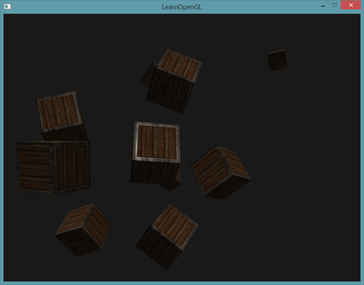

Исходный код примера можно найти [здесь](src2.cpp).
 
### Точечные источники

Направленные источники света хорошо справляются с задачей освещения всей сцены целиком, но, обычно, нам требуется разместить дополнительно еще несколько точечных источников в пространстве сцены. Точечный источник света имеет заданное положение в пространстве и равномерно излучает во всех направлениях, а интенсивность освещения спадает с расстоянием. Обычные лампы накаливания или факелы можно привести как пример точечных источников.

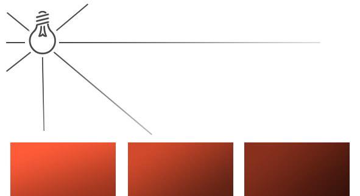

В предыдущих уроках мы использовали простейшую реализацию точечного источника с заданной позицией, распространявшего свет во всех направлениях. Однако, лучи этого источника не затухали с удалением, что заставляло источник выглядеть чрезвычайно мощным. В большинстве же создаваемых сцен желательно было бы иметь источники, влияющие на окружение в непосредственной близости к ним, но не на всю сцену сразу.

Если вы добавите 10 контейнеров к сцене предыдущего примера, то заметите, что даже самые удаленные из них освещены с той же интенсивностью, что и находящиеся прямо пред источником. И это ожидаемо – мы ведь не ввели в расчет никаких выражений, управляющих интенсивностью освещения. Но мы хотим, чтобы удаленные контейнеры были лишь слегка подсвечены по сравнению с ближайшими к источнику.

### Затухание

Ослабление интенсивности освещения с расстоянием называется затуханием. Простейшим методом расчета затухания является использование линейного закона. В этом случае интенсивность будет линейно спадать с расстоянием, обеспечивая меньшую освещенность удаленных объектов. Но визуально такая модель дает нереалистичные результаты. В общем случае реальные источники света дают сильную засветку вблизи, но интенсивность довольно резко спадает в небольшом радиусе и далее оставшийся ее запас медленно уменьшается с расстоянием. Для имитации подобного поведения понадобится расчет похитрее линейного.
К счастью, физики не дремлют, и обобщенное выражение вычисления коэффициента затухания от расстояния давно выведена. Остается только рассчитать значение для каждого фрагмента и умножить на результат вектор интенсивности конкретного источника:

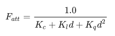

, где *d* — расстояние от фрагмента до источника, Kc, Kl, Kq — постоянный, линейный и квадратичный коэффициенты.

- Постоянный коэффициент по обыкновению равен 1.0, выполняя защиту от уменьшения значения знаменателя до величин меньше единицы, что привело бы к росту интенсивности освещения на определенных расстояниях. Для нас такой эффект нежелателен.
- Линейный коэффициент определяет член, линейно уменьшающий интенсивность света с ростом расстояния.
- Квадратичный коэффициент определяет член, задающий квадратичный спад интенсивности. На малых расстояниях вклад квадратичного члена будет перекрыт вкладом линейного, но с ростом расстояния станет доминирующим в выражении.

Комбинация линейной и квадратичной зависимости позволяет создать эффект, когда интенсивность спадает линейно вблизи от источника, а после определенного рубежа удаления начинает спадать гораздо быстрее. В итоге яркость источника велика вблизи, довольно быстро убывает с ростом расстояния и на больших удалениях падает медленней. Следующий график показывает пример зависимости коэффициента затухания на протяжении 100 единиц расстояния:

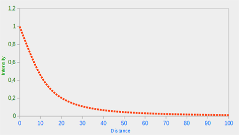

Как видно, интенсивность наибольшая на малых расстояниях, но с ростом значительно падает и стремится к нулю в окрестностях 100ед.

### Подбор коэффициентов

Встает вопрос выбора трех коэффициентов Kc, Kl, Kq. Подходящие значения ищутся исходя из разрабатываемого окружения в сцене, требующегося расстояния освещения, типа источника и прочих факторов. В большинстве случаев же это становится вопросом опыта и определенного количества подстройки методом проб и ошибок. Приведенная таблица содержит список параметров, которые обеспечивают реалистичное, в определенном смысле, поведение источника света, покрывающего указанное расстояние. Первая колонка указывает на расстояние покрытия при установленных коэффициентах. Таблица взята со [страницы вики](http://www.ogre3d.org/tikiwiki/tiki-index.php?page=-Point+Light+Attenuation) проекта движка Ogre3D и является отличной отправной точкой подбора нужных вам значений.
| **Дистанция** | **Постоянный** | **Линейный** | **Квадратичный** |
| --- | --- | --- | --- |
| 7 | 1.0 | 0.7 | 1.8 |
| 13 | 1.0 | 0.35 | 0.44 |
| 20 | 1.0 | 0.22 | 0.20 |
| 32 | 1.0 | 0.14 | 0.07 |
| 50 | 1.0 | 0.09 | 0.032 |
| 65 | 1.0 | 0.07 | 0.017 |
| 100 | 1.0 | 0.045 | 0.0075 |
| 160 | 1.0 | 0.027 | 0.0028 |
| 200 | 1.0 | 0.022 | 0.0019 |
| 325 | 1.0 | 0.014 | 0.0007 |
| 600 | 1.0 | 0.007 | 0.0002 |
| 3250 | 1.0 | 0.0014 | 0.000007 |

Как видно, постоянный коэффициент везде равен единице. Линейный коэффициент выбирают небольшим при освещении больших расстояний, а квадратичный коэффициент и того меньше. Попробуйте поэкспериментировать с данными значениями и лично узреть, какой эффект их смена оказывает в условиях вашей реализации. Для рассматриваемых сцен расстояние покрытия от 32 до 100ед. вполне достаточно.

### Реализация

Для реализации затухания нам потребуются три допольнительных параметра в коде фрагментного шейдера: собственно, постоянный, линейный и квадратичный коэффициенты. Хранить их логичней всего в составе объявленной структуры *Light*, что мы использовали ранее. Обратите внимание, что расчет вектора *lightDir* осуществляется аналогично предыдущему уроку, а не путем, описанным в разделе направленного источника света.

```glsl
struct Light {
    vec3 position;  
  
    vec3 ambient;
    vec3 diffuse;
    vec3 specular;
	
    float constant;
    float linear;
    float quadratic;
};
```

Далее, установим конкретные значения параметров в коде. Нам потребуется дистанция освещения порядка 50ед., для которых в таблице указаны следующие значения: 

```cpp
lightingShader.setFloat("light.constant",  1.0f);
lightingShader.setFloat("light.linear",    0.09f);
lightingShader.setFloat("light.quadratic", 0.032f);
```

Код вычисления во фрагментном шейдере очевидный: мы рассчитываем коэффициент затухания и далее умножаем на него фоновую, диффузную и зеркальную компоненты освещения.

Для вычислений нам, однако, потребуется значение расстояния от фрагмента до источника света. Как нам его получить? Все просто: достаточно вычислить разность векторов положения фрагмента и источника, и воспользоваться встроенной функцией GLSL *length\(\)*:

```glsl
float distance    = length(light.position - FragPos);
float attenuation = 1.0 / (light.constant + light.linear * distance + 
    		    light.quadratic * (distance * distance));
```

В итоге мы умножаем полученный коэффициент на все компоненты модели освещения.

> Можно было бы оставить фоновый компонент без затухания, однако в сценах с несколькими источниками вклад этой компоненты начнет суммироваться, что, обычно, нежелательно. В этом случае затухание стоит включить и для фоновой компоненты.

```glsl
ambient  *= attenuation; 
diffuse  *= attenuation;
specular *= attenuation;
```

Запустив тестовое приложение можно ожидать примерно такой результат:

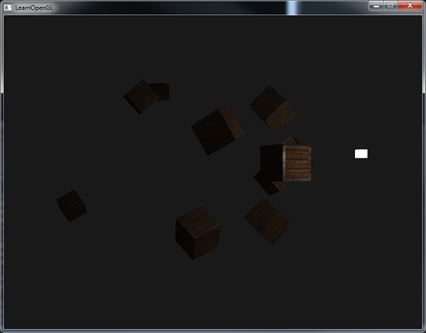

Видно, что теперь подсвечены только контейнеры, находящиеся впереди, и самый ближний является ярчайшим. Контейнеры в глубине сцены же не освещены вовсе, поскольку слишком удалены от источника.

Полный код примера можно найти [здесь](src3.cpp). Подытоживая, можно сказать, что точечным мы называем источник с настраиваемым положением и учетом затухания интенсивности в расчетах освещения. Еще один инструмент в нашей копилке!

### Прожектор

Последним рассмотренным типом источника будет прожектор. Такой источник имеет заданное положение, но излучает не во всех направлениях, а только в выбранном. При этом объекты освещаются лишь в небольшой окрестности от заданного направления, а предметы, лежащие вне этой области, остаются без подсветки. Как пример представьте себе уличный фонарь или ручной фонарик.

В нашей модели прожектор будет представлен положением в мировых координатах, вектором направления и **углом отсечения**, который определяет радиус подсветки прожектора. Чтобы определить, подсвечен фрагмент или нет, мы вычислим, находится ли он внутри или за пределами конусообразной зоны отсечения источника. Данная схема поможет разобраться, как все устроено:

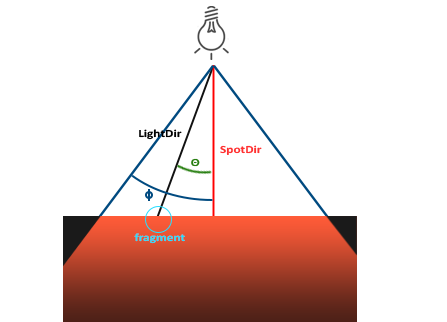

Здесь *LightDir* – вектор, направленный от фрагмента к источнику, *SpotDir* – вектор направления прожектора, *phi* – угол отсечения, определяющий радиус подсветки \(фрагменты, лежащие вне этого угла не будут подсвечены\), *theta* – угол между векторами *LightDir* и *SpotDir* \(если *theta* меньше чем *phi*, то фрагмент попадает в зону подсветки\).

Таким образом, все что нужно сделать – это рассчитать скалярное произведение векторов *LightDir* и *SpotDir* и сравнить полученное значение с заданным углом отсечения \(с косинусом угла, ведь скалярное умножение возвращает косинус угла между двумя нормализованным векторами\). Теперь, когда у вас есть базовое понимание устройства прожектора, можно перейти к реализации.

### Реализация

Воплотим модель в жизнь в виде фонарика, т.е. источника, зафиксированного в точке положения наблюдателя и направленного прямо вперед с его точки зрения. По сути фонарик – источник типа прожектора, с положением и направлением, жестко привязанным к положению и ориентации игрока.

Для передачи в шейдер нам понадобятся значения положения (для вычисления вектора на источник света), вектор направления прожектора и угол отсечения. Все это можно поместить в структуру *Light*:

```glsl
struct Light {
    vec3  position;
    vec3  direction;
    float cutOff;
    ...
};
```

Далее, передаем данные шейдеру в коде программы: 

```cpp
lightingShader.setVec3("light.position",  camera.Position);
lightingShader.setVec3("light.direction", camera.Front);
lightingShader.setFloat("light.cutOff",   glm::cos(glm::radians(12.5f)));
```

Как видно, здесь мы передаем не угол отсечения, а его косинус, поскольку в самом шейдере мы рассчитываем скалярное произведение векторов, что возвращает косинус угла между ними. Дабы избежать вычисления угла по косинусу с вызовом дорогой функции *acos\(\)* мы передадим в шейдер готовое значение косинуса угла отсечения и будем сравнивать эти значения напрямую, немного экономя вычислительные ресурсы.

Собственно, вычислим и определим, находимся мы внутри зоны действия прожектора или нет:

```glsl
float theta = dot(lightDir, normalize(-light.direction));
if(theta > light.cutOff) 
{       
  // расчет освещения
}
// иначе используем только фоновую компоненту, чтобы сцена не была 
// полностью черной вне конуса прожектора
else  color = vec4(light.ambient * vec3(texture(material.diffuse, TexCoords)), 1.0);
```

Сперва мы вычисляем скалярное произведение векторов *LightDir* и инвертированного вектора *direction* \(поскольку нам требуется вектор, направленный к источнику, а не от него\). Не забудьте нормализовать все используемые вектора!

> Вас может удивить использование знака сравнения ">" вместо "<" в условном операторе. Кажется, *theta* должна быть меньше значения отсечения чтобы фрагмент оказался в конусе действия прожектора? Все верно, но мы сравниваем здесь не углы, а их косинусы. Косинус 0° при этом равен 1, а 90° — 0. Взгляните на график:
> 
> 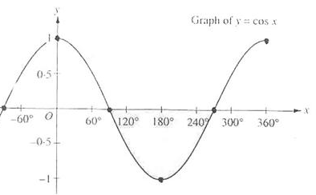
> 
> Очевидно, что с значение косинуса стремится к 1 при уменьшении угла, что объясняет, почему theta должна быть больше значения отсечения. В данном примере используется значение отсечения равное косинусу угла 12,5°, что равно 0.9978. Соответственно фрагмент будет в конусе подсветки, если значение *theta* будет в отрезке от 0.9978 до 1.0.

Запуск тестового приложения покажет, что теперь подсвечиваются только те фрагменты, что лежат внутри конуса действия прожектора:

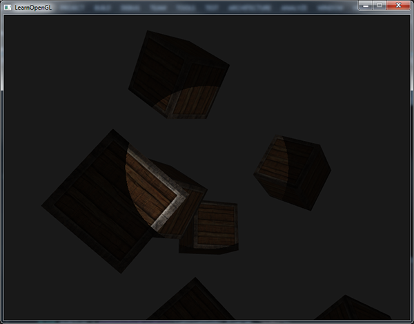

Полный код примера – [здесь](src4.cpp).

Результаты, однако, не впечатляют. Особенно нереалистично выглядят жесткие, резкие края подсвеченной области. Фрагменты, выпавшие из конуса прожектора затеняются моментально, без спада яркости. Реалистичнее же плавно уменьшать интенсивность подсветки в зоне отсечения.

### Плавное затухание

Для реализации прожектора с мягкими краями зоны подсветки нам потребуются задать внутренний и внешний конусы этой зоны. Внутренний конус можно определить на основе данных, рассмотренных в предыдущей секции. От его границ до границ внешнего конуса интенсивность должна плавно затухать.

Внешний конус определим с помощью косинуса угла раствора этого конуса. В результате, для фрагмента, оказавшегося в промежутке между границами двух конусов должна быть вычислена интенсивность освещения в промежутке между 0.0 и 1.0. Фрагменты, лежащие во внутреннем конусе всегда освещены с интенсивностью 1.0, а попавшие за пределы внешнего конуса не освещены вовсе.

Вычислить параметр, определяющий плавный спад интенсивности можно по следующей формуле:

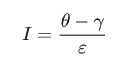

, где 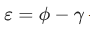  — разница косинусов углов, определяющих внутренний \(ϕ\) и внешний \(γ\) конусы, *I* — коэффициент интенсивности освещения для данного фрагмента.

Практически представить, как себя ведет данное выражение, может быть затруднительно, потому рассмотрим пару примеров:

| θ | Θ° | ϕ (внутренний) | ϕ° | γ (внешний) | γ° | ε | I |
| --- | --- | --- | --- | --- | --- | --- | --- |
| 0.87 | 30 | 0.91 | 25 | 0.82 | 35 | 0.91 — 0.82 = 0.09 | 0.87 — 0.82 / 0.09 = 0.56 |
| 0.9 | 26 | 0.91 | 25 | 0.82 | 35 | 0.91 — 0.82 = 0.09 | 0.9 — 0.82 / 0.09 = 0.89 |
| 0.97 | 14 | 0.91 | 25 | 0.82 | 35 | 0.91 — 0.82 = 0.09 | 0.97 — 0.82 / 0.09 = 1.67 |
| 0.83 | 34 | 0.91 | 25 | 0.82 | 35 | 0.91 — 0.82 = 0.09 | 0.83 — 0.82 / 0.09 = 0.11 |
| 0.64 | 50 | 0.91 | 25 | 0.82 | 35 | 0.91 — 0.82 = 0.09 | 0.64 — 0.82 / 0.09 = -2.0 |
| 0.966 | 15 | 0.9978 | 12.5 | 0.953 | 17.5 | 0.966 — 0.953 = 0.0448 | 0.966 — 0.953 / 0.0448 = 0.29 |

Как видно, это простая операция интерполяции между косинусом внешнего и внутреннего угла отсечения в зависимости от значения θ. Если и сейчас не понятно, что происходит, то не волнуйтесь – можно просто принять формулу как данность и вернуться к ней через года опытным и умудренным человеком.

Одна проблема – значение I теперь оказывается меньше ноля в области вовне внешнего конуса, больше единицы в области внутреннего конуса и промежуточные значения между границами. Необходимо корректно ограничить область значений, чтобы избавиться в необходимости условных операторов и просто умножать компоненты модели освещения на вычисленное значение интенсивности:

```glsl
float theta     = dot(lightDir, normalize(-light.direction));
float epsilon   = light.cutOff - light.outerCutOff;
float intensity = clamp((theta - light.outerCutOff) / epsilon, 0.0, 1.0);    
...
// we'll leave ambient unaffected so we always have a little light.
diffuse  *= intensity;
specular *= intensity;
...
```

Обратите внимание на функцию *clamp\(\)*, которая ограничивает область значений своего первого параметра значениями второго и третьего параметров. В данном случае значение *intensity* будет лежать на отрезке \[0, 1\].
 
Не забудьте добавить параметр *outerCutOff* в структуру *Light* и настроить передачу конкретного значения в uniform переменную шейдера. Для данного изображения внутренний угол установлен в 12.5°, а внешний – 17.5°:

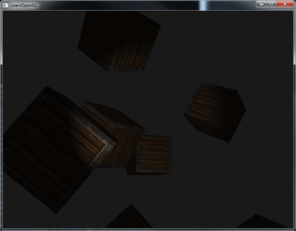

Много лучше! Теперь можно и поиграть с настройками зон отсечения и получить прожектор, идеально подходящий вашей задаче. Исходный код приложения можно найти [здесь](src5.cpp).

Такой тип источника-фонарика идеален для игр жанра ужасов, а в сочетании с направленными и точечными источниками создаваемые вами сцены кардинально преобразятся.

В следующем уроке попробуем использовать все рассмотренные на данный момент виды источников и графических техник.

## Задания

Попробуйте поэкспериментировать со всеми описанными типами источников и их фрагментными шейдерами. Проинвертируйте некоторые векторы и/или поменяйте знаки сравнений. Разберитесь для себя в результатах подобных действий.
