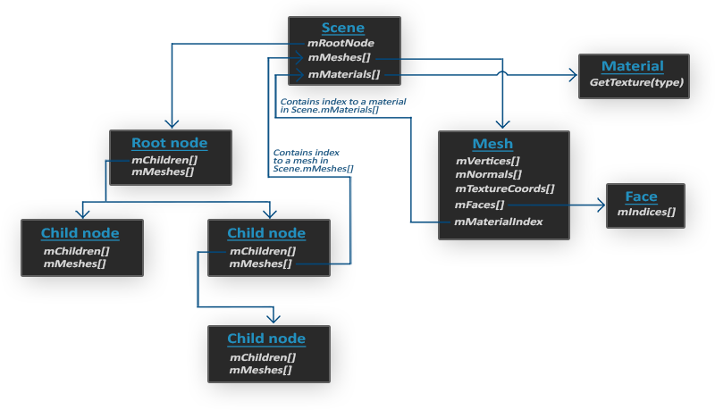

# learnopengl. Уроки 3.1 (Assimp) + 3.2 (класс Mesh)

## Assimp

Во всех уроках, мы, в основном, использовали нашего маленького друга — контейнер, но через некоторое время, даже наши лучшие друзья становятся немного скучными. В большом графическом приложении, обычно присутствуют много моделей, на которые намного приятнее смотреть, чем на наш статичный контейнер. Хотя, в отличие от контейнера, нам будет очень сложно, вручную, определить все вершины, нормали и текстурные координаты таких сложных моделей, как например дом или человекоподобные персонажи. Вместо этого, мы будем имортировать модели в наше приложение; модели, которые были тщательно нарисованы, в 3D редакторах, таких как Blender, 3DS MAX или Maya.

Эти, так называемые инструменты 3D моделирования, позволяют художникам создавать сложные модели и применять текстуры к ним с помощью процесса, который называется текстурная развертка \(uv-mapping\). Инструменты автоматически генерируют все вершинные координаты, вершины нормалей и текстурные координаты, экспортируя их в файл модели. Таким образом, художники имеют обширный набор инструментов для создания высококачественных моделей, не заботясь о технических деталях. Все технические аспекты спрятаны в экспортируемом файле. Мы, как программисты графики, должны позаботится об этих технических деталях.

Таким образом, наша работа заключается в анализе этих экспортированных файлов модели и извлечении всей соответствующей информации, чтобы мы могли хранить их в формате, который понимает OpenGL. Однако, распространенная проблема заключается в том, что существуют десятки различных форматов файлов, каждый из которых экспортирует данные модели по-своему уникальному способу. Форматы модели, как [.obj](https://ru.wikipedia.org/wiki/Obj) от Wavefront содержат только данные модели с незначительной информацией материала, такой как цвет модели или диффузные\бликовые карты, в то время как файлы моделей, на основе XML, чрезвычайно обширны и содержат модели, освещения, много информации о материалах, анимацию и многое другое. Формат obj считается легко анализированным. Рекомендуется ознакомиться со структурой файла, например, на странице в википедии. Это должно дать вам базовые сведения о том, как храниться модель в файле формата obj.

В общем, существует много разных форматов, где хранящаяся структура данных отличается. Поэтому, если мы хотим импортировать модель из этих файлов, нам нужно написать импортер самим, для каждого формата, который мы захотим импортировать. Удачно для нас, для этого есть библиотека.

## Библиотека для загрузки моделей

Assimp — очень популярная библиотека, для импортирования моделей, которая расшифровывается как Open Asset Import Library. Эта библиотека может импортировать множество различных форматов, содержащие модели, сохраняя данные, которые импортируются, в виде простой иерархической структуры данных. Как только Assimp закончит загрузку моделей, мы сможем получить все нужные нам данные из этой структуры. Без разницы какой формат файлов мы импортируем, обращение к данным в структурах не изменяется, структура остается такой же для всех различных форматов файлов.

При импорте модели, с помощью Assimp, библиотека загружает всю модель в объект сцены \(Scene\), содержащий все данные импортированной модели. Затем Assimp создает коллекцию узлов, где каждый узел содержит индексы к данным, хранящимся в объекте сцены, каждый узел может иметь потомка. Простая модель структуры Assimp представлена ниже:



- Все данные модели содержатся в объекте Scene, как и данные о материалах и полигональной сетки. Scene также содержит ссылку на корневой узел \(Root node\) сцены.
- Корневой узел \(Root node\) может иметь потомков \(Child node\) \(как и остальные узлы\) и может иметь индексы, которые указывают на данные полигональной сетки, хранящиеся в массиве объекта сцены mMeshes. Массив mMeshes корневого узла содержит конкретные объекты полигональных сеток, а значения в массиве mMeshes у любого потомка являются лишь индексами для выборки из массива сеток корневого узла.
- Объект полигональной сетки \(Mesh\) содержит все соответствующие данные, необходимые для отрисовки: вершинные координаты, вектора нормалей, текстурных координаты, грани и информацию о материале объекта.
- Полигональная сетка \(Mesh\) содержит несколько граней. Грани \(Faces\) представляют собой примитивы объекта \(треугольники, квадраты, точки\). Они содержат индексы вершин, образующие примитивы. Так как у нас имеются вершины и их индексы, отрисовка происходит намного легче благодаря element buffer objects \([Hello Triangle](../../part%201/chapter%204/text.md)\)
- Так же, полигональная сетка содержит индекс на материальный объект \(Material\), который имеет несколько функций для получения свойств материала.

И так, нам нужно сначала загрузить наш объект в объект сцены, рекурсивно извлекать соответствующие объекты полигональной сетки от каждого из узлов \(рекурсивно пройдясь по потомкам каждого узла\) и обработать каждый элемент полигональной сетки для извлечения вершин, индексов и свойств материала. Результатом является коллекция полигональных сеток, которые мы будем содержать в объекте Model.

> Mesh — набор вершин и треугольников
> 
> Одна сетка \(Mesh\) — это минимальный набор данных, необходимый для вывода средствами OpenGL\(данные вершин, индексов, материала\). Модель же, обычно, состоит из нескольких сеток. При моделировании объектов в специальных программах\(Blender, 3D max\), художники не создают целую модель из одной формы. Обычно, каждая модель имеет несколько под-моделей\\форм, из которых она состоит. Подумайте о человеке, как о модели: художник обычно моделирует голову, конечности, одежду, оружие, все как отдельные компоненты, затем объединив все под-модели, получает исходную.

В следующих уроках мы создадим наши собственные классы Model и Mesh, которые загружают и хранят импортированные модели, используя только что описанную структуру. Если мы хотим нарисовать модель, то мы выводим ее не целиком, а осуществляем вывод каждой из составляющих модель сеток по-отдельности. До того, как мы сможем имортировать модели, нам нужно сначала включить Assimp в наш проект.

## Сборка Assimp

Вы можете скачать Assimp с [этой](http://assimp.org/main_downloads.html) страницы, выбрав соответствующую версию. Во время написания статьи, последняя версия Assimp была 3.1.1. Рекомендуется компилировать библиотеки самостоятельно, так как их, предварительно скомпилированые библиотеки, не работают на большинстве систем. Пересмотрите урок [Создание окна](../../part%201/chapter%202/text.md), если вы забыли как компилировать библиотеку самим, используя CMake.

Несколько проблем появлялись во время сборки Assimp, так что я отмечу их здесь, с их решениями в случае, если кто-либо из вас получит те же ошибки:

- CMake выдает ошибки о отсутствующих библиотеках DiretX, такие как:
  - Could not locate DirectX
  - CMake Error at cmake-modules/FindPkgMacros.cmake:110 (message):
  - Required library DirectX not found! Install the library (including dev packages)
    and try again. If the library is already installed, set the missing variables manually in cmake.
  Нужно установить DirectX SDK, в случае если он не был установлен. Вы можете скачать SDK [здесь](http://www.microsoft.com/en-us/download/details.aspx?id=6812).
- Во время установка DirectX SDK выскакивает код ошибки s1023.
В этом случае вам сначала нужно установить пакет С++, до того как устанавливать SDK, как описано [здесь](https://blogs.msdn.microsoft.com/chuckw/2011/12/09/known-issue-directx-sdk-june-2010-setup-and-the-s1023-error/).
- После завершения настройки можно создать файл проекта, открыть его и скомпилировать библиотеки.
- По умолчанию, Assimp предоставляется в виде динамической библиотеки, поэтому нам нужно включить в проект соответствующую dll с именем assimp.DLL. Можно просто файл библиотеку DLL в ту же папку, где находится исполняемый файл приложения.
- После компиляции, библиотека и её dll файл будут находится в папках code/Debug или code/Release.
- Далее просто свяжите файл библиотеки и dll файл с вашим проектом, и убедитесь, что вы не забыли также подключить заголовочные файлы Assimp.

> Если вы хотите использовать многопоточность для увеличения производительности, вы можете собрать Assimp с Boost. Полная инструкция находится [здесь](http://assimp.org/lib_html/install.html).

На этом моменте, вы должны были скомпилировать Assimp и внедрить его в ваше приложение.

## Класс Mesh

Используя Assimp мы можем загружать множество различных моделей в наше приложение, но после загрузки, данные все ещё хранятся в структуре Assimp. Нам нужно преобразовать эти данные в формат, который понимает OpenGL, чтобы мы смогли отрисовать модель. В предыдущем уроке мы узнали, что полигональная сетка представляет собой одну рисуемую сущность, поэтому давайте начнем с определения собственного класса Mesh.

Давайте подумаем, какой набор данных нам нужен для нашего класса. Полигональная сетка нуждается в наборе вершин, где каждая вершина содержит вектор позиции, вектор нормали и вектор текстурных координат. Полигональная сетка также должна содержать индексы, для индексированной отрисовки, и данные для материалов.

Теперь, мы можем определить структуру вершины:

```cpp
struct Vertex {
    glm::vec3 Position;
    glm::vec3 Normal;
    glm::vec2 TexCoords;
};
```

Каждая вершина хранится в структуре Vertex, которая может использоваться для индексации каждой вершины. Помимо структуры Vertex, нам также нужно создать структуру, которая хранит текстурные данные.

```cpp
struct Texture {
    unsigned int id;
    string type;
}; 
```

Она хранит id и тип текстуры \(диффузная или бликовая\).

Написав структуры, можно начинать писать наш класс:

```cpp
class Mesh {
    public:
        /*  Mesh Data  */
        vector<Vertex> vertices;
        vector<unsigned int> indices;
        vector<Texture> textures;
        /*  Functions  */
        Mesh(vector<Vertex> vertices, vector<unsigned int> indices, vector<Texture> textures);
        void Draw(Shader shader);
    private:
        /*  Render data  */
        unsigned int VAO, VBO, EBO;
        /*  Functions    */
        void setupMesh();
};
```

Как вы можете видеть, класс не очень сложен. Конструктор принимает все нужные нам данные, в методе setupMesh мы инициализируем буферы, в методе Draw мы будем отрисовывать нашу полигональную сетку. Обратите внимание, что функция отрисовки \(Draw\), принимает объект шейдера, чтобы мы могли установить соответствующие uniform переменные, до отрисовки.

Код конструктора довольно прост, мы просто присваиваем аргументам класса, соответствующие аргуметы. Также мы вызываем функцию setupMesh:

```cpp
Mesh(vector<Vertex> vertices, vector<unsigned int> indices, vector<Texture> textures)
{
    this->vertices = vertices;
    this->indices = indices;
    this->textures = textures;

    setupMesh();
}
```

Как видите, ничего необычного здесь не происходит. Далее, переходим к функции setupMesh.

## Инициализация

Благодаря конструктору, у нас имеется все нужные нам данные, которые мы можем использовать для отрисовки. Однако, нам сначала нужно настроить соответствующие буферы. К этому моменту у вас не должно быть проблем с этими понятиями, но, возможно, мы вас немного удивим как можно передавать данные в буфер, которые находятся в структуре:

```cpp
void setupMesh()
{
    glGenVertexArrays(1, &VAO);
    glGenBuffers(1, &VBO);
    glGenBuffers(1, &EBO);
  
    glBindVertexArray(VAO);
    glBindBuffer(GL_ARRAY_BUFFER, VBO);

    glBufferData(GL_ARRAY_BUFFER, vertices.size() * sizeof(Vertex), &vertices[0], GL_STATIC_DRAW);  

    glBindBuffer(GL_ELEMENT_ARRAY_BUFFER, EBO);
    glBufferData(GL_ELEMENT_ARRAY_BUFFER, indices.size() * sizeof(unsigned int), 
                 &indices[0], GL_STATIC_DRAW);

    // vertex positions
    glEnableVertexAttribArray(0);	
    glVertexAttribPointer(0, 3, GL_FLOAT, GL_FALSE, sizeof(Vertex), (void*)0);
    // vertex normals
    glEnableVertexAttribArray(1);	
    glVertexAttribPointer(1, 3, GL_FLOAT, GL_FALSE, sizeof(Vertex), (void*)offsetof(Vertex, Normal));
    // vertex texture coords
    glEnableVertexAttribArray(2);	
    glVertexAttribPointer(2, 2, GL_FLOAT, GL_FALSE, sizeof(Vertex), (void*)offsetof(Vertex, TexCoords));

    glBindVertexArray(0);
}  
```

Код не сильно отличается от того, что вы ожидали, но несколько маленьких трюков были использованы с помощью структуры Vertex.

В С++, у структур есть отличное свойство — их память является последовательной. То есть, если бы мы представили структуру как массив данных, то она содержала бы переменные в том порядке, в котором они определены в самой структуре. Например, если мы наполним структуру Vertex, какими нибудь значениями, то их размещение в памяти будет равной:

```cpp
Vertex vertex;
vertex.Position  = glm::vec3(0.2f, 0.4f, 0.6f);
vertex.Normal    = glm::vec3(0.0f, 1.0f, 0.0f);
vertex.TexCoords = glm::vec2(1.0f, 0.0f);
// = [0.2f, 0.4f, 0.6f, 0.0f, 1.0f, 0.0f, 1.0f, 0.0f];
```

Благодаря этому свойству, например, если мы применим функцию sizeof к нашей структуре, она вернет размер все аргументов, которые в ней определены. Она должна весить 32 байта
(8 * 4 — размер 1 float). Мы можем это использовать для функции glBufferData:

```cpp
glBufferData(GL_ARRAY_BUFFER, vertices.size() * sizeof(Vertex), vertices[0], GL_STATIC_DRAW);
```

Также мы используем макрокоманду offsetof, которая в качестве первого аргумента принимает структуру, а в качестве второго — имя переменной структуры. А возвращает она смещение в байтах указанной структуры, до переменной, переданной во втором аргументе. Это идеально подходит для определения последнего параметра функции glVertexAttribPointer:

```cpp
glVertexAttribPointer(1, 3, GL_FLOAT, GL_FALSE, sizeof(Vertex), (void*)offsetof(Vertex, Normal));
```

Смещение теперь определяется с помощью макроса offsetof, который, в данном случае, устанавливает смещение байта для вектора нормали. Обратите также, что мы указываем размер шага равным размеру структуры.

Использование такой структуры не только обеспечивает более читаемый код, но и позволит нам, в будущем, её расширять. Если мы захотим использовать какой нибудь другой вершинный артрибут, мы сможем легко добавить его в нашу структуру и из-за своей гибкости, код не поломается.

## Отрисовка

Последняя функция, которую нам следует написать — это Draw. Но перед тем, как отрисовать наши полигоны, сначала нам нужно связать наши текстуры, до вызова функции glDrawElements. Однако, это немного тяжело, т.к. мы не знаем сколько у нас есть текстур \(если они вообще есть\) и какого они типа. И также, как установить текстурные блоки и текстурных объектов в шейдере?

Чтобы решить эту проблему, мы примем некоторые соглашения об именовании: каждая диффузная текстура называется texture_diffuseN, а каждая бликовая текстурная карта должна называться texture_specularN, где N-любое число, начиная с 1 до максимального количества разрешенных текстур. Допустим у нас есть 3 диффузные текстуры и 2 бликовые текстуры для конкретной полигональной сетки, мы должны определить их так:

```cpp
uniform sampler2D texture_diffuse1;
uniform sampler2D texture_diffuse2;
uniform sampler2D texture_diffuse3;
uniform sampler2D texture_specular1;
uniform sampler2D texture_specular2;
```

Благодаря этому соглашению, мы можем определить столько текстурных объектов, сколько захотим, и если полигональная сетка действительно содержит много текстур, мы знаем, какими будут их имена. Мы можем обрабатывать любое количество текстур на одной полигональной сетке и разработчик может свободно использовать столько текстур, сколько он хочет, просто определяя дополнительные текстурные объекты в шейдере.

> Кроме этого решения, есть также много других, и если вам не нравится это, вы можете проявить свою творческую способность и придумать свое собственное решение.

Код метода Draw:

```cpp
void Draw(Shader shader) 
{
    unsigned int diffuseNr = 1;
    unsigned int specularNr = 1;
    for(unsigned int i = 0; i < textures.size(); i++)
    {
        glActiveTexture(GL_TEXTURE0 + i); // активируем текстурный блок, до привязки
        // получаем номер текстуры
        stringstream ss;
        string number;
        string name = textures[i].type;
        if(name == "texture_diffuse")
            ss << diffuseNr++; // передаем unsigned int в stream
        else if(name == "texture_specular")
            ss << specularNr++; // передаем unsigned int в stream
        number = ss.str(); 

        shader.setFloat(("material." + name + number).c_str(), i);
        glBindTexture(GL_TEXTURE_2D, textures[i].id);
    }
    glActiveTexture(GL_TEXTURE0);

    // отрисовывем полигональную сетку
    glBindVertexArray(VAO);
    glDrawElements(GL_TRIANGLES, indices.size(), GL_UNSIGNED_INT, 0);
    glBindVertexArray(0);
}  
```

Это не самый красивый код, но отчасти в этом виноват С++, так как, например, в нем нет такого преобразования типов, как int в строку. Мы пробегаемся по N-текстурам и определяем присваиваем их типы строковой переменной, что бы затем мы имели преставление, какой номер конкретного типа текстуры. Далее, мы узнаём номер нашего текстурного объекта, ну и наконец, устанавливаем этому текстурному объекту номер, соответствующий активному текстурному блоку и связываем текстуру. Обратите внимание, что мы собираемся хранить текстурные объекты в структуре Material, как обычно мы и делали.

> Обратите внимание, что увеличив диффузные и бликовые счетчики, мы сразу передаем их в stringstream. Правый инкремент в C++ увеличивает значение на 1, но возвращает старое значение.

Вы можете найти полный код класса Mesh [здесь](src1.cpp).

В следующем уроке, мы создадим класс Model, который работает как контейнер, для объектов класса Mesh и фактически реализует интерфейс загрузки Assimp.
