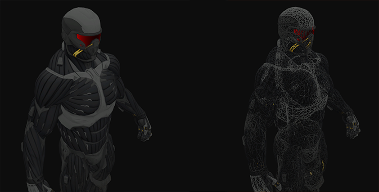
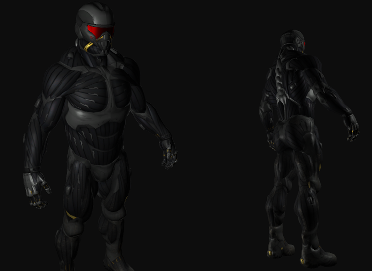

# Learn OpenGL. Урок 3.3 — Класс 3D-модели

## Класс 3D-модели

Ну что ж, пора закатать рукава и погрузиться в дебри работы с кодом загрузки и преобразования данных Assimp! Задача урока – создать еще один класс, представляющий собой целую модель, содержащую множество полигональных сеток, а также, возможно, состоящую из нескольких подобъектов. Здание с деревянным балконом, башней и, например, плавательным бассейном все равно будет загружено как единая модель. С помощью Assimp мы подгрузим данные и преобразуем их во множество объектов типа Mesh из прошлого урока.

Не будем тянуть кота за хвост – ознакомимся со структурой класса Model:

```cpp
class Model 
{
    public:
        /*  Методы   */
        Model(char *path)
        {
            loadModel(path);
        }
        void Draw(Shader shader);	
    private:
        /*  Данные модели  */
        vector<Mesh> meshes;
        string directory;
        /*  Методы   */
        void loadModel(string path);
        void processNode(aiNode *node, const aiScene *scene);
        Mesh processMesh(aiMesh *mesh, const aiScene *scene);
        vector<Texture> loadMaterialTextures(aiMaterial *mat, aiTextureType type, string typeName);
};
```

Как видно, класс содержит вектор объектов типа *Mesh* и требует указания пути к файлу модели в конструкторе. Загрузка и происходит непосредственно в конструкторе и использует вспомогательный метод *loadModel*. Все приватные методы ответственны за работу с какой-то частью процесса импорта данных Assimp и мы рассмотрим их подробнее чуть ниже.
Метод *Draw* тривиален: здесь осуществляется итерация по списку полигональных сеток и вызов их методов *Draw*.

```cpp
void Draw(Shader shader)
{
    for(unsigned int i = 0; i < meshes.size(); i++)
        meshes[i].Draw(shader);
}
```

## Импорт 3D модели в OpenGL

Для начала включим требуемые Assimp заголовочные файлы:

```cpp
#include <assimp/Importer.hpp>
#include <assimp/scene.h>
#include <assimp/postprocess.h>
```

Первый метод, который будет вызван в конструкторе – это *loadModel*, которая использует библиотеку для загрузки модели в структуру, называемую объектом сцены в терминологии Assimp. Вспомните [первый урок раздела](../../part%203/chapter%2012/text.md) – нам известно, что объект сцены – корневой объект иерархии данных в Assimp. Как только мы получим законченный объект сцены мы сможем получить доступ ко всем необходимым данным модели.

Замечательное свойство API Assimp – его абстрагирование от частностей и технических деталей загрузки различных форматов. Вся загрузка идет в один вызов:

```cpp
Assimp::Importer importer;
const aiScene *scene = importer.ReadFile(path, aiProcess_Triangulate | aiProcess_FlipUVs); 
```

Сначала создается экземпляр класса *Importer*, затем идет вызов *ReadFile* с параметрами пути к файлу модели и списком флагов для пост-обработки. Кроме простой загрузки данных API позволяет указать некоторые флаги, заставляющие Assimp проделать некоторую дополнительную обработку над импортируемыми данными. Установка *aiProcess_Triangulate* указывает, что при наличии в модели объектов, составленных не из треугольников, библиотека проведет преобразования таких объектов в сетку треугольников. Флаг *aiProcess_FlipUVs* активирует инверсию текстурных координат по оси oY там, где это необходимо \(как вы узнали из урока по [текстурированию](../../part%201/chapter%206/text.md) — в OpenGL практически все изображения были перевернуты по оси oY, так что данный флаг помогает скорректировать все как надо\). Есть еще несколько полезных опций:

- *aiProcess_GenNormals*: вычисляет нормали для вершин, если таковые отсутствуют в исходных данных;
- *aiProcess_SplitLargeMeshe*s: разделяет большие полигональные сетки на меньшие, что полезно, если ваш рендер имеет ограничение на количество обрабатываемых величин;
- *aiProcess_OptimizeMeshes*: проводит обратное действие – пытается сшить множество сеток в одну большую для оптимизации количества вызовов на отрисовку.

API библиотеки содержит еще [множество опций обработки](http://assimp.sourceforge.net/lib_html/postprocess_8h.html). Сама же загрузка модели на удивление проста. Немного сложнее работа, связанная с извлечением данных из полученного объекта сцены и их преобразованием в объекты *Mesh*.

Полный листинг метода *loadModel*:

```cpp
void loadModel(string path)
{
    Assimp::Importer import;
    const aiScene *scene = import.ReadFile(path, aiProcess_Triangulate | aiProcess_FlipUVs);	
	
    if(!scene || scene->mFlags & AI_SCENE_FLAGS_INCOMPLETE || !scene->mRootNode) 
    {
        cout << "ERROR::ASSIMP::" << import.GetErrorString() << endl;
        return;
    }
    directory = path.substr(0, path.find_last_of('/'));

    processNode(scene->mRootNode, scene);
}  
```

После загрузки мы проверяем на отличие от нуля указателей на объект сцены и корневого узла сцены, а также флаг состояния, сообщающий о неполноте возвращенных данных. Любое из этих событий приводит к выводу сообщения об ошибке с описанием, полученном из метода объекта-импортера *GetErrorString*, и дальнейшему выходу из функции. Также из полного пути к файлу мы вычленяем путь к каталогу с ним.

Если все прошло без ошибок, то мы приступаем к обработке узлов сцены передавая корневой узел в рекурсивный метод *processNode*. Рекурсивная форма обработки выбрана как очевидная для иерархии сцены, где после обработки текущего узла мы должны обработать каждый из его потомков, если таковые есть. Напомню, что рекурсивная функция выполняет некоторую обработку и далее вызывает сама себя с измененными параметрами до тех пор, пока не будет нарушено некоторое условие – условие выхода. В нашем случае такое условие – отсутствие к обработке новых узлов.

Как вы помните, структура данных Assimp предполагает, что каждый узел хранит набор индексов полигональных сеток, которые фактически хранятся в объекте сцены. Соответственно, для каждого узла и его потомков мы должны совершить выборку данных полигональных сеток с использованием списка индексов сеток, хранящихся в узле. Листинг метода *processNode* приведен ниже:

```cpp
void processNode(aiNode *node, const aiScene *scene)
{
    // обработать все полигональные сетки в узле(если есть)
    for(unsigned int i = 0; i < node->mNumMeshes; i++)
    {
        aiMesh *mesh = scene->mMeshes[node->mMeshes[i]]; 
        meshes.push_back(processMesh(mesh, scene));			
    }
    // выполнить ту же обработку и для каждого потомка узла
    for(unsigned int i = 0; i < node->mNumChildren; i++)
    {
        processNode(node->mChildren[i], scene);
    }
}  
```

В начале мы получаем указатель на объект полигональной сетки Assimp выборкой из массива *mMeshes* объекта сцены, используя индексы текущего узла. Далее объект *aiMesh* преобразуется с помощью метода *processMesh* в экземпляр нашего класса *Mesh* и сохраняется в списке *meshes*.

После получения всех полигональных сеток узла мы проходимся по списку потомков, выполняя ту же *processNode* уже для них. После того, как список потомков иссяк, метод завершает работу.

> Внимательный читатель мог заметить, что список сеток можно было бы получить и просто пройдясь по их массиву, хранимому в объекте сцены, без всей этой кутерьмы с индексами в узле. Однако, более сложный метод, что был использован оправдан возможностью установления отношений родитель-потомок между полигональными сетками. Рекурсивный проход позволяет устанавливать подобные отношения между определенными объектами.
> 
> Пример использования: любая многокомпонентная движущаяся модель, например, автомобиль. При его перемещении вам бы хотелось, чтобы все зависимые детали \(двигатель, рулевое колесо, покрышки и прочее\) также перемещались. Подобная система объектов легко создается как иерархия родитель-потомок.
> 
> В данный момент такая система нами не используется, однако, рекомендуется придерживаться такого подхода, если в будущем вам захочется добавить больше возможностей управления полигональными сетками. В конечном итоге, эти отношения устанавливаются художниками-моделлерами, создавшими данную модель.

Следующим шагом мы займемся преобразованием данных Assimp в формат класса *Mesh*, что мы создали ранее.

## Преобразование Assimp в Mesh

Непосредственное преобразование объекта типа *aiMesh* в наш внутренний формат не слишком обременительно. Достаточно считать необходимые нам атрибуты объекта полигональной сетки и сохранить в объекте типа *Mesh*. Скелет метода *processMesh* приведен ниже:

```cpp
Mesh processMesh(aiMesh *mesh, const aiScene *scene)
{
    vector<Vertex> vertices;
    vector<unsigned int> indices;
    vector<Texture> textures;

    for(unsigned int i = 0; i < mesh->mNumVertices; i++)
    {
        Vertex vertex;
        // обработка координат, нормалей и текстурных координат вершин
        ...
        vertices.push_back(vertex);
    }
    // орбаботка индексов
    ...
    // обработка материала
    if(mesh->mMaterialIndex >= 0)
    {
        ...
    }

    return Mesh(vertices, indices, textures);
}  
```

Обработка сводится к трем шагам: считыванию вершин, индексов и получению данных материала. Полученные данные сохраняются в одном из трех объявленных векторов, которые используются в создании объекта *Mesh*, который и будет возвращен.

Получение вершинных данных тривиально: мы объявляем структуру *Vertex*, экземпляр которой мы добавляем в массив *vertices* на каждом шаге обработки. Цикл выполняется пока не кончатся хранимые данные вершин \(определяется значением *mesh->mNumVertices*\). В теле цикла мы заполняем поля структуры актуальными данными, например, для положения вершины:

```cpp
glm::vec3 vector; 
vector.x = mesh->mVertices[i].x;
vector.y = mesh->mVertices[i].y;
vector.z = mesh->mVertices[i].z; 
vertex.Position = vector;
```

Обратите внимание, что мы объявляем вспомогательный объект типа *vec3*, ибо Assimp хранит информацию в своих внутренних типах данных, которые не преобразуются напрямую в типы, заявленные glm.

> Массив положений вершин в Assimp назван просто mVertices, что несколько неинтуитивно.

Для нормалей процесс схож:

```cpp
vector.x = mesh->mNormals[i].x;
vector.y = mesh->mNormals[i].y;
vector.z = mesh->mNormals[i].z;
vertex.Normal = vector;  
```

Уже догадались, как выглядит считывание текстурных координат? Не тут то было: в Assimp предполагается возможность вершины иметь до 8 наборов текстурных координат. У нас нет нужды в таком богатстве, достаточно получить данные первого набора. И, заодно, неплохо бы проверять – есть ли у рассматриваемой сетки текстурные координаты в принципе:

```cpp
if(mesh->mTextureCoords[0]) // сетка обладает набором текстурных координат?
{
    glm::vec2 vec;
    vec.x = mesh->mTextureCoords[0][i].x; 
    vec.y = mesh->mTextureCoords[0][i].y;
    vertex.TexCoords = vec;
}
else
    vertex.TexCoords = glm::vec2(0.0f, 0.0f);  
```

Экземпляр структуры Vertex к этому моменту полностью укомплектован требуемыми атрибутами вершин и может быть отправлен на хранение в массив vertices. Данный процесс повторится по количеству вершин в полигональной сетке.

## Индексы

Библиотека Assimp определяет каждую полигональную сетку как содержащую массив граней, где каждая грань представлена определенным примитивом. В нашем случае — это всегда треугольники \(благодаря опции импорта *aiProcess_Triangulate*\). Сама грань содержит список индексов, которые указывают, какие вершины и в каком порядке используются для отрисовки примитива этой грани. Соответственно, мы можем пройтись по списку граней и считать все индексные данные:

```cpp
for(unsigned int i = 0; i < mesh->mNumFaces; i++)
{
    aiFace face = mesh->mFaces[i];
    for(unsigned int j = 0; j < face.mNumIndices; j++)
        indices.push_back(face.mIndices[j]);
}  
```

После завершения внешнего цикла у нас на руках останется полный список индексов, достаточный для вывода сетки с помощью процедуры OpenGL *glDrawElements*. Однако, чтобы наш урок был полным, мы разберемся с материалом, чтобы добавить деталей нашей модели.

## Материал

Объект сетки только ссылается по индексу на материал объекта, фактически хранимый в массиве *mMaterials* объекта сцены. Соответственно, данные материала можно получить по этому индексу, если материал, конечно, назначен сетке:

```cpp
if(mesh->mMaterialIndex >= 0)
{
    aiMaterial *material = scene->mMaterials[mesh->mMaterialIndex];
    vector<Texture> diffuseMaps = loadMaterialTextures(material, 
                                        aiTextureType_DIFFUSE, "texture_diffuse");
    textures.insert(textures.end(), diffuseMaps.begin(), diffuseMaps.end());
    vector<Texture> specularMaps = loadMaterialTextures(material, 
                                        aiTextureType_SPECULAR, "texture_specular");
    textures.insert(textures.end(), specularMaps.begin(), specularMaps.end());
}  
```

Сперва получим указатель на объект *aiMaterial* из массива *mMaterials* объекта всены. Далее, мы загружаем диффузные текстуры и/или текстуры зеркального блеска. Объект материала содержит массив путей к текстурам каждого типа. Каждый тип текстуры имеет собственный идентификатор с префиксом *aiTextureType_*. Вспомогательный метод *loadMaterialTextures* возвращает вектор объектов *Texture*, содержащий текстуры соответствующего типа, извлеченные из объекта материала. Данные этих векторов сохраняются в общем массиве textures объекта модели.

Сама функция *loadMaterialTextures* в цикле проходит по всем текстурам указанного типа, считывает пути к файлам, загружает и генерирует текстуры формата OpenGL, сохраняя нужную информацию в экземпляр структуры *Texture*:

```cpp
vector<Texture> loadMaterialTextures(aiMaterial *mat, aiTextureType type, string typeName)
{
    vector<Texture> textures;
    for(unsigned int i = 0; i < mat->GetTextureCount(type); i++)
    {
        aiString str;
        mat->GetTexture(type, i, &str);
        Texture texture;
        texture.id = TextureFromFile(str.C_Str(), directory);
        texture.type = typeName;
        texture.path = str;
        textures.push_back(texture);
    }
    return textures;
}  
```

Сперва проверяется количество текстур с помощью вызова *GetTextureCount*, которой передается интересующий тип текстуры. Далее считывается путь к файлу текстуры с помощью метода *GetTexture*, возвращающего результат в виде строки типа *aiString*. Еще одна вспомогательная функция *TextureFromFile* осуществляет непосредственную загрузку файла и генерацию текстуры \(используя библиотеку SOIL\) с возвращением её идентификатора. Если вы не уверены в том, как конкретно должна выглядеть эта функция, то её полный текст можно подглядеть в полном коде программы, приведенном в конце статьи.

> Заметьте, что в нашем коде действует предположение о характере хранимых в файле модели путей к файлам текстуры. Мы считаем, что эти пути относительны папки, содержащей файл модели. В этом случае полный путь к файлу текстуры можно получить слиянием ранее сохраненного пути к папке с моделью \(сделано в методе *loadModel*\) и пути к текстуре \(поэтому в *GetTexture* также передается и путь к папке\).
> 
> Некоторые модели, доступные к скачиванию в сети, хранят текстурные пути в абсолютном виде, что, очевидно, вызовет проблемы на вашей машине. Вероятно, вам потребуется воспользоваться редактором, чтобы привести пути к текстурам в порядок. 

Ну вот, кажется, и все, что касается импорта модели, используя Assimp?

## Значительная оптимизация

На самом деле нет. Остается открытой возможность для оптимизации \(хотя она и не обязательна\). Во многих сценах некоторые объекты могут повторно использовать определенное количество текстур. Представьте себе дом, где текстура гранита использована для стен. Но эта же текстура прекрасно подойдет и для пола, потолков, лестниц, а может и для стола или маленького колодца поодаль. Загрузка текстуры из файла не самая легковесная процедура, а текущая реализация загружает и создает текстурные объекты для каждой сетки по-отдельности, даже если такой файл уже был загружен. Такой недосмотр легко может стать бутылочным горлышком в реализации загрузки файла модели.

В качестве оптимизации мы создадим отдельный список уже загруженных текстур, который будем хранить в области видимости объекта *Model*, а при загрузке очередной текстуры будем проверять на её присутствие в списке загруженных. Это поможет сэкономить порядочно вычислительной мощности на дубликатах. Но чтобы осуществить проверку на дубли, придется хранить путь к текстуре в структуре *Texture*:

```cpp
struct Texture {
    unsigned int id;
    string type;
    aiString path;  // храним путь к текстуре для нужд сравнения объектов текстур
};
```

Сам же список уже загруженных текстур оформим в виде вектора, объявленного как закрытая переменная класса *Model*:

```cpp
vector<Texture> textures_loaded; 
```

И в методе *loadMaterialTextures* будем искать вхождение пути загружаемой текстуры в этом векторе и при наличии копии – пропускать загрузку, подставляя в массив текстур текущей полигональной сетки идентификатор уже загруженной текстуры:

```cpp
vector<Texture> loadMaterialTextures(aiMaterial *mat, aiTextureType type, string typeName)
{
    vector<Texture> textures;
    for(unsigned int i = 0; i < mat->GetTextureCount(type); i++)
    {
        aiString str;
        mat->GetTexture(type, i, &str);
        bool skip = false;
        for(unsigned int j = 0; j < textures_loaded.size(); j++)
        {
            if(std::strcmp(textures_loaded[j].path.C_Str(), str.C_Str()) == 0)
            {
                textures.push_back(textures_loaded[j]);
                skip = true; 
                break;
            }
        }
        if(!skip)
        {   // если текстура не была загружена – сделаем это
            Texture texture;
            texture.id = TextureFromFile(str.C_Str(), directory);
            texture.type = typeName;
            texture.path = str;
            textures.push_back(texture);
// занесем текстуру в список уже загруженных
            textures_loaded.push_back(texture);
        }
    }
    return textures;
}  
```

Готово! У нас в руках не только универсальная, но и оптимизированная система загрузки моделей, справляющаяся со своей задачей довольно быстро.

> Некоторые версии Assimp становятся заметно медлительными, будучи собранными как отладочная версия или использованные в отладочной сборке вашего проекта. Если столкнетесь с подобным поведением – стоит попробовать работу с релизными сборками.

Полный исходный код, включая оптимизацию, расположен [здесь](src1.cpp).

## Контейнеры – долой!

Что ж, пора испытать в бою нашу систему, скормив ей самую настоящую модель, разработанную профессиональным 3D-художником, а не состряпанное сетевым Кулибиным на колене чудо-юдо \(хотя признайте, те контейнеры были одними из самых прекрасных представителей кубов, которые вам доводилось видеть\). Не желая стяжать всю славу в одиночку здесь я обращусь к чужому творчеству: подопытной будет модель [нанотехнологичного костюма](http://tf3dm.com/3d-model/crysis-2-nanosuit-2-97837.html) из шутера Crysis от Crytek \(в данном случае — скачанная с tf3dm.com, сгодится и любая другая модель\). Модель подготовлена в виде .obj файла и вспомогательного .mtl, который содержит данные о диффузных, зеркальных текстурах и картах нормалей). Можете скачать модельку [здесь](nanosuit.rar) \(немного модифицированную\). Напомню также, что все текстуры должны лежать в папке с моделью.

> Модификация файла модели заключается в изменении путей к текстурам на относительный, вместо абсолютного, который сохранен в оригинальном файле.

В коде мы объявляем экземпляр Model и передаем путь к файлу модели в конструктор. При успешной загрузке модель будет выведена на экран с помощью вызова ее метода Draw в основном цикле программы. Собственно, все! Никакой мороки с выделением буферов, назначением указателей на вершинные атрибуты и вызов отрисовки через процедуры OpenGL – теперь достаточно одной строчки. Остается только создать простой комплект шейдеров, где фрагментный будет выдавать только цвет диффузной текстуры модели. Результат будет примерно таким:



Полный исходный код — [здесь](src2.cpp).
Введя два источника света, подключив использование карт зеркального отражения и модель вычисления освещения из [соответствующего урока](../../part%202/chapter%205/text.md) можно добиться замечательных результатов:



Даже мне придется признать, что такой результат позамысловатей моих ненаглядных контейнеров. С помощью Assimp у вас появляется возможность загружать практически любую из тысяч моделей, доступных в сети. Существует не один ресурс, предоставляющий бесплатную загрузку моделей в нескольких форматах. Безусловно, не все модели будут успешно загружены, иметь некорректные пути к текстурам или в принципе быть в формате, не поддерживаемом Assimp.
