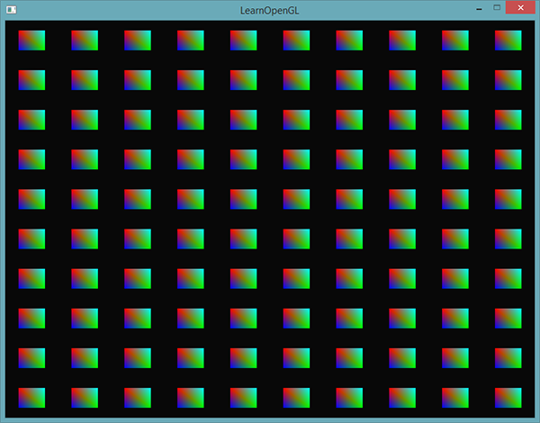
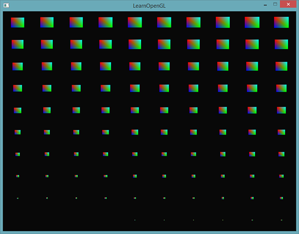
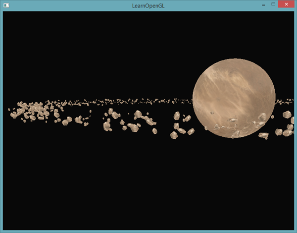
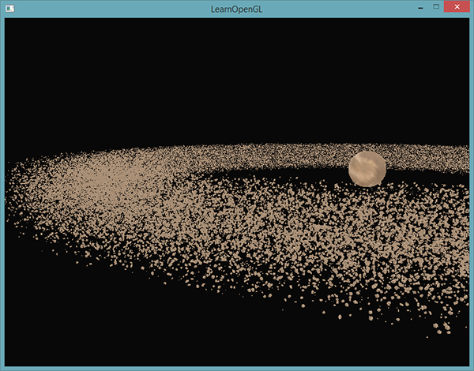

# Learn OpenGL. Урок 4.10 — Инстансинг

## Инстансинг

Представьте, что вы задумали сцену, содержащую огромное количество моделей объектов, причем преимущественно эти модели содержат одинаковые вершинные данные, разнятся только матрицы трансформации, примененные к ним. Например, сцена с травяным полем, где каждая былинка представлена маленькой моделью, составленной буквально из пары треугольников. Конечно же, для достижения нужного эффекта придется отрендерить эту модель не один раз, а тысячу, десять тысяч раз за кадр. Поскольку в каждом листике содержится буквально пара треугольников, то его рендер будет практически мгновенным. Но вот тысячи повторных вызовов функций рендера совокупно очень заметно ударят по производительности.

Если бы мы и вправду планировали выводить множество объектов в сцене описанным образом, то в коде это выглядело бы как-то так:

```cpp
for (unsigned int ix = 0; ix < model_count; ++ix)
{
     // привязка VAO, текстур, установка юниформов, проч...
    DoSomePreparations();
    glDrawArrays(GL_TRIANGLES, 0, vertex_count);
} 
```

При рендере множества *экземпляров* одной и той же модели мы быстро достигнем бутылочного горлышка в плане производительности – им станет множество вызовов функций отрисовки примитивов. По сравнению с временными затратами на непосредственный рендер, передача данных в GPU о том, что вы хотите что-то отрендерить, с помощью функций типа *glDrawArrays* или *glDrawElemenets* занимает весьма ощутимое время. Это время уходит на подготовку, необходимую OpenGL перед непосредственным выводом данных вершин: передача в GPU данных об текущем буфере чтения данных, расположении и формате данных вершинных атрибутов и прочая, прочая. И весь этот обмен осуществляется по относительно небыстрой шине, связующей CPU и GPU. Складывается парадоксальная ситуация: рендер вершинных данных молниеносен, но вот передача команд на осуществление рендера довольно медленна.

Было бы здорово иметь возможность отправить необходимые данные в видеокарту однократно, а затем всего одним вызовом попросить OpenGL осуществить рендер множества объектов, используя эти данные. Добро пожаловать в мир **инстансинга**!

Инстансинг – технология, позволяющая выводить множество объектов, используя один вызов функции отрисовки, что избавляет нас от лишнего обмена CPU -> GPU при рендере. Все что нужно сделать для начала использования инстансинга: сменить вызовы *glDrawArrays* и *glDrawElemenets* на *glDrawArraysInstanced* и *glDrawElementsInstanced* соответственно. Версии, поддерживающие инстансинг, принимают один дополнительный параметр, помимо уже знакомых по обычным версиям функций. Этот параметр – число экземпляров инстансинга, т.е. число отрисовываемых экземпляров модели. Таким образом мы единожды скармливаем GPU все необходимые для рендера данные, а затем сообщаем ему как осуществить рендер желаемого числа экземпляров объекта всего за один вызов специальной функции. И видеокарта отрисует все множество объектов без постоянного обращения к CPU.

Сама по себе такая возможность не очень то полезна: выведя тысячи объектов одним и тем же образом, в одном и том же положении, мы в итоге все равно получим изображение единственного объекта – все экземпляры окажутся наложены друг на друга. Для решения этой проблемы в вершинных шейдерах доступная встроенная переменная GLSL *gl_InstanceID*.
При использовании для рендера функций, поддерживающих инстансинг, значение данной переменной будет увеличиваться на единицу для каждого выводимого экземпляра, начиная с нуля. Таким образом, рендеря 43ий экземпляр объекта, в вершинном шейдере мы получим *gl_InstanceID* равную 42. Имея уникальный индекс, соответствующий экземпляру, мы могли бы, к примеру, использовать его для выборки из большого массива векторов положений, дабы осуществить рендер каждого экземпляра в определенном месте сцены.

Чтобы лучше прочувствовать суть инстансинга, попробуем разобраться в простом примере, рендерящем сотню квадов \(прямоугольников\) в нормализованных координатах устройства \(NDC\) с помощью единственного вызова отрисовки. Смещение определяется с помощью выборки из юниформа, представляющего собой массив, содержащий сто векторов смещения. В результате получается симпатичная сетка из прямоугольников, заполняющих всю площадь окна:



Каждый квадрат составлен из двух треугольников, что дает нам шесть вершин. Каждая вершина содержит двухкомпонентный вектор положения в NDC и вектор цвета. Ниже представлены вершинные данные из примера – размер треугольников подобран достаточно маленьким, чтобы корректно заполнять экран в больших количествах:

```cpp
 float quadVertices[] = {
    // координаты  // цвета
    -0.05f,  0.05f,  1.0f, 0.0f, 0.0f,
     0.05f, -0.05f,  0.0f, 1.0f, 0.0f,
    -0.05f, -0.05f,  0.0f, 0.0f, 1.0f,

    -0.05f,  0.05f,  1.0f, 0.0f, 0.0f,
     0.05f, -0.05f,  0.0f, 1.0f, 0.0f,   
     0.05f,  0.05f,  0.0f, 1.0f, 1.0f		    		
};
```

Цвет квада задает фрагментный шейдер, который просто перенаправляет полученный из вершинного шейдера интерполированный цвет вершины прямо на выходную переменную:

```glsl
#version 330 core
out vec4 FragColor;
  
in vec3 fColor;

void main()
{
    FragColor = vec4(fColor, 1.0);
} 
```

Ничего для нас нового. Но в вершинном шейдере дела обстоят иначе:

```glsl
#version 330 core
layout (location = 0) in vec2 aPos;
layout (location = 1) in vec3 aColor;

out vec3 fColor;

uniform vec2 offsets[100];

void main()
{
    vec2 offset = offsets[gl_InstanceID];
    gl_Position = vec4(aPos + offset, 0.0, 1.0);
    fColor = aColor;
}  
```

Здесь мы объявили юниформ-массив *offsets*, содержащий сто векторов смещения. В коде шейдера мы получаем значение смещения путем выборки из массива по значению переменной *gl_InstanceID*. В итоге, используя этот шейдер, мы можем осуществить рендер сотни квадратов, расположенных в разных положениях на экране.

Однако, потребуется дополнительная работа – сам по себе массив смещений не заполнится. Заполним его в нашем приложении, до входа в основной цикл отрисовки:

```cpp
glm::vec2 translations[100];
int index = 0;
float offset = 0.1f;
for(int y = -10; y < 10; y += 2)
{
    for(int x = -10; x < 10; x += 2)
    {
        glm::vec2 translation;
        translation.x = (float)x / 10.0f + offset;
        translation.y = (float)y / 10.0f + offset;
        translations[index++] = translation;
    }
}  
```

Здесь создается сотня векторов переноса, задающих равномерную сетку 10х10.

Не забудем передать сгенерированные данные в юниформ- массив шейдера:

```cpp
shader.use();
for(unsigned int i = 0; i < 100; i++)
{
    stringstream ss;
    string index;
    ss << i; 
    index = ss.str(); 
    shader.setVec2(("offsets[" + index + "]").c_str(), translations[i]);
}   
```

В этом кусочке кода мы преобразуем переменную цикла *i* в переменную типа *string* для возможности динамического задания строки имени юниформа и получения расположения юниформа по этому имени. Для каждого элемента из юниформ-массива offsets мы передаем соответствующий сгенерированный вектор смещения.

> Если доступен C++11 и новее, лучше используйте std::to_string(). *Прим.пер.*

Теперь, когда подготовительная работа закончена, можно, наконец, приступать в рендеру. Напомню, что необходимо использовать *glDrawArraysInstanced* или *glDrawElementsInstanced* для вызова инстанцированного рендера. Поскольку мы не используем в примере индексный буффер, то используется следующий код:

```cpp
glBindVertexArray(quadVAO);
glDrawArraysInstanced(GL_TRIANGLES, 0, 6, 100);   
```

Параметры переданные функции отрисовки идентичны тем, что передаются в *glDrawArrays*, за исключением последнего параметра, задающего желаемое число экземпляров к рендеру. Поскольку мы хотим вывести 100 квадов в сетке 10х10, то и передаем мы число 100. Выполнение кода должно привести к выводу уже знакомой картинки с сотней цветастых прямоугольников.

### Инстансированные массивы

Предыдущий пример вполне себе работчий и справляется со своей задачей. Но есть проблема: если наши аппетиты вырастут, и мы захотим вывести гораздо больше, чем 100 экземпляров, то очень скоро упремся в [потолок](http://www.opengl.org/wiki/Uniform_(GLSL)#Implementation_limits) разрешенного объема отправляемых шейдеру юниформ-данных. Альтернативой передачи данных через юниформы являются *инстансированные массивы* \(*instanced arrays*\), которые задаются как вершинные атрибуты, выборка из которых происходит только при смене текущего индекса рендерящегося экземпляра объекта. В итоге это позволяет передавать куда большие объемы данных и более удобным способом.

Для обычных вершинных атрибутов GLSL осуществляет выборку новых значений вершинных данных с каждым очередным выполнением кода вершинного шейдера. Однако, задавая вершинный атрибут как инстансированный массив, мы заставляем GLSL осуществлять выборку нового значения атрибута для каждого очередного экземпляра объекта, а не очередной вершины объекта. В итоге можно использовать обычные вершинные атрибуты для данных, представленных повершинно, а инстансированные массивы для данных, уникальных для экземпляра объекта.

Чтобы лучше понять, как это работает, модифицируем код примера на использование инстансированного массива вместо юниформ-массива. Придется обновить код шейдера, задав новый вершинные атрибут:

```glsl
#version 330 core
layout (location = 0) in vec2 aPos;
layout (location = 1) in vec3 aColor;
layout (location = 2) in vec2 aOffset;

out vec3 fColor;

void main()
{
    gl_Position = vec4(aPos + aOffset, 0.0, 1.0);
    fColor = aColor;
}  
```

Здесь мы более не используем переменную *gl_InstanceID* и можем напрямую обращаться к атрибуту *offset*, без необходимость выборки из массива.

Поскольку реализация инстансированного массива по сути осуществляется на основе вершинных атрибутов, таких как *position* или *color*, то необходимо сохранить данные в объекте вершинного буфера и настроить указатель вершинного атрибута. Сперва сохраним данные массива translations в новом объекте буфера:

```cpp
unsigned int instanceVBO;
glGenBuffers(1, &instanceVBO);
glBindBuffer(GL_ARRAY_BUFFER, instanceVBO);
glBufferData(GL_ARRAY_BUFFER, sizeof(glm::vec2) * 100, &translations[0], GL_STATIC_DRAW);
glBindBuffer(GL_ARRAY_BUFFER, 0); 
```

Также настроим указатель вершинного атрибута и активируем атрибут:

```cpp
glEnableVertexAttribArray(2);
glBindBuffer(GL_ARRAY_BUFFER, instanceVBO);
glVertexAttribPointer(2, 2, GL_FLOAT, GL_FALSE, 2 * sizeof(float), (void*)0);
glBindBuffer(GL_ARRAY_BUFFER, 0);	
glVertexAttribDivisor(2, 1);   
```

Код знакомый, кроме последней строки с вызовом *glVertexAttribDivisor*. Данная функция указывает OpenGL, когда следует осуществлять выборку нового элемента из вершинного атрибута. Первый параметр – индекс интересующего атрибута, а второй – *разделитель атрибута* \(*attribute divisor*\). По умолчанию он установлен в 0, что соответствует обновлению атрибута для каждой новой обрабатываемой вершинным шейдером вершины. Устанавливая этот параметр в 1, мы сообщаем OpenGL о том, что следует обновлять атрибут при рендере каждого последующего экземпляра. Установив разделитель в значение 2, мы обеспечим обновление через каждые два экземпляра, и так далее. По сути, установив разделитель в 1, мы указываем, что атрибут с данным разделителем представлен инстансированным массивом.

Если сейчас отрисовать сцену, с использованием *glDrawArraysInstanced*, то получим следующую картину:


В точности то же самое, что и в прошлый раз, но реализованное с использованием инстансированного массива, что позволяет передавать куда больше данных в вершинный шейдер для обеспечения инстансированного рендера.

Чисто из шалости, попробуем постепенно уменьшать каждый квад, начиная с правого верхнего угла в направлении левого нижнего угла. Снова используем переменную *gl_InstanceID*, потому что почему бы и нет?

```glsl
void main()
{
    vec2 pos = aPos * (gl_InstanceID / 100.0);
    gl_Position = vec4(pos + aOffset, 0.0, 1.0);
    fColor = aColor;
}  
```

В итоге получим картинку, где первые экземпляры рендерятся крошечными, но с приближением номера экземпляра к 100 размер каждого прямоугольника стремится к исходному. Такое совместное использование инстансированных массивов и *gl_InstanceID* полностью допустимо.



Если вы сомневаетесь, что как следует усвоили принцип работы инстансированного рендера или просто хотите изучить устройство всего кода примера, то исходники доступны [здесь](src1.cpp).
Все это, конечно, хорошо, но данные примеры дают слабое представление о реальной пользе инстансинга. Конечно, технические детали здесь показаны, но самая суть инстансинга раскрывается только при рендере сумасшедшего количества схожих объектов – что-то, до чего мы пока не добрались. Именно поэтому в следующем разделе нам придётся выйти в открытый космос, чтобы воочию узреть истинную силу инстансинга.

## Поле астероидов

Представьте себе сцену, где огромная планета окружена массивным поясом астероидов. Такой пояс вполне может содержать тысячи, а то и десятки тысяч каменистых образований. Вывод такой сцены очень быстро станет практически невозможным на любой неплохой видеокарте. Но именно в данном сценарии применение инстансинга напрашивается само собой, поскольку все астероиды пояса вполне можно представить единственной моделью. Каждый астероид будет немного отличаться от соседей благодаря уникальной матрицы трансформации.

Чтобы показать положительный эффект инстансинга мы сперва попробуем вывести эту сцену без его использования. Сцена будет содержать большую планету, модель которой можно скачать [здесь](planet.rar), а также большого набора астероидов, специальным образом расположенных вокруг планеты. Модель астероида можно скачать [здесь](rock.rar).

В коде приложения мы осуществляем загрузку данных моделей с использованием загрузчика, разобранного в уроках, посвящённых [моделированию](../../part%203/chapter%2012/text.md).

Для достижения необходимой конфигурации сцены мы создадим уникальную для каждого астероида матрицу трансформации, которая будет использована как модельная матрица при рендере каждого из них. Матрица формируется в несколько этапов. Сперва применяется преобразование переноса, чтобы разместить астероид где-то в пределах кольца. Мы также применяем небольшое случайное смещение, чтобы добавить реалистичности распределению астероидов. Далее добавляется случайное масштабирование и поворот вокруг вектора вращения. В итоге получаем матрицу трансформации, которая размещает каждый астероид где-то в окрестностях планеты, заодно обеспечивая его уникальный вид. А пояс астероидов наполняется кучей непохожих друг на друга глыб камня.

```cpp
unsigned int amount = 1000;
glm::mat4 *modelMatrices;
modelMatrices = new glm::mat4[amount];
srand(glfwGetTime()); // задаем seed для генератора случ. чисел
float radius = 50.0;
float offset = 2.5f;
for(unsigned int i = 0; i < amount; i++)
{
    glm::mat4 model(1.0f);
    // 1. перенос: расположить вдоль окружности радиусом 'radius' 
    // и добавить смещение в пределах [-offset, offset]
    float angle = (float)i / (float)amount * 360.0f;
    float displacement = (rand() % (int)(2 * offset * 100)) / 100.0f - offset;
    float x = sin(angle) * radius + displacement;
    displacement = (rand() % (int)(2 * offset * 100)) / 100.0f - offset;
    // высоту поля держим заметно меньшей, чем размеры в плоскости XZ
    float y = displacement * 0.4f; 
    displacement = (rand() % (int)(2 * offset * 100)) / 100.0f - offset;
    float z = cos(angle) * radius + displacement;
    model = glm::translate(model, glm::vec3(x, y, z));

    // 2. масштабирование: случайное масштабирование в пределах (0.05, 0.25f)
    float scale = (rand() % 20) / 100.0f + 0.05;
    model = glm::scale(model, glm::vec3(scale));

    // 3. поворот: поворот на случайный угол вдоль 
    float rotAngle = (rand() % 360);
    model = glm::rotate(model, rotAngle, glm::vec3(0.4f, 0.6f, 0.8f));

    // 4. добавляем в массив матриц
    modelMatrices[i] = model;
}   
```

Данный фрагмент кода может показаться устрашающим, но здесь мы всего лишь располагаем каждый астероид в плоскости XZ вдоль окружности, определенной радиусом *radius*, а также добавляем небольшое случайное смещение в пределах \(-*offset*, *offset*\) относительно этой окружности. Координату Y мы меняем в меньшей степени, дабы придать кольцу астеродиов форму, собственно, кольца. Кроме того, применяется масштабирование и поворот, а результат сохраняется в массиве матриц *modelMatrices* объемом amount. В данном примере создается 1000 модельных матриц, по одной на астероид.

После загрузки моделей планеты и астероида, а также компиляции шейдеров можно приступать к коду рендеринга:

```cpp
// рендер планеты
shader.use();
glm::mat4 model(1.0f);
model = glm::translate(model, glm::vec3(0.0f, -3.0f, 0.0f));
model = glm::scale(model, glm::vec3(4.0f, 4.0f, 4.0f));
shader.setMat4("model", model);
planet.Draw(shader);
  
// рендер метеоритов
for(unsigned int i = 0; i < amount; i++)
{
    shader.setMat4("model", modelMatrices[i]);
    rock.Draw(shader);
}   
```

Сперва мы рисуем модель планеты, которую приходится немного сместить и отмасштабировать, дабы она вписалась в сцену. Затем рендерим астероиды в количестве, равном объёму amount подготовленного массива трансформаций. Перед выводом каждого астероида нам приходится передавать соответствующие данные в юниформ, содержащий модельную матрицу.

Получается картина, напоминающая снимок из космоса, с доволльно правдоподобно выглядящей планетой, окруженной поясом астероидов:



Данная сцена выполняет 1001 вызов функций отрисовки на кадр, 1000 из которых приходится на модель астероида. Исходники находятся [здесь](src2.cpp).

Если мы начнем повышать количество выведенных астероидов, то быстро заметим, что сцена перестает перерисовываться плавно, а количество кадров в секунду резко падает. Как только мы доходим до попытки вывести 2000 астероидов рендер становится настолько неотзывчивым, что простое перемещение в сцене практически невозможно.

Теперь, попробуем сделать то же самое, но используя инстансинг. Сначала немного подправим вершинный шейдер:

```glsl
#version 330 core
layout (location = 0) in vec3 aPos;
layout (location = 2) in vec2 aTexCoords;
layout (location = 3) in mat4 instanceMatrix;

out vec2 TexCoords;

uniform mat4 projection;
uniform mat4 view;

void main()
{
    gl_Position = projection * view * instanceMatrix * vec4(aPos, 1.0); 
    TexCoords = aTexCoords;
} 
```

Более мы не используем юниформ, содержащий модельную матрицу. Вместо этого объявляем новый вершинный атрибут, хранящий матрицы, в котором мы и разместим инстансированный массив матриц трансформации. Стоит отметить, что при задании вершинного атрибута с размером типа, превышающим размер *vec4*, нужно учесть одну особенность. Поскольку *mat4* по сути это четыре связных *vec4*, то для данного атрибута будет зарезервировано целых четыре индекса расположения \(*location*\) вершинного атрибута. Здесь мы назначили атрибуту индекс размещения равный 3, значит колонки матрицы получать индексы размещения 3, 4, 5 и 6.

В клиентском коде нам придется задать указатели на вершинные атрибуты для каждого из этих неявно заданных индексов расположения. И не забыть инициализировать каждый из них как инстансированный массив:

```cpp
// создаем VBO
unsigned int buffer;
glGenBuffers(1, &buffer);
glBindBuffer(GL_ARRAY_BUFFER, buffer);
glBufferData(GL_ARRAY_BUFFER, amount * sizeof(glm::mat4), &modelMatrices[0], GL_STATIC_DRAW);
  
for(unsigned int i = 0; i < rock.meshes.size(); i++)
{
    unsigned int VAO = rock.meshes[i].VAO;
    glBindVertexArray(VAO);
    // настройка атрибутов
    GLsizei vec4Size = sizeof(glm::vec4);
    glEnableVertexAttribArray(3); 
    glVertexAttribPointer(3, 4, GL_FLOAT, GL_FALSE, 4 * vec4Size, (void*)0);
    glEnableVertexAttribArray(4); 
    glVertexAttribPointer(4, 4, GL_FLOAT, GL_FALSE, 4 * vec4Size, (void*)(vec4Size));
    glEnableVertexAttribArray(5); 
    glVertexAttribPointer(5, 4, GL_FLOAT, GL_FALSE, 4 * vec4Size, (void*)(2 * vec4Size));
    glEnableVertexAttribArray(6); 
    glVertexAttribPointer(6, 4, GL_FLOAT, GL_FALSE, 4 * vec4Size, (void*)(3 * vec4Size));

    glVertexAttribDivisor(3, 1);
    glVertexAttribDivisor(4, 1);
    glVertexAttribDivisor(5, 1);
    glVertexAttribDivisor(6, 1);

    glBindVertexArray(0);
}   
```

Отмечу, что здесь мы немножко схалтурили, объявив VAO как публичную, а не приватную переменную класса *Mesh* – это позволило нам упростить доступ к объекту вершинного массива. Пусть не самое изящное и чистое решение, но для нужд простого примера сгодится. Кроме этого небольшого хака остальной код должен быть понятен. Здесь мы просто указываем как OpenGL следует интерпретировать содержимое буфера для каждого элемента вершинного атрибута, представленного матрицей. Также указываем, что каждый из этих атрибутов является инстансированным массивом.

Далее мы снова обращаемся к VAO подготовленных моделей и вызываем рендер:

```cpp
// draw meteorites
instanceShader.use();
for(unsigned int i = 0; i < rock.meshes.size(); i++)
{
    glBindVertexArray(rock.meshes[i].VAO);
    glDrawElementsInstanced(
        GL_TRIANGLES, rock.meshes[i].indices.size(), GL_UNSIGNED_INT, 0, amount
    );
} 
```

Здесь рендер осуществляется с тем же количеством астероидов, что и в прошлом примере, но теперь используется инстансинг. Визуально результат получится схожим. Главное отличие проявится с увеличением количества астероидов. Без инстансинга мы могли выжать из видеокарты плавный рендер в пределах от 1000 до 1500 астероидов. С инстансингом же мы спокойно можем поднять планку до невероятных 100000 астероидов. С учетом, что каждый из них содержит 576 вершин мы получаем приблизительно 57 миллионов обработанных вершин без какого-либо падения производительности!



Данное изображение получено при выводе 100000 астероидов с переменными *radius = 150.0f* и *offset = 25.0f*. Исходный код – [здесь](src3.cpp).

> У всех разные конфигурации рабочих машин, потому предел в 100000 может оказаться несколько оптимистичным. Попробуйте подогнать конкретное число в вашем случае так, чтобы частота кадров оставалась приемлемой.

Как видно, в определенных задачах инстансинг может дать значительный выигрыш в производительности. Именно поэтому, эта техника используется для рендера травы, растений, систем частиц и прочих сцен, похожих на приведенную в уроке – по сути любых таких, где один объект выводится множество раз.
