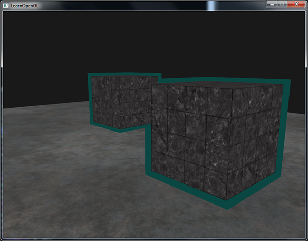

# Learn OpenGL. Часть 4.2. — Тест трафарета

Как только, фрагментный шейдер обработал фрагмент, выполняется так называемый **тест трафарета**, который, как и тест глубины, может отбрасывать фрагменты. Затем оставшиеся фрагменты переходят к тесту глубины, который, может отбросить еще больше фрагментов. Трафаретный тест основан на содержимом еще одного буфера, называемого **трафаретным буфером**. Мы можем обновлять его во время рендеринга для достижения интересных эффектов.

## Тест трафарета

Трафаретный буфер, обычно, содержит 8 бит на каждое **трафаретное значение**, что в сумме дает 256 различных значений трафарета на фрагмент/пиксель. Мы можем установить эти значения на наш вкус, а затем отбрасывать или сохранять фрагменты, всякий раз, когда определенный фрагмент имеет определенное трафаретное значение.

> Каждая оконная библиотека должна настроить буфер трафарета для вас. GLFW делает это автоматически, так что вам не нужно беспокоиться об этом, но другие оконные библиотеки могу не создавать трафаретный буфер по умолчанию, так что убедитесь, что просмотрели документацию вашей библиотеки.

Простой пример трафаретного буфера приведен ниже:


Сначала трафаретный буфер заполняется нулями, и затем область буфера, выглядящая как прямоугольная рамка, заполняется единицами. Отображаются только те фрагменты сцены, трафаретное значение которых равно единице, остальные — отбрасываются.

Операции трафаретного буфера позволяют нам установить разное значение для трафаретного буфера там, где мы отображаем фрагменты. Изменяя значения трафаретного буфера во время рендеринга, мы осуществляем операцию *записи*. В той же \(или следующей\) итерации рендеринга мы можем выполнить *чтение* значений из буфера, чтобы на основе прочитанных значений, отбросить или принять определенные фрагменты. Используя трафаретный буфер, вы можете дурачиться как угодно, но общая схема такова:

- Включить запись в трафаретный буфер.
- Отрисовать объекты, обновить содержимое трафаретного буфера.
- Отключить запись в трафаретный буфер.
- Отрисовать \(другие\) объекты, на этот раз отбрасывая определенные объекты, основываясь на содержимом трафаретного буфера.

В итоге, можно сказать, что, используя трафаретный буфер, мы можем отбросить определенные фрагменты, основываясь на фрагментах других объектов сцены.

Вы можете включить трафаретное тестирование, включив *GL_STENCIL_TEST*. С этого момента все вызовы рендеринга будут, так или иначе, влиять на трафаретный буфер.

```cpp
glEnable(GL_STENCIL_TEST);    
```

Обратите внимание, что вам нужно очищать трафаретный буфер на каждой итерации, так же как буфер цвета и глубины:

```cpp
glClear(GL_COLOR_BUFFER_BIT | GL_DEPTH_BUFFER_BIT | GL_STENCIL_BUFFER_BIT); 
```

Для трафаретного буфера есть аналог функции glDepthMask, используемой для параметризации теста глубины. Функция *glStencilMask* позволяет нам установить битовую маску, которая будет участвовать в операции побитового И со значениями трафарета, записываемыми в буфер. По умолчанию, битовая маска равна единице, что не влияет на выходные данные, но если бы мы установили маску в 0x00, то все трафаретные значения в конце концов были бы записаны как нули. Эквивалентом настройки маски теста глубины *glDepthMask\(GL_FALSE\)* была бы следующая пара вызовов:

```cpp
glStencilMask(0xFF); // каждый бит записывается в трафаретный буфер как есть
glStencilMask(0x00); // каждый бит становится нулем в трафаретном буфере (останавливаем запись)
```

В большинстве случаев просто записывайте *0x00* или *0xFF* в трафаретную маску, но неплохо было бы знать, что существует возможность устанавливать пользовательские битовые маски.

## Трафаретные функции

Также как и в тесте глубины у нас есть определенная возможность контролировать, когда трафаретный тест будет пройден, а когда — нет, и как это должно повлиять на трафаретный буфер. У нас есть всего две функции, которые мы можем использовать для настройки трафаретного тестирования: *glStencilFunc* и *glStencilOp*.

Функция `glStencilFunc(GLenum func, GLint ref, GLuint mask)` имеет три параметра:

- *func*: устанавливает функцию трафаретного тестирования. Эта функция применяется к хранимому значению трафарета и значению параметра ref. Возможные варианты: *GL_NEVER*, *GL_LESS*, *GL_LEQUAL*, *GL_GREATER*, *GL_GEQUAL*, *GL_EQUAL*, *GL_NOTEQUAL* и *GL_ALWAYS*. Смысловое значение этих функций схоже с функциями теста глубины.
- *ref*: определяет эталонное значение для трафаретного теста. Содержимое трафаретного буфера сравнивается с этим значением.
- *mask*: устанавливает маску, использующуюся в операции побитового И с хранимым и эталонным значением перед их непосредственным сравнением. По умолчанию устанавливается в 1.

Итак, в случае нашего простого примера трафарета, который мы показали в начале, функция будет такой:

```cpp
glStencilFunc(GL_EQUAL, 1, 0xFF)
```

Это говорит OpenGL, что, всякий раз, когда трафаретное значение фрагмента равно ссылочному значению 1, фрагмент проходит тест и рисуется, в противном случае — отбрасывается.

Но функция *glStencilFunc* описывает только то, что OpenGL следует делать с содержимым трафаретного буфера, а не то, как мы можем обновить буфер. Здесь нам на помощь приходит функция *glStencilOp*.

Функция `glStencilOp(GLenum sfail, GLenum dpfail, GLenum dppass)` содержит три параметра, с помощью которых мы можем определить действия для каждого варианта:

- *sfail*: действие, выполняемое в случае провала трафаретного теста.
- *dpfail*: действие, выполняемое в случае, если трафаретный тест пройден, а тест глубины — нет.
- *dppass*: действие, выполняемое в случае, если оба теста пройдены

Затем, для каждого случая можно выполнить одно из следующих действий:

| Действие | Описание |
| --- | --- |
| GL_KEEP | Хранящееся в данный момент значение трафарета сохраняется. |
| GL_ZERO | Трафаретное значение обнуляется. |
| GL_REPLACE | Трафаретное значение заменяется эталонным значением, установленным функцией *glStencilFunc*. |
| GL_INCR | Трафаретное значение увеличивается на единицу, если оно меньше максимального значения. |
| GL_INCR_WRAP | Ведет себя так же, как и GL_INCR, но при переходе через максимум значение в буфере обнуляется. |
| GL_DECR | Трафаретное значение уменьшается на единицу, если оно превышает минимальное значение. |
| GL_DECR_WRAP | Ведет себя так же, как и GL_DECR, но при переходе через 0 значение в буфере устанавливается в максимальное. |
| GL_INVERT | Побитово инвертирует текущее значение буфера трафарета. |

По умолчанию аргументы функции *glStencilOp* устанавливаются в *\(GL_KEEP, GL_KEEP, GL_KEEP\)*, так что, независимо от результатов тестов, значения в буфере трафарета сохраняются. Стандартное поведение не обновляет трафаретный буфер, поэтому, если мы хотим писать в трафаретный буфер, то нам нужно установить по крайней мере одно действие отличное от стандартного для любого варианта.

Итак, используя *glStencilFunc* и *glStencilOp* мы можем точно установить когда и как мы хотим обновлять трафаретный буфер, и мы также определяем, когда трафаретный тест будет пройден, а когда — нет, то есть когда фрагменты должны быть отброшены.

## Обводка объектов

Маловероятно, что вы полностью поняли, как работает трафаретное тестирование на основе предыдущих разделов, поэтому мы продемонстрируем полезный прием, который может быть реализован с помощью трафаретного тестирования. Это обводка объекта.


Нет нужды объяснять, что подразумевается под обводкой объекта. Для каждого объекта \(или только для одного\) мы создаем маленькую цветную рамку. Этот эффект особенно полезен, когда нам, к примеру, нужно выделить юнитов в стратегической игре, а затем показать пользователю, какие были выбраны. Алгоритм формирования обводки для объекта такой:

1. Установить трафаретную функцию в *GL_ALWAYS*, перед рисованием объектов \(которые будут обведены\), обновить трафаретный буфер единицами там, где фрагменты объектов будут нарисованы.
2. Нарисовать объекты.
3. Отключить тестирование глубины и запись в трафаретный буфер.
4. Немного увеличить каждый объект.
5. Использовать другой фрагментый шейдер, который выводить только один цвет \(цвет обводки\).
6. Снова нарисовать объект, но только если трафаретное значение их фрагментов не равно единице.
7. Снова включить запись в трафаретный буфер и тестирование глубины.

Этот процесс устанавливает содержимое буфера для каждого фрагмента объекта равным единице, и когда мы хотим нарисовать границы, мы, по сути, рисуем масштабируемые версии объектов, и там, где позволяет тест, масштабируемая версия рисуется \(вокруг границ объекта\). С помощью теста трафарета мы отбрасываем те фрагменты отмасштабированных объектов, которые наложены на фрагменты исходных объектов.

Для начала создаем очень простой фрагментный шейдер, который выводит цвет обводки. Мы просто устанавливаем жестко-закодированный цвет и вызываем шейдер *shaderSingleColor*:

```glsl
void main()
{
    FragColor = vec4(0.04, 0.28, 0.26, 1.0);
}
```

Мы планируем включить обводку только для двух контейнеров, но не для пола. Поэтому сперва нужно вывести пол, затем два контейнера \(с записью в буфер трафарета\), а затем — увеличенные версии контейнеров \(с отбраковкой фрагментов, наложенных на уже отрисованные фрагменты исходных контейнеров\).

Сначала нам нужно включить трафаретное тестирование и установить действия, выполняемые при успешном или неудачном выполнении любого из тестов:

```cpp
glEnable(GL_DEPTH_TEST);
glStencilOp(GL_KEEP, GL_KEEP, GL_REPLACE);  
```

Если какой-нибудь из тестов провалится, то мы ничего не делаем, а просто оставляем текущее значение в трафаретном буфере. Если же и трафаретный тест и тест глубины пройдены успешно, то мы заменяем текущее значение трафарета на эталонное значение, установленное через *glStencilFunc*, которое мы позже установим в 1.

Буфер очищается заполнением нулями, а для контейнеров мы обновляем трафаретный буфер до 1 для каждого нарисованного фрагмента:

```cpp
glStencilFunc(GL_ALWAYS, 1, 0xFF); // каждый фрагмент обновит трафаретный буфер
glStencilMask(0xFF); // включить запись в трафаретный буфер
normalShader.use();
DrawTwoContainers();
```

Используя *GL_ALWAYS* в функции *glStencilFunc* мы гарантируем, что каждый фрагмент контейнеров обновит трафаретный буфер с трафаретным значением 1. Так как фрагменты всегда проходят трафаретный тест, то трафаретный буфер обновляется ссылочным значением, везде, где мы их нарисовали.

Теперь, когда трафаретный буфер обновлен до единицы, там, где мы нарисовали контейнеры, нам нужно нарисовать увеличенные версии контейнеров, но, теперь отключив запись в трафаретный буфер:

```cpp
glStencilFunc(GL_NOTEQUAL, 1, 0xFF);
glStencilMask(0x00); // отключить запись в трафаретный буфер
glDisable(GL_DEPTH_TEST);
shaderSingleColor.use(); 
DrawTwoScaledUpContainers();
```

Мы используем аргумент *GL_NOTEQUAL* в *glStencilFunc*, который гарантирует, что мы рисуем только те части объектов, которые не равны единице, таким образом, мы рисуем только те части объектов, которые находятся за пределами ранее нарисованных объектов. Обратите внимание, что мы также отключили тест глубины, чтобы элементы увеличенных контейнеров, например, их границы, не были перезаписаны полом.

Также убедитесь, что снова включили тест глубины.

Общий шаблон обводки объекта для нашей сцены выглядит как-то так:

```cpp
glEnable(GL_DEPTH_TEST);
glStencilOp(GL_KEEP, GL_KEEP, GL_REPLACE);  
  
glClear(GL_COLOR_BUFFER_BIT | GL_DEPTH_BUFFER_BIT | GL_STENCIL_BUFFER_BIT); 

glStencilMask(0x00); // убедитесь, что мы не обновляем трафаретный буфер во время рисования пола
normalShader.use();
DrawFloor()  
  
glStencilFunc(GL_ALWAYS, 1, 0xFF); 
glStencilMask(0xFF); 
DrawTwoContainers();
  
glStencilFunc(GL_NOTEQUAL, 1, 0xFF);
glStencilMask(0x00); 
glDisable(GL_DEPTH_TEST);
shaderSingleColor.use(); 
DrawTwoScaledUpContainers();
glStencilMask(0xFF);
glEnable(GL_DEPTH_TEST);
```

Если вы понимаете общую идею, лежащую в основе трафаретного тестирования, этот фрагмент кода не должен быть слишком сложен для понимания. В противном случае попробуйте внимательнее прочитать предыдущие секции и полностью понять, что делает каждая функция, теперь, когда вы видели пример ее использования.

Результат применения алгоритма обводки к сцене из урока по [тесту глубины](../../part%204/chapter%201/text.md) выглядит так:



Проверьте исходный код [здесь](src1.cpp), чтобы увидеть полный код алгоритма обводки объекта

> Можно заметить, что границы между двумя контейнерами перекрываются. Обычно, это именно то, что нужно \(вспомните стратегические игры, когда мы выделяем несколько юнитов\). Если вам нужна полная граница вокруг каждого объекта, нужно очищать трафаретный буфер для каждого объекта и немного пошаманить с настройкой теста глубины.

Алгоритм обводки объектов, который вы видели, довольно часто используется в некоторых играх для визуализации выбранных объектов \(вспомните стратегические игры\), и такой алгоритм может быть легко реализован в классе модели. Затем можно просто установить логический флаг в классе модели для рисования с границами или без них. Если проявить немного творчества, то можно сделать границы более органичными с помощью фильтров пост-обработки, например размытия по Гауссу.

С помощью трафаретного тестирования можно делать больше вещей, чем просто обводить объекты, например рисовать текстуры внутри зеркала заднего вида так, что они вписываются в рамку зеркала. Или рендерить тени в реальном времени с помощью техники *shadow volumes*. Трафаретный буфер обеспечивает нас еще одним прекрасным инструментом в нашем и без того обширном инструментарии OpenGL.
