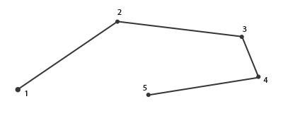
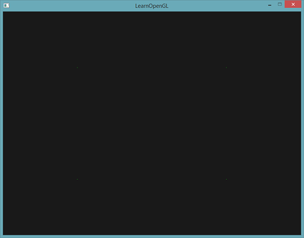
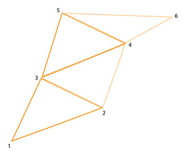
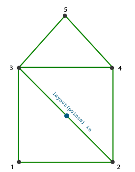
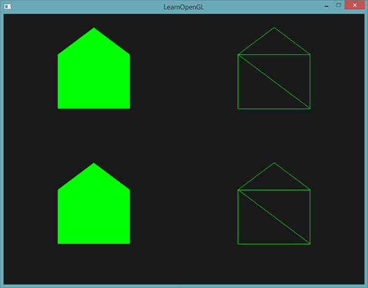
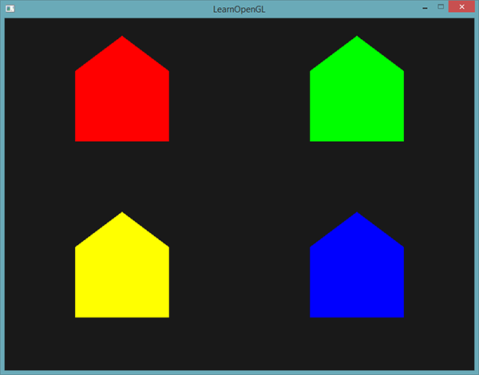
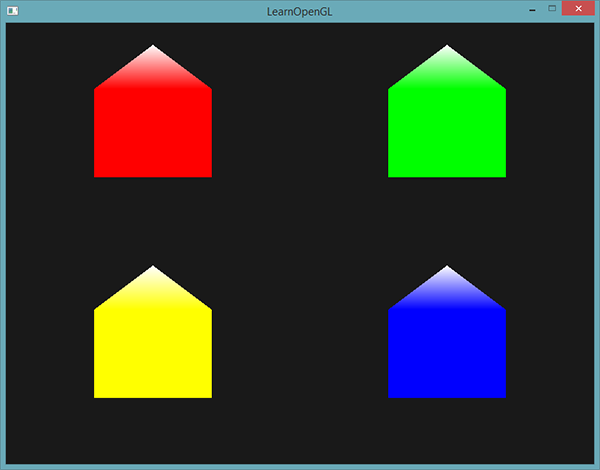
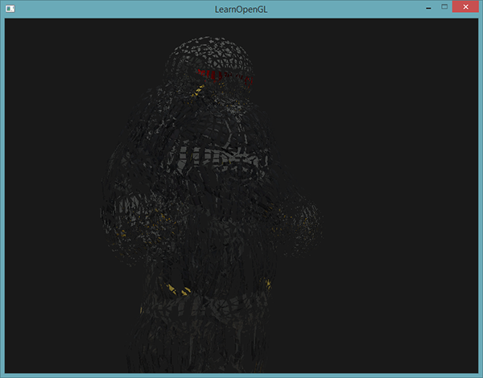
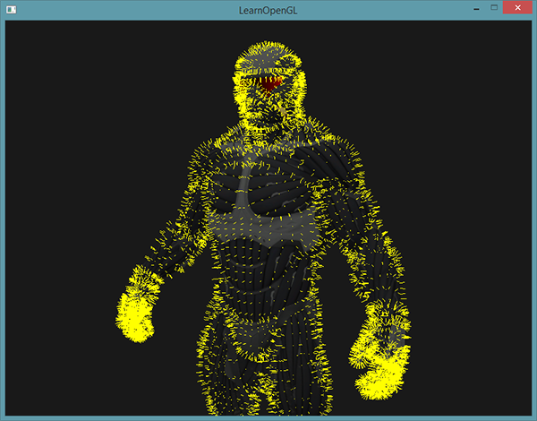

# Learn OpenGL. Урок 4.9 — Геометрический шейдер

## Геометрический Шейдер

Между этапами выполнения вершинного и фрагментного шейдера есть опциональная стадия, предназначенная для выполнения геометрического шейдера. На входе у геометрического шейдера оказывается набор вершин, формирующих один из допустимых в OpenGL примитивов \(точки, треугольники, ...\). В результате своей работы геометрический шейдер может преобразовать этот набор вершин по своему усмотрению, прежде чем передать его на следующую шейдерную стадию. При этом стоит отметить самую интересную особенность геометрического шейдера: в процессе своей работы набор входных вершин может быть преобразован к представлению совершенно иного примитива, а также может сгенерировать совершенно новые вершины на основе входных данных, увеличивая итоговое количество вершин.

Не будем долго запрягать и сразу обратимся к примеру геометрического шейдера:

```glsl
#version 330 core
layout (points) in;
layout (line_strip, max_vertices = 2) out;

void main() {    
    gl_Position = gl_in[0].gl_Position + vec4(-0.1, 0.0, 0.0, 0.0); 
    EmitVertex();

    gl_Position = gl_in[0].gl_Position + vec4( 0.1, 0.0, 0.0, 0.0);
    EmitVertex();
    
    EndPrimitive();
}  
```

В начале кода шейдера необходимо указать тип примитива, данные которого поступают со стадии вершинного шейдера. Делается это с помощью спецификатора *layout*, расположенного перед ключевым словом *in*. Тип примитива указываемый в спецификаторе может принимать одно из следующих значений, соответствующих типу примитива, обрабатываемого вершинным шейдером:

- *points*: При выводе GL_POINTS \(1\).
- *lines*: При выводе GL_LINES или GL_LINE_STRIP \(2\).
- *lines_adjacency*: При выводе GL_LINES_ADJACENCY или GL_LINE_STRIP_ADJACENCY \(4\).
- *triangles*: При выводе GL_TRIANGLES, GL_TRIANGLE_STRIP или GL_TRIANGLE_FAN \(3\).
- *triangles_adjacency*: При выводе GL_TRIANGLES_ADJACENCY или GL_TRIANGLE_STRIP_ADJACENCY \(6\).


В итоге здесь перечислены практически все типы примитивов, допустимые для передачи в вызов функций рендера типа *glDrawArrays\(\)*. Если бы осуществляли рендер с помощью *GL_TRIANGLES*, то в спецификаторе следовало бы указать параметр *triangles*. Номер в скобках здесь означает минимальное количество вершин, которое содержится в одном примитиве.

Далее, необходимо также указать и тип выходного примитива для данного шейдера. Соответственно, делается это посредством спецификатора *layout* перед ключевым словом *out*. В данном примере на выходе будет формироваться line_strip с максимум двумя вершинами.

Если вы подзабыли: примитив *Line Strip* связывает между собой точки в наборе, формируя непрерывную линию между ними, начиная с двух точек в наборе. Каждая дополнительная точка сверх двух выливается в еще один отрисованный сегмент линии тянущийся от новой точки к предыдущей. Ниже представлено изображение сегмента из пяти точек:



Представленный пример шейдера может выдать лишь отдельные прямые отрезки, поскольку мы явно задали максимальное число вершин в примитиве равное двум.

Чтобы шейдер смог сделать что-то полезное необходимо получить данные с выхода предыдущей шейдерной стадии. GLSL предоставляет встроенную переменную *gl_in*, которую можно представить приблизительно следующей структурой:

```glsl
in gl_Vertex
{
    vec4  gl_Position;
    float gl_PointSize;
    float gl_ClipDistance[];
} gl_in[]; 
```

Таким образом, переменная схожа с интерфесными блоками, рассмотренными на [прошлом уроке](../../part%204/chapter%208/text.md), и содержит несколько полей из которых нас сейчас больше всего интересует *gl_Position*, содержащая в себе вектор положения вершины, который был установлен в результате выполнения вершинного шейдера.
Обратите внимание, что эта переменная является массивом, поскольку большая часть примитивов содержит в себе более одной вершины, а стадия геометрического шейдера получает на вход все вершины обрабатываемого примитива.

Получив вершинные данные с выхода вершинного шейдера можно приступить к генерации новых данных, что осуществляется с помощью двух специальных функций геометрического шейдера: *EmitVertex\(\)* и *EndPrimitive\(\)*. Ожидается, что в коде вы сгенерируете хотя бы один примитив, заявленный как выходной. В нашем примере следует выдать хотя бы по одному примитиву типа *line_strip*.

```glsl
void main() {    
    gl_Position = gl_in[0].gl_Position + vec4(-0.1, 0.0, 0.0, 0.0); 
    EmitVertex();

    gl_Position = gl_in[0].gl_Position + vec4( 0.1, 0.0, 0.0, 0.0);
    EmitVertex();
    
    EndPrimitive();
}    
```

Каждый вызов *EmitVertex\(\)* добавляет текущее значение в переменной *gl_Position* к текущему экземпляру примитива. Когда же мы вызываем *EndPrimitive\(\)*, все порожденные вершины окончательно связываются в указанный выходной тип примитива. Повторяя вызовы *EndPrimitive\(\)* после одного или более вызовов *EmitVertex\(\)* можно продолжать создавать новые экземпляры примитивов. Конкретно в примере генерируется по две вершины, смещенные на небольшое расстояние от положения входной вершины, а затем выполняется вызов *EndPrimitive\(\)*, формирующий из этих двух сгенерированных вершин один line strip, содержащий две вершины.

Итак, зная \(в теории\), как работает геометрический шейдер, вы, вероятно, уже догадались, каков эффект от выполнения данного примера. На вход шейдер принимает точечные примитивы и создает на их основе горизонтальные линии, где входная вершина лежит ровно посередине. Вывод программы, использующей такой шейдер представлен ниже:


Не слишком впечатляет, но уже интересно, с учетом того, что мы получили такие результаты, выполнив всего лишь один вызов отрисовки:

```cpp
 glDrawArrays(GL_POINTS, 0, 4);
```

Пусть данный пример и весьма прост, он демонстрирует важный принцип: возможность динамического создания новых фигур с использованием геометрических шейдеров. Позже мы рассмотрим еще несколько интересных эффектов, реализуемых на основе шейдеров геометрии, а пока же проработаем основы с помощью простых шейдеров.

### Использование геометрического шейдера

Для демонстрации использования геометрического шейдера мы используем простую программу, рендерящую четыре точки, лежащие на плоскости XoY в нормализованных координатах устройства \(NDC\). Координаты точек:

```cpp
 float points[] = {
	-0.5f,  0.5f, // верхняя-левая
	 0.5f,  0.5f, // верхняя-правая
	 0.5f, -0.5f, // нижняя-правая
	-0.5f, -0.5f  // нижняя-левая
};
```

Вершинный шейдер прост – достаточно только отобразить точки на нужную плоскость:

```glsl
 #version 330 core
layout (location = 0) in vec2 aPos;

void main()
{
    gl_Position = vec4(aPos.x, aPos.y, 0.0, 1.0); 
}
```

Фрагментный шейдер также тривиален и просто использует захардкоженный цвет для фрагментов:

```glsl
 #version 330 core
out vec4 FragColor;

void main()
{
    FragColor = vec4(0.0, 1.0, 0.0, 1.0);   
} 
```

В коде программы мы, как обычно, создаем VAO и VBO для вершинных данных и осуществляем рендер вызовом *glDrawArrays\(\)*:

```cpp
 shader.use();
glBindVertexArray(VAO);
glDrawArrays(GL_POINTS, 0, 4); 
```

В результате на экране кромешная тьма и четыре едва заметные зеленые точки:



Как-то грустно, если мы научились столькому только чтобы вывести такую удручающую картинку. Поэтому осуществим срочное вмешательство в сцену и разбавим этот мрачняк используя возможности геометрического шейдера.

Но сначала, в целях обучения, придется создать и разобраться как работает *сквозной* геометрический шейдер, который просто берет данные входного примитива и отправляет на выход без изменений:

```glsl
 #version 330 core
layout (points) in;
layout (points, max_vertices = 1) out;

void main() {    
    gl_Position = gl_in[0].gl_Position; 
    EmitVertex();
    EndPrimitive();
}  
```

На данный момент вы уже и без подсказок сможете понять код шейдера. Здесь мы просто генерируем вершину в положении, полученном из вершинного шейдера, а затем порождаем все тот же точечный примитив.

Геометрический шейдер требует компиляции и линковки в программный объект ровно также, как и вершинный и фрагментный шейдеры. Однако, в этот раз объект шейдера создается с указанием *GL_GEOMETRY_SHADER* как типа шейдера:

```cpp
 geometryShader = glCreateShader(GL_GEOMETRY_SHADER);
glShaderSource(geometryShader, 1, &gShaderCode, NULL);
glCompileShader(geometryShader);  
...
glAttachShader(program, geometryShader);
glLinkProgram(program); 
```

По сути код компиляции абсолютно такой же, что и для остальных типов шейдеров. Не забудьте о проверках на ошибки компиляции и линковки!

При выполнении должна получиться знакомая картинка:


Получили то же самое, что и без геометрического шейдера… Скучно! Но, раз точки все еще выводятся, мы хотя бы убедились, что наш шейдер работает и можно перейти к чему-то более интересному.

### Строим домики

Рисование простых линий и точек – не совсем то, на что мы рассчитывали, потому попробуем добавить немного креатива и отрисуем домики в точках, заданных входными вершинами. Для этого нам понадобится сменить тип выходного примитива на *triangle_strip* и нарисовать три треугольника: два для создания квадратной основы и один для крыши.

Примитив *Triangle Strip* в OpenGL является более эффективным методом рисования треугольников требующим меньше вершин на входе. После рендера первого треугольника каждая последующая вершина создает еще один треугольник, смежный с предыдущим. Если заданы шесть вершин в составе *triangle strip*, то в итоге получится следующая последовательность треугольников: \(1,2,3\), \(2,3,4\), \(3,4,5\) и \(4,5,6\), что выльется в четыре отрисованных треугольника. Данный примитив требует задания как минимум трех вершин для успешного рендера. В общем случае будет выведено N-2 треугольника; имея шесть вершин мы получили 6-2=4 треугольника, что проиллюстрировано ниже:



Используя *triangle strip* можно легко сформировать требуемую фигуру домика всего из трех смежных треугольников, задав их в правильном порядке. Следующее изображение показывает порядок, в котором необходимо вывести вершины, чтобы получить требуемый вид треугольников. Синяя точка показывает положение входной вершины:



Результирующий геометрический шейдер:

```glsl
 #version 330 core
layout (points) in;
layout (triangle_strip, max_vertices = 5) out;

void build_house(vec4 position)
{    
    gl_Position = position + vec4(-0.2, -0.2, 0.0, 0.0);    // 1:bottom-left
    EmitVertex();   
    gl_Position = position + vec4( 0.2, -0.2, 0.0, 0.0);    // 2:bottom-right
    EmitVertex();
    gl_Position = position + vec4(-0.2,  0.2, 0.0, 0.0);    // 3:top-left
    EmitVertex();
    gl_Position = position + vec4( 0.2,  0.2, 0.0, 0.0);    // 4:top-right
    EmitVertex();
    gl_Position = position + vec4( 0.0,  0.4, 0.0, 0.0);    // 5:top
    EmitVertex();
    EndPrimitive();
}

void main() {    
    build_house(gl_in[0].gl_Position);
}
```

Шейдер создает пять вершин в положениях, смещенных относительно положения входной вершины, помещая их все в один примитив типа *triangle strip*. Этот примитив далее отправляется на растеризацию, а фрагментный шейдер раскрашивает его поверхность в зеленый цвет. Получаем по одному зеленому домику на каждую входную точку:



Здесь можно увидеть, что каждый домик действительно составлен из трех треугольников – и все это построено на основе единственной точке входных данных.

Но что-то все равно выглядит скучновато! Попробуем раскрасить каждый из домиков в свой цвет. Для этого мы организуем еще один вершинный атрибут, хранящий цветовую информацию о вершине. Вершинный шейдер считывает значение атрибута для вершины и передает в геометрический шейдер, который, в свою очередь, направит значение цвета во фрагментный шейдер.

Обновленные данные вершин выглядят следующим образом:

```cpp
 float points[] = {
    -0.5f,  0.5f, 1.0f, 0.0f, 0.0f, // верхняя-левая
     0.5f,  0.5f, 0.0f, 1.0f, 0.0f, // верхняя-правая
     0.5f, -0.5f, 0.0f, 0.0f, 1.0f, // нижняя-правая
    -0.5f, -0.5f, 1.0f, 1.0f, 0.0f  // нижняя-левая
}; 
```

Далее, уточним код вершинного шейдера для передачи атрибута цвета в геометрический шейдер с использованием интерфейсного блока:

```glsl
 #version 330 core
layout (location = 0) in vec2 aPos;
layout (location = 1) in vec3 aColor;

out VS_OUT {
    vec3 color;
} vs_out;

void main()
{
    gl_Position = vec4(aPos.x, aPos.y, 0.0, 1.0); 
    vs_out.color = aColor;
}  
```

Очевидно, что нам потребуется определить интерфейсный блок того же типа \(но с другим именем\) в геометрическом шейдере:

```glsl
 in VS_OUT {
    vec3 color;
} gs_in[];  
```

Поскольку геометрический шейдер выполняется на целых наборах входных вершин, то его входной параметр всегда представляет собой массив, даже в случаях, когда на вход подается единственная вершина.

> На самом деле нам не обязательно использовать интерфейсные блоки для передачи данных в геометрический шейдер. Если бы вершинный шейдер передавал вектор с цветом как *out vec3 vColor*, то можно было бы написать и так:> 
> 
> ```glsl
>      in vec3 vColor[];
> ```
> 
> Однако, в общем случае работать с интерфейсными блоками гораздо проще, особенно в геометрических шейдерах. На практике, входные параметры геометрических шейдеров зачастую представлены довольно большими наборами данных и объединение их в единый интерфейсный блок, представленный массивом, является вполне ожидаемым шагом. 

Также следует объявить и выходную переменную, направляющую данные цвета во фрагментный шейдер:

```glsl
 out vec3 fColor;  
```

Поскольку фрагментный шейдер ожидает одно \(интерполированное\) значение цвета, то отправлять массивы векторов цвета нет смысла. Именно поэтому *fColor* здесь – не массив, а единственный вектор. Когда мы порождаем вершину, каждая из них запомнит последнее значение, находившееся в переменной *fColor* для своего вызова фрагментного шейдера. Соответственно, для наших домиков мы можем заполнить *fColor* всего один раз цветом, полученным со стадии вершинного шейдера, чтобы установить цвет всего домика:

```glsl
 fColor = gs_in[0].color; // используется gs_in[0] поскольку на входе у нас единственная вершина
gl_Position = position + vec4(-0.2, -0.2, 0.0, 0.0);    // 1:нижняя-левая
EmitVertex();   
gl_Position = position + vec4( 0.2, -0.2, 0.0, 0.0);    // 2:нижняя-правая
EmitVertex();
gl_Position = position + vec4(-0.2,  0.2, 0.0, 0.0);    // 3:верхняя-левая
EmitVertex();
gl_Position = position + vec4( 0.2,  0.2, 0.0, 0.0);    // 4:верхняя-правая
EmitVertex();
gl_Position = position + vec4( 0.0,  0.4, 0.0, 0.0);    // 5:крыша
EmitVertex();
EndPrimitive();  
```

В итоге все порожденные вершины будут хранить значение цвета из переменной *fColor*, что соответствует цветам из атрибутов вершин. Теперь каждый домик раскрашен в свой цвет:



Добавим еще немного креатива и устроим виртуальную зиму, присыпав крыши домиков снегом. Для этого последней вершине мы отдельно присвоим белый цвет:

```glsl
 fColor = gs_in[0].color; 
gl_Position = position + vec4(-0.2, -0.2, 0.0, 0.0);    // 1:нижняя-левая
EmitVertex();   
gl_Position = position + vec4( 0.2, -0.2, 0.0, 0.0);    // 2:нижняя-правая
EmitVertex();
gl_Position = position + vec4(-0.2,  0.2, 0.0, 0.0);    // 3:верхняя-левая
EmitVertex();
gl_Position = position + vec4( 0.2,  0.2, 0.0, 0.0);    // 4:верхняя-левая
EmitVertex();
gl_Position = position + vec4( 0.0,  0.4, 0.0, 0.0);    // 5:крыша
fColor = vec3(1.0, 1.0, 1.0);
EmitVertex();
EndPrimitive();  
```

В итоге имеем:



Свой код приложения можете сравнить с [примером](src1.cpp).

Думаю, на этот момент вам уже ясно, что геометрические шейдеры дают широкие творческие возможности, даже и с использованием простых примитивов. Поскольку геометрия создается динамически внутри сверхскоростного ядра GPU, это оказывается гораздо эффективнее чем задание аналогичной геометрии с использованием вершинных буферов. Геометрические шейдеры предлагают широкие возможности для оптимизации рендера простых и часто повторяющихся фигур типа кубов для воксельного рендера или стебельков травы в сценах открытых пространств.

### Взрываем объекты

Рисование домиков – это, конечно, здорово, но не то, с чем нам придется часто работать. Поэтому добавим-ка жару и перейдем прямо к взрыванию трехмерных моделей! Хм, этим вам, пожалуй, тоже не придется заниматься так уж часто, но зато послужит отличной демонстрацией возможностей геометрических шейдеров.

Под взрыванием объекта мы понимаем не буквальное уничтожение наших драгоценных вершин, а перемещение каждого треугольника вдоль направления нормали с течением времени. В результате этот эффект дает подобие взрыва объекта, разделяя его на отдельные треугольники, движущиеся по направлению своего вектора нормали. Ниже приведен эффект, применённый к модели нанокостюма:



Что замечательно, так это то, что использование геометрического шейдера позволяет эффекту работать на любом объекте, вне зависимости от его сложности.

Поскольку нам требуется сдвигать треугольники вдоль нормального вектора, то придется его для начала посчитать. Конкретно, нам необходимо найти вектор, перпендикулярный поверхности треугольника, имея на руках только три его вершины. Из урока по [трансформациям](../../part%201/chapter%207/text.md) вы, вероятно, помните, что вектор, перпендикулярный двум другим, можно получить, используя операцию векторного умножения \(*cross product*\). Если бы мы могли найти два вектора *a* и *b*, параллельных к поверхности треугольника, то вектор перпендикулярный к поверхности был бы просто результатом их векторного произведения. Собственно, приведенный ниже код геометрического шейдера занимается именно этим: вычисляет вектор нормали используя три вершины входного треугольника:

```glsl
 vec3 GetNormal()
{
   vec3 a = vec3(gl_in[0].gl_Position) - vec3(gl_in[1].gl_Position);
   vec3 b = vec3(gl_in[2].gl_Position) - vec3(gl_in[1].gl_Position);
   return normalize(cross(a, b));
}  
```

Здесь мы с помощью вычитания получаем два вектора *a* и *b*, параллельные поверхности треугольника. Вычитание векторов дает еще один вектор, представляющий собой разницу двух исходных. Поскольку все три вершины лежат в плоскости треугольника, то разница любых векторов, представляющих вершины треугольника, порождает вектора, параллельные поверхности треугольника. Обратите внимание на порядок параметров в вывозе функции *cross\(\)*: если бы мы поменяли местами *a* и *b*, то направление вектора нормали стало бы противоположным.

Теперь, имея на руках способ нахождения нормали, можно перейти к реализации функции *explode\(\)*. Функция принимает вектор нормали и вектор положения вершины, а возвращает новое положение вершины, смещенное вдоль нормали:

```glsl
 vec4 explode(vec4 position, vec3 normal)
{
    float magnitude = 2.0;
    vec3 direction = normal * ((sin(time) + 1.0) / 2.0) * magnitude; 
    return position + vec4(direction, 0.0);
} 
```

Код довольно очевидный. Функция *sin\(\)* зависит от переменной *time*, связанной с текущим временем, и периодично возвращает значения в интервале \[-1.0, 1.0\]. Поскольку эффект взрыва вовнутрь \(имплозии\) нам не интересен, то значения *sin\(\)* мы ограничиваем интервалом \[0.0, 1.0\]. Далее полученное значение и управляющая константа *magnitude* используются для масштабирования вектора нормали в вычислении итогового вектора направления *direction*. Этот вектор прибавляется к входному параметру положения вершины для получения нового, смещенного положения.

Полный код геометрического шейдера эффекта взрыва при использовании кода рендера файлов 3D моделей из [соответствующего урока](../../part%203/chapter%203/text.md) приведен ниже:

```glsl
 #version 330 core
layout (triangles) in;
layout (triangle_strip, max_vertices = 3) out;

in VS_OUT {
    vec2 texCoords;
} gs_in[];

out vec2 TexCoords; 

uniform float time;

vec4 explode(vec4 position, vec3 normal) { ... }

vec3 GetNormal() { ... }

void main() {    
    vec3 normal = GetNormal();

    gl_Position = explode(gl_in[0].gl_Position, normal);
    TexCoords = gs_in[0].texCoords;
    EmitVertex();
    gl_Position = explode(gl_in[1].gl_Position, normal);
    TexCoords = gs_in[1].texCoords;
    EmitVertex();
    gl_Position = explode(gl_in[2].gl_Position, normal);
    TexCoords = gs_in[2].texCoords;
    EmitVertex();
    EndPrimitive();
}
```

Обратите внимание на то, что перед порождением каждой вершины мы передаем соответствующие ей текстурные координаты.

Также не забудьте установить значение для юниформа *time* в своем клиентском коде:

```cpp
 shader.setFloat("time", glfwGetTime());  
```

В результате получится сцена с моделькой, периодически взрывающейся и возвращающейся в исходное состояние. Пример пустячный, но хорошо подводит к углубленному использованию геометрических шейдеров.

Итоговый код можно сравнить с [примером](src2.cpp).

### Отображаем векторы нормалей

В этот раз попробуем реализовать с помощью геометрического шейдера нечто действительно полезное в практике: отображение векторов нормалей рендерящейся геометрии. При реализации алгоритмов освещения вы неизбежно столкнетесь со странными результатами и визуальными глитчами, причину которых будет непросто определить. Одной из самых распространенных ошибок при работе с освещением – это задание некорректных нормалей, будто то из-за ошибок с загрузкой вершинных данных, ошибок с заданием формата вершинных атрибутов или просто ошибками преобразования непосредственно в шейдерах. Было бы здорово иметь инструмент, позволяющий определить корректность предоставленных нормалей. Визуализация нормалей – один из таких инструментов, а геометрические шейдеры просто созданы для его реализации.
Идея проста: сначала рендерим сцену обычным образом без включенного геометрического шейдера, затем делаем второй проход, но отображая лишь только нормали, сгенерированные геометрическим шейдером. Шейдер будет принимать на входе примитив типа треугольника и создавать три отрезка в направлении вектора нормали в положении каждой вершины. В виде псевдокода выглядит как-то так:

```cpp
 shader.use();
DrawScene();
normalDisplayShader.use();
DrawScene();
```

В этот раз геометрический шейдер будет использовать нормали, поставляемые как вершинный атрибут, вместо вычисления на лету. Геометрический шейдер получает на входе вектора положения в клиповом пространстве \(*clip space*\), поэтому нам стоит преобразовать вектора нормалей в то же пространство. Но прежде чем сделать это нам потребуется преобразование векторов нормалей с помощью нормальной матрицы – так мы учтем масштабирование и повороты \(заданные видовой и модельной матрицами\). Все это делается в вершинном шейдере:

```glsl
 #version 330 core
layout (location = 0) in vec3 aPos;
layout (location = 1) in vec3 aNormal;

out VS_OUT {
    vec3 normal;
} vs_out;

uniform mat4 projection;
uniform mat4 view;
uniform mat4 model;

void main()
{
    gl_Position = projection * view * model * vec4(aPos, 1.0); 
    mat3 normalMatrix = mat3(transpose(inverse(view * model)));
    vs_out.normal = normalize(vec3(projection * vec4(normalMatrix * aNormal, 0.0)));
}
```

Преобразованный в клиповое пространство вектор нормали передается на следующую шейдерную стадию посредством интерфейсного блока. Геометрический шейдер считывает атрибуты вершины \(вектор положения и нормали\) и выводит отрезок в направлении нормали в положении каждой вершины:

```glsl
 #version 330 core
layout (triangles) in;
layout (line_strip, max_vertices = 6) out;

in VS_OUT {
    vec3 normal;
} gs_in[];

const float MAGNITUDE = 0.4;

void GenerateLine(int index)
{
    gl_Position = gl_in[index].gl_Position;
    EmitVertex();
    gl_Position = gl_in[index].gl_Position + vec4(gs_in[index].normal, 0.0) * MAGNITUDE;
    EmitVertex();
    EndPrimitive();
}

void main()
{
    GenerateLine(0); // вектор нормали для первой вершины
    GenerateLine(1); // ... для второй
    GenerateLine(2); // ... для третьей
}
```

Думаю, на данный момент код не требует дополнительных пояснений. Отмечу только, что вектор нормали масштабируется с помощью константы *MAGNITUDE*, которая позволяет ограничить длину отображаемого отрезка \(иначе он был бы слегка великоват\).

Поскольку вывод нормалей служит в первую очередь отладочной цели, то их можно вывести просто линиями одного цвета, с помощью фрагментного шейдера:

```glsl
 #version 330 core
out vec4 FragColor;

void main()
{
    FragColor = vec4(1.0, 1.0, 0.0, 1.0);
}  
```

В итоге, сочетание рендера модели с использованием обычного шейдера и повторный рендер с использованием свежего шейдера визуализации нормалей даст такую картинку:



Если отвлечься от того, что нанокостюм теперь больше похож на волосатого мужика в кухонных прихватках, то мы смогли получить весьма удобный метод для определения корректности векторов нормалей для используемых в сцене моделей. Ну и раз уж на то пошло, теперь ясно, что что-то подобное используют и в шейдерах, реализующих эффект меха.

Исходный код данного примера находится [здесь](src3.cpp).
