# Learn OpenGL. Урок 5.10 – Screen Space Ambient Occlusion

## SSAO

Тема фонового освещения была затронута нами в уроке по [основам освещения](../../part%202/chapter%202/text.md), но лишь вскользь. Напомню: фоновая составляющая освещения – суть постоянная величина, добавляемая во все расчеты освещения сцены для имитации процесса *рассеяния света*. В реальном же мире свет испытывает множество переотражений с разной степенью интенсивности, что приводит к столь же неравномерной засветке косвенно освещенных участков сцены. Очевидно, что засветка с постоянной интенсивностью не очень правдоподобна.

Одним из видов приближенного расчета затенения от непрямого освещения является алгоритм *фонового затенения* \(*ambient occlusion*, AO\), который имитирует ослабление непрямого освещения в окрестности углов, складок и прочих неровностях поверхностей. Такие элементы, в основном, значительно перекрываются соседствующей геометрией и потому оставляют меньше возможностей лучам света вырваться наружу, затемняя данные участки.

Ниже представлено сравнение рендера без и с использованием алгоритма AO. Обратите внимание на то, как падает интенсивность фонового освещения в окрестности углов стен и прочих резких изломов поверхности:

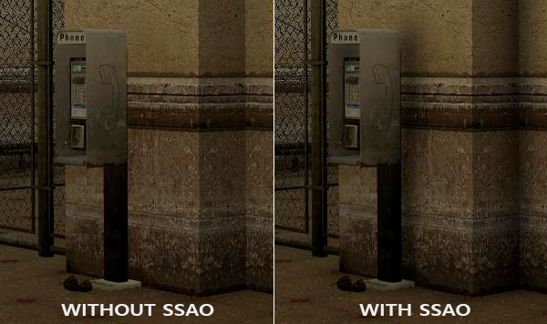

Пусть эффект и не очень заметен, но присутствие эффекта во всей сцене добавляет ей реалистичности за счет дополнительной иллюзии глубины, созданной малыми деталями эффекта самозатенения.

Стоит отметить, что алгоритмы расчета AO являются довольно ресурсоемкими, поскольку требуют анализа окружающей геометрии. В наивной реализации можно было бы просто в каждой точке поверхности выпустить множество лучей и определить степень её затенения, но такой подход весьма быстро достигает допустимого для интерактивных приложений предела ресурсоемкости. К счастью, в 2007 году компания Crytek опубликовала работу с описанием собственного подхода в реализации алгоритма *фонового затенения в экранном пространстве* \(*Screen-Space Ambient Occlusion*, SSAO\), который использовался в релизной версии игры Crysis. Подход рассчитывал степень затенения в экранном пространстве, используя лишь текущий буфер глубины вместо реальных данных об окружающей геометрии. Такая оптимизация радикально ускорила алгоритм по сравнению с эталонной реализацией и при этом давала по большей части правдоподобные результаты, что сделало данный подход приближенного расчета фонового затенения стандартом де-факто в индустрии.

Принцип, на котором основан алгоритм довольно прост: для каждого фрагмента полноэкранного квада рассчитывается *коэффициент затенения* \(*occlusion factor*\) на основе значений глубины окружающих фрагментов. Вычисленный коэффициент затенение далее используется для уменьшения интенсивности фонового освещения \(вплоть до полного исключения\). Получение коэффициента требует сбора данных о глубине от множества выборок из сферической области, окружающей рассматриваемый фрагмент, и сравнения этих значений глубины с глубиной рассматриваемого фрагмента. Число выборок, имеющих глубину бОльшую, нежели текущий фрагмент непосредственно и определяют коэффициент затенения. Посмотрите на данную схему:

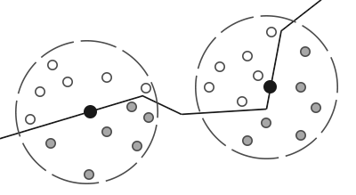

Здесь, каждая серая точка лежит внутри некоторого геометрического объекта, а потому осуществляет вклад в значение коэффициента затенения. Чем больше выборок окажутся внутри геометрии окружающих объектов, тем меньше будет остаточная интенсивность фонового затенения в этой области.

Очевидно, что качество и реалистичность эффекта прямо зависит от числа сделанных выборок. При малом числе выборок точность алгоритма падает и приводит к появлению артефакта бэндинга (banding) или «полошения» из-за резких переходов между областями с сильно отличающимися коэффициентами затенения. Большое же число выборок просто убивает производительность. Рандомизации ядра выборок позволяет при схожих по качеству результатах несколько снизить число требуемых выборок. Подразумевается переориентация поворотом на случайный угол набора векторов выборок. Однако внесение случайности тут же приносит новую проблему в виде заметного шумового узора, что требует использования фильтров размытия для сглаживания результата. Ниже приведен пример работы алгоритма \(автор – [John Chapman](http://john-chapman-graphics.blogspot.com/)\) и его типичные проблемы: бэндинг и шумовой узор.

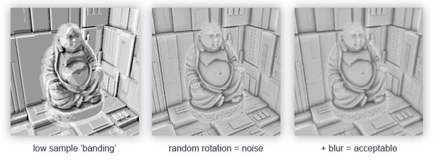

Как видно, заметное полошение из-за малого числа выборок неплохо убирается внесением рандомизации ориентации выборок.

Конкретная реализация SSAO от Crytek обладала узнаваемым визуальным стилем. Поскольку специалисты Crytek использовали сферическое ядро выборки это сказывалось даже на плоских поверхностях типа стен, делая их затененными – ведь половина объема ядра выборки оказывалась погруженной под геометрию. Ниже – скриншот со сценой из Crysis, изображенной в градациях серого на основе значения коэффициента затенения. Здесь хорошо виден эффект "серости":

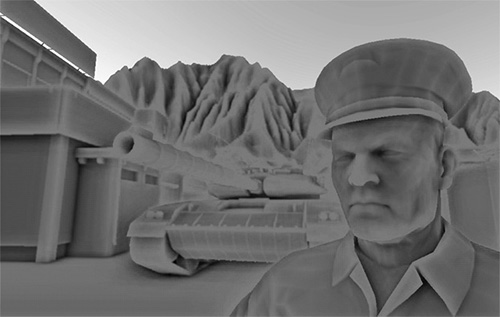

Для избегания такого влияния мы перейдем от сферического ядра выборки к полусфере, ориентированной вдоль нормали к поверхности:

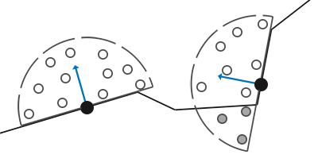

Осуществляя выборку из такой *полусферы ориентированной по нормали* \(*normal-oriented hemisphere*\) нам не придется учитывать в расчете коэффициента затенения фрагменты, лежащие под поверхностью прилегающей поверхности. Такой подход убирает излишнее затенение в, в целом, дает более реалистичные результаты. Данном урок будет использовать подход с полусферой и немного доработанный код из блестящего урока по SSAO от [John Chapman](http://john-chapman-graphics.blogspot.com/).

## Буфер с исходными данными

Процесс вычисления коэффициента затенения в каждом фрагменте требует наличия данных об окружающей геометрии. Конкретно, нам потребуются следующие данные:

- Вектор положения для каждого фрагмента;
- Вектор нормали для каждого фрагмента;
- Диффузный цвет для каждого фрагмента;
- Ядро выборки;
- Случайный вектор поворота для каждого фрагмента, использующийся в реориентации ядра выборки.

Используя данные о координатах фрагмента в видовом пространстве мы можем сориентировать полусферу ядра выборки вдоль вектора нормали, заданного в видовом пространстве, для текущего фрагмента. Затем получившееся ядро используется для осуществления выборок с различными смещениями из текстуры, хранящей данные о координатах фрагментов. Мы делаем множество выборок в каждом фрагменте и каждой осуществленной выборки сравниваем её значение глубины со значением глубины из буфера координат фрагментов для оценки величины затенения. Полученное значение затем используется для ограничения вклада фоновой компоненты в итоговом расчете освещения. Использование пофрагментного случайного вектора поворота мы можем заметно снизить необходимое количество выборок для получения пристойного результата, далее это будет продемонстрировано.

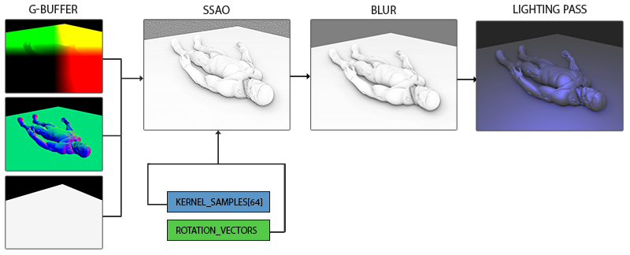

Поскольку SSAO является эффектом, реализующимся в экранном пространстве, то непосредственный расчет возможно выполнить отрендерив полноэкранный квад. Но тогда у нас не будет данных о геометрии сцены. Чтобы обойти такое ограничение, мы осуществим рендер всей необходимой информации в текстуры, которые позже будут использованы в шейдере SSAO для доступа к геометрической и прочей информации о сцене. Если вы внимательно следовали данным урокам, то уже должны узнать в описанном подходе облик алгоритма отложенного затенения. Во многом поэтому эффект SSAO как родной встает в рендер с отложенным затенением – ведь текстуры, хранящие координаты и нормали, уже доступны в G-буфере.

> В данном уроке эффект реализуется поверх несколько упрощенной версии кода из урока об [отложенном освещении](../../part%205/chapter%209/text.md). Если вы еще не ознакомились с принципами отложенного освещения – настоятельно советую обратиться к этому уроку.

Поскольку доступ к пофрагментной информации о координатах и нормалях уже должен быть доступен за счет G-буфера, то фрагментный шейдер стадии обработки геометрии достаточно прост:

```glsl
#version 330 core
layout (location = 0) out vec4 gPosition;
layout (location = 1) out vec3 gNormal;
layout (location = 2) out vec4 gAlbedoSpec;

in vec2 TexCoords;
in vec3 FragPos;
in vec3 Normal;

void main()
{    
    // положение фрагмента сохраняется в первой текстуре фреймбуфера
    gPosition = FragPos;
    // вектор нормали идет во вторую текстуру
    gNormal = normalize(Normal);
    // диффузный цвет фрагмента - в третью
    gAlbedoSpec.rgb = vec3(0.95);
}  
```

Поскольку алгоритм SSAO является эффектом в экранном пространстве, а коэффициент затенения вычисляется на основе видимой области сцены, то есть смысл вести расчеты в видовом пространстве. В данном случае переменная *FragPos*, полученная из вершинного шейдера, хранит положение именно в видовом пространстве. Стоит удостовериться, что данные о координатах и нормалях хранятся в G-буфере в видовом пространстве, поскольку все дальнейшие расчеты будут осуществляться в нем же.

> Существует возможность восстановления вектора положения на основе лишь известной глубины фрагмента и некоторого количества математической магии, что описано, например, у Matt Pettineo в [блоге](https://mynameismjp.wordpress.com/2010/09/05/position-from-depth-3/). Это, конечно, требующий бОльших затрат на расчеты способ, однако он избавляет от необходимости хранить данные о положении в G-буфере, что занимает уйму видеопамяти. Однако, ради простоты кода примера, мы оставим этот подход для личного изучения.

Текстура буфер цвета *gPosition* сконфигурирована следующим образом:

```cpp
glGenTextures(1, &gPosition);
glBindTexture(GL_TEXTURE_2D, gPosition);
glTexImage2D(GL_TEXTURE_2D, 0, GL_RGB16F, SCR_WIDTH, SCR_HEIGHT, 0, GL_RGB, GL_FLOAT, NULL);
glTexParameteri(GL_TEXTURE_2D, GL_TEXTURE_MIN_FILTER, GL_NEAREST);
glTexParameteri(GL_TEXTURE_2D, GL_TEXTURE_MAG_FILTER, GL_NEAREST);
glTexParameteri(GL_TEXTURE_2D, GL_TEXTURE_WRAP_S, GL_CLAMP_TO_EDGE);
glTexParameteri(GL_TEXTURE_2D, GL_TEXTURE_WRAP_T, GL_CLAMP_TO_EDGE);  
```

Данная текстура хранит координаты фрагментов и может быть использована для получения данных о глубине для каждой точки из ядра выборок. Отмечу, что текстура использует формат данных с плавающей точкой – это позволит координатам фрагментов не быть приведенными к интервалу \[0.0, 1.0\]. Также обратите внимание на режим повтора – установлен *GL_CLAMP_TO_EDGE*. Это необходимо для устранения возможности не нарочно осуществить оверсэмплинг в экранном пространстве. Выход за пределы основного интервала текстурных координат даст нам некорректные данные о положении и глубине.

Далее займемся формированием полусферического ядра выборок и созданием метода случайной его ориентации.

### Создание ориентированной по нормали полусферы

Итак, стоит задача создать набор точек выборки, расположенных внутри полусферы, сориентированной вдоль нормали к поверхности. Поскольку создание ядра выборки для всех возможных направлений нормали вычислительно недостижимо, то мы используем переход в [касательное пространство](../../part%205/chapter%205/text.md), где нормаль всегда представляется как вектор в направлении положительной полуоси Z.


Предполагая радиус полусферы единичным процесс формирования ядра выборки из 64 точек выглядит так:

```cpp
// случайные вещественные числа в интервале 0.0 - 1.0
std::uniform_real_distribution<float> randomFloats(0.0, 1.0); 
std::default_random_engine generator;
std::vector<glm::vec3> ssaoKernel;
for (unsigned int i = 0; i < 64; ++i)
{
    glm::vec3 sample(
        randomFloats(generator) * 2.0 - 1.0, 
        randomFloats(generator) * 2.0 - 1.0, 
        randomFloats(generator)
    );
    sample  = glm::normalize(sample);
    sample *= randomFloats(generator);
    float scale = (float)i / 64.0; 
    ssaoKernel.push_back(sample);  
}
```

Здесь мы случайным образом выбираем координаты x и y в интервале \[-1.0, 1.0\], а координату z – в интервале \[0.0, 1.0\] \(будь интервал таким же, как для x и y, мы бы получили сферическое ядро выборки\). Результирующие вектора выборок окажутся ограничены полусферы, поскольку ядро выборки в конечном итоге будет сориентировано вдоль нормали к поверхности.

В данный момент все точки выборки случайно распределены внутри ядра, но в угоду качеству эффекта выборкам, лежащим ближе к началу координат ядра, стоило бы вносить больший вклад в расчете коэффициента затенения. Это можно реализовать за счет изменения распределения сформированных точек выборки, увеличив их плотность около начала координат. Такую задачу легко выполнить с помощью функции интерполяции с ускорением:

```cpp
scale   = lerp(0.1f, 1.0f, scale * scale);
   sample *= scale;
   ssaoKernel.push_back(sample);  
}
```

Функция *lerp\(\)* определена как:

```cpp
float lerp(float a, float b, float f)
{
    return a + f * (b - a);
}  
```

Такой трюк дает нам модифицированное распределение, где большинство точек выборки лежат вблизи начала координат ядра.

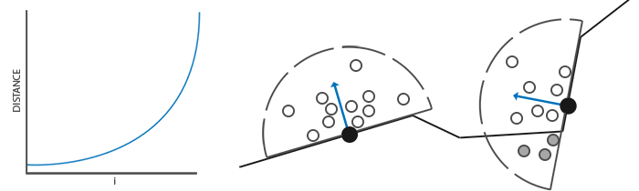

Каждый из полученных векторов выборки будет использован для смещения координаты фрагмента в видовом пространстве для получения данных об окружающей геометрии. Для получения приличных результатов при работе в видовом пространстве может потребоваться внушительное количество отсчетов, что неизбежно ударит по производительности. Однако, внесение псевдослучайного шума или поворота векторов выборок в каждом обрабатываемом фрагменте, позволит значительно снизить требуемое число выборок при сравнимом качестве.

### Случайный поворот ядра выборки

Итак, внесение случайности в распределение точек ядра выборки позволяет значительно снизить требование к числу этих точек для получения достойного качества эффекта. Можно было бы создать случайный вектор поворота для каждого фрагмента сцены, но это слишком затратно по памяти. Эффективней создать небольшую текстуру, содержащую набор случайных векторов поворота, а затем просто использовать её с установленным режимом повтора *GL_REPEAT*.

Создадим массив 4х4 и заполним случайными векторами поворота, сориентированными вдоль вектора нормали в касательном пространстве:

```cpp
std::vector<glm::vec3> ssaoNoise;
for (unsigned int i = 0; i < 16; i++)
{
    glm::vec3 noise(
        randomFloats(generator) * 2.0 - 1.0, 
        randomFloats(generator) * 2.0 - 1.0, 
        0.0f); 
    ssaoNoise.push_back(noise);
}  
```

Поскольку ядро выровнено вдоль положительной полуоси Z в касательном пространстве, то компонент z оставляем равным нулю – это обеспечит поворот только вокруг оси Z.

Далее создадим текстуру размером также 4х4 и зальем туда наш массив векторов поворота. Обязательно используйте режим повтора *GL_REPEAT* для тайлинга текстуры:

```cpp
unsigned int noiseTexture; 
glGenTextures(1, &noiseTexture);
glBindTexture(GL_TEXTURE_2D, noiseTexture);
glTexImage2D(GL_TEXTURE_2D, 0, GL_RGB16F, 4, 4, 0, GL_RGB, GL_FLOAT, &ssaoNoise[0]);
glTexParameteri(GL_TEXTURE_2D, GL_TEXTURE_MIN_FILTER, GL_NEAREST);
glTexParameteri(GL_TEXTURE_2D, GL_TEXTURE_MAG_FILTER, GL_NEAREST);
glTexParameteri(GL_TEXTURE_2D, GL_TEXTURE_WRAP_S, GL_REPEAT);
glTexParameteri(GL_TEXTURE_2D, GL_TEXTURE_WRAP_T, GL_REPEAT);  
```

Что ж, теперь у нас готовы все данные, необходимые для непосредственной реализации алгоритма SSAO!

## Шейдер SSAO

Шейдер эффекта будет исполняться для каждого фрагмента полноэкранного квада, вычисляя коэффициент затенения в каждом из них. Поскольку результаты будут использованы в еще одной стадии рендера, создающей итоговое освещение, нам потребуется создание еще одного объекта фреймбуфера для хранения результата работы шейдера:

```cpp
unsigned int ssaoFBO;
glGenFramebuffers(1, &ssaoFBO);  
glBindFramebuffer(GL_FRAMEBUFFER, ssaoFBO);
  
unsigned int ssaoColorBuffer;
glGenTextures(1, &ssaoColorBuffer);
glBindTexture(GL_TEXTURE_2D, ssaoColorBuffer);
glTexImage2D(GL_TEXTURE_2D, 0, GL_RED, SCR_WIDTH, SCR_HEIGHT, 0, GL_RGB, GL_FLOAT, NULL);
glTexParameteri(GL_TEXTURE_2D, GL_TEXTURE_MIN_FILTER, GL_NEAREST);
glTexParameteri(GL_TEXTURE_2D, GL_TEXTURE_MAG_FILTER, GL_NEAREST);
  
glFramebufferTexture2D(GL_FRAMEBUFFER, GL_COLOR_ATTACHMENT0, GL_TEXTURE_2D, ssaoColorBuffer, 0);  
```

Поскольку результат работы алгоритма – единственное вещественное число в пределах \[0.0, 1.0\], то для хранения будет достаточно создать текстуру с единственной доступной компонентой. Именно поэтому в качестве внутреннего формата для буфера цвета ставится *GL_RED*.

В целом процесс рендера стадии SSAO выглядит примерно следующим образом:

```cpp
// проход геометрии: подготовка G-буфера
glBindFramebuffer(GL_FRAMEBUFFER, gBuffer);
    [...]
glBindFramebuffer(GL_FRAMEBUFFER, 0);  
  
// используем G-буфер для создания текстуры с данными SSAO
glBindFramebuffer(GL_FRAMEBUFFER, ssaoFBO);
    glClear(GL_COLOR_BUFFER_BIT);    
    glActiveTexture(GL_TEXTURE0);
    glBindTexture(GL_TEXTURE_2D, gPosition);
    glActiveTexture(GL_TEXTURE1);
    glBindTexture(GL_TEXTURE_2D, gNormal);
    glActiveTexture(GL_TEXTURE2);
    glBindTexture(GL_TEXTURE_2D, noiseTexture);
    shaderSSAO.use();
    SendKernelSamplesToShader();
    shaderSSAO.setMat4("projection", projection);
    RenderQuad();
glBindFramebuffer(GL_FRAMEBUFFER, 0);
  
// проход освещения: сведение итогового изображения
glClear(GL_COLOR_BUFFER_BIT | GL_DEPTH_BUFFER_BIT);
shaderLightingPass.use();
[...]
glActiveTexture(GL_TEXTURE3);
glBindTexture(GL_TEXTURE_2D, ssaoColorBuffer);
[...]
RenderQuad();  
```

Шейдер *shaderSSAO* принимает нужные ему текстуры G-буфера как входные данные, а также шумовую текстуру и ядро выборки:

```glsl
#version 330 core
out float FragColor;
  
in vec2 TexCoords;

uniform sampler2D gPosition;
uniform sampler2D gNormal;
uniform sampler2D texNoise;

uniform vec3 samples[64];
uniform mat4 projection;

// тайлинг шумовой текстуры основан на отношении размера вьюпорта к размеру самой текстуры
// в примере вьюпорт имеет размер 1280x720
const vec2 noiseScale = vec2(1280.0/4.0, 720.0/4.0); 

void main()
{
    [...]
}
```

Обратите внимание на переменную *noiseScale*. Наша маленькая текстура с шумом должна быть затайлена по всей поверхности экрана, но поскольку текстурные координаты TexCoords заключены в пределах \[0.0, 1.0\] этого не произойдет без нашего вмешательства. В этих целях мы вычисляем множитель для текстурных координат, который находится как отношение размера экрана к размеру шумовой текстуры:

```glsl
vec3 fragPos   = texture(gPosition, TexCoords).xyz;
vec3 normal    = texture(gNormal, TexCoords).rgb;
vec3 randomVec = texture(texNoise, TexCoords * noiseScale).xyz;  
```

Поскольку при создании шумовой текстуры *texNoise* мы установили режим повтора в *GL_REPEAT*, то теперь она будет повторяться множество раз на поверхности экрана. Имея на руках величины *randomVec*, *fragPos* и *normal* мы можем создать матрицу TBN трансформации из касательного пространства в видовое:

```glsl
vec3 tangent   = normalize(randomVec - normal * dot(randomVec, normal));
vec3 bitangent = cross(normal, tangent);
mat3 TBN       = mat3(tangent, bitangent, normal);  
```

Используя процесс Грамма-Шмидта мы создаем ортогональный базис, случайно наклоненным в каждом фрагменте на основе случайного значения *randomVec*. Важный момент: поскольку в данном случае нам неважно, чтобы матрица TBN была точно сориентирована вдоль поверхности треугольника \(как в случае с parallax mapping'ом, прим. пер.\), то нам не нужны предрасчитанные данные о касательных и бикасательных.

Далее мы проходим по массиву ядра выборки, переводим каждый вектор выборки из касательного пространства в видовое и получаем его сумму с текущим положением фрагмента. Затем сравниваем величину глубины получившейся суммы со значением глубины, полученной выборкой из соответствующей текстуры G-буфера.

Пока звучит запутанно, разберем это по шагам:

```glsl
float occlusion = 0.0;
for(int i = 0; i < kernelSize; ++i)
{
    // получение координаты точки выборки
    vec3 sample = TBN * samples[i]; // переход от касательного в видовое пр-во
    sample = fragPos + sample * radius; 
    
    [...]
}  
```

Здесь *kernelSize* и *radius* являются переменными, контролирующими характеристики эффекта. В данном случае они равны 64 и 0.5 соответственно. На каждой итерации мы переводим вектор ядра выборки в видовое пространство. Далее прибавляем к полученному значению смещения выборки в видовом пространстве значение положения фрагмента в видовом пространстве. При этом значение смещения умножается на переменную radius, которая управляет радиусом ядра выборки эффекта SSAO.

После этих шагов нам следует преобразовать полученный вектор *sample* в экранное пространство, для того, чтобы мы могли осуществить выборку из текстуры G-буфера, хранящей положения и глубины фрагментов, используя полученное спроецированное значение. Поскольку *sample* находится в видовом пространстве, нам потребуется матрица проекции *projection*:

```glsl
vec4 offset = vec4(sample, 1.0);
offset      = projection * offset;    // переход из видового  клиповое
offset.xyz /= offset.w;               // перспективное деление 
offset.xyz  = offset.xyz * 0.5 + 0.5; // преобразование к интервалу [0., 1.] 
```

После преобразования в клиповое пространство мы вручную осуществляем перспективное деление простым делением компонент xyz на w компоненту. Полученный вектор в нормализованных координатах устройства \(NDC\) переводится в интервал значений \[0.0, 1.0\] дабы его можно было использовать как текстурные координаты:

```glsl
float sampleDepth = texture(gPosition, offset.xy).z; 
```

Используем компоненты xy вектора *sample* для выборки из текстуры положений G-буфера. Получим значение глубины \(z компоненты\), соответствующее вектору выборки при взгляде с позиции наблюдателя \(это первый не заслоненный видимый фрагмент\). Если при этом полученная глубина выборки оказывается больше, чем сохраненная глубина, то мы увеличиваем коэффициент затенения:

```glsl
occlusion += (sampleDepth >= sample.z + bias ? 1.0 : 0.0);  
```

Обратите внимание на смещение *bias*, которое добавляется к исходной глубине фрагмента \(в примере установлена в 0.025\). Это смещение не всегда является обязательным, но наличие переменной позволяет управлять тем, как выглядит эффект SSAO, а также, в определенных ситуациях, убирает проблемы с рябью в затененных областях.

Но и это еще не все, поскольку такая реализация приводит к заметным артефактам. Он проявляется в тех случаях, когда рассматривается фрагмент, лежащий вблизи края некоторой поверхности. В таких ситуациях алгоритм при сравнении глубин неизбежно захватит и глубины поверхностей, которые могут лежать очень далеко позади рассматриваемой. В этих местах алгоритм ошибочно сильно увеличит степень затенения, что создаст заметные темные ореолы по краям объектов. Лечится артефакт введением дополнительной проверки на расстояние \(пример за авторством [John Chapman](http://john-chapman-graphics.blogspot.com/)\):

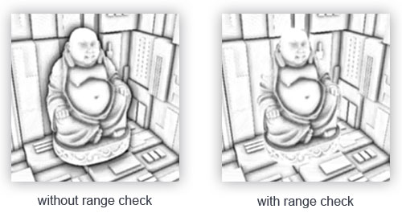

Проверка будет ограничивать вклад в коэффициент затенения только для значений глубины, лежащих в пределах радиуса выборки:

```glsl
float rangeCheck = smoothstep(0.0, 1.0, radius / abs(fragPos.z - sampleDepth));
occlusion       += (sampleDepth >= sample.z + bias ? 1.0 : 0.0) * rangeCheck;         
```

Также мы применяем функцию GLSL *smoothstep\(\)*, которая реализует плавную интерполяцию третьего параметра в пределах между первым и вторым. При этом возвращая 0, если третий параметр меньше или равен первому, либо 1, если третий параметр больше либо равен второму. Если разница глубин оказывается в пределах *radius*, то её величина будет плавно сглажена в интервале \[0.0, 1.0\] в соответствии с данной кривой:


Если бы мы использовали четкие границы в условиях проверки глубины, то это добавило бы артефакты в виде резких границ в тех местах, где значения разницы глубин оказываются вне пределов *radius*.

Последним штрихом мы нормализуем величину коэффициента затенения, используя размер ядра выборки и записываем результат. Также мы инвертируем итоговое значение, вычитая его из единицы, дабы можно было использовать конечное значение напрямую для модуляции фоновой составляющей освещения без дополнительных действий:

```glsl
occlusion = 1.0 - (occlusion / kernelSize);
FragColor = occlusion;  
```

Для сцены с лежащим знакомым нам нанокостюмом, выполнение SSAO шейдера дает следующую текстуру:

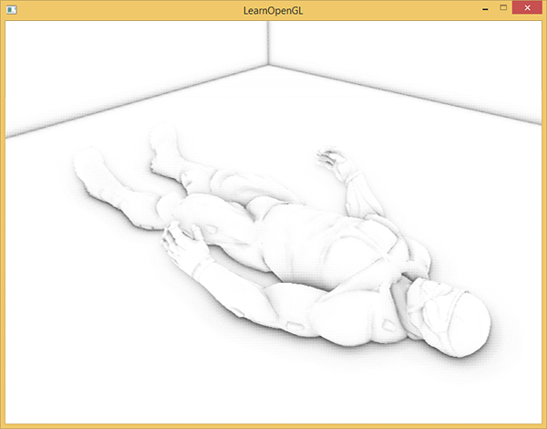

Как видно, эффект фонового затенения создает неплохую иллюзию глубины. Одно только выходное изображение шейдера уже позволяет различить детали костюма и убедиться, что он действительно лежит на полу, а не левитирует на некотором расстоянии от него.

И все же эффект далек от идеала, поскольку шумовой узор, привнесенный текстурой случайных векторов поворота, легко заметен. Для сглаживания результата расчета SSAO мы применим фильтр размытия.

### Размытие фонового затенения

После построения результата SSAO и перед финальным сведением освещения необходимо провести размытие текстуры, хранящей данные о коэффициенте затенения. Для этого мы заведем еще один фреймбуфер:

```cpp
unsigned int ssaoBlurFBO, ssaoColorBufferBlur;
glGenFramebuffers(1, &ssaoBlurFBO);
glBindFramebuffer(GL_FRAMEBUFFER, ssaoBlurFBO);
glGenTextures(1, &ssaoColorBufferBlur);
glBindTexture(GL_TEXTURE_2D, ssaoColorBufferBlur);
glTexImage2D(GL_TEXTURE_2D, 0, GL_RED, SCR_WIDTH, SCR_HEIGHT, 0, GL_RGB, GL_FLOAT, NULL);
glTexParameteri(GL_TEXTURE_2D, GL_TEXTURE_MIN_FILTER, GL_NEAREST);
glTexParameteri(GL_TEXTURE_2D, GL_TEXTURE_MAG_FILTER, GL_NEAREST);
glFramebufferTexture2D(GL_FRAMEBUFFER, GL_COLOR_ATTACHMENT0, GL_TEXTURE_2D, ssaoColorBufferBlur, 0);
```

Тайлинг шумовой текстуры в экранном пространстве обеспечивает вполне определенные характеристики случайности, которые можно использовать в свою пользу при создании фильтра размытия:

```glsl
#version 330 core
out float FragColor;
  
in vec2 TexCoords;
  
uniform sampler2D ssaoInput;

void main() {
    vec2 texelSize = 1.0 / vec2(textureSize(ssaoInput, 0));
    float result = 0.0;
    for (int x = -2; x < 2; ++x) 
    {
        for (int y = -2; y < 2; ++y) 
        {
            vec2 offset = vec2(float(x), float(y)) * texelSize;
            result += texture(ssaoInput, TexCoords + offset).r;
        }
    }
    FragColor = result / (4.0 * 4.0);
}  
```

Шейдер просто осуществляет переход по текселям текстуры SSAO со смещение от -2 до +2, что соответствует реальным размерам шумовой текстуры. Смещение равно точному размеру одного текселя: для расчета используется функция *textureSize\(\)*, возвращающая *vec2* с размерами указанной текстуры. Т.о. шейдер просто усредняет результаты, хранимые в текстуре, что дает быстрое и достаточно эффективное размытие:

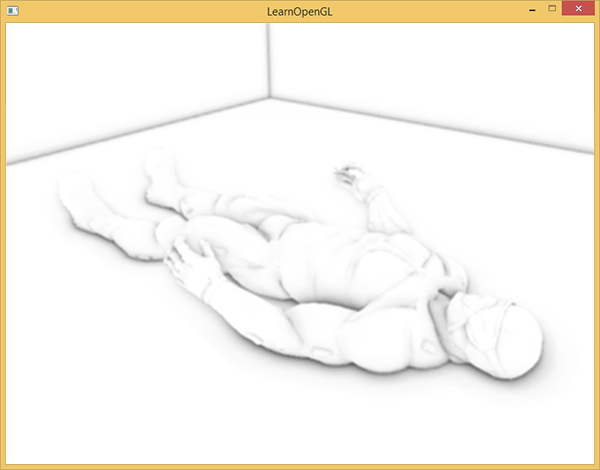

Итого у нас на руках есть текстура с данными фонового затенения для каждого фрагмента на экране – все готово для стадии финального сведения изображения!

### Применение фонового затенения

Этап применения коэффициента затенения в итоговом расчете освещения на удивление прост: для каждого фрагмента достаточно просто умножить значение фоновой составляющей источника света на коэффициент затенения из подготовленной текстуры. Можно взять готовый шейдер с моделью Блинна-Фонга из урока по [отложенному затенению](../../part%205/chapter%209/text.md) и немного его подправить:

```glsl
#version 330 core
out vec4 FragColor;
  
in vec2 TexCoords;

uniform sampler2D gPosition;
uniform sampler2D gNormal;
uniform sampler2D gAlbedo;
uniform sampler2D ssao;

struct Light {
    vec3 Position;
    vec3 Color;
    
    float Linear;
    float Quadratic;
    float Radius;
};
uniform Light light;

void main()
{             
    // извлечение данных из G-буфера
    vec3 FragPos = texture(gPosition, TexCoords).rgb;
    vec3 Normal = texture(gNormal, TexCoords).rgb;
    vec3 Diffuse = texture(gAlbedo, TexCoords).rgb;
    float AmbientOcclusion = texture(ssao, TexCoords).r;
    
    // расчет модели Блинна-Фонга в видовом пространстве 
   
    // здесь появляется новшество: учет расчитанного к-та затенения
    vec3 ambient = vec3(0.3 * Diffuse * AmbientOcclusion); 
    vec3 lighting  = ambient; 
    // положение наблюдателя всегда (0, 0, 0) в видовом пр-ве
    vec3 viewDir  = normalize(-FragPos); 
    // диффузная составляющая
    vec3 lightDir = normalize(light.Position - FragPos);
    vec3 diffuse = max(dot(Normal, lightDir), 0.0) * Diffuse * light.Color;
    // зеркальная составляющая
    vec3 halfwayDir = normalize(lightDir + viewDir);  
    float spec = pow(max(dot(Normal, halfwayDir), 0.0), 8.0);
    vec3 specular = light.Color * spec;
    // фоновая составляющая
    float dist = length(light.Position - FragPos);
    float attenuation = 1.0 / (1.0 + light.Linear * dist + light.Quadratic * dist * dist);
    diffuse  *= attenuation;
    specular *= attenuation;
    lighting += diffuse + specular;

    FragColor = vec4(lighting, 1.0);
}
```

Серьезных изменений здесь всего два: переход к расчетам в видовом пространстве и умножение компоненты фонового освещения на значение *AmbientOcclusion*. Пример сцены с единственным синим точечным источником света:

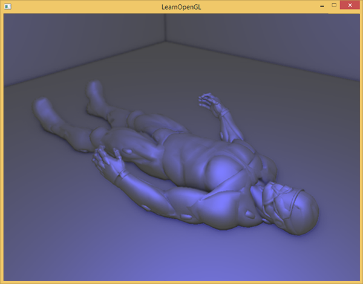

Полный исходный код лежит [здесь](src1.cpp).

Проявление эффекта SSAO сильно зависит от параметров типа *kernelSize*, *radius* и *bias*, зачастую их тонкая подстройка – само собой разумеющееся занятие художника при проработке той или иной локации/сцены. Нет каких-то «лучших» и универсальных сочетаний параметров: для одних сцен хорош малый радиус ядра выборки, другие выигрывают от увеличенного радиуса и числа выборок. В примере используется 64 точки выборки, что, откровенно говоря, избыточно, но вы всегда можете отредактировать код и посмотреть, что получится при меньшем числе выборок.

Кроме перечисленных юниформов, которые отвечают за настройку эффекта, существует возможность явно регулировать выраженность эффекта фонового затенения. Для этого достаточно возвести коэффициент в степень, контролируемую еще одним юниформом:

```glsl
occlusion = 1.0 - (occlusion / kernelSize);       
FragColor = pow(occlusion, power);
```

Советую потратить некоторое время на игру с настройками, поскольку это даст лучшее понимание о характере изменений в итоговой картинке.

Подводя итог, стоит сказать, что хотя визуальный эффект от применения SSAO и достаточно слабозаметный, но в сценах с хорошо расставленным освещением он неоспоримо добавляет заметную толику реализма. Иметь такой инструмент в своем арсенале безусловно ценно.

## Дополнительные ресурсы

- [SSAO Tutorial](http://john-chapman-graphics.blogspot.nl/2013/01/ssao-tutorial.html): отличная статья-урок от John Chapman, на основе которой построен код данного урока.
- [Know your SSAO artifacts](https://mtnphil.wordpress.com/2013/06/26/know-your-ssao-artifacts/): Весьма ценная статья доходчиво показывающая не только самые насущные проблемы с качеством SSAO, но и пути их решения. Рекомендуется к прочтению.
- [SSAO With Depth Reconstruction](http://ogldev.atspace.co.uk/www/tutorial46/tutorial46.html): Дополнение к основному уроку о SSAO от автора OGLDev, касающаяся часто применяемой техники восстановления координаты фрагмента на основе значения глубины. Важность данного подхода обусловлена весомой экономией памяти за счет отсутствия необходимости хранить положения в G-буфере. Подход так то универсальный, к SSAO относится постольку поскольку.
