# Learn OpenGL. Урок 5.5 – Normal Mapping

## Normal Mapping

Все сцены, которые мы используем состоят из многоугольников, в свою очередь состоящих из сотен, тысяч абсолютно плоских треугольников. Нам уже удалось немного повысить реализм сцен за счет дополнительных деталей, которые обеспечивает нанесение двухмерных текстур на эти плоские треугольники. Текстурирование помогает скрыть факт того, что все объекты в сцене – всего лишь набор множества мелких треугольников. Великолепная техника, но возможности её не безграничны: при приближении к любой поверхности все одно становится ясно, что она состоит из плоских поверхностей. Большая же часть реальных объектов не является абсолютно плоской и демонстрирует множество рельефных деталей.

Например, возьмите кирпичную кладку. Поверхность её весьма груба и, очевидно, представлена далеко не плоскостью: на ней есть углубления с цементом и множество мелких деталей типа отверстий и трещин. Если сцену с имитацией кирпичной кладки проанализировать в условиях наличия освещения, то иллюзия рельефности поверхности очень легко разрушается. Ниже представлен пример такой сцены, содержащей плоскость с нанесенной текстурой кирпичной кладки и один точечный источник света:

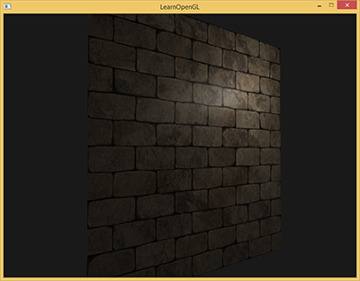

Как видно, освещение совершенно не учитывает предполагаемые для этой поверхности детали рельефа: отсутствуют и все мелкие трещинки, и углубления с цементом неотличимы от остальной поверхности. Можно было бы использовать карту зеркального блеска дабы ограничить освещенность определенных деталей, которые находятся в углублениях поверхности. Но это больше похоже на грязный хак, чем на рабочее решение. Что нам нужно, так это способ обеспечить уравнения освещения данными о микрорельефе поверхности.
В контексте известных нам уравнений освещения подумайте вот над каким вопросом: при каких условиях поверхность будет освещена как идеально плоская? Ответ связан с нормалью к поверхности. С точки зрения алгоритма освещения информация о форме поверхности передается только через вектор нормали. Поскольку у представленной выше поверхности вектор нормали постоянен всюду, то и освещение выходит равномерным, соответствующим плоскости. А что если передавать алгоритму освещения не единственную нормаль, постоянную для всех фрагментов, принадлежащих объекту, а нормаль уникальную для каждого фрагмента? Таким образом вектор нормали будет слегка меняться на основе рельефа поверхности, что создаст более убедительную иллюзию сложности поверхности:


За счет использования пофрагментно отличающихся нормалей алгоритм освещения будет считать поверхность состоящей из множества микроскопических плоскостей, перпендикулярных своему вектору нормали. В итоге это ощутимо добавит объекту фактурности. Техника применения нормалей уникальных для фрагмента, а не всей поверхности – это и есть **Normal Mapping** или **Bump Mapping**. В применении к уже знакомой сцене:

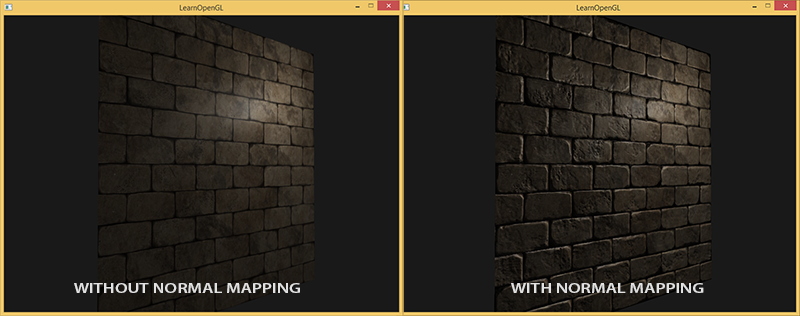

Виден впечатляющий рост визуальной сложности за счет весьма скромных затрат производительности. Поскольку мы все изменения в модели освещения заключаются лишь в подаче уникальной нормали в каждом фрагменте, то никакие формулы вычислений не меняются. Только лишь на вход вместо интерполированной нормали к поверхности поступает нормаль для текущего фрагмента. Все те же уравнения освещения проделывают остальную работу по созданию иллюзии рельефа.

## Normal Mapping

Итак, получается, нам необходимо обеспечить алгоритм освещения нормалями, уникальными для каждого фрагмента. Воспользуемся уже знакомым по текстурам диффузного и зеркального отражения методом и используем обычную 2D текстуру для хранения данных о нормали в каждой точке поверхности. Не удивляйтесь, текстуры отлично подходят и для хранения векторов нормалей. Далее нам останется только осуществить выборку из текстуры, восстановить вектор нормали и провести расчеты освещения.

На первый взгляд может быть не очень ясно, как сохранить векторные данные в обычной текстуре, которая типично используется для хранения информации о цвете. Но задумайтесь на секунду: цветовая триада RGB по сути и есть трехмерный вектор. Похожим образом можно сохранить компоненты вектора нормали XYZ в соответствующих компонентах цвета. Величины компонент вектора нормали лежат в интервале \[-1, 1\] и потому требуют дополнительного преобразования в интервал \[0, 1\]:

```glsl
vec3 rgb_normal = normal * 0.5 + 0.5; // переход от [-1,1] к [0,1]   
```

Такое приведение вектора нормали в пространство цветовых компонент RGB позволит нам сохранить в текстуре вектора нормалей, полученные на основе реального рельефа моделируемого объекта и уникальные для каждого фрагмента. Пример такой текстуры – карты нормалей – для все той же кирпичной кладки:

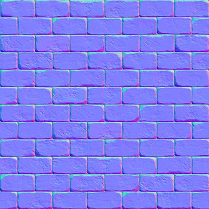

Интересно отметить синий оттенок этой карты нормалей (практически все карты нормалей имеют схожий оттенок). Так получается, поскольку все нормали сориентированы приблизительно вдоль оси oZ, которая представляется координатной тройкой \(0, 0, 1\), т.е. в виде цветовой триады – чисто синий цвет. Небольшие изменения оттенка являются следствием отклонения нормалей от положительной полуоси oZ на некоторых участках, что соответствует неровностям рельефа. Так, можно заметить, что на верхних кромках каждого кирпича текстура приобретает зеленый оттенок. И это логично: на верхних гранях кирпича нормали должны бы быть сориентированы больше в сторону оси oY \(0, 1, 0\), что соответствует зеленому цвету.

Для тестовой сцены возьмем плоскость, сориентированную в сторону положительной полуоси oZ и используем для нее следующие [диффузную карту](brickwall.jpg) и [карту нормалей](brickwall_normal.jpg).

> Обратите внимание на то, что карта нормалей по ссылке и на картинке выше отличаются. В статье автор довольно вскользь упомянул о причинах отличий, ограничившись советом преобразовывать карты нормалей к такому виду, чтобы зеленая компонента указывала «вниз», а не "вверх" в системе локальной для плоскости текстуры.
> Если взглянуть более подробно, то тут взаимодействуют две фактора:
> 
> - Различие в том, как адресуются тексели в клиентской памяти и в текстурной памяти OpenGL
> - Наличие двух нотаций для карт нормалей. Условно, два лагеря: DirectX-style и OpenGL-style
> 
> Что касается нотаций карт нормалей, то исторически знакомые два лагеря: DirectX и OpenGL.
> 
> 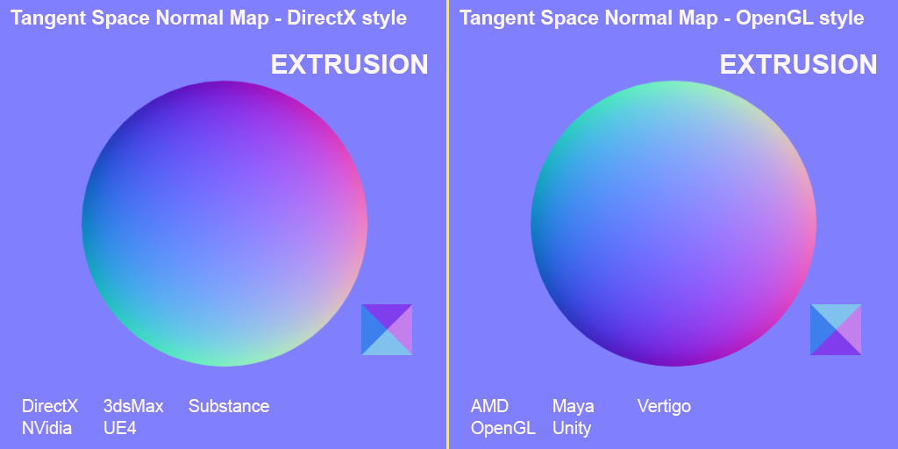
> 
> Как видно, они не совместимы. И немного покумекав можно понять, что DirectX полагает касательное пространство леворуким, а OpenGL праворуким. Подсунув иксовую карту нормалей нашему приложению без изменений получим некорректное освещение, причем не всегда сразу видно, что оно некорректное. Самое заметное — то, что выпуклости в формате OpenGL становятся углублениями для DirectX и наоборот.
> 
> Что касается адресации: загружая данные из файла текстур в память мы предполагаем, что первый тексель — это левый верхний тексель изображения. Для представления текстурных данных в памяти приложения это, вобщем случае, верно. Но OpenGL использует другую систему текстурных координат: для нее первый тексель — это левый нижний. Для корректного текстурирования изображения, обычно, переворачиваются по оси Y еще в коде того или иного загрузчика файлов изображений. Для используемой в уроках либы Stb_image нужно добавить установку флажка
> 
> ```cpp
>     stbi_set_flip_vertically_on_load(1);
> ```
> 
> Что самое забавное, то корректно в плане освещения отображаются два варианта: карта нормалей в нотации OpenGL с включенным отражением по Y или карта нормалей в нотации DirectX с выключенным отражением по Y. Освещение в обоих случаях работает корректно, разница останется только в инверсии текстур по оси Y.
> 
> 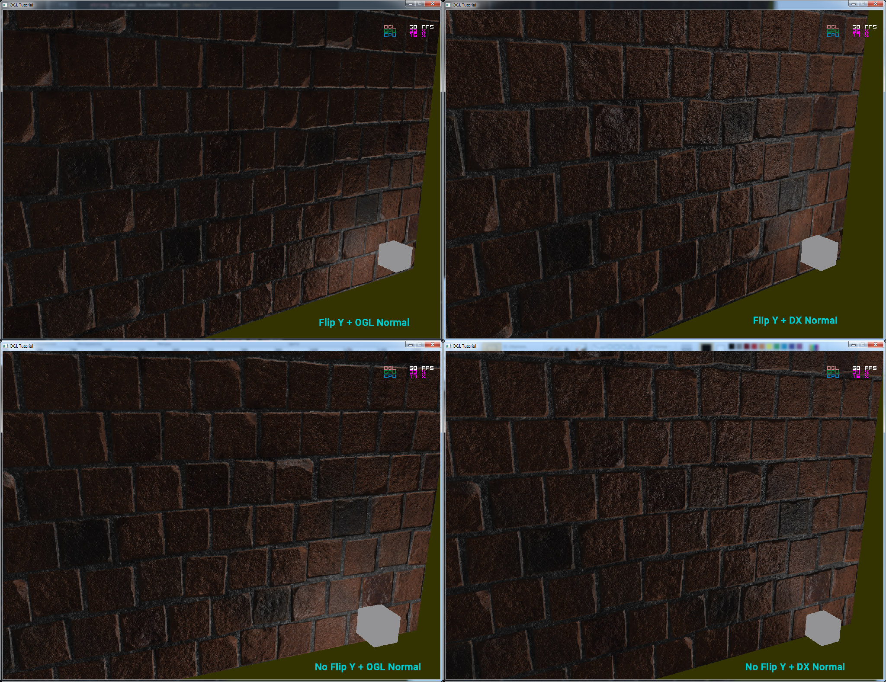
> 
> **Прим. пер.**

Итак, загрузим обе текстуры, привяжем к текстурным блокам и отрендерим подготовленную плоскость, с учетом следующих модификаций кода фрагментного шейдера:

```glsl
uniform sampler2D normalMap;  

void main()
{           
    // выборка вектора из карты нормалей с областью значений [0,1]
    normal = texture(normalMap, fs_in.TexCoords).rgb;
    // перевод вектора нормали в интервал [-1,1]
    normal = normalize(normal * 2.0 - 1.0);   
  
    [...]
    // вычисление освещения...
} 
```

Здесь мы применяем обратное преобразование из пространства значений RGB в полноценный вектор нормали и далее просто используем его в хорошо знакомой модели освещения Блинна-Фонга.

Теперь, если медленно менять положение источника света в сцене, то можно ощутить иллюзию рельефности поверхности, обеспечиваемую картой нормалей:

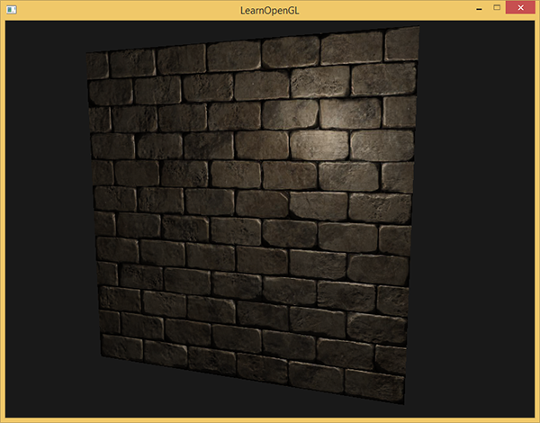

Но остается одна проблема, которая радикально сужает круг возможного применения карт нормалей. Как уже отмечено синий оттенок карты нормалей намекал на то, что все вектора в текстуре ориентированы в среднем вдоль положительной оси oZ. В нашей сцене это не создало проблем, ведь нормаль к поверхности плоскости также была сонаправлена с oZ. Однако, что случится, если мы изменим положение плоскости в сцене так, что нормаль к ней будет сонаправлена с положительной полуосью oY?

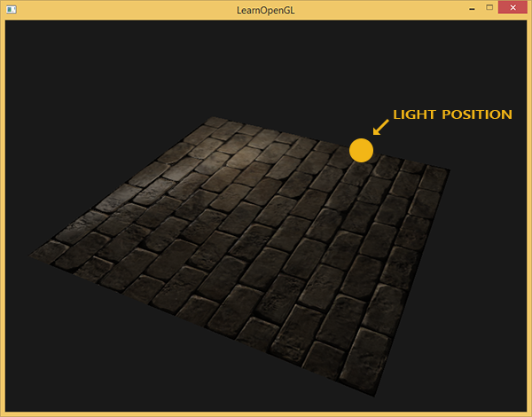

Освещение оказалось полностью неверным! И причина проста: выборки нормалей из карты все также возвращают вектора, ориентированные вдоль положительной полуоси oZ, хотя в данном случае им следовало бы быть ориентированными в направлении положительной полуоси oY нормали поверхности. В данный же момент расчет освещения идет так, будто нормали к поверхности расположены так, будто плоскость все еще ориентирована в сторону положительной полуоси oZ, что дает неверный результат. Рисунок ниже более наглядно показывает ориентацию считанных из карты нормалей относительно поверхности:

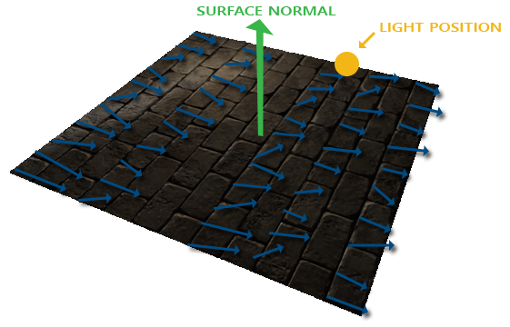

Видно, что нормали в целом выровнены вдоль положительной полуоси oZ, хотя должны бы быть выровнены вдоль нормали к поверхности, которая направлена вдоль положительной полуоси oY.
Возможным решением могло бы быть задание отдельной карты нормалей для каждой ориентации рассматриваемой поверхности. Для куба понадобилось бы шесть карт нормалей, а для более сложных моделей число возможных ориентаций может быть слишком высоко и для реализации не годится.

Есть другой, математически более сложный подход, предлагающий вести расчеты освещения в другой системе координат: такой, что вектора нормали в ней всегда примерно совпадают с положительной полуосью oZ. Другие вектора, требующиеся для расчетов освещения тогда преобразуются в эту систему координат. Такой метод дает возможность использовать одну карту нормалей для любой ориентации объекта. А эта специфичная система координат называется **касательным пространством** или **tangent space**.

### Касательное пространство

Стоит отметить, что вектор нормали в карте нормалей выражен непосредственно в касательном пространстве, т.е. в такой системе координат, что нормаль всегда направлена примерно в направлении положительной полуоси oZ. Касательное пространство задано как система координат, локальная для плоскости треугольника и каждый вектор нормали задается в рамках этой системы координат. Можно представить эту систему и как локальную систему координат для карты нормалей: все вектора в ней заданы направленными в сторону положительной полуоси oZ вне зависимости от конечной ориентации поверхности. Используя специально подготовленные матрицы трансформации можно преобразовать вектора нормалей из этой локальной касательной системы координат в мировые или видовые координаты, ориентируя их в соответствии с окончательным положением поверхностей, подвергаемых текстурированию.

Рассмотрим предыдущий пример с некорректным применением normal mapping’а, где плоскость была сориентирована вдоль положительной полуоси oY. Так как карта нормалей задана в касательном пространстве, то один из вариантов корректировки – это расчет матрицы перехода нормалей из касательного пространства в такое, что они бы стали ориентированы по нормали к поверхности. Это привело бы к тому, что нормали стали бы выровнены вдоль положительной полуоси oY. Замечательным свойством касательного пространства является тот факт, что расчитав такую матрицу мы сможем переориентировать нормали к любой поверхности и её ориентации.

Такая матрица сокращенно обозначается как TBN, что есть сокращение от названия тройки векторов *Tangent*, *Bitangent* и *Normal*. Эти три вектора нам необходимо найти, дабы сформировать эту матрицу смены базиса. Такая матрица осуществляет переход вектора из касательного пространства в какое-либо другое и для её формирования необходимы три взаимоперпендикулярных вектора, ориентация которых соответствует ориентации плоскости карты нормалей. Это вектор направления вверх, вправо и вперед, набор знакомый нам по уроку о [виртуальной камере](../../part%201/chapter%209/text.md).

С вектором верх все ясно сразу – это наш вектор нормали. Вектор вправо и вперед называются касательная \(*tangent*\) и бикасательная \(*bitangent*\) соответственно. Следующий рисунок дает представление об их взаимном расположении на плоскости:


Расчет касательной и бикасательной не настолько очевиден, как расчет вектора нормали. На рисунке можно заметить, что направление касательной и бикасательной карты нормали выровнены с осями, задающими текстурные координаты поверхности. Данный факт и положен в основу расчета этих двух векторов который потребует некоторой сноровки с математикой. Посмотрите на рисунок:

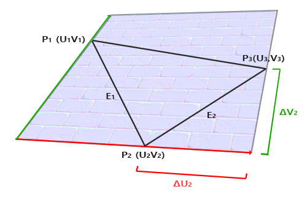

Изменения текстурных координат вдоль грани треугольника E2 обозначенное как ΔU2 и ΔV2 выражены в тех же направлениях, что и векторы касательной T и бикасательной B. Исходя из этого факта можно выразить грани треугольника E1 и E2 в виде линейной комбинации касательного и бикасательного векторов:

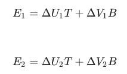

Преобразуя в поэлементную запись получим:

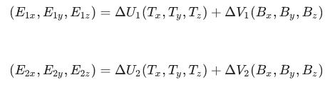

вычисляется как вектор разности двух векторов, а ΔU и ΔV как разности текстурных координат. Остается найти две неизвестных в двух уравнениях: касательную T и бикасательную B. Если еще припоминаете уроки алгебры, то знаете, что такие условия позволяют решить систему и для T и для B.
Последняя приведенная форма уравнений позволяет нам переписать её в форме матричного умножения:

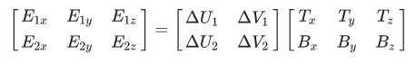

Попробуйте мысленно провести матричное умножение, чтобы убедиться в верности записи. Запись системы в матричной форме позволяет гораздо легче понять подход к нахождению T и B. Умножим обе части уравнения на величину обратную ΔUΔV:

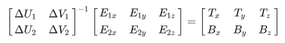

Получаем решение относительно T и B, которое, однако, требует расчета обратной матрицы изменений текстурных координат. Не будем углубляться в подробности вычисления обратных матриц – выражение для обратной матрицы выглядит как произведение числа, обратного к детерминанту исходной матрицы, и присоединенной матрицы:

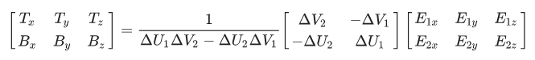

Данное выражение и есть формула для расчета вектора касательной и бикасательной на основе координат граней треугольника и соответствующих текстурных координат.
Не переживайте, если суть приведенных математических выкладок ускользает от вас. Если вы понимаете, что касательную и бикасательную мы получаем на основе координат вершин треугольника и их текстурных координат (поскольку текстурные координаты также принадлежат касательному пространству) – это уже половина дела.

### Расчет тангентов и битангентов

В примере этого урока мы взяли простую плоскость, смотрящую в сторону положительной полуоси oZ. Сейчас же попробуем реализовать normal mapping используя касательное пространство, чтобы иметь возможность ориентировать плоскость в примере как нам вздумается, не разрушая эффекта normal mapping’а. Используя вышеописанный расчет мы вручную найдем касательную и бикасательную к рассматриваемой поверхности.

Примем, что плоскость составлена из следующих вершин с текстурными координатами \(два треугольника заданы векторами 1, 2, 3 и 1, 3, 4\):

```cpp
// координаты вершин
glm::vec3 pos1(-1.0,  1.0, 0.0);
glm::vec3 pos2(-1.0, -1.0, 0.0);
glm::vec3 pos3( 1.0, -1.0, 0.0);
glm::vec3 pos4( 1.0,  1.0, 0.0);
// текстурные координаты
glm::vec2 uv1(0.0, 1.0);
glm::vec2 uv2(0.0, 0.0);
glm::vec2 uv3(1.0, 0.0);
glm::vec2 uv4(1.0, 1.0);
// вектор нормали
glm::vec3 nm(0.0, 0.0, 1.0); 
```

Сначала рассчитываем вектора, описывающие грани треугольника, а также дельты текстурных координат:

```cpp
glm::vec3 edge1 = pos2 - pos1;
glm::vec3 edge2 = pos3 - pos1;
glm::vec2 deltaUV1 = uv2 - uv1;
glm::vec2 deltaUV2 = uv3 - uv1;  
```

Имея на руках необходимые исходные данные мы можем приступить к расчету касательной и бикасательной прямо по формулам из предыдущего раздела:

```cpp
float f = 1.0f / (deltaUV1.x * deltaUV2.y - deltaUV2.x * deltaUV1.y);

tangent1.x = f * (deltaUV2.y * edge1.x - deltaUV1.y * edge2.x);
tangent1.y = f * (deltaUV2.y * edge1.y - deltaUV1.y * edge2.y);
tangent1.z = f * (deltaUV2.y * edge1.z - deltaUV1.y * edge2.z);
tangent1 = glm::normalize(tangent1);

bitangent1.x = f * (-deltaUV2.x * edge1.x + deltaUV1.x * edge2.x);
bitangent1.y = f * (-deltaUV2.x * edge1.y + deltaUV1.x * edge2.y);
bitangent1.z = f * (-deltaUV2.x * edge1.z + deltaUV1.x * edge2.z);
bitangent1 = glm::normalize(bitangent1);  
  
[...] // аналогичный код для расчета касательных второго треугольника плоскости
```

Сперва выносим дробный компонент итогового выражения в отдельную переменную *f*. Затем для каждого компонента векторов выполняем соответствующую часть матричного умножения и умножаем на *f*. Сравнив данный код с итоговой формулой расчета можно увидеть, что это буквальное её переложение. Не забудьте в конце провести нормализацию, дабы найденные вектора были единичными.

Поскольку треугольник плоская фигура, то расчет касательной и бикасательной достаточно провести один раз на треугольник – они будут одинаковые для всех вершин. Стоит отметить, что большая часть реализаций работы с моделями \(типа загрузчиков или генераторов ландшафтов\) используют такую организацию треугольников, где они делят вершины с другими треугольниками. В таких случаях разработчики, обычно, прибегают к усреднению параметров в общих вершинах, таких как вектора нормали, касательно и бикасательной, чтобы получить более сглаженный результат. Треугольники, составляющие нашу плоскость тоже делят несколько вершин, но поскольку они оба лежат в одной плоскости, то усреднение не потребуется. И все же полезно помнить о наличии такого подхода в реальных приложениях и задачах.

Получившиеся вектора касательной и бикасательной должны иметь значения \(1, 0, 0\) и \(0, 1, 0\) соответственно. Что вкупе с вектором нормали \(0, 0, 1\) формируют ортогональную матрицу TBN. Если визуализировать полученный базис вместе с плоскостью, то получится следующее изображение:

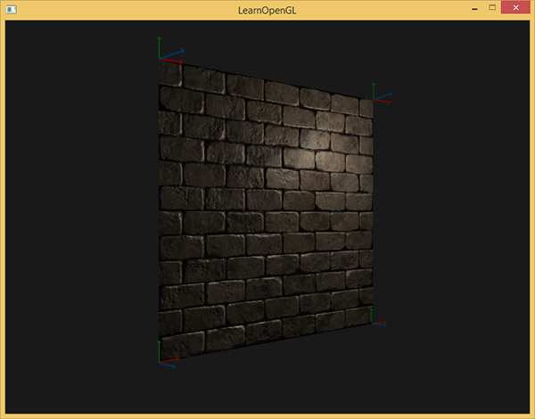

Теперь, имея рассчитанные вектора можно приступать к полноценной реализации normal mapping’а.

## Normal mapping в касательном пространстве

Для начала необходимо сформировать матрицу TBN в шейдерах. Для этой цели мы передадим заранее подготовленные вектора касательной и бикасательной в вершинный шейдер через вершинные атрибуты:

```glsl
#version 330 core
layout (location = 0) in vec3 aPos;
layout (location = 1) in vec3 aNormal;
layout (location = 2) in vec2 aTexCoords;
layout (location = 3) in vec3 aTangent;
layout (location = 4) in vec3 aBitangent;   
```

В самом коде вершинного шейдера сформируем непосредственно матрицу:

```glsl
void main()
{
   [...]
   vec3 T = normalize(vec3(model * vec4(aTangent,   0.0)));
   vec3 B = normalize(vec3(model * vec4(aBitangent, 0.0)));
   vec3 N = normalize(vec3(model * vec4(aNormal,    0.0)));
   mat3 TBN = mat3(T, B, N)
} 
```

В приведенном коде сперва преобразуем все вектора базиса касательного пространства в систему координат, в которой нам удобно работать – в данном случае это мировая система координат и мы умножаем вектора на модельную матрицу *model*. Далее мы создаем саму матрицу TBN просто передавая конструктору типа *mat3* все три соответствующих вектора. Обратите внимание на то, что для полной корректности порядка вычислений необходимо проводить умножение векторов не на модельную матрицу, а на матрицу нормалей, поскольку нас интересует лишь ориентация векторов, но не их смещение или масштабирование

> Строго говоря, передавать вектор бикасательной в шейдер вовсе не обязательно.
> Поскольку тройка векторов TBN взаимно перпендикулярна, то бикасательную можно банально найти в шейдере через векторное умножение:
> 
> ```cpp
>      vec3 B = cross(N, T)
> ```

Итак, получена матрица TBN, как нам ее использовать? По сути есть два подхода к её применению в normal mapping’е:

1. Использовать матрицу TBN для преобразования всех необходимых векторов из касательного пространства в мировое. Передать результаты во фрагментный шейдер, где, также используя матрицу, преобразовать вектор из карты нормалей в мировое пространство. В итоге вектор нормали окажется в пространстве, где вычисляется все освещение.
2. Взять матрицу обратную к TBN и преобразовать все необходимые вектора из мирового пространства в касательное. Т.е. использовать эту матрицу для преобразования векторов, участвующих в расчетах освещения, в касательное пространство. Вектор нормали в этом случае также остается в том же пространстве, что и прочие участники расчета освещения.

Давайте рассмотрим первый вариант. Вектор нормали из соответствующей текстуры задан в касательном пространстве, в то время как остальные вектора, использующиеся в расчете освещения, заданы в мировом пространстве. Передав матрицу TBN во фрагментный шейдер мы могли бы преобразовать вектор нормали, полученный выборкой из текстуры, из касательного пространства в мировое, обеспечив единство систем координат для всех элементов расчета освещения. В этом случае все расчеты \(особенно скалярные умножения векторов\) будут корректны.

Передача матрицы TBN делается простейшим образом:

```glsl
out VS_OUT {
    vec3 FragPos;
    vec2 TexCoords;
    mat3 TBN;
} vs_out;  
  
void main()
{
    [...]
    vs_out.TBN = mat3(T, B, N);
} 
```

В коде фрагментного шейдера, соответственно, задаем входную переменную типа mat3:

```glsl
in VS_OUT {
    vec3 FragPos;
    vec2 TexCoords;
    mat3 TBN;
} fs_in;   
```

Имея матрицу на руках можно уточнить код получения нормали выражением перевода из касательного в мировое пространство:

```glsl
normal = texture(normalMap, fs_in.TexCoords).rgb;
normal = normalize(normal * 2.0 - 1.0);   
normal = normalize(fs_in.TBN * normal);  
```

Поскольку полученная нормаль теперь задана в мировом пространстве нет необходимости менять что-либо еще в коде шейдера. Расчеты освещения и так предполагают вектор нормали заданным в мировых координатах.

Давайте также рассмотрим и второй подход. Он потребует получения матрицы обратной TBN, а также переноса всех векторов, участвующих в расчете освещения, из мировой системы координат в ту, что соответствует векторам нормали, полученным из текстуры – касательную. В данном случае формирование матрицы TBN остается неизменным, но перед передачей во фрагментный шейдер мы должны получить обратную матрицу:

```glsl
vs_out.TBN = transpose(mat3(T, B, N));    
```

Обратите внимание на то, что применена функция *transpose\(\)* вместо *inverse\(\)*. Такая подстановка справедлива, поскольку для ортогональных матриц \(где все оси представлены единичными взаимно перпендикулярными векторами\) получение обратной матрицы дает результат идентичный транспонированию. И это весьма кстати, поскольку, в общем случае, вычисление обратной матрицы куда более вычислительно затратное дело по сравнению с транспонированием.

В коде фрагментного шейдера мы не будем преобразовывать вектор нормали, вместо этого преобразуем из мировой системы координат в касательную прочие важные вектора, а именно *lightDir* и *viewDir*. Это решение также приводит все элементы вычислений в единую систему координат, на этот раз – касательную.

```glsl
void main()
{           
    vec3 normal = texture(normalMap, fs_in.TexCoords).rgb;
    normal = normalize(normal * 2.0 - 1.0);   
   
    vec3 lightDir = fs_in.TBN * normalize(lightPos - fs_in.FragPos);
    vec3 viewDir  = fs_in.TBN * normalize(viewPos - fs_in.FragPos);    
    [...]
}   
```

Второй подход кажется более трудоемким и требует больше матричных умножений во фрагментном шейдере \(что сильно влияет на производительность\). Почему мы вообще взялись его разбирать?

Дело в том, что перевод векторов из мировых координат в касательные предоставляет дополнительное преимущество: фактически мы можем вынести весь код преобразований из фрагментного в вершинный шейдер! Такой подход является рабочим поскольку *lightPos* и *viewPos* не изменяются от фрагмента к фрагменту, а значение *fs_in.FragPos* мы также можем перевести в касательное пространство в вершинном шейдере, интерполированное значение на входе во фрагментный шейдер будет вполне корректным. Таким образом, для второго подхода нет никакой надобности переводить все эти вектора в касательное пространство в коде фрагментного шейдера, в то время как первый этого требует – ведь нормаль является уникальной для каждого фрагмента.

В итоге мы уходим от передачи матрицы обратной к TBN в фрагментный шейдер и вместо этого передаем ему вектора положения вершины, источника света и наблюдателя в касательном пространстве. Так мы избавимся от затратных матричных умножений во фрагментном шейдере, что будет значительной оптимизацией, ведь вершинный шейдер исполняется гораздо реже. Именно это преимущество и выдвигает второй подход в разряд предпочтительного в большинстве случаев использования.

```glsl
out VS_OUT {
    vec3 FragPos;
    vec2 TexCoords;
    vec3 TangentLightPos;
    vec3 TangentViewPos;
    vec3 TangentFragPos;
} vs_out;

uniform vec3 lightPos;
uniform vec3 viewPos;
 
[...]
  
void main()
{    
    [...]
    mat3 TBN = transpose(mat3(T, B, N));
    vs_out.TangentLightPos = TBN * lightPos;
    vs_out.TangentViewPos  = TBN * viewPos;
    vs_out.TangentFragPos  = TBN * vec3(model * vec4(aPos, 0.0)); 
```

Во фрагментном шейдере мы переходим на использование новых входных переменных в расчетах освещения в касательном пространстве. Поскольку нормали у нас по условию заданы в этом пространстве, то все расчеты остаются корректными.
Теперь, когда все расчеты normal mapping’а ведутся в касательном пространстве, мы можем изменять ориентацию тестовой поверхности в приложении как хотим и освещение останется корректным:

```cpp
glm::mat4 model(1.0f);
model = glm::rotate(model, (float)glfwGetTime() * -10.0f, glm::normalize(glm::vec3(1.0, 0.0, 1.0)));
shader.setMat4("model", model);
RenderQuad(); 
```

Действительно, внешне все выглядит как надо:

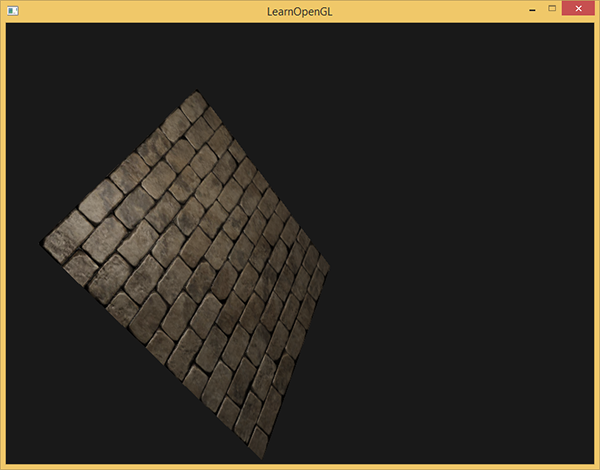

Исходники лежат [здесь](src1.cpp).

## Сложные объекты

Итак, мы разобрались в том, как осуществить normal mapping в касательном пространстве и как для этого самостоятельно вычислить вектора касательной и бикасательной. К счастью, такой ручной расчет не то чтобы часто возникающая задача: по большей части этот код реализуется разработчиками где-то в недрах загрузчика моделей. В нашем случае, это верно для использующегося [загрузчика Assimp](../../part%203/chapter%2012/text.md).

Assimp предоставляет весьма полезный флаг опций при загрузке моделей: *aiProcess_CalcTangentSpace*. При его передаче функции *ReadFile\(\)* библиотека сама займется расчетом сглаженных касательных и бикасательных для каждой из загруженных вершин – процесс похожий на рассмотренный здесь.

```cpp
const aiScene *scene = importer.ReadFile(
    path, aiProcess_Triangulate | aiProcess_FlipUVs | aiProcess_CalcTangentSpace
);  
```

После этого можно прямо получить доступ к рассчитанным касательным:

```cpp
vector.x = mesh->mTangents[i].x;
vector.y = mesh->mTangents[i].y;
vector.z = mesh->mTangents[i].z;
vertex.Tangent = vector;   
```

Также необходимо будет обновить код загрузки, чтобы он учитывал получение карт нормалей для текстурированных моделей. Формат Wavefront Object \(.obj\) экспортирует карты нормалей таким образом, что флаг Assimp *aiTextureType_NORMAL* не обеспечивает корректной загрузки этих карт, в то время как с флагом *aiTextureType_HEIGHT* все работает корректно. Поэтому лично я, обычно, загружаю карты нормалей следующим способом:

```cpp
vector<Texture> normalMaps = loadMaterialTextures(material, aiTextureType_HEIGHT, "texture_normal");   
```

Безусловно, для других форматов описания модели и типов файлов этот подход может не подходить. Также отмечу, что выставление флага *aiProcess_CalcTangentSpace* не всегда срабатывает. Нам известно, что вычисление касательных основывается на текстурных координатах, однако, зачастую авторы моделей применяют различные ухищрения к текстурным координатам, что ломает расчет касательных. Так, нередко применяется зеркальное отражение текстурных координат для симметрично оттекстурированных моделей. Если не учитывать факт зеркальности, то расчет касательных будет неверен. Assimp не делает такого учета. Знакомая нам модель нанокостюма вот не подходит для демонстрации, поскольку также использует зеркалирование.

Но с корректно оттекстурированной моделью, использующей карты нормалей и зеркального отражения, тестовое приложение дает весьма неплохой результат:

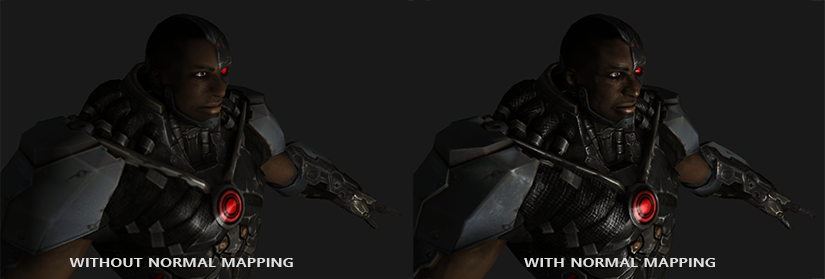

Как видно, применение normal mapping’а дает ощутимый прирост детальности и при этом дешев в плане затрат производительности.

Не стоит забывать, что применение normal mapping’а может позволить повысить производительность для конкретной сцены. Без его использования достижение детальности модели возможно только через увеличение плотности полигональной сетки, меша. Но данная техника позволяет добиться визуально того же уровня детализации для низкополигональных мешей. Ниже можно увидеть сравнение этих двух подходов:

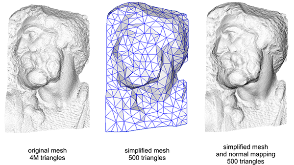

Уровень детализации на высокополигональной модели и на низкополигональной с применением normal mapping’а практически неотличим. Так что эта техника – отличный метод заместить высокополигональные модели в сцене упрощенными практически без потери в визуальном качестве.

## Последнее замечание

Есть еще одна техническая деталь, касающаяся normal mapping’а, которая немного улучшает качество практически без дополнительных расходов.

В тех случаях, когда касательные рассчитываются для больших и сложных мешей, имеющих значительное количество вершин, принадлежащих нескольким треугольникам, касательные вектора, обычно, усредняются, чтобы получить гладкий и визуально приятный результат normal mapping’а. Однако, это создает проблему: после усреднения тройка векторов TBN может потерять взаимную перпендикулярность, что также значит потерю ортогональности для матрицы TBN. В общем случае результат normal mapping’а, полученный на основе неортогональной матрицы, лишь слегка некорректен, но все же мы можем улучшить его.

Для этого достаточно применить простой математический метод: [процесс Грамма-Шмидта](https://ru.wikipedia.org/wiki/%D0%9F%D1%80%D0%BE%D1%86%D0%B5%D1%81%D1%81_%D0%93%D1%80%D0%B0%D0%BC%D0%B0_%E2%80%95_%D0%A8%D0%BC%D0%B8%D0%B4%D1%82%D0%B0) или ре-ортогонализация нашей тройки векторов TBN. В коде вершинного шейдера:

```glsl
vec3 T = normalize(vec3(model * vec4(aTangent, 0.0)));
vec3 N = normalize(vec3(model * vec4(aNormal, 0.0)));
// ре-ортогонализация T относительно N
T = normalize(T - dot(T, N) * N);
// получаем перпендикулярный вектор B через векторное умножение T и N
vec3 B = cross(N, T);

mat3 TBN = mat3(T, B, N)   
```

Эта, пусть и небольшая, поправка улучшает качество normal mapping’а в обмен на мизерные накладные расходы. Если вам интересны детали этой процедуры, то можете посмотреть последнюю часть видеоролика Normal Mapping Mathematics, ссылка на который дана ниже.

## Дополнительные ресурсы

- [Tutorial 26: Normal Mapping](http://ogldev.atspace.co.uk/www/tutorial26/tutorial26.html): Урок по Normal Mapping от ogldev.
- [How Normal Mapping Works](https://www.youtube.com/watch?v=LIOPYmknj5Q): видеоурок, разъясняющий основы Normal Mapping от TheBennyBox.
- [Normal Mapping Mathematics](https://www.youtube.com/watch?v=4FaWLgsctqY): ролик, связанный с предыдущим, объясняющий математику, применяемую в методе Normal Mapping, также от TheBennyBox.
- [Tutorial 13: Normal Mapping](http://www.opengl-tutorial.org/intermediate-tutorials/tutorial-13-normal-mapping/): еще один урок от opengl-tutorial.org.
