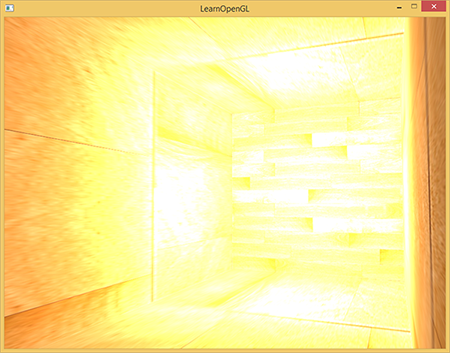
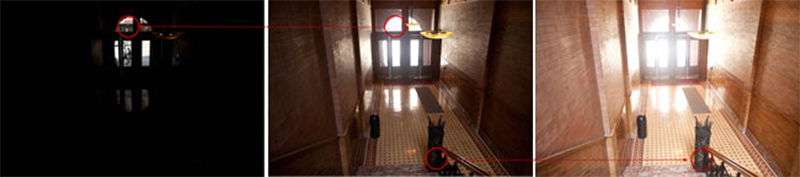
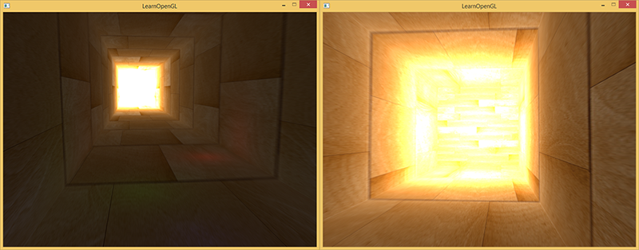
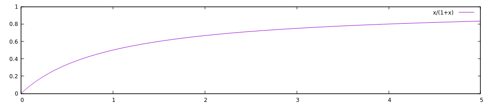
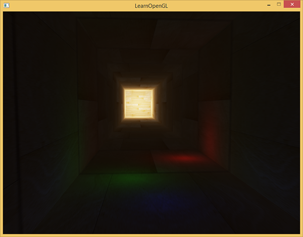
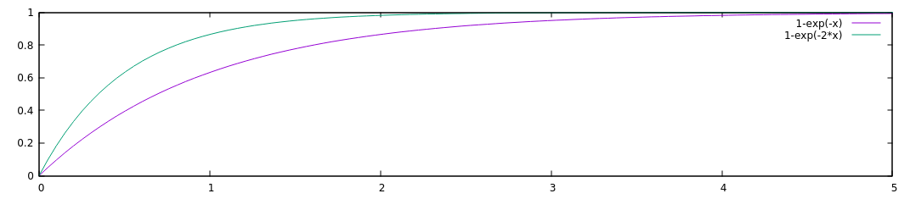
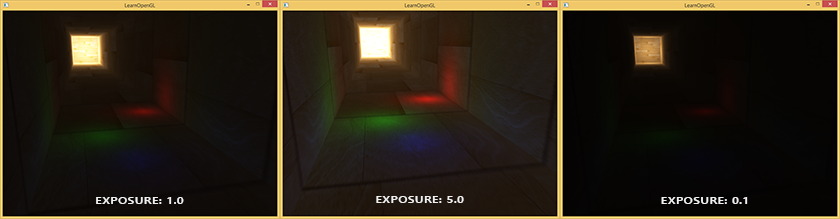

# Learn OpenGL. Урок 5.7 — HDR

При записи во фреймбуфер значения яркости цветов приводятся к интервалу от 0.0 до 1.0. Из-за этой, на первый вгляд безобидной, особенности нам всегда приходится выбирать такие значения для освещения и цветов, чтобы они вписывались в это ограничение. Такой подход работает и даёт достойные результаты, но что случится, если мы встретим особенно яркую область с большим количеством ярких источников света, и суммарная яркость превысит 1.0? В результате все значения, большие чем 1.0, будут приведены к 1.0, что выглядит не очень красиво:



Так как для большого количества фрагментов цветовые значения приведены к 1.0, получаются большие области изображения, залитые одним и тем же белым цветом, теряется значительное количество деталей изображения, и само изображение начинает выглядеть неестественно.

Решением данной проблемы может быть снижение яркости источников света, чтобы на сцене не было фрагментов ярче 1.0: это не лучшее решение, вынуждающее использовать нереалистичные значения освещения. Лучший подход заключается в том, чтобы разрешить значениям яркости временно превышать яркость 1.0 и на финальном шаге изменить цвета так, чтобы яркость вернулась к диапазону от 0.0 до 1.0, но без потери деталей изображения.

Дисплей компьютера способен показывать цвета с яркостью в диапазоне от 0.0 до 1.0, но у нас нет такого ограничения при расчёте освещения. Разрешая цветам фрагмента быть ярче единицы, мы получаем намного более высокий диапазон яркости для работы — HDR \(*high dynamic range*\). С использованием hdr яркие вещи выглядят яркими, тёмные вещи могут быть реально тёмными, и при этом мы будем видеть детали.

Изначально высокий динамический диапазон использовался в фотографии: фотограф делал несколько одинаковых фотографий сцены с различной экспозицией, захватывая цвета почти любой яркости. Комбинация этих фотографий формирует hdr изображение, в котором становится различимым большинство деталей за счёт сведения изображений с разными уронями экспозиции. Например, ниже на левом изображении хорошо видны сильно освещённые фрагменты изображения \(посмотрите на окно\), но эти детали пропадают при использовании высокой экспозиции. Однако, высокая экспозиция делает различимымидетали на тёмных областях изображения, которые до этого не были видны.



Это похоже на то, как работает человеческий глаз. При недостатке света глаз приспосабливается, так что тёмные детали становятся хорошо различимыми, и аналогично для ярких областей. Можно сказать, что человеческий глаз имеет автоматическу настройку экспозиции, зависящую от яркости сцены.

HDR рендеринг работает примерно так же. Мы разрешаем при рендере использовать большой диапазон значений яркости, чтобы собрать информацию и о ярких, и о тёмных деталях сцены, и в конце мы преобразуем значения из диапазона HDR обратно в LDR \(low dynamic range, диапазон от 0 до 1\). Это преобразование называется тональной компрессией \(*tone mapping*\), существует большое количество алгоритмов, нацеленных на сохранение большинства деталей изображения при конвертации в LDR. Эти алгоритмы часто имеют параметр экспозиции, который позволяет лучше показывать яркие или тёмные области изображения.

Использование HDR при рендеринге позволят нам не только превышать LDR диапазон от 0 до 1 и сохранять больше деталей изображения, но также даёт возможность указывать реальную яркость источников света. Например, солнце имеет намного большую яркость света, чем что-нибудь типа фонарика, так почему бы не настроить солнце таким \(например, присвоить ему яркость 10.0\)? Это позволит нам лучше настроить освещение сцены с более реалистичными параметрами яркости, что было бы невозможно при LDR рендеринге и диапазоне яркости от 0 до 1.

Так как дисплей показывают яркость только от 0 до 1, мы вынуждены конвертировать используемый HDR диапазон значений обратно к диапазону монитора. Просто отмасштабировать диапазон не будет хорошим решением, так как на изображении начнут преобладать яркие области. Однако мы можем использовать различные уравнения или кривые для преобразования значений HDR в LDR, что даст нам полный контроль над яркостью сцены. Этот преобразование называется тональной компрессией \(*tone mapping*\) и являетя финальным шагом HDR рендеринга.

## Фреймбуферы с плавающей точкой

Для реализации HDR рендеринга нам нужен способ, чтобы предотвратить приведение значений к диапазону от 0 до 1 результатов работы фрагментного шейдера. Если фреймбуфер использует нормализованный формат с фиксированной точкой \(GL_RGB\) для буферов цвета, то OpenGL автоматически ограничнивает значения перед сохранением во фреймбуфер. Это ограничние применяется для большинства форматов фреймбуфера, кроме форматов с плавающей точкой.

Чтобы хранить значения, выходящие из диапазана \[0.0..1.0\], мы можем использовать буфер цвета со следующими форматами: *GL_RGB16F*, *GL_RGBA16F*, *GL_RGB32F* или *GL_RGBA32F*. Это прекрасно подходит для hdr рендеринга. Такой буфер будем называть floating point фреймбуффером.

Создание floating point буфера отличается от обычного буфера только тем, что в нём используется другой внутренний формат:

```cpp
glBindTexture(GL_TEXTURE_2D, colorBuffer);
glTexImage2D(GL_TEXTURE_2D, 0, GL_RGBA16F, SCR_WIDTH, SCR_HEIGHT, 0, GL_RGBA, GL_FLOAT, NULL);
```

Фреймбуфер OpenGL по умолчанию использует только 8 бит для хранения каждого цвета. В floating point фреймбуфере с форматами *GL_RGB32F* или *GL_RGBA32F* для хранения каждого цвета используется 32 бита — в 4 раза больше. Если не требуется очень высокая точность, то вполне достаточным будет формат *GL_RGBA16F*.

Если к фреймбуферу присоединён floating point буфер для цвета, мы можем рендерить сцену в него с учётом того, что значения цвета не будут ограничены диапазоном от 0 до 1. В коде к данной статье мы сначала рендерим сцену в floating point фреймбуфер и после этого выводим содержимое буфера цвета на полкоэкранный прямоугольник. Это выглядит примерно так:

```cpp
glBindFramebuffer(GL_FRAMEBUFFER, hdrFBO);
    glClear(GL_COLOR_BUFFER_BIT | GL_DEPTH_BUFFER_BIT);
    // [...] рисуем сцену в hdr
glBindFramebuffer(GL_FRAMEBUFFER, 0);

// рендерим hdr буфер цвета как 2д прямоугольник с другим шейдером
hdrShader.use();
glActiveTexture(GL_TEXTURE0);
glBindTexture(GL_TEXTURE_2D, hdrColorBufferTexture);
RenderQuad();
```

Здесь значения цвета, содержащиеся в буфере цвета, могут быть больше 1. Для этой статьи была создана сцена с большим вытянутым кубом, выглядящим как туннель с четырьмя точечными источниками света, один из них расположен в конце туннеля и обладает огромной яркостью.

```cpp
std::vector<glm::vec3> lightColors;
lightColors.push_back(glm::vec3(200.0f, 200.0f, 200.0f));
lightColors.push_back(glm::vec3(0.1f, 0.0f, 0.0f));
lightColors.push_back(glm::vec3(0.0f, 0.0f, 0.2f));
lightColors.push_back(glm::vec3(0.0f, 0.1f, 0.0f));
```

Рендеринг в floating point буфер точно такой же, как если бы мы рендерили сцену в обычный фреймбуфер. Новым является только фрагментный hdr шейдер, который занимается простой закраской полноэкранного прямоугольника значениями из текстуры, являющейся буфером цвета с плавающей точкой. Для начала напишем простой шейдер, передающий входные данные без изменений:

```glsl
#version 330 core
out vec4 FragColor;

in vec2 TexCoords;

uniform sampler2D hdrBuffer;

void main()
{
    vec3 hdrColor = texture(hdrBuffer, TexCoords).rgb;
    FragColor = vec4(hdrColor, 1.0);
}
```

Мы берём входные данные из floating point буфера цвета и используем их в качестве выходных значений шейдера. Однако, так как 2д прямоугольник рендерится в фреймбуфер по-умолчанию, выходные значения шейдера будут ограничены интервалом от 0 до 1, не смотря на то, что в некоторых местах значения больше 1.



Становится очевидным, что слишком большие значения цвета в конце туннеля ограничены единицей, так как значительная часть изображения полностью белая, и мы теряем детали изображения, которые ярче единицы. Так как мы используем HDR значения напрямую в качестве LDR, это эквивалентно отсутствию HDR. Чтобы исправить это, мы должны отобразить различные значения цветов обратно в диапазон от 0 до 1 без потери каких-либо деталей изображения. Для этого применим тональную компрессию.

## Тональная компрессия

Тональная компрессия — преобразование значений цвета, чтобы уместить их в диапазоне от 0 до 1 без потери деталей изображения, часто в сочетании с приданием изображению желаемого баланса белого.

Самый простой алгоритм тональной компрессии известен как алгоритм Рейнхарда \(*Reinhard tone mapping*\). Он отображает любые HDR значения в LDR диапазаон. Добавим этот алгоритм в предыдущий фрагментный шейдер, а так же применим гамма-коррекцию \(и использование SRGB текстур\).

```glsl
void main()
{
    const float gamma = 2.2;
    vec3 hdrColor = texture(hdrBuffer, TexCoords).rgb;

    // тональная компрессия
    vec3 mapped = hdrColor / (hdrColor + vec3(1.0));
    // гамма-коррекция
    mapped = pow(mapped, vec3(1.0 / gamma));

    FragColor = vec4(mapped, 1.0);
}
```

> Прим. пер. — при малых значениях х функция x/\(1+x\) ведёт себя примерно как х, при больших х — стремится к единице. График функции: 
> 
> 

С тональной компрессией Рейнхарда мы больше не теряем деталей в ярких областях изображения. Алгоритм отдаёт предпочтение ярким областям, делая тёмные области менее отчётливыми.



Здесь вы снова можете видеть такие детали в конце изображения, как текстура дерева. С этим относительно простым алгоритмом мы хорошо видим любые цвета из HDR диапазона и можем контролировать освещение сцены без потери деталей изображения.

> Стоит отметить, что мы можем использовать тональную компрессию напрямую в конце нашего шейдера для рассчёта освещения, и тогда нам вообще не понадобится floating point фреймбуфер. Однако, на более сложных сценах вы часто будете встречаться с необходимостью хранить промежуточные HDR значения в floating point буферах, так что это вам пригодится.

Ещё одной интересной возможностью тоновой компрессии является использование параметра экспозиции. Возможно, вы помните, что на изображениях в начале статьи различные детали были видны при разных значениях экспозиции. Если мы имеем сцену, на которой сменяются день и ночь, имеет смысл использовать низкую экспозицию днём и высокую ночью, что схоже с адаптацией человеческого глаза. С таким параметром экспозиции мы сможем настраивать параметры освещения, которые будут работать и днём и ночью при разных условиях освещения.

Относительно простой алгоритм тональной компрессии с экспозицией выглядит так:

```glsl
uniform float exposure;

void main()
{
    const float gamma = 2.2;
    vec3 hdrColor = texture(hdrBuffer, TexCoords).rgb;

    // тональная компрессия с экспозицией
    vec3 mapped = vec3(1.0) - exp(-hdrColor * exposure);
    // гамма-коррекция
    mapped = pow(mapped, vec3(1.0 / gamma));

    FragColor = vec4(mapped, 1.0);
}
```

> Прим. пер: добавлю график и для этой функции c экспозицией 1 и 2:
> 
> 

Здесь мы определили переменную для экспозиции, которая по умолчанию равна 1 и позволяет нам более точно выбрать баланс между качеством отображения тёмных и ярких областей изображения. Например, с большой экспозицией мы видим значительно больше подробностей на тёмных областях изображения. И наоборот, малая экспозиция делает неразличимыми тёмные области, но позволяет лучше увидеть яркие области изображения. Ниже приведены изображения туннеля с различными уровнями экспозиции.



Эти изображения явно показывают преимущества hdr рендеринга. При изменении уровня экспозиции мы видим больше деталей сцены, которые были бы потеряны при обычном рендеринге. Возьмите для примера конец туннеля — с нормальной экспозицией текстура дерева едва видна, но при низкой экспозиции текстуру превосходно видно. Аналогично, при высокой экспозиции очень хорошо видны детали в тёмных областях.

Исходный код для демо [здесь](src1.cpp).

## Больше HDR

Те два алгоритма тоновой компрессии, которые были показаны, являются лишь малой частью среди большого количества более продвинутых алгоритмов, каждый из которых имеет свои сильные и слабые стороны. Некоторые алгоритмы лучше подчёркивают определённые цвета/яркости, некоторые алгоритмы показывают одновременно тёмные и яркие области, выдавая более красочные и детализированные изображения. Так же существует множество способов, известных как автоматичесий выбор экспозиции \(*automatic exposure adjustment*\) или адаптация глаз \(*eye adaptation*\). В них определяется яркость сцены на предыдущем кадре и \(медленно\) изменяется параметр экспозиции, так что тёмная сцена потихоньку становится ярче, а яркая — темнее: схоже с привыканием человеческого глаза.

Реальные преимущества HDR становятся лучше всего видны на больших и сложных сценах с серьёзными алгоритмами освещения. В целях обучения в данной статье использовалась максимально простая сцена, так как создание большой сцены может быть сложным. Несмотря на простоту сцены, на ней видны некоторые преимущества hdr рендеринга: в тёмных и светлых областях изображения не теряются детали, так как они сохраняются при помощи тоновой компрессии, добавление множественных источников света не приводит к появлению белых областей, и значения не обязаны умещаться в LDR диапазон.

Более того, HDR рендеринг также делает некоторые интересные эффекты более правдоподобными и реалистичными. Одним из таких эффектов является блум \(bloom\), который мы обсудим в следующей статье.

## Дополнительные ресурсы:

- Вопрос на stackexchange с отличным длинным ответом, в котором описаны некоторые преимущества HDR рендеринга: [Does HDR rendering have any benefits if bloom won't be applied?](http://gamedev.stackexchange.com/questions/62836/does-hdr-rendering-have-any-benefits-if-bloom-wont-be-applied)
- Ещё один интересный ответ с хорошими изображениями в качестве примеров тональной компрессии. [What is tone mapping? How does it relate to HDR?](http://photo.stackexchange.com/questions/7630/what-is-tone-mapping-how-does-it-relate-to-hdr)
