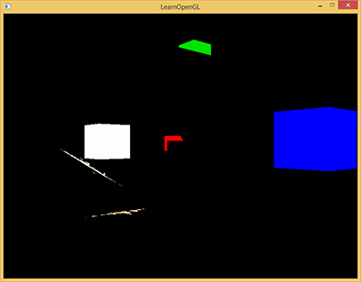

# Learn OpenGL. Урок 5.8 – Bloom

## Bloom

В связи с ограниченным диапазоном яркости, доступным обычным мониторам, задача убедительного отображения ярких источников света и ярко освещенных поверхностей является сложной по определению. Одним из распространенных методов, позволяющих подчеркнуть яркие области на мониторе, является техника, добавляющая ореол свечения вокруг ярких объектов, создающая впечатление "растекания" света за пределы источника света. В итоге у наблюдателя создается впечатление о высокой яркости таких освещенных участков или источников света.

Описанный эффект ореола и выхода света за пределы источника достигается техникой пост-обработки, именуемой *блумом* \(*bloom*\). Применение эффекта добавляет всем ярким участкам отображаемой сцены характерный ореол свечения, что можно увидеть на примере ниже:


Блум добавляет в изображение хорошо различимую визуальную подсказку об значительной яркости объектов, охваченных ореолом от примененного эффекта. Будучи примененным избирательно и в выверенном объеме \(с чем многие игры, увы, не справляются\), эффект позволяет значительно улучшить визуальную выразительность примененного в сцене освещения, а также добавить драматичности в определенных ситуациях.

Данная техника работает в связке с [HDR](../../part%205/chapter%207/text.md)-рендерингом практически как само-собой разумеющееся дополнение. Видимо, из-за этого многие люди ошибочно смешивают эти два термина до полной взаимозаменяемости. Однако, техники эти совершенно независимы и используются для разных целей. Вполне возможно реализовать блум, используя буфер кадра по умолчанию с глубиной цвета 8бит, ровно как и применить HDR-рендеринг не прибегая к использованию блума. Дело только в том, что HDR-рендер позволяет реализовать эффект более эффективным образом \(далее мы в этом убедимся\).

Для реализации блума сначала обычным образом рендерится освещенная сцена. Далее извлекаются HDR буфера цвета и буфер цвета, содержащий только яркие участки сцены. Это извлеченное изображение ярких участков затем размывается и накладывается поверх исходного HDR изображения сцены.

Чтобы было яснее разберем процесс по шагам. Рендерим сцену, содержащую 4 ярких источника света, отображенных как цветные кубики. Все они имеют величину яркости в интервале от 1.5 до 15.0. Если осуществить вывод в HDR буфер цвета, то результат выглядит следующим образом:


Из этого HDR буфера цвета мы извлекаем все фрагменты, яркость которых превышает заданный предел. Получается образ, содержащий лишь ярко освещенные участки:



Далее это изображение ярких участков размывается. Выраженность эффекта по сути определяется силой и радиусом примененного фильтра размытия:


Полученное размытое изображение ярких участков и есть основа итогового эффекта ореолов вокруг ярких объектов. Данная текстура просто смешивается с исходным HDR образом сцены. Поскольку яркие области были размыты, их размеры увеличились, что в итоге дает визуальный эффект светимости, выходящей за границы источников света:


Как видно, блум – не самая изощренная техника, однако достичь высокого визуального её качества и достоверности не всегда просто. По большей части эффект зависит от качества и типа примененного фильтра размытия. Даже небольшие изменения в параметрах фильтра могут разительно изменить итоговое качество техники.

Итак, вышеописанные действия дают нам пошаговый алгоритм эффекта пост-обработки для блум-эффекта. Изображение ниже кратко подытоживает необходимые действия:


Первым делом нам потребуется информация о ярких участках сцены на основе заданного порогового значения. Этим и займемся.

## Извлечение ярких участков

Итак, для начала нам потребуется получить два изображения на основе нашей сцены. Можно было бы наивно выполнить рендер дважды, но используем более продвинутый метод множественных целей рендера \(*Multiple Render Targets, MRT*\): мы задаем в завершающем фрагментном шейдере более одного выхода и благодаря этому извлечение двух изображений можно выполнить в один проход! Чтобы указать в какой буфер цвета будет осуществлен вывод шейдера используется спецификатор layout:

```glsl
layout (location = 0) out vec4 FragColor;
layout (location = 1) out vec4 BrightColor;  
```

Безусловно, метод будет работать только если мы подготовили несколько буферов для записи. Иными словами, для осуществления множественного вывода из фрагментного шейдера использующийся в этот момент кадровый буфер должен содержать достаточное количество подключенных буферов цвета. Если обратиться к уроку о [кадровом буфере](../../part%204/chapter%205/text.md), то вспоминается, что при привязке текстуры как буфера цвета мы могли указать номер *прикрепления цвета* \(*color attachment*\). До сего момента нам не было нужды использовать прикрепление отличное от *GL_COLOR_ATTACHMENT0*, но в этот раз пригодится и *GL_COLOR_ATTACHMENT1* – ведь нам нужны сразу две цели для записи:

```cpp
// настройка кадрового буфера с плавающей точкой
unsigned int hdrFBO;
glGenFramebuffers(1, &hdrFBO);
glBindFramebuffer(GL_FRAMEBUFFER, hdrFBO);
unsigned int colorBuffers[2];
glGenTextures(2, colorBuffers);
for (unsigned int i = 0; i < 2; i++)
{
    glBindTexture(GL_TEXTURE_2D, colorBuffers[i]);
    glTexImage2D(
        GL_TEXTURE_2D, 0, GL_RGB16F, SCR_WIDTH, SCR_HEIGHT, 0, GL_RGB, GL_FLOAT, NULL
    );
    glTexParameteri(GL_TEXTURE_2D, GL_TEXTURE_MIN_FILTER, GL_LINEAR);
    glTexParameteri(GL_TEXTURE_2D, GL_TEXTURE_MAG_FILTER, GL_LINEAR);
    glTexParameteri(GL_TEXTURE_2D, GL_TEXTURE_WRAP_S, GL_CLAMP_TO_EDGE);
    glTexParameteri(GL_TEXTURE_2D, GL_TEXTURE_WRAP_T, GL_CLAMP_TO_EDGE);
    // присоединение текстуры к фреймбуферу
    glFramebufferTexture2D(
        GL_FRAMEBUFFER, GL_COLOR_ATTACHMENT0 + i, GL_TEXTURE_2D, colorBuffers[i], 0
    );
}  
```

Также, посредством вызова *glDrawBuffers*, потребуется явно указать OpenGL, что мы собираемся совершать вывод в несколько буферов. В противном случае библиотека все равно будет осуществлять вывод только в первое прикрепление, игнорируя операции записи в другие прикрепления. Как аргумент функции передается массив идентификаторов используемых прикреплений из соответствующего перечисления:

```cpp
unsigned int attachments[2] = { GL_COLOR_ATTACHMENT0, GL_COLOR_ATTACHMENT1 };
glDrawBuffers(2, attachments);  
```

Для данного кадрового буфера любой фрагментный шейдер, указавший для своих выходов спецификатор *location*, будет осуществлять запись в соответствующий буфер цвета. И это отличные новости, ведь так мы избегаем лишнего прохода отрисовки для извлечения данных о ярких участках сцены – можно сделать все за один раз в единственном шейдере:

```glsl
#version 330 core
layout (location = 0) out vec4 FragColor;
layout (location = 1) out vec4 BrightColor;

[...]

void main()
{            
    [...] // сначала делаем обычные расчеты освещения
    FragColor = vec4(lighting, 1.0);
    // проверка фрагмента на превышение по яркости заданного порога
    // если ярче - вывести в отдельный буфер, хранящий яркие участки
    float brightness = dot(FragColor.rgb, vec3(0.2126, 0.7152, 0.0722));
    if(brightness > 1.0)
        BrightColor = vec4(FragColor.rgb, 1.0);
    else
        BrightColor = vec4(0.0, 0.0, 0.0, 1.0);
}
```

В данном фрагменте опущена часть, содержащая типичный код расчета освещения. Результат его записывается в первый выход шейдера – переменную *FragColo*r. Далее результирующий цвет фрагмента используется для вычисления величины яркости. Для этого осуществляется взвешенный перевод в градации серого \(путем скалярного умножения мы перемножаем соответствующие компоненты векторов и складываем их вместе, приводя к единственной величине\). Затем, при превышении яркости фрагмента некого порога, мы записываем его цвет во второй выход шейдера. Для кубиков, замещающих источники света также выполняется этот шейдер.

Разобравшись с алгоритмом мы можем понять, почему данная техника так хорошо сочетается с HDR рендерингом. Рендеринг в HDR формате позволяет компонентам цвета выходить за верхнюю границу величиной в 1.0, что позволяет более гибко настраивать порог яркости за пределами стандартного интервала \[0.0, 1.0\], обеспечивая возможностью тонко настроить какие участки сцены считать яркими. Без использования HDR придется довольствоваться порогом яркости в интервале \[0.0, 1.0\], что вполне допустимо, но приводит к более "резкой" отсечке по яркости, что зачастую делает блум слишком навязчивым и кричащим \(представьте себя на снежном поле высоко в горах\).

После исполнения шейдера два целевых буфера будут содержать нормальное изображение сцены, а также образ, содержащий только яркие участки.


Изображение ярких участков теперь следует обработать с помощью размытия. Можно выполнить это простым прямоугольным \(*box*\) фильтром, что был использован в секции постпроцессинга урока по [кадровому буферу](../../part%204/chapter%205/text.md). Но гораздо более качественный результат дает *фильтрация Гаусса*.

## Размытие по Гауссу

Урок постпроцессинга дал нам представление о размытии с использованием простого усреднения цвета соседствующих фрагментов изображения. Такой метод размытия прост, но результирующее изображение может выглядеть и привлекательней. Размытие по Гауссу основывается на одноименной кривой распределения, имеющей форму колокола: высокие значения функции располагаются ближе к центру кривой и спадают в обе стороны от него. Математически кривая Гаусса может быть выражена с разными параметрами, но общий вид кривой остается следующим:


Размытие с весовыми коэффициентами, основанными на значениях кривой Гаусса, выглядит гораздо лучше прямоугольного фильтра: за счет того, что кривая имеет бОльшую площадь в окрестности своего центра, что соответствует бОльшим весовым коэффициентам для фрагментов вблизи центра ядра фильтра. Взяв, для примера, ядро 32х32 мы будем использовать весовые коэффициенты тем меньше, чем дальше фрагмент отстоит от центрального. Именно эта характеристика фильтра и дает визуально более удовлетворяющий результат размытия по Гауссу.

Реализация фильтра потребует двумерного массива весовых коэффициентов, который можно было бы заполнить на основе двумерного же выражения, описывающего кривую Гаусса. Однако, мы тут же столкнемся с проблемой производительности: даже относительно небольшое ядро размытия в 32х32 фрагмента потребует 1024 выборок из текстуры для каждого фрагмента обрабатываемого изображения!

На наше счастье выражение Гауссовой кривой обладает весьма удобной математической характеристикой – сепарабельностью, которая позволит сделать из одного двумерного выражения два одномерных, описывающих горизонтальную и вертикальную составляющие. Это позволить выполнить размытие по очереди в два подхода: по горизонтали, а затем по вертикали с наборами весовых коэффициентов, соответствующими каждому из направлений. Результирующее изображение будет таким же, что и при обработке двумерным алгоритмом, но при этом потребует куда меньше вычислительной мощности видеопроцессора: вместо 1024 выборок из текстуры нам понадобятся всего лишь 32 + 32 = 64! В этом и заключается суть двупроходной фильтрации по Гауссу.


Для нас все это означает одно: размытие одного изображения придется сделать дважды и здесь как нельзя кстати придется использование объектов кадрового буфера. Применим так называемую технику пинг-понга: имеется пара объектов кадрового буфера и содержимое буфера цвета одного фреймбуфера рендерится с некоторой обработкой в буфер цвета текущего фреймбуфера, затем фреймбуфер-источник и фреймбуфер-приемник меняются местами и данный процесс повторяется заданное число раз. По сути просто переключается текущий кадровый буфер для вывода изображения и с ним – текущая текстура из которой осуществляется выборка для отрисовки. Подход позволяет размыть исходное изображение, поместив его в первый буфер кадра, затем размыть содержимое первого буфера кадра, поместив его во второй, затем размыть второй, поместив в первый и так далее.

Прежде чем перейти к коду настройки буферов кадра, давайте взглянем на код шейдера гауссова размытия:

```glsl
#version 330 core
out vec4 FragColor;
  
in vec2 TexCoords;

uniform sampler2D image;
  
uniform bool horizontal;
uniform float weight[5] = float[] (0.227027, 0.1945946, 0.1216216, 0.054054, 0.016216);

void main()
{             
    // получаем размер одного текселя
    vec2 tex_offset = 1.0 / textureSize(image, 0); 
    // вклад текущего фрагмента
    vec3 result = texture(image, TexCoords).rgb * weight[0]; 
    if(horizontal)
    {
        for(int i = 1; i < 5; ++i)
        {
            result += texture(image, TexCoords + vec2(tex_offset.x * i, 0.0)).rgb * weight[i];
            result += texture(image, TexCoords - vec2(tex_offset.x * i, 0.0)).rgb * weight[i];
        }
    }
    else
    {
        for(int i = 1; i < 5; ++i)
        {
            result += texture(image, TexCoords + vec2(0.0, tex_offset.y * i)).rgb * weight[i];
            result += texture(image, TexCoords - vec2(0.0, tex_offset.y * i)).rgb * weight[i];
        }
    }
    FragColor = vec4(result, 1.0);
}
```

Как видно, мы используем довольно небольшую выборку коэффициентов гауссовой кривой, которые используются как веса для выборок по горизонтали или вертикали относительно текущего фрагмента. Код имеет две основные ветки, разделяющие алгоритм на вертикальный и горизонтальный проход на основе значения юниформа *horizontal*. Смещение для каждой выборки задано равным размеру текселя, который определен как величина обратная размеру текстуры \(значение типа *vec2*, возвращённое функцией *textureSize\(\)*\).

Создадим два буфера кадра, содержащие по одному буферу цвета на основе текстуры:

```cpp
unsigned int pingpongFBO[2];
unsigned int pingpongBuffer[2];
glGenFramebuffers(2, pingpongFBO);
glGenTextures(2, pingpongBuffer);
for (unsigned int i = 0; i < 2; i++)
{
    glBindFramebuffer(GL_FRAMEBUFFER, pingpongFBO[i]);
    glBindTexture(GL_TEXTURE_2D, pingpongBuffer[i]);
    glTexImage2D(
        GL_TEXTURE_2D, 0, GL_RGB16F, SCR_WIDTH, SCR_HEIGHT, 0, GL_RGB, GL_FLOAT, NULL
    );
    glTexParameteri(GL_TEXTURE_2D, GL_TEXTURE_MIN_FILTER, GL_LINEAR);
    glTexParameteri(GL_TEXTURE_2D, GL_TEXTURE_MAG_FILTER, GL_LINEAR);
    glTexParameteri(GL_TEXTURE_2D, GL_TEXTURE_WRAP_S, GL_CLAMP_TO_EDGE);
    glTexParameteri(GL_TEXTURE_2D, GL_TEXTURE_WRAP_T, GL_CLAMP_TO_EDGE);
    glFramebufferTexture2D(
        GL_FRAMEBUFFER, GL_COLOR_ATTACHMENT0, GL_TEXTURE_2D, pingpongBuffer[i], 0
    );
}
```

После того, как мы получим HDR текстуру сцены и извлечем текстуру ярких областей, мы заполняем буфер цвета одного из пары подготовленных фреймбуферов текстурой яркости и запускаем процесс пинг-понга десять раз \(пять раз по вертикали, пять по горизонтали\):

```cpp
bool horizontal = true, first_iteration = true;
int amount = 10;
shaderBlur.use();
for (unsigned int i = 0; i < amount; i++)
{
    glBindFramebuffer(GL_FRAMEBUFFER, pingpongFBO[horizontal]); 
    shaderBlur.setInt("horizontal", horizontal);
    glBindTexture(
        GL_TEXTURE_2D, first_iteration ? colorBuffers[1] : pingpongBuffers[!horizontal]
    ); 
    RenderQuad();
    horizontal = !horizontal;
    if (first_iteration)
        first_iteration = false;
}
glBindFramebuffer(GL_FRAMEBUFFER, 0); 
```

На каждой итерации мы выбираем и привязываем один из буферов кадра на основе того, будет ли эта итерация совершать размытие по горизонтали или вертикали, а буфер цвета другого фреймбуфера тогда используется как входная текстура для шейдера размытия. На первый итерации нам приходится явно использовать образ, содержащий яркие области \(*brightnessTexture*\) – иначе оба пинг-понг фреймбуфера так и останутся пустыми. После десяти проходов исходное изображение приобретает вид пятикратно размытого полным фильтром Гаусса. Использованный подход позволяет нам легко менять степень размытия: чем больше пинг-понг итераций – тем сильнее размытие.

В нашем случае итог размытия выглядит как-то так:


Для завершения эффекта остается только скомбинировать размытое изображение с исходным HDR образом сцены.

## Смешение текстур

Имея под рукой HDR текстуру отрендереной сцены и размытую текстуру пересвеченных участков все что нужно для реализации знаменитого блум- эффекта или свечения – объединить эти два изображения. Итоговый фрагментный шейдер \(весьма похож на присутствовавший в уроке о формате [HDR](../../part%205/chapter%207/text.md)\) именно это и делает – аддитивно смешивает две текстуры:

```glsl
#version 330 core
out vec4 FragColor;
  
in vec2 TexCoords;

uniform sampler2D scene;
uniform sampler2D bloomBlur;
uniform float exposure;

void main()
{             
    const float gamma = 2.2;
    vec3 hdrColor = texture(scene, TexCoords).rgb;      
    vec3 bloomColor = texture(bloomBlur, TexCoords).rgb;
    hdrColor += bloomColor; // additive blending
    // тональная компрессия
    vec3 result = vec3(1.0) - exp(-hdrColor * exposure);
    // также не забудем о гамма-коррекции
    result = pow(result, vec3(1.0 / gamma));
    FragColor = vec4(result, 1.0);
}
```

На что обратить внимание: смешение осуществляется до применения тональной компрессии \(*tone mapping*\). Это позволит корректно перевести дополнительную яркость от эффекта в LDR \(*Low Dynamic Range*\) диапазон, сохранив относительное распределение яркости в сцене.

Итог обработки – все яркие участки получили заметный эффект свечения:


Кубики, замещающие источники света, теперь выглядят гораздо более яркими и лучше передают впечатление об источнике света. Данная сцена довольно примитивна, потому реализация эффекта особых восторгов не вызовет, но в сложных сценах с продуманным освещением качественно реализованный блум может оказаться решающим визуальным элементом, добавляющим драматичности.

Исходный код примера – [здесь](src1.cpp).

Отмечу, что в уроке использовался довольно простой фильтр с всего пятью выборками в каждом направлении. Делая больше выборок в большем радиусе или проводя несколько итераций работы фильтра, можно визуально улучшить эффект. Также, стоит сказать, что визуально качество всего эффекта напрямую зависит от качества использованного алгоритма размытия. Улучшив фильтр можно добиться значительного улучшения и всего эффекта. Например, более впечатляющие результаты показывает сочетание нескольких фильтров с разными размерами ядра или разными кривыми Гаусса. Ниже представлены дополнительные ресурсы от Kalogirou и EpicGames, затрагивающие вопросы повышения качества блума за счет модификации размытия по Гауссу.

## Дополнительные ресурсы

- [Efficient Gaussian Blur with linear sampling](http://rastergrid.com/blog/2010/09/efficient-gaussian-blur-with-linear-sampling/): качественное описание работы фильтра Гаусса вкупе с исследованием улучшения производительности метода за счет использования билинейной фильтрации текстурных выборок OpenGL.
- [Bloom Post Process Effect](https://udk-legacy.unrealengine.com/udk/Three/Bloom.html): статья от EpicGames, касающаяся повышения качества эффекта за счет сочетания нескольких кривых Гаусса.
- [How to do good bloom for HDR rendering](http://kalogirou.net/2006/05/20/how-to-do-good-bloom-for-hdr-rendering/): Статья от Kalogirou, описывающая улучшение блума за счет модификации исходного алгоритма фильтра Гаусса.
