# Learn OpenGL. Урок 6.1. PBR или Физически-корректный рендеринг. Теория

## Физически-корректный рендеринг

PBR, или физически-корректный рендеринг \(physically-based rendering\) это набор техник визуализации, в основе которых лежит теория, довольно хорошо согласующаяся с реальной теорией распространения света. Поскольку целью PBR является физически достоверная имитация света, он выглядит гораздо более реалистичным по сравнению с использованными нами ранее моделями освещения Фонга и Блинна-Фонга. Он не только лучше выглядит, но и дает неплохое приближение к реальной физике, что позволяет нам \(и в частности художникам\) создавать материалы, основанные на физических свойствах поверхностей, не прибегая к дешевым трюкам дабы заставить освещение выглядеть реалистично. Главным преимуществом такого подхода является то, что создаваемые нами материалы будут выглядеть как задумано независимо от условий освещения, чего нельзя сказать о других, не PBR подходах.

Тем не менее, PBR все еще остается приближением реальности \(базирующемся на законах физики\), поэтому он называется физически-корректным рендерингом, а не физическим рендерингом. Чтобы модель освещения могла называться физически-корректной она должна удовлетворять 3-м условиям \(не волнуйтесь, мы скоро до них доберемся\):

- Основываться на модели отражающих микрограней
- Подчиняться закону сохранения энергии
- Использовать двулучевую функцию отражательной способности \(англ. Bidirectional reflectance distribution function — BRDF\)

В данной серии туториалов мы сосредоточимся на подходе PBR, первоначально разработанном в Disney и адаптированным для реал-тайм визуализации компанией Epic Games. Их подход, базирующийся на *металл-диэлектрическом рабочем процессе* \(англ. metallic workflow, перевода лучше не нашел — прим. ред.\), неплохо документирован, широко принят во многих популярных движках и выглядит потрясающе. В конце этого раздела мы получим нечто похожее на это:

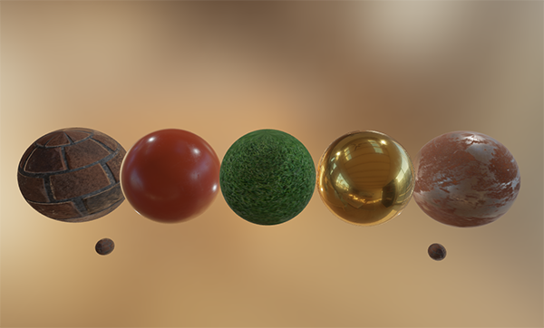

Имейте ввиду, что статьи в данном разделе довольно продвинуты, поэтому рекомендуется иметь хорошее представление об OpenGL и шейдерном освещении. Вот некоторые знания, которые вам понадобятся для изучения данного раздела: [буфер кадра](../../part%204/chapter%205/text.md), [кубические карты](../../part%204/chapter%206/text.md), [гамма-коррекция](../../part%205/chapter%202/text.md), [HDR](../../part%205/chapter%207/text.md) и [карты нормалей](../../part%205/chapter%205/text.md). Также мы немного углубимся в математику, но я обещаю сделать все возможное чтобы объяснить все как можно понятнее.

### Модель отражающих микрограней

Все PBR-техники основываются на теории микрограней. Эта теория гласит что каждая поверхность при сильном увеличении может быть представлена как набор микроскопических зеркал, называемых микрогранями. Ввиду шероховатости поверхности эти микро-зеркала могут быть ориентированы в разных направлениях:


Чем более шероховата поверхность, тем более хаотично ориентированы ее микрограни. Результатом такого расположения этих маленьких зеркал является то \(в частности когда речь заходит о зеркальных бликах и отражениях\), что падающие лучи света рассеиваются в разных направлениях на шероховатых поверхностях, что приводит к более широкому зеркальному блику. И наоборот: на гладких поверхностях падающие лучи вероятнее отразятся в одном направлении, что даст меньший и более резкий блик:


На микроскопическом уровне не бывает абсолютно гладких поверхностей, но учитывая то что микрограни достаточно малы и мы не можем провести различие между ними в рамках нашего пиксельного пространства, мы статистически аппроксимируем шероховатость поверхности вводя коэффициент **шероховатости**. С помощью этого коэффициента мы можем посчитать долю микрограней, ориентированных в направлении некоторого вектора h. Этот вектор h ничто иное как медианный вектор, лежащий посередине между направлением падающего света l и направлением наблюдателя v. Мы говорили о нем ранее, в уроке посвященном [продвинутому освещению](../../part%205/chapter%201/text.md), где определили его как отношение суммы векторов l и v к длине полученного вектора:

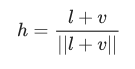

Чем больше микрограней ориентировано в направлении медианного вектора, тем более резким и ярким будет зеркальный блик. Благодаря коэффициенту шероховатости, который лежит в пределах между 0 и 1, мы можем статистически аппроксимировать ориентацию микрограней:

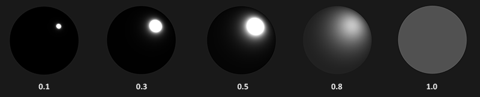

Как видно, более высокое значение коэффициента шероховатости дает пятно зеркального блика большего размера, по сравнению с небольшим и резким пятном на гладких поверхностях.

### Сохранение энергии.

Использование приближения с учетом микрограней уже несет в себе некую форму сохранения энергии: энергия отраженного света никогда не превысит энергии падающего \(если поверхность не светится сама по себе\). Глядя на изображение выше мы видим, что с увеличением шероховатости поверхности пятно отраженного света увеличивается, но в то же время его яркость снижается. Если бы интенсивность отраженного света была одинаковой для всех пикселей независимо от размера пятна, то более шероховатые поверхности излучали бы гораздо больше энергии, что нарушило бы закон сохранения энергии. Поэтому зеркальные отражения более яркие на гладких поверхностях и тусклые на шероховатых.

Для того чтобы энергия сохранялась мы должны провести четкое разделение между диффузной и зеркальной компонентами. В тот момент когда луч света достигает поверхности, он разделяется на *отраженную* и *преломленную* составляющие. Отраженная составляющая — это свет, отраженный напрямую, и не проникающий внутрь поверхности, мы знаем его как зеркальную компоненту света. Преломленная составляющая представляет собой свет, который проникает внутрь поверхности и поглощается ей — он известен нам как диффузная компонента света.

Но есть некоторые нюансы связанные с поглощением света — оно не происходит мгновенно, как только свет касается поверхности. Из курса физики мы знаем, что свет может быть описан как пучок фотонов, обладающих энергией, который движется прямолинейно пока не потеряет всю энергию в результате столкновения с препятствиями. Каждый материал состоит из микрочастиц, которые могут взаимодействовать с лучом света, как показано на рисунке ниже. Эти частицы поглощают часть или всю энергии света при каждом столкновении, преобразуя ее в тепло.

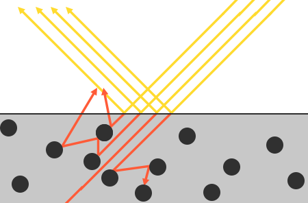

В общем случае поглощается не вся энергия, и свет продолжает рассеиваться в \(преимущественно\) случайных направлениях, где опять сталкивается с другими частицами до тех пор его пока энергия не иссякнет, или он снова не покинет поверхность. Таким образом поверхность начинает заново испускать световые лучи, делая вклад в виде наблюдаемого \(диффузного\) цвета поверхности. Применяя PBR мы делаем упрощенное предположение, что весь преломленный свет поглощается и рассеивается на небольшой области воздействия, игнорируя эффект от рассеянного света, который покидает поверхность на расстоянии от это области. Особые шейдерные техники, которые учитывают это, известные как техники *подповерхностного рассеяния*, значительно повышают визуальное качество материалов вроде кожи, мрамора, воска, но дороги в плане производительности.

Дополнительные тонкости появляются при преломлении и отражении света на *металлических* поверхностях. Металлические поверхности иначе взаимодействуют со светом, нежели *неметаллические* \(т.е. диэлектрики\). Они подчиняются тем же законам преломления и отражения, за одним исключением: весь преломленный свет поглощается поверхностью без рассеивания, остается только зеркально-отраженный свет; другими словами металлические поверхности не имеют диффузного цвета. По причине этого очевидного различия между металлами и диэлектриками они будут по-разному обрабатываться в конвейере PBR в который мы углубимся далее по ходу статьи.

Это различие между отраженным и преломленным светом приводит нас к еще одному наблюдению относительно сохранения энергии: их величины взаимоисключающие. Энергия отраженного света не может быть поглощена материалом. Поэтому энергия, поглощенная поверхностью в виде преломленного света -это оставшаяся энергия после учета отраженной.
Мы используем данное соотношение, вычислив сперва отраженную часть как процент энергии падающих лучей, отраженных поверхностью, а затем долю преломленного света непосредственно из отраженной, как:

```glsl
float kS = calculateSpecularComponent(...); // отраженная/зеркальная часть
float kD = 1.0 - kS;                        // преломленная/диффузная часть
```

Таким образом мы узнаем значения и отраженной и преломленной части благодаря закону сохранения энергии. При таком подходе ни преломленная \(диффузная\), ни отраженная часть не будет превышать 1.0, гарантируя, что суммарная их энергия не превысит значение энергии падающего света, чего мы не могли учесть в предыдущих уроках.

### Уравнение отражения

Вышесказанное подводит нас к так называемому [уравнению рендеринга](https://en.wikipedia.org/wiki/Rendering_equation): сложному уравнению, придуманному очень умными ребятами, и на сегодняшний день являющемуся лучшей моделью для имитации освещения. PBR строго следует более специфической версии этого уравнения, известной как **уравнение отражения**. Чтобы хорошо понимать PBR важно сперва иметь полное понимание уравнения отражения:

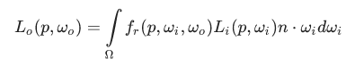

Поначалу оно выглядит пугающе, но мы будем разбирать его постепенно, по частям, и вы увидите как потихоньку оно начнет обретать смысл. Чтобы понять это уравнение нам придется немного углубиться в радиометрию. **Радиометрия** — это наука об измерении электромагнитного излучения \(в том числе видимого света\). Существует несколько радиометрических величин, которые мы можем использовать для измерения освещения, но мы будем использовать только одну, относящуюся к уравнению отражения, известную как Энергетическая яркость \(англ. radiance\) и обозначенную здесь буквой L. ЭЯ используется для количественной оценки величины или силы света, приходящего с определенного направления. ЭЯ, в свою очередь, является комбинацией нескольких физических величин, и, чтобы нам было легче представить ее себе, сосредоточимся на каждой из них в отдельности.

### Поток излучения \(англ. radiant flux\)

Поток излучения \(Φ\) это мощность переносимой светом энергии, измеряемая в ваттах. Общая энергия света складывается из множества слагаемых для разных длин волн, каждой из которых соответствует свой цвет спектра. Энергия, испускаемая источником света, в таком случае, может быть представлена как функция от всех этих длин волн. Длины волн от 390нм до 700нм составляют видимую часть спектра, то есть излучение в этом диапазоне может быть воспринято человеческим глазом. На изображении ниже вы можете видеть значения энергий для различных длин волн составляющих дневной свет:

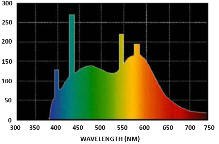

Поток излучения соответствует площади под графиком этой функции от всех длин волн. Непосредственное использование длин волн света в качестве входных данных в компьютерной графике является непрактичным, поэтому мы прибегаем к упрощенному представлению потока излучения, используя вместо функции от всех длин волн триплет цветов, известный как RGB \(или как мы обычно его называем — цвет освещения\). Такое представление ведет к некоторой потере информации, но в целом это незначительно отразится на итоговой картине.

### Телесный угол \(англ. solid angle\)

**Телесный угол**, обозначаемый как ω дает нам размер или площадь фигуры, спроецированной на единичную сферу. Вы можете представить его как направление, имеющее объем:

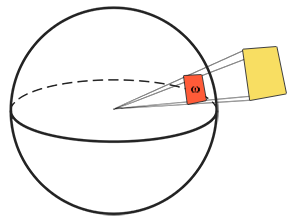

Представьте себе, что вы находитесь в центре сферы и смотрите в направлении фигуры. Размер полученного силуэта и будет телесным углом.

### Сила излучения \(англ. radiance intensity\)

Сила излучения измеряет количество потока излучения, приходящегося на телесный угол, или силу источника света, приходящуюся на площадь единичной сферы, определенную телесным углом. Например, для всенаправленного источника света, который одинаково излучает по всем направлениям, сила излучения означает энергию света, приходящуюся на определенную площадь \(телесный угол\):


Уравнение, описывающее силу излучения выглядит так:

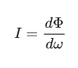

, где I это поток излучения Ф, приходящийся на телесный угол dω


Зная поток излучения, силу и телесный угол мы можем описать уравнение энергетической яркости которое описывает полную наблюдаемую энергию на площади А, ограниченную телесным углом O для света силой Φ

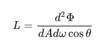

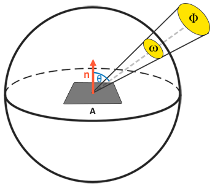

Энергетическая яркость — это радиометрическая величина количества света в области, которая зависит от угла падающего света θ
\(угол между направлением света и нормалью к поверхности\) через cosθ : свет слабее когда он излучается вдоль поверхности и сильнее всего когда он перпендикулярен ей. Это похоже на наши вычисления для диффузного света в туториале по [основам освещения](../../part%202/chapter%202/text.md) так как cosθ ничто иное как скалярное произведение между направлением света и вектором нормали к поверхности:

```glsl
float cosTheta = dot(lightDir, N);
```

Уравнение энергетической яркости весьма полезно для нас, поскольку оно содержит в себе большинство интересующих нас физических величин. Если мы будем считать, что телесный угол ω и площадь A бесконечно малы, мы можем использовать ЭЯ для измерения потока одного луча света, приходящегося на одну точку пространства. Это позволит нам вычислить ЭЯ отдельного светового луча, воздействующего на отдельную точку \(фрагмент\); мы фактически переводим телесный угол ω в вектор направления ω и в точку A. Таким образом, мы можем напрямую использовать ЭЯ в наших шейдерах для расчета вклада отдельного луча света для каждого фрагмента.

На самом деле, когда речь идет об ЭЯ, нас обычно интересует весь входящий свет, приходящийся на точку p, который является суммой всей ЭЯ, и известен как облучённость \(англ. irradiance\). Зная ЭЯ и облучённость мы можем вернуться к уравнению отражения:

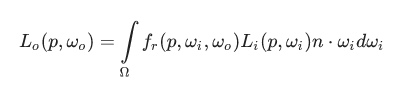

Теперь мы знаем, что L в уравнении рендеринга представляет собой ЭЯ для некоторой точки поверхности p и некоторого бесконечно малого телесного угла входящего света ωi, который можно рассматривать как входящий вектор направления . Помните, что энергия умножается на cosθ — угла между направлением падения света и нормалью поверхности, что выражено в уравнении отражения произведением . Уравнение отражения вычисляет сумму отраженной ЭЯ L0\(p,ω0\) точки p в направлении ω0, которое является исходящим направлением к наблюдателю. Или иначе: L0 измеряет отраженную облучённость точки p, если смотреть из ω0.

Поскольку уравнение отражения основано на облучённости, которая является суммой всего входящего излучения, мы измеряем свет не только одного входящего светового направления, а со всех входящих направлений света в пределах полусферы Ω, с центром в точке p. Ее можно описать как половину сферы, ориентированной вдоль нормали поверхности n:

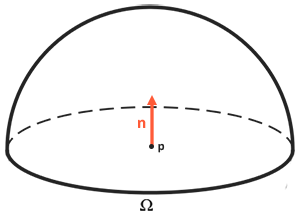

Чтобы вычислить сумму всех значений внутри области, или, в случае полусферы, объема, мы проинтегрируем уравнение по всем входящим направлениям dωi в пределах полусферы Ω. Поскольку нет аналитического решения как для уравнения рендера, так и для уравнения отражения, мы будем решать интеграл численно. Это означает что мы получим результаты для небольших дискретных шагов уравнения отражения по полусфере Ω и усредним их по размеру шага. Это называется **суммой Римана**, которую мы можем грубо представить следующим кодом:

```glsl
int steps = 100;
float sum = 0.0f;
vec3 P    = ...;
vec3 Wo   = ...;
vec3 N    = ...;
float dW  = 1.0f / steps;
for(int i = 0; i < steps; ++i) 
{
    vec3 Wi = getNextIncomingLightDir(i);
    sum += Fr(P, Wi, Wo) * L(P, Wi) * dot(N, Wi) * dW;
}
```

dW для каждого дискретного шага можно рассматривать как dωi в уравнении отражения. Математически dωi является дифференциалом, по которому мы вычисляем интеграл, и хотя он и не то же самое что dW в коде \(поскольку это дискретный шаг суммы Римана\), мы можем считать его таковым для простоты вычислений. Имейте в виду, что использование дискретных шагов всегда даст нам приближенную сумму, а не точное значение интеграла. Внимательный читатель заметит, что мы можем повысить точность суммы Римана, увеличив количество шагов.

Уравнение отражения суммирует излучение всех входящих световых направлений ωi по полусфере Ω, которое достигает точки и возвращает сумму отраженного света L0 в направлении зрителя. Входящее излучение может исходить от источников света, с которыми мы уже знакомы, или с карт окружения, определяющих ЭЯ каждого входящего направления, о чем мы поговорим в туториале IBL.

Теперь единственным неизвестным слева является символ fr, известный как функция **BRDF** или **двулучевая функция отражательной способности**, которая масштабирует \(или взвешивает\) значение входящего излучения на основе свойств материала поверхности.

### BRDF

BRDF является функцией, которая принимает на вход направление падающего света ωi, направление на наблюдателя ω0, нормаль к поверхности n и параметр a, который представляет собой шероховатость поверхности. BRDF аппроксимирует, насколько каждый отдельный световой луч ωi вносит вклад в конечный отраженный свет непрозрачной поверхности с учетом свойств ее материала. Например, если поверхность совершенно гладкая \(почти как зеркало\), функция BRDF вернет 0.0 для всех входящих световых лучей ωi, за исключением одного, имеющего тот же угол \(после отражения\), что и луч ω0, для которого функция вернет 1.0.

BRDF аппроксимирует отражающие и преломляющие свойства материала на основе ранее упомянутой теории микрограней. Для того, чтобы BRDF была физически правдоподобной, она должна подчиняться закону сохранения энергии, т. е. суммарная энергия отраженного света никогда не должна превышать энергии падающего света. Технически, модель Блинна-Фонга считается BRDF, принимающим те же самые ωi и ω0 на вход. Однако модель Блинна-Фонга не считается физически-корректной, поскольку она не гарантирует соблюдения закона сохранения энергии. Существует несколько физически-корректных BRDF для аппроксимации реакции поверхности на освещение. Тем не менее, почти все графические конвейеры реального времени используют BRDF, известную как **BRDF Кука-Торренса** \(Cook-Torrance\).

BRDF Кука-Торренса содержит как диффузную, так и зеркальную часть:

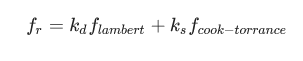

здесь kd— преломленная доля входящей световой энергии, ks — отраженная. Левая часть BRDF содержит диффузную часть уравнения, обозначенную здесь как flambert. Это, так называемое Ламбертово рассеяние. Оно аналогично тому, что мы использовали для диффузного освещения, и является постоянным:

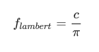

где c — альбедо или цвет поверхности \(диффузная текстура поверхности\). Деление на π нужно, чтобы нормировать рассеянный свет, поскольку ранее обозначенный интеграл, содержащий BRDF, умножается на π (мы доберемся до этого в туториале IBL).

> Вы можете быть удивлены тем, как это Ламбертово рассеяние похоже на выражение для диффузного освещения, которое мы использовали раньше: цвет поверхности, умноженный на скалярное произведение между нормалью поверхности и направлением света. Скалярное произведение все еще присутствует, но выведено из BRDF, поскольку мы имеем nωi в интеграле L0.

Существуют различные уравнения для диффузной части BRDF, которые выглядят более реалистичными, однако они дороже в плане производительности. К тому же, как заключили в Epic Games: Ламбертового рассеяния вполне достаточно для большинства целей рендеринга в реальном времени.

Зеркальная часть BRDF Кука-Торренса немного усовершенствована и описывается как:

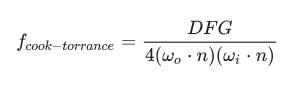

Она состоит из трех функций и коэффициента нормирования в знаменателе. Каждая из букв D, F и G представляет собой определенный тип функции, которая аппроксимирует определенную часть отражающих свойств поверхности. Они известны как функция нормального распределения \(normal **D**istribution function, NDF\), уравнение Френеля \(**F**resnel equation\) и Функция геометрии \(**G**eometry function\):

- Функция нормального распределения: аппроксимирует количество микрограней поверхности, ориентированных по медианному вектору, основываясь на шероховатости поверхности; это основная функция, аппроксимирующая микрограни.
- Функция геометрии: описывает свойство самозатенения микрограней. Когда поверхность довольно шероховатая, одни микрограни поверхности могут перекрывать другие, тем самым уменьшая количество света, отражаемого поверхностью.
- Уравнение Френеля: описывает коэффициент поверхностного отражения при разных углах.

Каждая из этих функций является приближением их физического эквивалента, и для них существуют различные реализации, направленные на более точное приближение к лежащей в их основе физической модели; некоторые дают более реалистичные результаты, другие более эффективны с точки зрения производительности. Брайан Карис из Epic Games провел много исследований по разным типам приближений, подробнее с которыми вы можете ознакомиться [здесь](http://graphicrants.blogspot.nl/2013/08/specular-brdf-reference.html). Мы будем использовать те же функции, что и в Unreal Engine 4 от Epic Games, а именно: *Trowbridge-Reitz GGX* для D, приближение *Френеля-Шлика* для F и *Smith's Schlick-GGX* для G.

## Функция нормального распределения

Функция нормального распределения D статистически аппроксимирует относительную площадь поверхности микрограней, точно ориентированных по медианному вектору h. Существует множество NDF определяющих статистическую аппроксимацию общего выравнивания микрограней с учетом некоторого параметра шероховатости. Мы будем использовать одну, известную как Trowbridge-Reitz GGX:

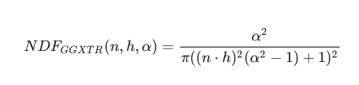

здесь h — это медианный вектор, α — значение шероховатости поверхности. Если мы выберем h как медианный вектор между нормалью к поверхности и направлением света, то изменяя параметр шероховатости, получим следующую картину:


Когда шероховатость мала \(т.е. поверхность гладкая\), микрограни ориентированные в направлении медианного вектора концентрируются в небольшом радиусе. Благодаря этой высокой концентрации NDF дает очень яркое пятно. На шероховатой же поверхности, где микрограни ориентированы в более случайных направлениях, вы обнаружите гораздо большее количество микрограней, ориентированных в направлении медианного вектора h, но расположенных в большем радиусе, что делает цвет пятна более серым.

В коде GLSL функция нормального распределения Trowbridge-Reitz GGX будет выглядеть примерно так:

```glsl
float DistributionGGX(vec3 N, vec3 H, float a)
{
    float a2     = a*a;
    float NdotH  = max(dot(N, H), 0.0);
    float NdotH2 = NdotH*NdotH;
	
    float nom    = a2;
    float denom  = (NdotH2 * (a2 - 1.0) + 1.0);
    denom        = PI * denom * denom;
	
    return nom / denom;
}
```

### Функция геометрии

Функция геометрии статистически аппроксимирует относительную площадь поверхности, где ее микроскопические неровности перекрывают друг друга, что не дает проникать световым лучам.


Как и в случае с NDF, функция геометрии принимает на вход коэффициент шероховатости поверхности, что в данном случае означает следующее: более шероховатые поверхности будут иметь более высокую вероятность затенения микрограней. Функция геометрии, которую мы будем использовать, представляет собой комбинацию приближения GGX и Шлика-Бекмана \(Schlick-Beckmann\), и известна как Schlick-GGX:

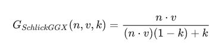

Здесь k является переобозначением α в зависимости от того, используем ли мы функцию геометрии для прямого освещения или освещения IBL:

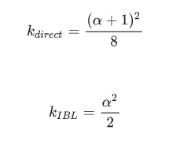

Обратите внимание, что значение α может отличаться в зависимости от того, как ваш движок переводит шероховатость в α. В следующих уроках мы подробно обсудим, как и где это переназначение становится актуальным.

Чтобы эффективно аппроксимировать геометрию, нам необходимо учитывать как направление обзора \(перекрытие геометрии\), так и вектор направления света \(самозатенение геометрии\). Мы можем учитывать оба случая с помощью *метода Смита*:

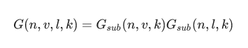

Использование метода Смита с Schlick-GGX в качестве Gsub дает следующую картинку при различной шероховатости R:

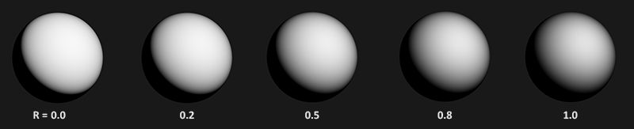

Функция геометрии представляет собой множитель между \[0.0, 1.0\], где белый \(или 1.0\) означает отсутствие затенения микрограней, а черный \(или 0.0\) означает полное затенение микрограней.

В GLSL функция геометрии преобразуется в следующий код:

```glsl
float GeometrySchlickGGX(float NdotV, float k)
{
    float nom   = NdotV;
    float denom = NdotV * (1.0 - k) + k;
	
    return nom / denom;
}
  
float GeometrySmith(vec3 N, vec3 V, vec3 L, float k)
{
    float NdotV = max(dot(N, V), 0.0);
    float NdotL = max(dot(N, L), 0.0);
    float ggx1 = GeometrySchlickGGX(NdotV, k);
    float ggx2 = GeometrySchlickGGX(NdotL, k);
	
    return ggx1 * ggx2;
}
```

### Уравнение Френеля

Уравнение Френеля описывает отношение отраженного и преломленного света, которое зависит от угла, под который мы смотрим на поверхность. Когда свет попадает на поверхность, уравнение Френеля дает нам процент отраженного света на основании угла, под которым мы видим эту поверхность. Из этого соотношения отражения и закона сохранения энергии мы можем непосредственно получить преломленную часть света, которая будет равна оставшейся энергии.

Каждая поверхность или материал имеет уровень *базовой отражательной способности*, наблюдаемый при взгляде на поверхность прямо, но если смотреть на поверхность под углом, [все](http://filmicworlds.com/blog/everything-has-fresnel/) отражения становятся более заметными. Вы можете проверить это самостоятельно, взглянув на ваш, вероятно, деревянный или металлический стол сначала перпендикулярно, а затем под углом близким к 90 градусам. Вы увидите, что отражения становятся намного более заметными. Все поверхности, теоретически, полностью отражают свет, если смотреть на них под идеальным углом в 90 градусов. Этот эффект получил имя Френеля и описывается **уравнением Френеля**.

Уравнение Френеля является довольно сложным, но, к счастью, его можно упростить с помощью **приближения Френеля-Шлика**:

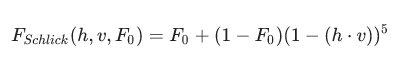

F0 представляет базовую отражательную способность поверхности, которую мы вычисляем используя нечто, называемое показателями преломления или **IOR** \(indices of refraction\), и, как вы можете видеть на поверхности сферы, чем ближе направление обзора к границам видимой сферы \(при этом угол между направлением обзора и медианным вектором достигает 90 градусов\), тем сильнее эффект Френеля и, следовательно, отражения:

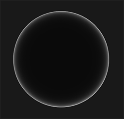

Существует несколько тонкостей, связанных с уравнением Френеля. Первая заключается в том, что приближение Френеля-Шлика действительно только для *диэлектриков* или неметаллических поверхностей. Для поверхностей проводников \(металлов\), вычисление базовой отражательной способности с использованием показателей преломления будет неверным, и нам нужно использовать другое уравнение Френеля для проводников. Поскольку это неудобно, мы используем предварительно вычисленные значения для поверхностей при нормальном падении \(F0\) \(с углом 0 градусов, как если бы мы смотрели прямо на поверхность\) и интерполируем это значение на основе угла обзора в соответствии с приближением Френеля-Шлика, так что мы можем использовать одно и то же уравнение как для металлов, так и для неметаллов.

Отклик поверхности при нормальном падении или базовая отражательная способность может быть найдена в больших базах данных вроде [этой](http://refractiveindex.info/). Некоторые распространенные значения, перечисленные ниже, взяты из примечаний к курсу Нати Хоффмана:

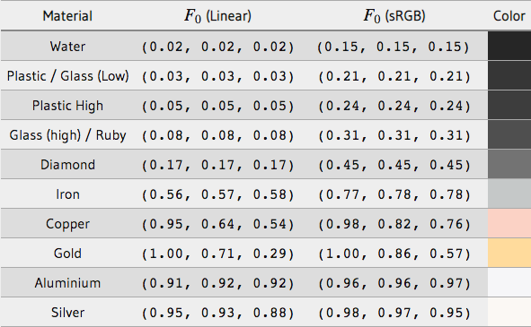

Интересное наблюдение: для всех диэлектрических поверхностей базовая отражательная способность никогда не поднимается выше 0.17, что является скорее исключением, нежели правилом, тогда как для проводников базовая отражательная способность расположена значительно выше и \(в основном\) лежит в диапазоне от 0.5 до 1.0. Кроме того, для проводников или металлических поверхностей базовая отражательная способность "подкрашивается", поэтому F0 представлен как триплет RGB \(отражательная способность при нормальном падении может меняться в зависимости от длины волны\).

Эти специфические признаки металлических поверхностей по сравнению с диэлектрическими породили нечто, называемое metallic workflow: когда мы создаем материалы поверхностей с дополнительным параметром, известным как металличность \(metalness\), который описывает, является поверхность металлической или нет.

> Теоретически металличность поверхности принимает только два значения: это либо металл, либо нет; поверхность не может быть и тем, и другим. Тем не менее, большинство конвейеров рендера позволяют настраивать металличность поверхности линейно между 0.0 и 1.0. Это происходит главным образом из-за отсутствия в текстуре материала достаточной точности для создания поверхности, например, с небольшими частицами пыли и песка, царапинами на поверхности металла. Изменяя значение металличности вокруг этих мелких неметаллических частиц и царапин, мы получаем визуально более приятные результаты.

Предварительно вычисляя F0 как для диэлектриков, так и для металлов, мы можем использовать одно и то же приближение Френеля-Шлика для обоих типов поверхностей, но нам нужно подкрашивать базовую отражательную способность, если у нас есть металлическая поверхность. Обычно мы делаем это следующим образом:

```glsl
vec3 F0 = vec3(0.04);
F0 = mix(F0, surfaceColor.rgb, metalness);
```

Мы определили базовую отражательную способность, приблизительно одинаковую для большинства диэлектрических поверхностей. Это еще одно приближение, поскольку F0 усредняется по большинству распространенных диэлектриков. Базовая отражательная способность 0.04 сохраняется для большинства диэлектриков и дает физически правдоподобные результаты без необходимости задания дополнительного параметра поверхности. Поэтому, в зависимости от типа поверхности, мы либо берем базовую отражательную способность диэлектрика, либо считаем F0 заданную цветом поверхности. Поскольку металлические поверхности поглощают весь преломленный свет, они не имеют диффузных отражений, и мы можем непосредственно использовать диффузную текстуру поверхности в качестве базовой отражательной способности.

Переведем приближение Френеля-Шлика в код:

```glsl
vec3 fresnelSchlick(float cosTheta, vec3 F0)
{
    return F0 + (1.0 - F0) * pow(1.0 - cosTheta, 5.0);
}
```

где cosTheta есть результат скалярного произведения между вектором нормали поверхности и направлением обзора.

### Уравнение отражения Кука-Торренса

Зная все компоненты BRDF Кука-Торренса мы можем включить ее в окончательное уравнение отражения:

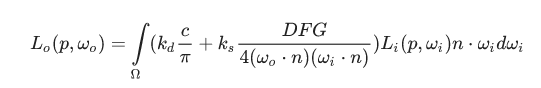

Однако это уравнение не полностью верно математически. Вероятно, вы помните, что уравнение Френеля F представляет собой коэффициент количества света отраженного поверхностью. То есть фактически это наш коэффициент ks, что означает, что зеркальная часть уравнения отражения уже содержит ks. Учитывая это, наше окончательное уравнение отражения запишется так:

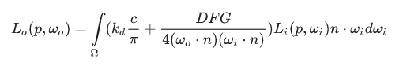

В этом уравнении теперь полностью описывается физическая модель рендеринга, которую обычно мы называем физически корректным рендерингом или PBR. Не волнуйтесь, если вы еще не полностью поняли, как нам нужно оформить всю обсуждаемую математику в виде кода. В следующих уроках мы рассмотрим как использовать уравнение отражения, чтобы получить гораздо более физически правдоподобные результаты в нашем рендеринге, и все кусочки понемногу соберутся в единое целое.

## Создание материалов для PBR

Теперь, зная основную математическую модель PBR, мы завершаем обсуждение описанием того, как художники обычно задают физические свойства поверхности, которые мы можем напрямую передать в уравнения PBR. Каждый из параметров поверхности, которые нам нужны для конвейера PBR, может быть определен или смоделирован текстурами. Использование текстур дает нам пофрагментный контроль над тем, как каждая конкретная точка поверхности должна реагировать на свет: является ли она металлической, шероховатой или гладкой или как данная поверхность реагирует на разные длины волн света.

Ниже вы увидите список текстур, которые часто можно встретить в конвейере PBR, а также результат их применения:

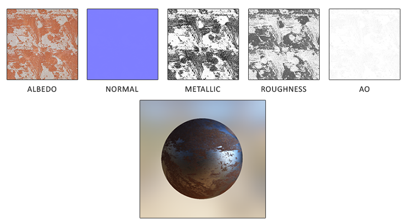

**Альбедо**: текстура альбедо определяет для каждого текселя цвет поверхности или базовую отражательную способность, если этот тексель металлический. Это во многом напоминает диффузные текстуры что мы использовали раньше, но вся информация об освещении убирается из текстуры. Диффузные текстуры часто имеют небольшие тени или затемненные трещины внутри изображения, что не нужно в текстуре альбедо; она должна содержать только цвет поверхности.

**Нормали**: текстура карты нормалей, точно такая же, какую мы использовали ранее в туториале по [картам нормалей](../../part%205/chapter%205/text.md). Карта нормалей позволяет нам задать для каждого фрагмента свою нормаль, дабы создать иллюзию, что поверхность более выпуклая.

**Металличность**: карта металличности определяет является тексель металлическим или нет. В зависимости от того, как настроен PBR-движок, художники могут задавать металличность как оттенками серого, так и только двумя цветами: черным и белым.

**Шероховатость**: карта шероховатости указывает, насколько шероховатая поверхность находится в основе текселя. Выбранное из текстуры значение шероховатости определяет статистическую ориентацию микрограней поверхности. На более шероховатой поверхности получаются более широкие и размытые отражения, тогда как на гладкой поверхность они сфокусированные и четкие. Некоторые PBR-движки используют карты гладкости вместо карты шероховатости, которые некоторые художники находят более интуитивно понятными, но эти значения переводятся в шероховатость \(1.0 — гладкость\) в момент выборки.

**AO \(ambient occlusion\)**: карты фонового затенения или AO определяют дополнительный коэффициент затенения поверхности и окружающей геометрии. Если у нас есть кирпичная поверхность, например, текстура альбедо не должна иметь никакой информации о затенении внутри щелей кирпича. Карта AO как раз определяет эти затемненные грани, за которые свету труднее проникнуть. Учитывая АО в конце этапа освещения мы можем значительно повысить визуальное качество сцены. Карты АО для мешей и поверхности либо генерируется вручную, либо предварительно вычисляется в программах 3D-моделирования.

Художники устанавливают и настраивают входные значения для каждого текселя и могут основывать свои текстуры на физических свойствах поверхности реальных материалов. Это одно из самых больших преимуществ конвейера PBR, так как эти физические свойства поверхности остаются неизменными от условий окружающей среды или освещения, что облегчает жизнь художникам в получении правдоподобных результатов. Поверхности, созданные в конвейере PBR, могут быть легко использованы в различных PBR-движках, и будут выглядеть корректно независимо от среды, в которой они находятся, что в результате выглядит намного более естественно.

## Материалы по теме

- [Background: Physics and Math of Shading by Naty Hoffmann](http://blog.selfshadow.com/publications/s2013-shading-course/hoffman/s2013_pbs_physics_math_notes.pdf): очень много теории, чтобы уместиться в рамках одной статьи, поэтому теория здесь едва затрагивает основы; если вы хотите больше узнать о физике света и о том как она связана с теорией PBR, этот ресурс must-read для вас.
- [Real shading in Unreal Engine 4](http://blog.selfshadow.com/publications/s2013-shading-course/karis/s2013_pbs_epic_notes_v2.pdf): обсуждение модели PBR, принятой Epic Games в Unreal Engine 4. PBR, о котором мы говорим в этих туториалах, основана на этой модели.
- [Marmoset: PBR Theory](https://www.marmoset.co/toolbag/learn/pbr-theory): введение в PBR. В основном предназначено для художников, но, тем не менее, стоит прочесть.
- [Coding Labs: Physically based rendering](http://www.codinglabs.net/article_physically_based_rendering.aspx): основы уравнения рендеринга и то, как оно связано к PBR.
- [Coding Labs: Physically Based Rendering — Cook–Torrance](http://www.codinglabs.net/article_physically_based_rendering_cook_torrance.aspx): основные положения BRDF Кука-Торренса
- [Wolfire Games — Physically based rendering](http://blog.wolfire.com/2015/10/Physically-based-rendering): введение в PBR от Lukas Orsvärn.
- [\[SH17C\] Physically Based Shading](https://www.shadertoy.com/view/4sSfzK): отличный интерактивный shadertoy \(предупреждение: может долго грузиться\) от Krzysztof Narkowi, демонстрирует взаимодействие света с материалом PBR.
