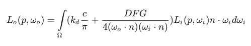
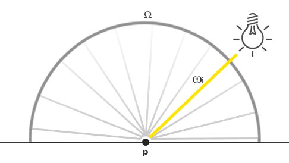
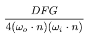
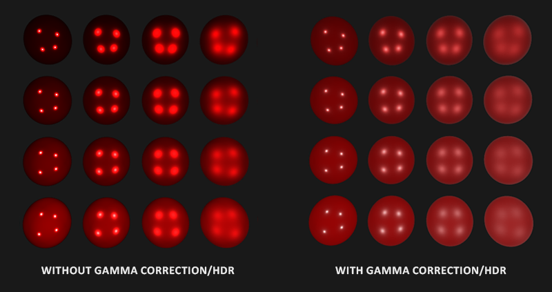
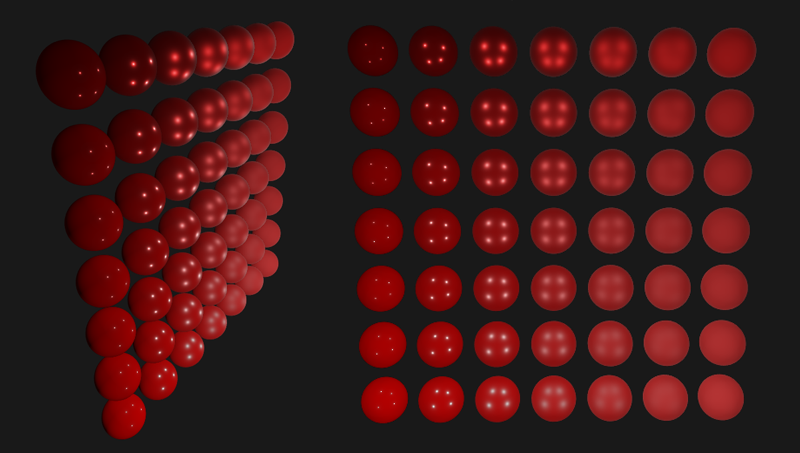
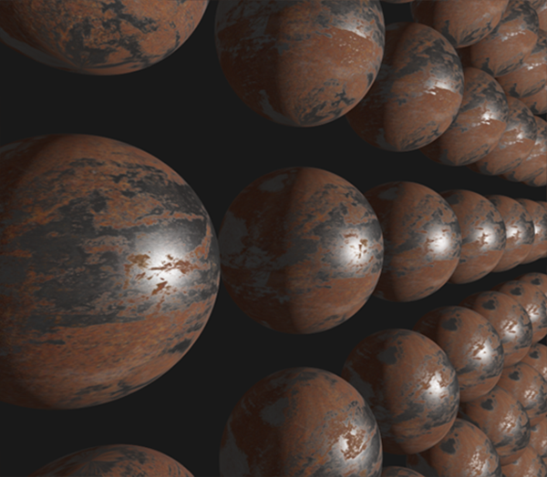

# Learn OpenGL. Урок 6.2 – Physically-Based Rendering. Аналитические источники света

В [предыдущем уроке](../../part%206/chapter%201/text.md) был дан обзор основам реализации физически правдоподобной модели рендеринга. В этот раз мы перейдем от теоретических выкладок к конкретной реализации рендера с участием непосредственных \(аналитических\) источников света: точечных, направленных или прожекторного типа.

Для начала освежим в памяти выражение для расчета отражающей способности из предыдущего урока:



По большей части мы уже разобрались с компонентами этой формулы, но неизвестным остается вопрос о том, как же конкретно представить величину облученности \(*irradiance*\), представляющую собой суммарную энергетическую яркость \(*radiance*\) L всей сцены. Мы условились, что энергетическая яркость L \(в рамках терминологии компьютерной графики\) рассматривается как отношение потока излучения \(*radiant flux*\) φ \(энергии излучения источника света\) к значению телесного угла ω. В нашем случае телесный угол ω мы приняли бесконечно малым, и потому энергетическая яркость дает представление о потоке излучения для каждого отдельно взятого луча света \(его направления\).

Как же увязать эти выкладки с той моделью освещения, что мы знаем из предыдущих уроков? Для начала представьте, что задан единственный точечный источник света \(что излучает равномерно во всех направлениях\) с потоком излучения, заданным как RGB триада \(23.47, 21.31, 20.79\). Сила излучения \(*radiant intensity*\) такого источника равна его потоку излучения на всех направлениях. Однако, рассмотрев задачу определения цвета конкретной точки на поверхности, можно увидеть, что из всех возможных направлений падения света в полусфере Ω, только вектор ωi будет явно исходить из источника света. Поскольку задан только один источник света, представленный точкой в пространстве, то для всех остальных возможных направлений падения света в точку p энергетическая яркость будет равной нулю:



Теперь, если временно не учитывать закон затухания света для данного источника, получится, что энергетическая яркость для падающего луча света этого источника остается неизменной где бы мы не расположили источник \(масштабирование светимости на основе косинуса угла падения φ также не в счет\). Итого, точечный источник сохраняет силу излучения постоянной вне зависимости от угла обзора, что эквивалентно принятию величины силы излучения равной исходному потоку излучения в виде постоянной триады \(23.47, 21.31, 20.79\).

Однако, вычисление энергетической яркости также основывается на координате точки p, как минимум любой физически достоверный источник света демонстрирует затухание силы излучения с ростом расстояния от точки до источника. Также следует учесть ориентацию поверхности, что видно из исходного выражения для светимости: результат вычисления силы излучения необходимо умножить на значение скалярного умножения вектора нормали к поверхности n и вектора падения излучения ωi.

Если переписать вышесказанное: для непосредственного точечного источника света функция излучения L определяет цвет падающего света с учетом затухания на заданном расстоянии от точки p и с учетом масштабирования на коэффициент nωi, но только для единственного луча света ωi, попадающего в точку p – по сути единственного вектора, соединяющего источник и точку. В виде исходного кода это интерпретируется следующим образом:

```glsl
vec3  lightColor  = vec3(23.47, 21.31, 20.79);
vec3  wi          = normalize(lightPos - fragPos);
float cosTheta    = max(dot(N, Wi), 0.0);
float attenuation = calculateAttenuation(fragPos, lightPos);
vec3 radiance    = lightColor * attenuation * cosTheta; 
```

Если закрыть глаза на немного измененную терминологию, этот кусок кода должен кое-что вам напоминать. Да-да, это все тот же код для расчета диффузной составляющей в известной нам модели освещения. Для непосредственного освещения энергетическая яркость определяется единственным вектором на источник света, потому расчет ведется в манере столь похожей знакомую нам до сих пор.

> Отмечу, что данное утверждение верно лишь в рамках предположения, что точечный источник света бесконечно мал и представлен точкой в пространстве. При моделировании объемного источника его светимость будет отличаться от нуля во множестве направлений, а не только на одном луче.

Для прочих источников света, испускающих излучение из единственной точки, энергетическая яркость рассчитывается таким же образом. Например, направленный источник света обладает постоянным направлением ωi и не использует затухания, а прожекторный источник демонстрирует изменяющуюся силу излучения, зависящую от направления источника.

Здесь мы возвращаемся к значению интеграла по поверхности полусферы Ω. Поскольку нам заранее известны положения всех участвующих в затенении конкретной точки источников света, то у нас нет необходимости пытаться решить интеграл. Мы можем непосредственно рассчитать суммарную облученность, обеспечиваемую этим количеством источников света, поскольку на энергетическую яркость поверхности влияет единственное направление для каждого источника.

В итоге PBR расчет для непосредственных источников света является достаточно простым делом, поскольку все сводится к последовательному перебору участвующих в освещении источников. Позже в модели освещения появится компонента от окружающей обстановки, над чем мы будем работать в уроке по освещению на основе изображения \(*Image-Based Lighting, IBL*\). Тут не отвертеться от оценки интеграла, поскольку свет в такой модели падает с множества направлений.

## Модель поверхности PBR

Начнем с фрагментного шейдера, реализующего описанную выше модель PBR. Сперва зададим необходимые для шейдинга поверхности входные данные:

```glsl
#version 330 core
out vec4 FragColor;
in vec2 TexCoords;
in vec3 WorldPos;
in vec3 Normal;
  
uniform vec3 camPos;
  
uniform vec3  albedo;
uniform float metallic;
uniform float roughness;
uniform float ao; 
```

Здесь видны привычные входные данные, рассчитанные с помощью простейшего вершинного шейдера, а также набор юниформов, описывающих характеристики поверхности объекта.

Далее, в самом начале кода шейдера, осуществим вычисления, столь знакомые по реализации модели освещения Блинна-Фонга:

```glsl
void main()
{
    vec3 N = normalize(Normal); 
    vec3 V = normalize(camPos - WorldPos);
    [...]
} 
```

### Непосредственное освещение

Пример для данного урока содержит всего четыре точечных источника света, которые явно задают облученность сцены. Для удовлетворения выражения отражающей способности мы итеративно пройдемся по каждому источнику света, вычислим индивидуальную энергетическую яркость и просуммируем этот вклад, попутно промодулировав значением BRDF и углом падения луча света. Можно представить данную итерацию как решение интеграла по поверхности Ω только для аналитических источников света.

Итак, рассчитаем сначала рассчитываются величины для каждого источника:

```glsl
vec3 Lo = vec3(0.0);
for(int i = 0; i < 4; ++i) 
{
    vec3 L = normalize(lightPositions[i] - WorldPos);
    vec3 H = normalize(V + L);
  
    float distance    = length(lightPositions[i] - WorldPos);
    float attenuation = 1.0 / (distance * distance);
    vec3 radiance     = lightColors[i] * attenuation; 
    [...]   
```

Поскольку расчеты ведутся в линейном пространстве \([гамма-коррекцию](../../part%205/chapter%202/text.md) выполним в завершении шейдера\), то используется более физически корректный закон затухания согласно обратному квадрату расстояния.

> Пусть закон обратного квадрата и более физически корректный, в целях лучшего управления характером затухания вполне можно использовать и уже знакомую формулу, содержащую постоянный, линейный и квадратичный члены.

Далее, для каждого источника мы также рассчитываем значение зеркальной Cook-Torrance BRDF:



Первым делом стоит рассчитать соотношение между зеркальным и диффузным отражением, или, иными словами, отношением между количеством отраженного света к количеству преломленного поверхностью света. Из [предыдущего урока](../../part%206/chapter%201/text.md) мы знаем, как выглядит расчет коэффициента Френеля:

```glsl
vec3 fresnelSchlick(float cosTheta, vec3 F0)
{
    return F0 + (1.0 - F0) * pow(1.0 - cosTheta, 5.0);
}   
```

Аппроксимация Френеля-Шлика ожидает на входе параметр F0, который показывает *степень отражения поверхности при нулевом угле падения света*, т.е. степень отражения, если смотреть на поверхность по нормали сверху вниз. Значение F0 меняется в зависимости от материала и приобретает цветной оттенок для металлов, в чем можно убедиться просмотрев каталоги PBR материалов. Для процесса *metallic workflow* \(процесс авторинга PBR материалов, разделяющий все материалы на классы диэлектриков и проводников\) принимается, что все диэлектрики выглядят достаточно достоверно при неизменной величине *F0 = 0.04*, в то время как для металлических поверхностей F0 задается на основе альбедо поверхности. В виде кода:

```glsl
vec3 F0 = vec3(0.04); 
F0      = mix(F0, albedo, metallic);
vec3 F  = fresnelSchlick(max(dot(H, V), 0.0), F0); 
```

Как видите, для строго неметаллических поверхностей F0 устанавливается равной 0.04. Но при этом может и плавно изменяться от этого значения до величины альбедо на основе показателя "металичности" поверхности. Этот показатель, обычно, представлен в виде отдельной текстуры \(отсюда, собственно, и берется *metallic workflow*, прим. пер.\).

Получив F нам остается рассчитать значение функции нормального распределения D и функции геометрии G.

Код функций для случая с аналитическим освещением:

```glsl
float DistributionGGX(vec3 N, vec3 H, float roughness)
{
    float a      = roughness*roughness;
    float a2     = a*a;
    float NdotH  = max(dot(N, H), 0.0);
    float NdotH2 = NdotH*NdotH;
	
    float num   = a2;
    float denom = (NdotH2 * (a2 - 1.0) + 1.0);
    denom = PI * denom * denom;
	
    return num / denom;
}

float GeometrySchlickGGX(float NdotV, float roughness)
{
    float r = (roughness + 1.0);
    float k = (r*r) / 8.0;

    float num   = NdotV;
    float denom = NdotV * (1.0 - k) + k;
	
    return num / denom;
}
float GeometrySmith(vec3 N, vec3 V, vec3 L, float roughness)
{
    float NdotV = max(dot(N, V), 0.0);
    float NdotL = max(dot(N, L), 0.0);
    float ggx2  = GeometrySchlickGGX(NdotV, roughness);
    float ggx1  = GeometrySchlickGGX(NdotL, roughness);
	
    return ggx1 * ggx2;
} 
```

Важное отличие от описанного в [теоретической части](../../part%206/chapter%201/text.md): здесь мы непосредственно передаем параметр шероховатости во все упомянутые функции. Делается это для возможности в каждой из функций по-своему модифицировать исходное значение шероховатости. Например, исследования Disney, нашедшие отражение в движке от Epic Games, показали, что модель освещения дает более визуально корректные результаты, если использовать квадрат шероховатости в функции геометрии и функции нормального распределения.

Задав все функции можно непосредственно получить величины NDF и G:

```glsl
float NDF = DistributionGGX(N, H, roughness);       
float G   = GeometrySmith(N, V, L, roughness);        
```

Итого у нас на рука все величины для расчета всей Cook-Torrance BRDF:

```glsl
vec3 numerator    = NDF * G * F;
float denominator = 4.0 * max(dot(N, V), 0.0) * max(dot(N, L), 0.0) + 0.001;
vec3 specular     = numerator / denominator;   
```

Обратите внимание, что мы ограничиваем знаменатель минимальным значением 0.001 для предотвращения деления на ноль, в случаях обнуления скалярного произведения.

Теперь приступим к расчету вклада каждого источника в уравнение отражающей способности. Поскольку коэффициент Френеля непосредственно представляет собой переменную Ks, то можно использовать величину F для обозначения вклада источника в зеркальное отражение поверхности. Из величины Ks можно получить и коэффициент преломления :

```glsl
vec3 kS = F;
vec3 kD = vec3(1.0) - kS;
  
kD *= 1.0 - metallic;	 
```

Поскольку мы считаем величину kS представляющей количество световой энергии отраженной поверхностью, то вычитая её из единицы, получим остаточную энергию света kD, преломленного поверхностью. Кроме того, поскольку металлы не преломляют свет и не имеют диффузной компоненты переизлученного света, компонента kD будет промодулирована таким образом, чтобы оказаться равной нулю для полностью металлического материала. После данных вычислений у нас на руках будут все данные для расчета отражающей способности, обеспечиваемой каждым из источников света:

```glsl
const float PI = 3.14159265359;
  
    float NdotL = max(dot(N, L), 0.0);        
    Lo += (kD * albedo / PI + specular) * radiance * NdotL;
```

Итоговая величина Lo, или исходящая энергетическая яркость, по сути есть решение выражения отражающей способности, т.е. результат интегрирования по поверхности Ω. В данном случае нам не требуется пытаться решать интеграл в общем виде для всех возможных направлений, поскольку в данном примере есть всего четыре источника света, которые влияют на обрабатываемый фрагмент. Именно поэтому все «интегрирование» ограничивается простым циклом по существующим источникам света.

Остается только добавить подобие фоновой компоненты освещения к результатам расчета непосредственного источника света и итоговый цвет фрагмента готов:

```glsl
vec3 ambient = vec3(0.03) * albedo * ao;
vec3 color   = ambient + Lo;   
```

### Рендеринг в линейном пространстве и HDR

До сих пор мы предполагали, что все расчеты ведутся в линейном цветовом пространстве, и потому использовали [гамма-коррекцию](../../part%205/chapter%202/text.md) как финальный аккорд в нашем шейдере. Проведение расчетов в линейном пространстве крайне важно для корректного моделирования PBR, поскольку модель требует линейности всех входных данных. Попробуйте не обеспечить линейность какого-либо из параметров и результат шейдинга окажется некорректным. Кроме того, неплохо было бы задать источникам света характеристики, близкие к реальным источниками: например, цвет их излучения и энергетическая яркость может свободно меняться в широких пределах. Как следствие Lo может довольно легко принимать большие значения, но неизбежно попадет под отсечку в интервале \[0.0, 1.0\] из-за низкого динамического диапазона \(LDR\) буфера кадра по умолчанию.

Чтобы избежать потери HDR величин, перед гамма-коррекцией необходимо провести тональную компрессию:

```glsl
color = color / (color + vec3(1.0));
color = pow(color, vec3(1.0/2.2));  
```

Здесь применяется уже знакомый оператор Рейнхарда, что позволяет сохранить широкий динамический диапазон в условиях сильно меняющейся облученности разных участков изображения. Поскольку здесь мы не применяем отдельный шейдер для пост-обработки, то описанные операции можно добавить просто в конец шейдерного кода.



Повторюсь, что для корректного моделирования PBR чрезвычайно важно помнить и учитывать особенности работы с линейным цветовым пространством и HDR рендера. Пренебрежение этими аспектами приведет к некорректным расчетам и визуально неэстетичным результатам.

### Шейдер PBR для аналитического освещения

Итак, вместе с последними штрихами в виде тональной компрессии и гамма-коррекции, остается только передать финальный цвет фрагмента на выход фрагментного шейдера и код PBR шейдера для непосредственного освещения можно считать завершенным. Напоследок окинем взором весь код функции *main\(\)* этого шейдера:

```glsl
#version 330 core
out vec4 FragColor;
in vec2 TexCoords;
in vec3 WorldPos;
in vec3 Normal;

// параметры материалов
uniform vec3  albedo;
uniform float metallic;
uniform float roughness;
uniform float ao;

// источники света
uniform vec3 lightPositions[4];
uniform vec3 lightColors[4];

uniform vec3 camPos;

const float PI = 3.14159265359;
  
float DistributionGGX(vec3 N, vec3 H, float roughness);
float GeometrySchlickGGX(float NdotV, float roughness);
float GeometrySmith(vec3 N, vec3 V, vec3 L, float roughness);
vec3 fresnelSchlickRoughness(float cosTheta, vec3 F0, float roughness);

void main()
{		
    vec3 N = normalize(Normal);
    vec3 V = normalize(camPos - WorldPos);

    vec3 F0 = vec3(0.04); 
    F0 = mix(F0, albedo, metallic);
	           
    // выражение отражающей способности
    vec3 Lo = vec3(0.0);
    for(int i = 0; i < 4; ++i) 
    {
        // расчет энергетической яркости для каждого источника света
        vec3 L = normalize(lightPositions[i] - WorldPos);
        vec3 H = normalize(V + L);
        float distance    = length(lightPositions[i] - WorldPos);
        float attenuation = 1.0 / (distance * distance);
        vec3 radiance     = lightColors[i] * attenuation;        
        
        // Cook-Torrance BRDF
        float NDF = DistributionGGX(N, H, roughness);        
        float G   = GeometrySmith(N, V, L, roughness);      
        vec3 F    = fresnelSchlick(max(dot(H, V), 0.0), F0);       
        
        vec3 kS = F;
        vec3 kD = vec3(1.0) - kS;
        kD *= 1.0 - metallic;	  
        
        vec3 numerator    = NDF * G * F;
        float denominator = 4.0 * max(dot(N, V), 0.0) * max(dot(N, L), 0.0);
        vec3 specular     = numerator / max(denominator, 0.001);  
            
        // прибавляем результат к исходящей энергетической яркости Lo
        float NdotL = max(dot(N, L), 0.0);                
        Lo += (kD * albedo / PI + specular) * radiance * NdotL; 
    }   
  
    vec3 ambient = vec3(0.03) * albedo * ao;
    vec3 color = ambient + Lo;
	
    color = color / (color + vec3(1.0));
    color = pow(color, vec3(1.0/2.2));  
   
    FragColor = vec4(color, 1.0);
}   
```

Надеюсь, после ознакомления с [теоретической частью](../../part%206/chapter%201/text.md) и с сегодняшним разбором выражения отражающей способности, тот листинг перестанет выглядеть устрашающе.

Используем этот шейдер в сцене, содержащей четыре точечных источника света, энное количество сфер, характеристики поверхности которых будут менять степень своей шероховатости и металличности по горизонтальной и вертикальной осям соответственно. На выходе получим такую картину:



Металличность меняется от нуля к единице снизу вверх, а шероховатость – аналогично, но слева направо. Становится видно, что меняя всего лишь эти две характеристики поверхности уже можно задать широкий диапазон материалов.

Полный исходный код находится [здесь](src1.cpp).

## PBR и текстурирование

Расширим нашу модель поверхности за счет передачи характеристик в виде текстур. Таким образом мы сможем обеспечить пофрагментный контроль за параметрами материала поверхности:

```glsl
[...]
uniform sampler2D albedoMap;
uniform sampler2D normalMap;
uniform sampler2D metallicMap;
uniform sampler2D roughnessMap;
uniform sampler2D aoMap;
  
void main()
{
    vec3 albedo     = pow(texture(albedoMap, TexCoords).rgb, 2.2);
    vec3 normal     = getNormalFromNormalMap();
    float metallic  = texture(metallicMap, TexCoords).r;
    float roughness = texture(roughnessMap, TexCoords).r;
    float ao        = texture(aoMap, TexCoords).r;
    [...]
} 
```

Заметьте, что текстура альбедо поверхности обычно создается художниками в цветовом пространстве sRGB, потому в коде выше мы возвращаем цвет текселя в линейное пространство, чтобы его можно было использовать в дальнейших расчетах. В зависимости от того, как художники создают текстуру, содержащую данные фонового затенения \(*ambient occlusion map*\), возможно, её также придется приводить в линейное пространство. Карты металличности и шероховатости практически всегда создаются в линейном пространстве.

Использование текстур вместо фиксированных параметров поверхности в сочетании с алгоритмом PBR дает значительный рост визуальной достоверности по сравнению с ранее использованными алгоритмами освещения:



Полный код примера с текстурированием лежит [здесь](src2.cpp), а использованные текстуры – [здесь](http://freepbr.com/materials/rusted-iron-pbr-metal-material-alt/) \(вместе с текстурой фонового затенения\). Обращаю внимание, что сильно металличные поверхности выглядят затемненными в условиях непосредственного освещения, поскольку вклад диффузного отражения мал \(в пределе вообще отсутствует\). Их затенение становится более корректным только при учете зеркального отражения освещения от окружающей обстановки, чем мы и займемся в следующих уроках.

На данный момент полученный результат, возможно, не так впечатляет, как некоторые PBR демонстрации – все же мы еще не реализовали систему освещения, основанного на изображении \(IBL\). Тем не менее наш рендер уже сейчас считается основанным на физических принципах и, даже без IBL, он демонстрирует картинку более достоверную, чем ранее.
