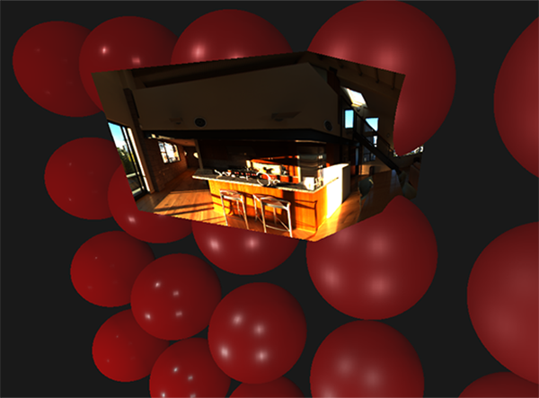
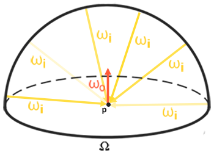

# Learn OpenGL. Урок 6.3 – Image Based Lighting. Диффузная облученность

Освещение на основе изображения или *IBL* \(*Image Based Lighting*\) – является категорией методов освещения, основанных не на учете аналитических источников света \(рассмотренных в [предыдущем уроке](../../part%206/chapter%202/text.md)\), но рассматривающих все окружение освещаемых объектов как один непрерывный источник света. В общем случае техническая основа таких методов лежит в обработке кубической карты окружения \(подготовленной в реальном мире или созданная на основе трехмерной сцены\) таким образом, чтобы хранимые в карте данные могли быть напрямую использованы в расчетах освещения: фактически каждый тексель кубической карты рассматривается как источник света. В общем и целом, это позволяет запечатлеть эффект глобального освещения в сцене, что является важной компонентой, передающей общий «тон» текущей сцены и помогающей освещаемым объектам быть лучше "встроенными" в нее.

Поскольку алгоритмы IBL учитывают освещение от некоего «глобального» окружения, то их результат считается более точной имитацией фонового освещения или даже очень грубой аппроксимацией глобального освещения. Этот аспект делает методы IBL интересными в плане включения в модель PBR, поскольку задействование освещения от окружения в модели освещения позволяет объектам выглядеть гораздо более физически корректно.

Для включения влияния IBL в уже описанную систему PBR вернемся к знакомому уравнению отражательной способности:


Как было описано ранее основной целью является вычисление интеграла для всех входящих направлений излучения ωi по полусфере Ω. В [прошлом уроке](../../part%206/chapter%202/text.md) вычисление интеграла было необременительным, поскольку мы заранее знали число источников света, а, значит, и все те несколько направлений падения света, что им соответствуют. В этот же раз интеграл с наскока не решить: **любой** падающий вектор ωi от окружающей среды может нести с собой ненулевую энергетическую яркость. В итоге для практической применимости метода требуется удовлетворить следующие требования:

- Необходимо придумать способ как получать энергетическую яркость сцены для произвольного вектора направления ωi
- Необходимо, чтобы решение интеграла могло происходить в реальном времени.


Ну, первый пункт разрешается сам собой. Здесь уже проскочил намек на решение: один из методов представления облученности сцены или окружения – это кубическая карта, прошедшая специальную обработку. Каждый тексель в такой карте можно рассматривать как отдельный излучающий источник. Осуществляя выборку из такой карты по произвольному вектору ωi мы легко получаем энергетическую яркость сцены в этом направлении.

Итак, получаем энергетическую яркость сцены для произвольного вектора ωi:

```glsl
vec3 radiance = texture(_cubemapEnvironment, w_i).rgb; 
```

Замечательно, однако решение интеграла требует от нас осуществления выборок из карты окружения не с одного направления, а со всех возможных в полусфере. И так – на каждый затеняемый фрагмент. Очевидно, для задач реального времени это практически неосуществимо. Более эффективным методом было бы часть подынтегральных операций просчитать заранее, еще вне нашего приложения. Но для этого придется закатать рукава и поглубже погрузиться в суть выражения отражающей способности:


Видно, что части выражения, связанные с рассеянной и зеркальной компонентами BRDF, являются независимыми. Можно разделить интеграл на две части:


Такое разделение на части позволит нам разобраться с каждой из них по отдельности и в этом уроке мы расправимся с частью, отвечающей за рассеянное освещение.

Проанализировав вид интеграла по диффузной составляющей можно сделать вывод, что диффузная составляющая Ламберта по сути есть постоянная \(цвет с, коэффициент преломления kd и π являются постоянными в условиях подынтегрального выражения\) и не зависит от прочих переменных. С учетом этого факта можно вынести постоянные за знак интеграла:


Так мы получим интеграл, зависящий только от ωi \(предполагается, что p соответствует центру кубической карты окружения\). Основываясь на этой формуле можно рассчитывать или, еще лучше, пред-рассчитать новую кубическую карту, хранящую результат вычисления интеграла диффузной составляющей для каждого направления выборки \(или текселя карты\) ω0 с использованием операции свертки.

Сверткой называют операцию применения некоторого вычисления к каждому элементу в наборе данных, с учетом данных всех остальных элементов набора. В данном случае такими данными является энергетическая яркость сцены или карты окружения. Таким образом, для вычисления одного значения на каждом направлении выборки в кубической карте мы вынуждены будем принять во внимание значения, взятые со всех прочих возможных направлений выборки на полусфере, лежащей вокруг точки выборки.

Для свертки карты окружения нужно решить интеграл для каждого результирующего направления выборки ω0 путем осуществления множественных дискретных выборок вдоль направлений ωi, принадлежащих полусфере Ω, и усредняя итоговую энергетическую яркость. Полусфера, на основе которой берутся направления выборки ωi ориентирована вдоль вектора ω0, представляющего целевое направление, для которого вычисляется свертка в текущий момент. Посмотрите на картинку для лучшего понимания:


Такая пред-рассчитанная кубическая карта, хранящая результат интегрирования для каждого направления выборки ω0, может быть рассмотрена и как хранящая результат суммирования всего непрямого диффузного освещения в сцене, падающего на некоторую поверхность, сориентированную вдоль направления ω0. Другими словами, такие кубические карты называют картами облученности \(irradiance map\), поскольку подвергнутая предварительной свертке кубическая карта окружения позволяет осуществлять непосредственную выборку величины облученности сцены, исходящую с произвольного направления ω0, без дополнительных вычислений.

> Выражение, определяющее энергетическую яркость, также зависит от положения точки выборки p, которую мы приняли лежащей прямо в центре карты облученности. Такое предположение накладывает ограничение в том смысле, что источником всего непрямого диффузного освещения также будет единственная карта окружения. В разнородных по освещению сценах это может разрушить иллюзию реальности \(особенно в сценах внутри помещений\). Современный движки рендеринга решают этот вопрос размещая специальные вспомогательные объекты в сцене – *пробы отражений* \(*reflection probes*\). Каждый такой объект занимается одной задачей: формирует собственную карту облученности для своего непосредственного окружения. При такой технике облученность \(и энергетическая яркость\) в произвольной точке p будет определяться простой интерполяцией между ближайшими пробами отражения. Но для текущих задач мы условимся, что выборка карты окружения ведется из самого её центра, а пробы отражения разберем в дальнейших уроках.

Ниже представлен пример кубической карты окружения и полученная на её основе карта облученности \(за авторством [wave engine](http://www.indiedb.com/features/using-image-based-lighting-ibl)\), усредняющая энергетическую яркость окружения для каждого выходного направления ω0.


Итак, данная карта хранит результат свертки в каждом текселе \(соответствующем направлению ω0\), и внешне такая карта выглядит будто хранящей усредненный цвет карты окружения. Выборка в любом направлении из такой карты вернет значение облученности, исходящей с этого направления.

## PBR и HDR

В [предыдущем уроке](../../part%206/chapter%202/text.md) уже был кратко отмечен тот факт, что для корректной работы PBR модели освещения чрезвычайно важен учет HDR диапазона яркостей присутствующих источников света. Поскольку модель PBR на входе принимает параметры так или иначе основанные на вполне конкретных физических величинах и характеристиках, то логично потребовать соответствия энергетической яркости источников света их реальным прототипам. Неважно как мы обоснуем конкретную величину потока излучения для каждого источника: сделаем грубую инженерную оценку или же обратимся к [физическим величинам](https://en.wikipedia.org/wiki/Lumen_(unit)) – разница в характеристиках между комнатной лампой и солнцем будет громадной в любом случае. Без использования [HDR](../../part%205/chapter%207/text.md) диапазона будет просто невозможно достаточно точно установить относительные яркости разнообразных источников света.

Итак, PBR и HDR – друзья на век, это понятно, только как относится этот факт к методам освещения на основе изображений? В прошлом уроке было показано, что перевести PBR в HDR диапазон рендеринга дело несложное. Остается одно "но": поскольку непрямое освещение от окружения основывается на кубической карте окружения, необходим способ сохранить HDR характеристики этого фонового освещения в карте окружения.

До сего момента мы применяли карты окружения, созданные в LDR формате \(как, например, [скайбоксы](../../part%204/chapter%206/text.md)\). Выборку цвета из них мы использовали в рендеринге как есть и это вполне приемлемо для непосредственного шейдинга объектов. И совершенно не годится при использовании карт окружения как источников физически достоверных измерений.

### RGBE – формат изображения в HDR диапазоне

Познакомитесь с форматом файлов изображений RGBE. Файлы с расширением ".hdr" используются для хранения изображений с широким динамическим диапазоном, отводя по одному байту под каждый элемент цветовой триады и еще один байт под общую экспоненту. В том числе формат позволяет хранить и кубические карты окружения с диапазоном цветовой интенсивности, выходящим за LDR диапазон \[0.0, 1.0\]. А значит источники света могут сохранить свою реальную интенсивность, будучи представленными такой картой окружения.

В сети водится достаточно бесплатных карты окружения в формате RGBE, снятых в различных реальных условиях. Вот, например, пример с сайта [sIBL archive](http://www.hdrlabs.com/sibl/archive.html):


Возможно, вы удивитесь увиденному: ведь это искаженное изображение совсем не похоже на обычную кубическую карту с её выраженной разбивкой на 6 граней. Объясняется то просто: данная карта окружения была спроецирована со сферы на плоскость – применена *равнопрямоугольная развертка*. Сделано это для возможности хранения в формате, не поддерживающем режим хранения кубических карт как есть. Безусловно, такой метод проецирования несет с собой недостатки: разрешение по горизонтали гораздо выше, нежели по вертикали. В большинстве случаев применения в рендеринге это допустимое соотношение, поскольку обычно интересные детали окружения и освещения как раз-таки располагаются в горизонтальной плоскости, а не в вертикальной. Ну и плюс ко всему нам нужен код преобразования обратно в кубическую карту.

### Поддержка RGBE формата в stb_image.h

Загрузка данного формата изображений своими силами требует знания [спецификации формата](http://radsite.lbl.gov/radiance/refer/Notes/picture_format.html), что пусть и не сложно, но все равно трудоемко. На наше счастье библиотека загрузки изображений [stb_image.h](https://github.com/nothings/stb/blob/master/stb_image.h), реализованная в один заголовочный файл, поддерживает загрузку RGBE файлов, возвращая массив чисел с плавающей точкой – то что надо для наших целей! Добавив библиотеку в свой проект загрузка данных изображений реализуется предельно просто:

```cpp
#include "stb_image.h"
[...]

stbi_set_flip_vertically_on_load(true);
int width, height, nrComponents;
float *data = stbi_loadf("newport_loft.hdr", &width, &height, &nrComponents, 0);
unsigned int hdrTexture;
if (data)
{
    glGenTextures(1, &hdrTexture);
    glBindTexture(GL_TEXTURE_2D, hdrTexture);
    glTexImage2D(GL_TEXTURE_2D, 0, GL_RGB16F, width, height, 0, GL_RGB, GL_FLOAT, data); 

    glTexParameteri(GL_TEXTURE_2D, GL_TEXTURE_WRAP_S, GL_CLAMP_TO_EDGE);
    glTexParameteri(GL_TEXTURE_2D, GL_TEXTURE_WRAP_T, GL_CLAMP_TO_EDGE);
    glTexParameteri(GL_TEXTURE_2D, GL_TEXTURE_MIN_FILTER, GL_LINEAR);
    glTexParameteri(GL_TEXTURE_2D, GL_TEXTURE_MAG_FILTER, GL_LINEAR);

    stbi_image_free(data);
}
else
{
    std::cout << "Failed to load HDR image." << std::endl;
}  
```

Библиотека автоматически преобразует значения из внутреннего HDR формата в обычные вещественные 32-битные числа, по умолчанию с тремя цветовыми каналами. Вполне достаточно для сохранения данных исходного HDR изображения в обычной 2D текстуре с плавающей точкой.

### Преобразование равнопрямоугольной развертки изображения в кубическую карту

Равнопрямоугольную развертку вполне можно использовать для непосредственного осуществления выборок из карты окружения, однако это потребовало бы затратных математических операций, в то время как выборка из нормальной кубической карты было бы практически бесплатным по производительности. Именно из этих соображений в данном уроке мы займемся преобразованием равнопрямоугольного изображения в кубическую карту, которая и будет использоваться далее. Однако, здесь также будет показан и метод прямой выборки из равнопрямоугольной карты с использованием трехмерного вектора, чтобы вы могли выбрать подходящий именно вам метод работы.

Для преобразования понадобится отрисовать куб единичного размера, наблюдая его изнутри, спроецировать на его грани равнопрямоугольную карту и затем извлечь шесть изображений с граней в качестве граней кубической карты. Вершинный шейдер этого этапа довольно прост: он просто обрабатывает вершины куба как есть, а также передает их непреобразованные позиции во фрагментный шейдер для использования в качестве трехмерного вектора выборки:

```glsl
#version 330 core
layout (location = 0) in vec3 aPos;

out vec3 localPos;

uniform mat4 projection;
uniform mat4 view;

void main()
{
    localPos = aPos;  
    gl_Position =  projection * view * vec4(localPos, 1.0);
}
```

Во фрагментном шейдере мы затеняем каждую грань кубика так, как если бы попытались аккуратно обернуть кубик листом с равнопрямоугольной картой. Для этого берется переданное во фрагментный шейдер направление выборки, обрабатывается особой тригонометрической магией и, в конечном счете, осуществляется выборка из равнопрямоугольной карты так, будто это на сам деле кубическая карты. Результат выборки непосредственно сохраняется как цвет фрагмента грани кубика:

```glsl
#version 330 core
out vec4 FragColor;
in vec3 localPos;

uniform sampler2D equirectangularMap;

const vec2 invAtan = vec2(0.1591, 0.3183);
vec2 SampleSphericalMap(vec3 v)
{
    vec2 uv = vec2(atan(v.z, v.x), asin(v.y));
    uv *= invAtan;
    uv += 0.5;
    return uv;
}

void main()
{		
    // localPos требует нормализации
    vec2 uv = SampleSphericalMap(normalize(localPos)); 
    vec3 color = texture(equirectangularMap, uv).rgb;
    
    FragColor = vec4(color, 1.0);
}
```

Если на самом деле отрисовать куб с этим шейдером и привязанной HDR картой окружения, то получится нечто подобное:



Т.е. видно, что фактически мы спроецировали прямоугольную текстуру на куб. Замечательно, но как это нам поможет в формировании настоящей кубической карты? Чтобы покончить с этой задачей необходимо отрендерить такой же кубик 6 раз с камерой, смотрящей на каждую из граней, при том записывая вывод в отдельный объект [кадрового буфера](../../part%204/chapter%205/text.md):

```cpp
unsigned int captureFBO, captureRBO;
glGenFramebuffers(1, &captureFBO);
glGenRenderbuffers(1, &captureRBO);

glBindFramebuffer(GL_FRAMEBUFFER, captureFBO);
glBindRenderbuffer(GL_RENDERBUFFER, captureRBO);
glRenderbufferStorage(GL_RENDERBUFFER, GL_DEPTH_COMPONENT24, 512, 512);
glFramebufferRenderbuffer(GL_FRAMEBUFFER, GL_DEPTH_ATTACHMENT, GL_RENDERBUFFER, captureRBO); 
```

Безусловно, не забудем организовать и память под хранение каждой из шести граней будущей кубической карты:

```cpp
unsigned int envCubemap;
glGenTextures(1, &envCubemap);
glBindTexture(GL_TEXTURE_CUBE_MAP, envCubemap);
for (unsigned int i = 0; i < 6; ++i)
{
    // обратите внимание, что каждая грань использует 
    // 16битный формат с плавающей точкой
    glTexImage2D(GL_TEXTURE_CUBE_MAP_POSITIVE_X + i, 0, GL_RGB16F, 
                 512, 512, 0, GL_RGB, GL_FLOAT, nullptr);
}
glTexParameteri(GL_TEXTURE_CUBE_MAP, GL_TEXTURE_WRAP_S, GL_CLAMP_TO_EDGE);
glTexParameteri(GL_TEXTURE_CUBE_MAP, GL_TEXTURE_WRAP_T, GL_CLAMP_TO_EDGE);
glTexParameteri(GL_TEXTURE_CUBE_MAP, GL_TEXTURE_WRAP_R, GL_CLAMP_TO_EDGE);
glTexParameteri(GL_TEXTURE_CUBE_MAP, GL_TEXTURE_MIN_FILTER, GL_LINEAR);
glTexParameteri(GL_TEXTURE_CUBE_MAP, GL_TEXTURE_MAG_FILTER, GL_LINEAR);
```

После этой подготовки останется только непосредственно осуществить перенос частей равнопрямоугольной карты на грани кубической карты.

Не будем сильно вдаваться в детали, тем более что код во много повторяет виденный в уроках по [кадровому буферу](../../part%204/chapter%205/text.md) и [всенаправленным теням](../../part%205/chapter%204/text.md). В принципе, все сводится к подготовке шести отдельных видовых матриц, ориентирующих камеру строго на каждую из граней кубика, а также специальной матрицы проекции с углом зрения в 90°, чтобы запечатлеть грань куба целиком. Затем просто шесть раз осуществляется рендер, а результат сохраняется во фреймбуфер с плавающей точкой:

```cpp
glm::mat4 captureProjection = glm::perspective(glm::radians(90.0f), 1.0f, 0.1f, 10.0f);
glm::mat4 captureViews[] = 
{
   glm::lookAt(glm::vec3(0.0f, 0.0f, 0.0f), glm::vec3( 1.0f,  0.0f,  0.0f), glm::vec3(0.0f, -1.0f,  0.0f)),
   glm::lookAt(glm::vec3(0.0f, 0.0f, 0.0f), glm::vec3(-1.0f,  0.0f,  0.0f), glm::vec3(0.0f, -1.0f,  0.0f)),
   glm::lookAt(glm::vec3(0.0f, 0.0f, 0.0f), glm::vec3( 0.0f,  1.0f,  0.0f), glm::vec3(0.0f,  0.0f,  1.0f)),
   glm::lookAt(glm::vec3(0.0f, 0.0f, 0.0f), glm::vec3( 0.0f, -1.0f,  0.0f), glm::vec3(0.0f,  0.0f, -1.0f)),
   glm::lookAt(glm::vec3(0.0f, 0.0f, 0.0f), glm::vec3( 0.0f,  0.0f,  1.0f), glm::vec3(0.0f, -1.0f,  0.0f)),
   glm::lookAt(glm::vec3(0.0f, 0.0f, 0.0f), glm::vec3( 0.0f,  0.0f, -1.0f), glm::vec3(0.0f, -1.0f,  0.0f))
};

// перевод HDR равнопрямоугольной карты окружения в эквивалентную кубическую карту
equirectangularToCubemapShader.use();
equirectangularToCubemapShader.setInt("equirectangularMap", 0);
equirectangularToCubemapShader.setMat4("projection", captureProjection);
glActiveTexture(GL_TEXTURE0);
glBindTexture(GL_TEXTURE_2D, hdrTexture);

// не забудьте настроить параметры вьюпорта для корректного захвата
glViewport(0, 0, 512, 512);
glBindFramebuffer(GL_FRAMEBUFFER, captureFBO);
for (unsigned int i = 0; i < 6; ++i)
{
    equirectangularToCubemapShader.setMat4("view", captureViews[i]);
    glFramebufferTexture2D(GL_FRAMEBUFFER, GL_COLOR_ATTACHMENT0, 
                           GL_TEXTURE_CUBE_MAP_POSITIVE_X + i, envCubemap, 0);
    glClear(GL_COLOR_BUFFER_BIT | GL_DEPTH_BUFFER_BIT);

    renderCube(); // вывод единичного куба
}
glBindFramebuffer(GL_FRAMEBUFFER, 0);  
```

Здесь используется прикрепление цвета кадрового буфера, и поочередная смена подключенной грани кубической карты, что приводит к непосредственному выводу рендера на одну из граней карты окружения. Данный код необходимо выполнить всего один раз, после чего у нас на руках останется полноценная карта окружения *envCubemap*, содержащая результат преобразования исходной равнопрямоугольной версии HDR карты окружения.

Протестируем полученную кубическую карту, набросав простейший шейдер для скайбокса:

```glsl
#version 330 core
layout (location = 0) in vec3 aPos;

uniform mat4 projection;
uniform mat4 view;

out vec3 localPos;

void main()
{
    localPos = aPos;
    // здесь отбрасываем данные о переносе из видовой матрицы
    mat4 rotView = mat4(mat3(view));
    vec4 clipPos = projection * rotView * vec4(localPos, 1.0);

    gl_Position = clipPos.xyww;
}
```

Обратите внимание на трюк с компонентами вектора *clipPos*: мы используем тетраду xyww при записи преобразованной координаты вершины, чтобы обеспечить всем фрагментам скайбокса максимальную глубину, равную 1.0 \(подход уже использовался в [соответствующем уроке](../../part%204/chapter%206/text.md)\). Не забудем поменять функцию сравнения на *GL_LEQUAL*:

```cpp
glDepthFunc(GL_LEQUAL); 
```

Фрагментный шейдер просто осуществляет выборку из кубической карты:

```glsl
#version 330 core
out vec4 FragColor;

in vec3 localPos;
  
uniform samplerCube environmentMap;
  
void main()
{
    vec3 envColor = texture(environmentMap, localPos).rgb;
    
    envColor = envColor / (envColor + vec3(1.0));
    envColor = pow(envColor, vec3(1.0/2.2)); 
  
    FragColor = vec4(envColor, 1.0);
}
```

Выборка из карты осуществляется на основе интерполированных локальных координат вершин куба, что является корректным направлением выборки в данном случае \(опять же, обсуждалось в уроке по скайбоксам, прим. пер.\). Поскольку компоненты переноса в видовой матрице были проигнорированы, то рендер скайбокса не будет зависеть от положения наблюдателя, создавая иллюзию бесконечно далекого фона. Поскольку здесь мы напрямую выводим данные из HDR карты в фреймбуфер по умолчанию, являющийся LDR приемником, то необходимо вспомнить и о тональной компрессии. И, последнее: практически все HDR карты сохраняются в линейном пространстве, а, значит, необходимо применить и [гамма коррекцию](../../part%205/chapter%202/text.md) как финальный аккорд обработки.

Итак, при выводе полученного скайбокса вместе с уже знакомым массивом сфер получается нечто подобное:


Что ж, потрачено немало усилий, но в итоге мы успешно освоились со считыванием HDR карты окружения, с преобразованием её из равнопрямоугольной в кубическую карту, с выводом HDR кубической карты в виде скайбокса в сцене. Более того, код преобразования в кубическую карту посредством рендера на шесть граней кубической карты пригодится нам и далее – в задаче *свертки карты окружения*. Код всего процесса преобразования – [здесь](src1.cpp).

## Свертка кубической карты

Как было сказано в начале урока, главная наша цель – решить интеграл для всех возможных направлений непрямого диффузного освещения с учетом заданной облученности сцены в виде кубической карты окружения. Известно, что мы можем получить значение энергетической яркости сцены L\(p,ωi\) для произвольного направления ωi, осуществляя выборку из HDR кубической карты окружения в этом направлении. Для решения интеграла потребуется осуществить выборку энергетической яркости сцены со всех возможных направлений в полусфере Ω каждого рассматриваемого фрагмента.
Очевидно, что задача выборки освещения от окружения со всех возможных направлений в полусфере Ω является вычислительно невыполнимой – таких направлений бесконечное число. Однако, можно применить аппроксимацию, взяв конечное количество направлений, выбранных случайно или расположенных равномерно внутри полусферы. Это позволит получить достаточно хорошее приближение к истинной облученности, по сути решая интересующий нас интеграл в виде конечной суммы.

Но для задач реального времени даже такой подход все еще невероятно накладен, ведь выборки осуществляются для каждого фрагмента, и число выборок должно быть достаточно высоким для приемлемого результата. Таким образом неплохо было бы *подготовить заранее* данные для этого шага, вне процесса рендеринга. Поскольку ориентация полусферы определяет из какой области пространства мы запечатлеваем облученность, то можно заранее рассчитать облученность для каждой возможной ориентации полусферы на основе всех возможных исходящих направлений ω0:


В итоге, при заданном произвольном векторе ωi, мы сможем осуществить выборку из предрассчитанной карты облученности, дабы получить величину диффузной облученности на этом направлении. Для определения величины непрямого диффузного излучения в точке текущего фрагмента мы берем величину суммарной облученности из полусферы, сориентированной по нормали к поверхности фрагмента. Другими словами, получение облученности сцены сводится к простой выборке:

```glsl
 vec3 irradiance = texture(irradianceMap, N);
```

Далее, для создания карты облученности необходимо осуществить свертку карты окружения, преобразованной к кубической карте. Нам известно, что для каждого фрагмента его полусфера считается сориентированной вдоль нормали к поверхности N. В этом случае свертка кубической карты сводится к расчету усредненной суммы энергетической яркости со всех направлений внутри полусферы Ω, сориентированной вдоль нормали N:



К счастью, та трудоемкая предварительная работа, что мы совершили в начале урока теперь позволит довольно просто преобразовать карту окружения в виде кубической карты в специальном фрагментном шейдере, вывод которого будет использован для формирования новой кубической карты. Для этого пригодится тот самый кусочек кода, который был использован для перевода равнопрямоугольной карты окружения в кубическую карту.

Останется только взять другой шейдер обработки:

```glsl
#version 330 core
out vec4 FragColor;
in vec3 localPos;

uniform samplerCube environmentMap;

const float PI = 3.14159265359;

void main()
{		
    // направление выборки идентично направлению ориентации полусферы
    vec3 normal = normalize(localPos);
  
    vec3 irradiance = vec3(0.0);
  
    [...] // код свертки
  
    FragColor = vec4(irradiance, 1.0);
}
```

Здесь сэмплер *environmentMap* представляет собой HDR кубическую карту окружения, ранее полученную из равнопрямоугольной.

Способов осуществить свертку карты окружения существует немало, в данном случае для каждого текселя кубической карты мы сформируем несколько векторов выборки из полусферы Ω, сориентированной вдоль направления выборки, и усредним результаты. Количество векторов выборки будет фиксированным, а сами вектора – равномерно распределены внутри полусферы. Отмечу, что подынтегральное выражение является непрерывной функцией, а дискретная оценка этой функции будет лишь приближением. И чем больше векторов выборки мы возьмем, тем ближе к аналитическому решению интеграла мы будем.

Подынтегральная часть выражения для отражающей способности зависит от телесного угла dω – величины с которой не очень удобно работать. Вместо интегрирования по телесному углу dω мы изменим выражение, приведя к интегрированию по сферическим координатам θ и φ:


Угол Фи будет представлять азимут в плоскости основания полусферы, изменяясь от 0 до 2π. Угол θ будет представлять угол места, изменяясь в пределах от 0 до π/2. Измененное выражение для отражающей способности в таких терминах выглядит следующим образом:


Решение такого интеграла потребует взятия конечного числа выборок в полусфере Ω и усреднения результатов. Зная число выборок n1 и n2 по каждой из сферических координат можно перевести интеграл к [римановской сумме](https://en.wikipedia.org/wiki/Riemann_sum):


Поскольку обе сферические координаты изменяются дискретно, то в каждый момент выборка осуществляется с некой усредненной площади на полусфере, как видно на рисунке выше. Из-за природы сферической поверхности размер площадки дискретной выборки неизбежно уменьшается с увеличением угла места θ и приближением к зениту. Для компенсации этого эффекта уменьшения площади мы добавили в выражение весовой коэффициент sinθ.

В итоге осуществление дискретной выборки в полусфере на основе сферических координат для каждого фрагмента в виде кода выглядит следующим образом:

```glsl
vec3 irradiance = vec3(0.0);  

vec3 up    = vec3(0.0, 1.0, 0.0);
vec3 right = cross(up, normal);
up         = cross(normal, right);

float sampleDelta = 0.025;
float nrSamples = 0.0; 
for(float phi = 0.0; phi < 2.0 * PI; phi += sampleDelta)
{
    for(float theta = 0.0; theta < 0.5 * PI; theta += sampleDelta)
    {
        // перевод сферических коорд. в декартовы (в касательном пр-ве)
        vec3 tangentSample = vec3(sin(theta) * cos(phi),  sin(theta) * sin(phi), cos(theta));
        // из касательного в мировое пространство
        vec3 sampleVec = tangentSample.x * right + tangentSample.y * up + tangentSample.z * N; 

        irradiance += texture(environmentMap, sampleVec).rgb * cos(theta) * sin(theta);
        nrSamples++;
    }
}
irradiance = PI * irradiance * (1.0 / float(nrSamples));
```

Переменная *sampleDelta* определяет размер дискретного шага по поверхности полусферы. Меняя эту величину можно добиться увеличения или уменьшения точности результата.

Внутри обоих циклов из сферических координат формируется обычный 3хмерный вектор выборки, переводится из касательного в мировое пространство и далее используется для выборки из HDR кубической карты окружения. Результат выборок накапливается в переменной *irradiance*, которая в финале обработки будет поделена на число сделанных выборок, дабы получить усредненное значение облученности. Обратите внимание, что результат выборки из текстуры модулируется двумя величинами: *cosθ* – для учета ослабления света на больших углах, и *sinθ* – для компенсации уменьшения площади выборки при приближении к зениту.

Остается только разобраться с кодом, осуществляющим рендер и захват результатов свертки карты окружения *envCubemap*. Сперва создадим кубическую карту, для хранения облученности \(потребуется осуществить однократно, до входа в основной цикл рендера\):

```cpp
unsigned int irradianceMap;
glGenTextures(1, &irradianceMap);
glBindTexture(GL_TEXTURE_CUBE_MAP, irradianceMap);
for (unsigned int i = 0; i < 6; ++i)
{
    glTexImage2D(GL_TEXTURE_CUBE_MAP_POSITIVE_X + i, 0, GL_RGB16F, 32, 32, 0, 
                 GL_RGB, GL_FLOAT, nullptr);
}
glTexParameteri(GL_TEXTURE_CUBE_MAP, GL_TEXTURE_WRAP_S, GL_CLAMP_TO_EDGE);
glTexParameteri(GL_TEXTURE_CUBE_MAP, GL_TEXTURE_WRAP_T, GL_CLAMP_TO_EDGE);
glTexParameteri(GL_TEXTURE_CUBE_MAP, GL_TEXTURE_WRAP_R, GL_CLAMP_TO_EDGE);
glTexParameteri(GL_TEXTURE_CUBE_MAP, GL_TEXTURE_MIN_FILTER, GL_LINEAR);
glTexParameteri(GL_TEXTURE_CUBE_MAP, GL_TEXTURE_MAG_FILTER, GL_LINEAR);
```

Поскольку карта облученности получается на основе усреднения равномерно распределенных выборок энергетической яркости карты окружения, то она практически не содержит высокочастотных деталей и элементов – для её хранения будет достаточно текстуры довольно малого разрешения \(здесь – 32х32\) и включенной линейной фильтрации.

Далее, настроим фреймбуфер захвата на данное разрешение:

```cpp
glBindFramebuffer(GL_FRAMEBUFFER, captureFBO);
glBindRenderbuffer(GL_RENDERBUFFER, captureRBO);
glRenderbufferStorage(GL_RENDERBUFFER, GL_DEPTH_COMPONENT24, 32, 32);  
```

Код захвата результатов свертки похож на код перевода карты окружения из равнопрямоугольной в кубическую, только используется шейдер свертки:

```cpp
irradianceShader.use();
irradianceShader.setInt("environmentMap", 0);
irradianceShader.setMat4("projection", captureProjection);
glActiveTexture(GL_TEXTURE0);
glBindTexture(GL_TEXTURE_CUBE_MAP, envCubemap);

// не забудьте настроить вьюпорт под захватываемый размер
glViewport(0, 0, 32, 32);
glBindFramebuffer(GL_FRAMEBUFFER, captureFBO);
for (unsigned int i = 0; i < 6; ++i)
{
    irradianceShader.setMat4("view", captureViews[i]);
    glFramebufferTexture2D(GL_FRAMEBUFFER, GL_COLOR_ATTACHMENT0, 
                           GL_TEXTURE_CUBE_MAP_POSITIVE_X + i, irradianceMap, 0);
    glClear(GL_COLOR_BUFFER_BIT | GL_DEPTH_BUFFER_BIT);

    renderCube();
}
glBindFramebuffer(GL_FRAMEBUFFER, 0);  
```

После выполнения этого этапа у нас на руках будет предрассчитанная карта облученности, которую можно непосредственно использовать для расчетов непрямого диффузного освещения. Для проверки того, как прошла свертка – попробуем заменить текстуру скайбокса с карты окружения на карту облученности:


Если в результате вы увидели нечто, похожее на сильно размытую карту окружения, то, верней всего, свертка прошла успешно.

## PBR и освещение непрямым излучением

Полученная карта облученности используется в диффузной части разделенного выражения отражающей способности и представляет собой накопленный вклад со всех возможных направлений непрямого освещения. Поскольку в данном случае свет приходит не от конкретных источников, а от окружения в целом, то диффузное и зеркальное непрямое освещение мы рассматриваем как фоновое \(*ambient*\), заменяя ранее использовавшуюся постоянной величину.

Для начала, не забудем добавить новый сэмплер с картой облученности:

```glsl
uniform samplerCube irradianceMap;
```

Имея карту облученности, хранящей всю информацию об непрямом диффузном излучении сцены, и нормаль к поверхности, получить данные об облученности конкретного фрагмента так же просто, как сделать одну выборку из текстуры:

```glsl
// vec3 ambient = vec3(0.03);
vec3 ambient = texture(irradianceMap, N).rgb;
```

Однако, поскольку непрямое излучение содержит данные и для диффузной и для зеркальной компоненты \(что мы увидели в разделенной на компоненты версии выражения отражающей способности\), нам потребуется промодулировать диффузную составляющую особым образом. Так же, как и в предыдущем уроке, мы используем выражение Френеля для определения степени отражения света для данной поверхности, откуда получим степень преломления света или диффузный коэффициент:

```glsl
vec3 kS = fresnelSchlick(max(dot(N, V), 0.0), F0);
vec3 kD = 1.0 - kS;
vec3 irradiance = texture(irradianceMap, N).rgb;
vec3 diffuse    = irradiance * albedo;
vec3 ambient    = (kD * diffuse) * ao; 
```

Поскольку фоновое освещение падает со всех направлений в полусфере на основе нормали к поверхности N, то невозможно определить единственный медианный \(*halfway*\) вектор для вычисления коэффициента Френеля. Дабы сымитировать эффект Френеля в таких условиях, приходится рассчитывать коэффициент на основе угла между нормальною и вектором наблюдения. Однако, ранее в качестве параметра для вычисления коэффициента Френеля мы использовали медианный вектор, полученный на основе модели микроповерхностей и зависящий от шероховатости поверхности. Поскольку в данном случае шероховатость не входит в параметры вычисления, то степень отражения света поверхностью будет всегда завышенным. Непрямое освещение в целом должно вести себя так же, как и непосредственное, т.е. от шероховатых поверхностей мы ожидаем меньшей степень отражения по краям. Но поскольку шероховатость не учитывается, то степень зеркального отражения по Френелю для непрямого освещения выглядит нереалистично на шероховатых неметаллических поверхностях \(на изображении ниже описываемый эффект преувеличен для большей наглядности\):


Обойти эту неприятность можно внесением шероховатости в выражение Фременля-Шлика, процесс описанный [Sébastien Lagarde](https://seblagarde.wordpress.com/2011/08/17/hello-world/):

```glsl
vec3 fresnelSchlickRoughness(float cosTheta, vec3 F0, float roughness)
{
    return F0 + (max(vec3(1.0 - roughness), F0) - F0) * pow(1.0 - cosTheta, 5.0);
}
```

С учетом шероховатости поверхности при вычислении к-та Френеля, код вычисления фоновой составляющей принимает следующий вид:

```glsl
vec3 kS = fresnelSchlickRoughness(max(dot(N, V), 0.0), F0, roughness); 
vec3 kD = 1.0 - kS;
vec3 irradiance = texture(irradianceMap, N).rgb;
vec3 diffuse    = irradiance * albedo;
vec3 ambient    = (kD * diffuse) * ao; 
```

Как оказалось, использование освещения на основе изображения по своей сути сводится к одной выборке из кубической карты. Все трудности, в основном, связаны с предварительной подготовкой и переводом карты окружения в карту облученности.

Взяв знакомую сцену из урока об [аналитических источниках света](../../part%206/chapter%202/text.md), содержащую массив сфер с меняющейся металличностью и шероховатостью, и добавив диффузное фоновое освещение от окружения, то получится нечто подобное:


Выглядит все еще странно, поскольку материалы с высокой степенью металличности все еще **требуют** наличия отражения для того, чтобы по-настоящему выглядеть, хм, металлическими \(металлы ведь не отражают диффузное освещение\). А в данном случае единственные отражения получены от точечных аналитических источников света. И все же, уже сейчас можно сказать, что сферы выглядят более погруженными в окружение \(особенно заметно при переключении карт окружения\), поскольку поверхности теперь корректно реагируют на фоновое освещение от окружения сцены.

Полный исходный код урока – [здесь](src2.cpp). В следующем уроке мы, наконец, разберемся со второй половиной выражения отражающей способности, отвечающей за непрямое зеркальное освещение. После этого шага вы по-настоящему почувствуете мощь подхода PBR в освещении.

## Дополнительные материалы

- [Coding Labs: Physically based rendering](http://www.codinglabs.net/article_physically_based_rendering.aspx): введение в модель PBR вместе с объяснением того как строится и для чего нужна карта облученности.
- [The Mathematics of Shading](http://www.scratchapixel.com/lessons/mathematics-physics-for-computer-graphics/mathematics-of-shading): краткий обзор от ScratchAPixel, касающийся некоторых математических приемов, использованы в этом уроке, в частности о полярных координатах и интегралах.
