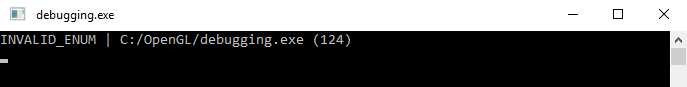
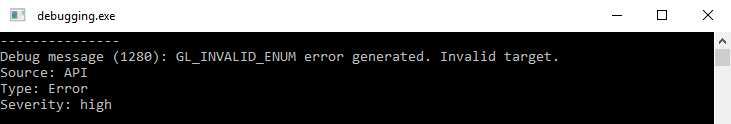
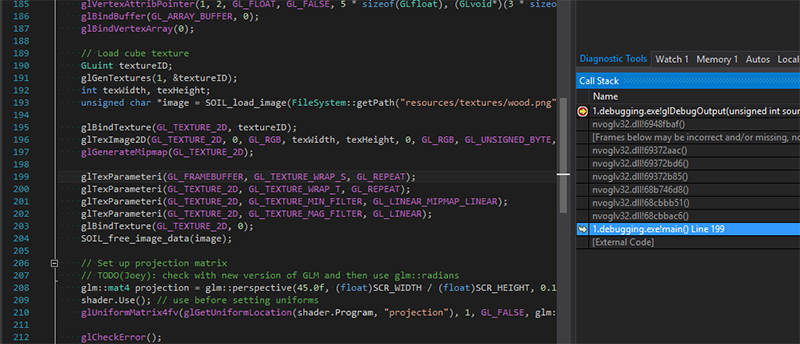
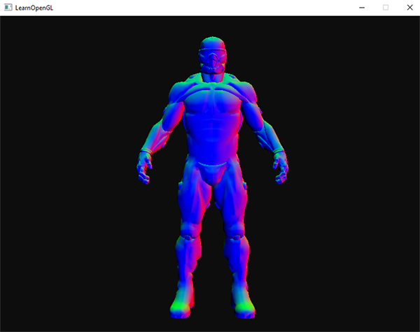
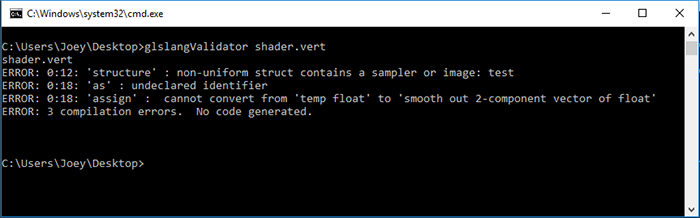
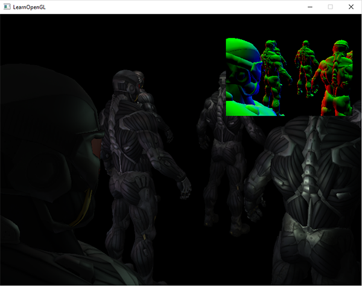
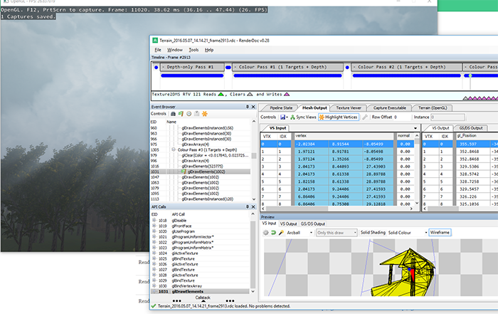
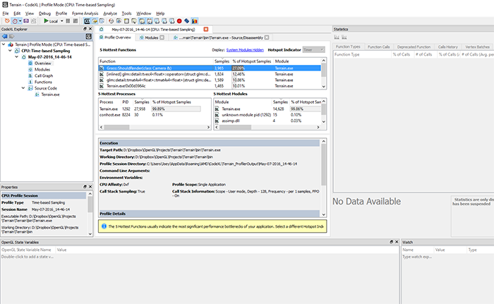
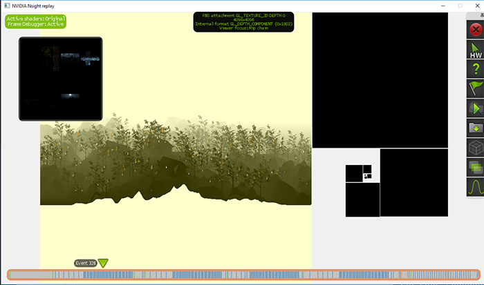

# Learn OpenGL. Урок 7.1 – Отладка

Графическое программирование — не только источник веселья, но еще и фрустрации, когда что-либо не отображается так, как задумывалось, или вообще на экране ничего нет. Видя, что большая часть того, что мы делаем, связана с манипулированием пикселями, может быть трудно выяснить причину ошибки, когда что-то работает не так, как полагается. Отладка такого вида ошибок сложнее, чем отладка ошибок на CPU. У нас нет консоли, в которую мы могли бы вывести текст, мы не можем поставить точку останова в шейдере и мы не можем просто взять и проверить состояние программы на GPU.

В этом уроке мы познакомимся с некоторыми методами и приемами отладки вашей OpenGL-программы. Отладка в OpenGL не так сложна, и изучение некоторых приемов обязательно окупится.

## glGetError()

Когда вы некорректно используете OpenGL \(к примеру, когда настраиваете буфер, забыв его связать \(to bind\)\), OpenGL заметит и создаст один или несколько пользовательских флагов ошибок за кулисами. Мы можем эти ошибки отследить, вызывая функцию `glGetError()`, которая просто проверяет выставленные флаги ошибок и возвращает значение ошибки, если случились ошибки.

```cpp
GLenum glGetError();
```

Эта функция возвращает флаг ошибки или вообще никакую ошибку. Список возвращаемых значений:

| Флаг | Код | Описание |
| --- | --- | --- |
| GL_NO_ERROR | 0 | Никакой ошибки не сгенерировано после последнего вызова glGetError |
| GL_INVALID_ENUM | 1280 | Установлено, когда параметр перечисления недопустим |
| GL_INVALID_VALUE | 1281 | Установлено, когда значение недопустимо |
| GL_INVALID_OPERATION | 1282 | Установлено, когда команда с заданными параметрами недопустима |
| GL_STACK_OVERFLOW | 1283 | Установлено, когда операция проталкивания данных в стек \(push\) вызывает переполнение стека |
| GL_STACK_UNDERFLOW | 1284 | Установлено, когда операция выталкивания данных из стека \(pop\) происходит с наименьшей точки стека |
| GL_OUT_OF_MEMORY | 1285 | Установлено, когда операция выделения памяти не может выделить достаточное количество памяти |
| GL_INVALID_FRAMEBUFFER_OPERATION | 1286 | Установлено, когда происходит чтение/запись в/из буфер кадра \(framebuffer\), который не завершен |

Внутри документации к функциям OpenGL вы можете найти коды ошибок, которые генерируются функциями, некорректно используемыми. К примеру, если вы посмотрите на документацию к функции `glBindTexture()`, то вы сможете найти коды ошибок, генерируемые этой функцией, в разделе "Ошибки" \(Errors\).

Когда флаг ошибки установлен, никаких других флагов ошибки сгенерировано не будет. Более того, когда *glGetError* вызывается, функция стирает все флаги ошибок \(или только один на распределенной системе, см. ниже\). Это значит, что если вы вызываете *glGetError* один раз после каждого кадра и получаете ошибку, это не значит, что это — единственная ошибка и еще вы не знаете, где произошла эта ошибка.

> Заметьте, что когда OpenGL работает распределенно, как это часто бывает на системах с X11, другие ошибки могут генерироваться, пока у них различные коды. Вызов *glGetError* тогда просто сбрасывает только один из флагов кодов ошибки вместо всех. Из-за этого и рекомендуют вызывать эту функцию в цикле.

```cpp
glBindTexture(GL_TEXTURE_2D, tex);
std::cout << glGetError() << std::endl; // вернет 0 (нет ошибки)
glTexImage2D(GL_TEXTURE_3D, 0, GL_RGB, 512, 512, 0, GL_RGB, GL_UNSIGNED_BYTE, data);
std::cout << glGetError() << std::endl; // вернет 1280 (неверное перечисление)
glGenTextures(-5, textures);
std::cout << glGetError() << std::endl; // вернет 1281 (неверное значение
std::cout << glGetError() << std::endl; // вернет 0 (нет ошибки)
```

Отличительной особенностью *glGetError* является то, что она позволяет относительно легко определить, где может быть любая ошибка, и проверить правильность использования OpenGL. Скажем, что у вас ничего не отрисовывается, и вы не знаете, в чем причина: неправильно установленный кадровый буфер? Забыл установить текстуру? Вызывая *glGetError* везде, вы сможете быстро понять, где возникает первая ошибка.
По умолчанию, *glGetError* сообщает только номер ошибки, который нелегко понять, пока вы не заучиваете номера кодов. Часто имеет смысл написать небольшую функцию, помогающую напечатать строку с ошибкой вместе с местом, откуда вызывается функция.

```cpp
GLenum glCheckError_(const char *file, int line)
{
    GLenum errorCode;
    while ((errorCode = glGetError()) != GL_NO_ERROR)
    {
        std::string error;
        switch (errorCode)
        {
            case GL_INVALID_ENUM:                  error = "INVALID_ENUM"; break;
            case GL_INVALID_VALUE:                 error = "INVALID_VALUE"; break;
            case GL_INVALID_OPERATION:             error = "INVALID_OPERATION"; break;
            case GL_STACK_OVERFLOW:                error = "STACK_OVERFLOW"; break;
            case GL_STACK_UNDERFLOW:               error = "STACK_UNDERFLOW"; break;
            case GL_OUT_OF_MEMORY:                 error = "OUT_OF_MEMORY"; break;
            case GL_INVALID_FRAMEBUFFER_OPERATION: error = "INVALID_FRAMEBUFFER_OPERATION"; break;
        }
        std::cout << error << " | " << file << " (" << line << ")" << std::endl;
    }
    return errorCode;
}
#define glCheckError() glCheckError_(__FILE__, __LINE__) 
```

Если вы решите сделать больше вызовов *glCheckError*, будет полезно знать в каком месте произошла ошибка.

```cpp
glBindBuffer(GL_VERTEX_ARRAY, vbo);
glCheckError();
```

Вывод:



Осталась одна важная вещь: в GLEW есть давний баг: `glewInit()` всегда выставляет флаг *GL_INVALID_ENUM*. Чтобы это исправить, просто вызывайте *glGetError* после *glewInit* чтобы сбросить флаг:

```cpp
glewInit();
glGetError();
```

*glGetError* не сильно помогает, поскольку возвращаемая информация относительно проста, но часто помогает отловить опечатки или отловить место возникновения ошибки. Это простой, но эффективный инструмент для отладки.

## Отладочный вывод

Инструмент менее известный, но полезнее, чем *glCheckError* — расширение OpenGL "debug output" \(Отладочный вывод\), вошедшее в OpenGL 4.3 Core Profile. С этим расширением OpenGL отошлет сообщение об ошибке пользователю с деталями ошибки. Это расширение не только выдает больше информации, но и позволяет отловить ошибки там, где они возникают, используя отладчик.

> Отладочный вывод входит в OpenGL начиная с версии 4.3, что означает, что вы найдете эту функциональность на любой машине, поддерживающей OpenGL 4.3 и выше. Если такая версия недоступна, то можно проверить расширения ARB_debug_output и AMD_debug_output. Также есть непроверенная информация о том, что отладочный вывод не поддерживается на OS X \(автор оригинала и переводчик не тестировали, прошу сообщать автору оригинала или мне в личные сообщения через механизм исправления ошибок, если найдете подтверждение или опровержение данного факта; UPD: Jeka178RUS проверил этот факт: из коробки отладочный вывод не работает, через расширения он не проверял\).

Чтобы начать использовать отладочный вывод, нам надо у OpenGL запросить отладочный контекст во время инициализационного процесса. Этот процесс отличается на разных оконных системах, но здесь мы обсудим только GLFW, но в конце статьи в разделе "Дополнительные материалы" вы можете найти информацию насчет других оконных систем.

### Отладочный вывод в GLFW

Запросить отладочный контекст в GLFW на удивление просто: нужно всего лишь дать подсказку GLFW, что мы хотим контекст с поддержкой отладочного вывода. Нам надо сделать это до вызова *glfwCreateWindow*:

```cpp
glfwWindowHint(GLFW_OPENGL_DEBUG_CONTEXT, GL_TRUE);
```

Как только мы проинициализировали GLFW, у нас должен появиться отладочный контекст, если мы используем OpenGL 4.3 или выше, иначе нам надо попытать удачу и надеяться на то, что система все еще может создать отладочный контекст. В случае неудачи нам надо запросить отладочный вывод через механизм расширений OpenGL.

> Отладочный контекст OpenGL бывает медленнее, чем обычный, так что во время работ над оптимизациями или перед релизом следует убрать или закомментировать эту строчку.

Чтобы проверить результат инициализации отладочного контекста, достаточно выполнить следующий код:

```cpp
GLint flags; 
glGetIntegerv(GL_CONTEXT_FLAGS, &flags);
if (flags & GL_CONTEXT_FLAG_DEBUG_BIT)
{
    // успешно
}
else
{
    // не получилось
}
```

Как работает отладочный вывод? Мы передаем callback-функцию обработчик сообщений в OpenGL (похоже на callback'и в GLFW) и в этой функции мы можем обрабатывать данные OpenGL как нам угодно, в нашем случае — отправка полезных сообщений об ошибках на консоль. Прототип этой функции:

```cpp
void APIENTRY glDebugOutput(GLenum source, GLenum type, GLuint id, GLenum severity, GLsizei length, const GLchar *message, void *userParam);
```

Заметьте, что на некоторых операционных системах тип последнего параметра может быть const void\*.
Учитывая большой набор данных, которыми мы располагаем, мы можем создать полезный инструмент печати ошибок, как показано ниже:

```cpp
void APIENTRY glDebugOutput(GLenum source, 
                            GLenum type, 
                            GLuint id, 
                            GLenum severity, 
                            GLsizei length, 
                            const GLchar *message, 
                            void *userParam)
{
    // ignore non-significant error/warning codes
    if(id == 131169 || id == 131185 || id == 131218 || id == 131204) return; 

    std::cout << "---------------" << std::endl;
    std::cout << "Debug message (" << id << "): " <<  message << std::endl;

    switch (source)
    {
        case GL_DEBUG_SOURCE_API:             std::cout << "Source: API"; break;
        case GL_DEBUG_SOURCE_WINDOW_SYSTEM:   std::cout << "Source: Window System"; break;
        case GL_DEBUG_SOURCE_SHADER_COMPILER: std::cout << "Source: Shader Compiler"; break;
        case GL_DEBUG_SOURCE_THIRD_PARTY:     std::cout << "Source: Third Party"; break;
        case GL_DEBUG_SOURCE_APPLICATION:     std::cout << "Source: Application"; break;
        case GL_DEBUG_SOURCE_OTHER:           std::cout << "Source: Other"; break;
    } std::cout << std::endl;

    switch (type)
    {
        case GL_DEBUG_TYPE_ERROR:               std::cout << "Type: Error"; break;
        case GL_DEBUG_TYPE_DEPRECATED_BEHAVIOR: std::cout << "Type: Deprecated Behaviour"; break;
        case GL_DEBUG_TYPE_UNDEFINED_BEHAVIOR:  std::cout << "Type: Undefined Behaviour"; break; 
        case GL_DEBUG_TYPE_PORTABILITY:         std::cout << "Type: Portability"; break;
        case GL_DEBUG_TYPE_PERFORMANCE:         std::cout << "Type: Performance"; break;
        case GL_DEBUG_TYPE_MARKER:              std::cout << "Type: Marker"; break;
        case GL_DEBUG_TYPE_PUSH_GROUP:          std::cout << "Type: Push Group"; break;
        case GL_DEBUG_TYPE_POP_GROUP:           std::cout << "Type: Pop Group"; break;
        case GL_DEBUG_TYPE_OTHER:               std::cout << "Type: Other"; break;
    } std::cout << std::endl;

    switch (severity)
    {
        case GL_DEBUG_SEVERITY_HIGH:         std::cout << "Severity: high"; break;
        case GL_DEBUG_SEVERITY_MEDIUM:       std::cout << "Severity: medium"; break;
        case GL_DEBUG_SEVERITY_LOW:          std::cout << "Severity: low"; break;
        case GL_DEBUG_SEVERITY_NOTIFICATION: std::cout << "Severity: notification"; break;
    } std::cout << std::endl;
    std::cout << std::endl;
}
```

Когда расширение определяет ошибку OpenGL, оно вызовет эту функцию и мы сможем печатать огромное количество информации об ошибке. Заметьте, мы проигнорировали некоторые ошибки, так как они бесполезны \(к примеру, 131185 в драйверах NVidia говорит о том, что буфер успешно создан\).
Теперь, когда у нас есть нужный callback, самое время инициализировать отладочный вывод:

```cpp
if (flags & GL_CONTEXT_FLAG_DEBUG_BIT)
{
    glEnable(GL_DEBUG_OUTPUT);
    glEnable(GL_DEBUG_OUTPUT_SYNCHRONOUS); 
    glDebugMessageCallback(glDebugOutput, nullptr);
    glDebugMessageControl(GL_DONT_CARE, GL_DONT_CARE, GL_DONT_CARE, 0, nullptr, GL_TRUE);
} 
```

Так мы сообщаем OpenGL, что хотим включить отладочный вывод. Вызов glEnable(GL_DEBUG_SYNCRHONOUS) говорит OpenGL, что мы хотим сообщение об ошибке в тот момент, когда только она произошла.

### Фильтрация отладочного вывода

С функцией *glDebugMessageControl* вы можете выбрать типы ошибок, которые хотите получать. В нашем случае мы получаем все виды ошибок. Если бы мы хотели только ошибки OpenGL API, типа Error и уровня значимости High, мы бы написали следующий код:

```cpp
glDebugMessageControl(GL_DEBUG_SOURCE_API, 
                      GL_DEBUG_TYPE_ERROR, 
                      GL_DEBUG_SEVERITY_HIGH,
                      0, nullptr, GL_TRUE); 
```

С такой конфигурацией и отладочным контекстом каждая неверная команда OpenGL будет отправлять много полезной информации:



### Находим источник ошибки через стек вызовов

Еще один трюк с отладочным выводом заключается в том, что вы можете относительно просто установить точное место возникновения ошибки в вашем коде. Устанавливая точку останова в функции DebugOutput на нужном типе ошибки \(или в начале функции если вы хотите отловить все ошибки\) отладчик отловит ошибку и вы сможете переместиться по стеку вызовов, чтобы узнать, где произошла ошибка:



Это требует некоторого ручного вмешательства, но если вы примерно знаете, что ищете, невероятно полезно быстро определить, какой вызов вызывает ошибку.

### Свои ошибки

Наряду с чтением ошибок, мы можем их посылать в систему отладочного вывода с помощью *glDebugMessageInsert*:

```cpp
glDebugMessageInsert(GL_DEBUG_SOURCE_APPLICATION, GL_DEBUG_TYPE_ERROR, 0,
                     GL_DEBUG_SEVERITY_MEDIUM, -1, "error message here");
```

Это очень полезно, если вы подключаетесь к другому приложению или к коду OpenGL, который использует отладочный контекст. Другие разработчики смогут быстро выяснить любую сообщенную ошибку, которая происходит в вашем пользовательском коде OpenGL.
В общем, отладочный вывод \(если доступен\) очень полезен для быстрого отлова ошибок и определенно стоит потраченных усилий на настройку, так как экономит значительное время разработки. Вы можете найти копию исходного кода [здесь](src0.cpp) с использованием *glGetError* и отладочного вывода. Есть ошибки, попробуйте их исправить.

## Отладочный вывод шейдера

Когда дело доходит до GLSL, у нас нет доступа к функции типа *glGetError* или возможности пройтись по коду по шагам в отладчике. Когда вы встречаетесь с черным экраном или совершенно неправильным отображением, бывает очень сложно понять, что происходит, если проблема в шейдере. Да, ошибки компиляции сообщают о синтаксических ошибках, но отлов семантических ошибок — та еще песня.
Один из часто используемых приемов для выяснения того, что не так с шейдером, состоит в том, чтобы отправить все соответствующие переменные в шейдерной программе непосредственно в выходной канал фрагментного шейдера. Выводя шейдерные переменные напрямую в выходной канал с цветом мы можем узнать интересную информацию проверяя картинку на выходе. К примеру, нам надо узнать, правильные ли нормали у модели. Мы можем отправить их \(трансформированными или нет\) из вершинного в фрагментный шейдер, где мы выведем нормали как-то так:

```glsl
#version 330 core
out vec4 FragColor;
in vec3 Normal;
[...]

void main()
{
    [...]
    FragColor.rgb = Normal;
    FragColor.a = 1.0f;
}
```

Выводя нецветовую переменную в выходной канал с цветом как сейчас, мы можем быстро проверить значение переменной. Если, к примеру, результатом стал черный экран, то ясно, что нормали неправильно переданы в шейдеры, а когда они отображаются, сравнительно легко проверить их на правильность:



Из визуальных результатов мы можем видеть, что нормали верны, так как правая сторона костюма преимущественно красная \(что говорит, что нормали примерно показывают в направлении полощительной оси x\) и также передняя сторона костюма окрашена в направлении положительной оси z \(в синий цвет\).

Этот подход можно расширить на любую переменную, которую вы хотите протестировать. Каждый раз, когда вы застряли и предполагаете, что ошибка в шейдерах, попробуйте отрисовывать несколько переменных или промежуточных результатов и выяснить, в какой части алгоритма есть ошибка.

## OpenGL GLSL reference compiler

В каждом видеодрайвере свои причуды. К примеру, драйвера NVIDIA немного смягчают требования спецификации, а драйвера AMD лучше соответствую спецификациям \(что лучше, как мне кажется\). Проблема в том, что шейдеры работающие на одной машине, могут не заработать на другой из-за отличий в драйверах.

За несколько лет опыта вы могли выучить все отличия между различными GPU, но если вы хотите быть уверены в том, что ваши шейдеры будут работать везде, то вы можете сверить ваш код с официальной спецификацией с помощью [GLSL reference compiler](https://www.khronos.org/opengles/sdk/tools/Reference-Compiler/). Вы можете скачать так называемый *GLSL lang validator* [тут](https://www.khronos.org/opengles/sdk/tools/Reference-Compiler/) \([исходник](https://github.com/KhronosGroup/glslang)\).

С этой программой вы можете проверить свои шейдеры, передавая их как 1-й аргумент к программе. Помните, что программа определяет тип шейдера по расширению:

- .vert вершинный шейдер
- .frag фрагментный шейдер
- .geom геометрический шейдер
- .tesc тесселяционный контролирующий шейдер
- .tese тесселяционный вычислительный шейдер
- .comp вычислительный шейдер

Запустить программу легко:

```
glslangValidator shader.vert
```

Заметьте, что если нет ошибок, то программа ничего не выведет. На сломанном вершинном шейдере вывод будет похож на:



Программа не покажет различий между компиляторами GLSL от AMD, NVidia или Intel, и даже не может сообщить обо всех багах в шейдере, но он хотя бы проверяет шейдеры на соответствие стандартам.

## Вывод буфера кадра

Еще один метод для вашего инструментария — отобразить содержимое кадрового буфера в определенной части экрана. Скорее всего, вы часто используете кадровые буферы и, поскольку вся магия происходит за кадром, бывает трудно определить, что происходит. Вывод содержимого кадрового буфера — полезный прием, чтобы проверить правильность вещей.

> Заметьте, что содержимое кадрового буфера, как тут объясняется, работает с текстурами, а не с объектами буферов отрисовки

Используя простой шейдер, который отрисовывает одну текстуру, мы можем написать небольшую функцию, быстро отрисовывающую любую текстуру в правом верхнем углу экрана:

```glsl
// vertex shader
#version 330 core
layout (location = 0) in vec2 position;
layout (location = 1) in vec2 texCoords;

out vec2 TexCoords;

void main()
{
    gl_Position = vec4(position, 0.0f, 1.0f);
    TexCoords = texCoords;
}
```

```glsl
//fragment shader
#version 330 core
out vec4 FragColor;
in vec2 TexCoords;

uniform sampler2D fboAttachment;

void main()
{
    FragColor = texture(fboAttachment, TexCoords);
}
```

```cpp
//main.cpp
void DisplayFramebufferTexture(GLuint textureID)
{
    if(!notInitialized)
    {
        // initialize shader and vao w/ NDC vertex coordinates at top-right of the screen
        [...]
    }
    glActiveTexture(GL_TEXTURE0);
    glUseProgram(shaderDisplayFBOOutput);
    glBindTexture(GL_TEXTURE_2D, textureID);
    glBindVertexArray(vaoDebugTexturedRect);
    glDrawArrays(GL_TRIANGLES, 0, 6);
    glBindVertexArray(0);
    glUseProgram(0);
}
int main()
{
    [...]
    while (!glfwWindowShouldClose(window))
    {
        [...]
        DisplayFramebufferTexture(fboAttachment0);
        glfwSwapBuffers(window);
    }
}
```

Это даст вам небольшое окошко в углу экрана для отладочного вывода кадрового буфера. Полезно, к примеру, когда пытаешься проверить корректность нормалей:



Вы также можете расширить эту функцию так, чтобы она отрисовывала больше 1 текстуры. Это быстрый путь получить непрерывную отдачу от чего угодно в кадровых буферах.

## Внешние программы-отладчики

Когда ничего не помогает, есть еще один прием: воспользоваться сторонними программами. Они встраиваются в драйвера OpenGL и могут перехватывать все вызовы OpenGL, чтобы дать вам очень много интересных данных о вашем приложении. Эти приложения могут профилировать использование функций OpenGL, искать узкие места, наблюдать за кадровыми буферами, текстурами и памятью. Во время работы над \(большим\) кодом, эти инструменты могут стать бесценными.

Я перечислил несколько популярных инструментов. Попробуйте каждый и выберите тот, который лучше всего вам подходит.

### RenderDoc

RenderDoc — хороший \(полностью [опенсорсный](https://github.com/baldurk/renderdoc)\) отдельный отладочный инструмент. Чтобы начать захват, выберите исполняемый файл и рабочую папку \(working directory\). Ваше приложение работает как обычно, и когда вы хотите понаблюдать за отдельным кадром, вы позволяете RenderDoc снять несколько кадров вашего приложения. Среди захваченных кадров вы можете просмотреть состояние конвейера, все команды OpenGL, хранилище буферов и используемые текстуры.



### CodeXL

[CodeXL](https://gpuopen.com/compute-product/codexl/) — инструмент отладки GPU, работает как отдельное приложение и плагин к Visual Studio. CodeXL Дает много информации и отлично подходит для профилирования графических приложений. CodeXL также работает на видеокартах от NVidia и Intel, но без поддержки отладки OpenCL.



Я не так много использовал CodeXL, поскольку RenderDoc мне показался проще, но я включил CodeXL в этот список, потому что он выглядит довольно надежным инструментом и в основном разработан одним из крупных производителей графических процессоров.

### NVIDIA Nsight

[Nsight](https://developer.nvidia.com/nsight-visual-studio-edition) — популярный инструмент отладки GPU от NUIDIA. Является не только плагином к Visual Studio и Eclipse, но еще и [отдельное приложение](https://developer.nvidia.com/nsight-graphics). Плагин Nsight — очень полезная вещь для графических разработчиков, поскольку собирает много статистик в реальном времени относительно использования GPU и покадрового состояния GPU.

В тот момент, когда вы запускаете свое приложение через Visual Studio или Eclipse с помощью команд отладки или профилирования Nsight, он запустится сам внутри приложения. Хорошая вещь в Nsight: рендер ГИП-системы \(GUI, графический интерфейс пользователя\) поверх запускаемого приложения, которую можно использовать для собирания информации всех видов о вашем приложении в реальном времени или покадровом анализе.



Nsight — очень полезный инструмент, который, по моему мнению, превосходит вышеперечисленные инструменты, но имеет один серьезный недостаток: работает только на видеокартах от NVIDIA. Если вы работаете на видеокартах от NVIDIA и используете Visual Studio — определенно стоит попробовать Nsight.

Дополнительные материалы

- [Почему я вижу черный экран?](http://retokoradi.com/2014/04/21/opengl-why-is-your-code-producing-a-black-window/) — список возможных случаев появления черного экрана вместо нужной картинки от Reto Koradi.
- [Отладочный вывод](http://web.archive.org/web/20150225171555/http://vallentinsource.com/opengl/debug-output) — обширный список методов настройки отладочного контекста в разных оконных менеджерах от Vallentin Source.
