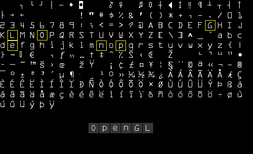
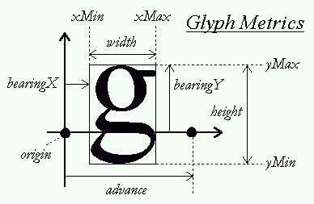
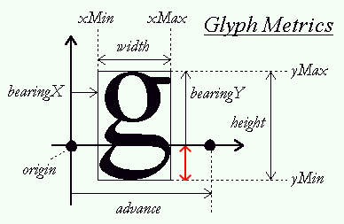
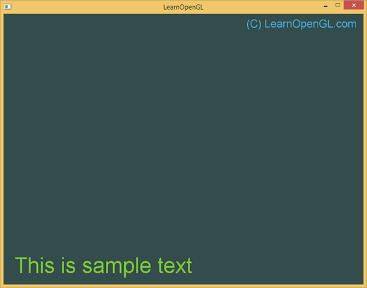
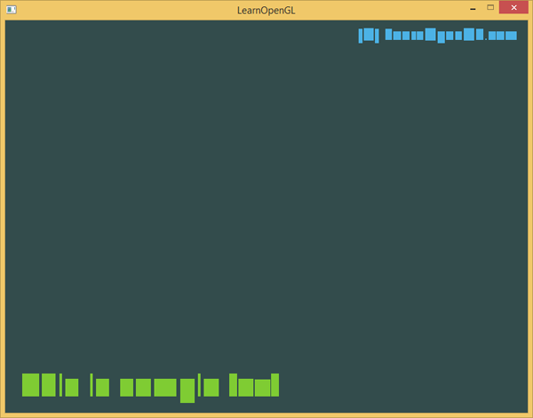

# Learn OpenGL. Урок 7.2 – Отрисовка текста

В некоторый момент ваших графических приключений вам захочется вывести текст через OpenGL. Вопреки тому, что вы могли ожидать, получить простую строку на экране довольно сложно с низкоуровневой библиотекой, такой как OpenGL. Если вам не нужно больше 128 различных символов для отрисовки текста, тогда это не будет сложно. Сложности появляются, когда у символов не совпадают высота, ширина и смещение. В зависимости от того, где вы живете, вам может потребоваться больше 128 символов. А что, если вам захочется спецсимволов, математических или музыкальных символов? Как только вы поймете, что отрисовка текста — не самое простое занятие, то к вам придет осознание того, что это, скорее всего, не должно принадлежать такому низкоуровневому API, как OpenGL.

Поскольку OpenGL не предоставляет никаких средств для отрисовки текста, все трудности этого дела оказываются на нас. Поскольку не существует графического примитива "Символ", нам придется придумывать его самим. Уже есть готовые примеры: рисовать символ через GL_LINES, создать 3D-модели символов или отрисовывать символы на плоские четырехугольники в трехмерном пространстве.

Чаще всего разработчики ~~ленятся пьют кофе~~ выбирают последний вариант. Отрисовать эти текстурированные четырехугольники не так сложно, как выбрать правильную текстуру. В этом уроке мы познакомимся с несколькими способами и напишем свой продвинутый, но гибкий отрисовщик текста с помощью FreeType.

## Классика: растровые шрифты

Давным-давно ~~во времена динозавров~~ отрисовка текста включала в себя выбор шрифта \(или его создание\) для приложения и копирования нужных символов на большую текстуру, называемую растровым шрифтом \(bitmap font\). Эта текстура содержит все нужные символы в определенных ее частях. Эти символы именуются глифами. Каждый глиф имеет определенную область координат текстур, связанную с ним. Каждый раз при отрисовке символа вы выбираете определенный глиф и отрисовываете только нужную часть на плоский четырехугольник.



Здесь вы можете видеть, как мы бы отрисовывали текст "OpenGL". Берем растровый шрифт и сэмплируем нужные глифы из текстуры, аккуратно выбирая текстурные координаты, которые мы будем отрисовывать поверх нескольких четырехугольников. Включая [смешивание](../../part%204/chapter%203/text.md) и сохраняя фон прозрачным, мы получим строку символов на экране. Этот растровый шрифт был сгенерирован используя генератор растровых шрифтов от [Codehead](http://www.codehead.co.uk/cbfg/).

Этот подход имеет свои плюсы и минусы. У этого подхода простая реализация, поскольку растровые шрифты уже растеризованы. Однако, это не всегда удобно. Если нужен другой шрифт, нужно генерировать новый растровый шрифт. Да еще и увеличение размера символов быстро покажет пикселизованные края. Более того, растровые шрифты часто привязаны к небольшому набору символов, так что символы Юникода, скорее всего, отображены не будут.

Данный прием не так давно был популярен \(да и сейчас сохраняет свою популярность\), поскольку очень быстр и работает на любой платформе. Но к настоящему времени существуют другие подходы к отрисовке текста. Один из них — отрисовка TrueType шрифтов с помощью FreeType.

## Современность: FreeType

FreeType — библиотека, которая загружает шрифты, отрисовывает их на битмапы и обеспечивает поддержку некоторых операций, связанных со шрифтом. Эта популярная библиотека используется в Mac OS X, Java, Qt, PlayStation, Linux и Android. Умение загружать TrueType-шрифты делает эту библиотеку достаточно привлекательной.

Шрифт TrueType — это коллекция глифов, определяемых не пикселями, а математическими формулами. Как и в векторных изображениях, растеризованное изображение шрифта может быть сгенерировано на основе предпочитаемого размера шрифта. Используя TrueType шрифты, вы можете с легкостью отрисовывать глифы различных размеров без потерь качества.

FreeType можно скачать с [официального сайта](http://www.freetype.org/). Вы можете либо скомпилировать FreeType сами, либо использовать precompiled-версии, если таковые имеются на сайте. Не забудьте слинковать вашу программу с *freetype.lib* и удостоверьтесь, что компилятор знает, где искать заголовочные файлы.

Затем подключите правильные заголовочные файлы:

```cpp
#include <ft2build.h>
#include FT_FREETYPE_H
```

> Поскольку FreeType разработан немного странным образом \(на момент написания оригинала, дайте знать, если что-то поменялось\), класть его заголовочные файлы можно только в корень папок с заголовочными файлами. Подключая FreeType как-то иначе \(к примеру, `#include <3rdParty/FreeType/ft2build.h>`\) может спровоцировать конфликт заголовочных файлов.

Что же делает FreeType? Загружает TrueType шрифты и для каждого глифа генерирует растровую картинку и вычисляет некоторые метрики глифа. Мы можем получить растровые изображения для генерации текстур и позиционирования каждого глифа в зависимости от полученных метрик.

Чтобы загрузить шрифт, нам надо инициализировать FreeType и загрузить шрифт как face \(так FreeType называет шрифт\). В данном примере мы загружаем TrueType шрифт *arial.ttf*, скопированный из папки C:\/Windows\/Fonts.

```cpp
FT_Library ft;
if (FT_Init_FreeType(&ft))
    std::cout << "ERROR::FREETYPE: Could not init FreeType Library" << std::endl;
FT_Face face;
if (FT_New_Face(ft, "fonts/arial.ttf", 0, &face))
    std::cout << "ERROR::FREETYPE: Failed to load font" << std::endl;
```

Каждая из этих функций FreeType возвращает ненулевое значение в случае неудачи.

Как только мы загрузили ~~морду шрифта~~ face, нам надо указать желаемый размер шрифта, который мы будем извлекать:

```cpp
FT_Set_Pixel_Sizes(face, 0, 48);
```

Данная функция устанавливает ширину и высоту глифа. Устанавливая ширину в 0 \(ноль\) мы позволяем FreeType рассчитывать ширину в зависимости от установленной высоты.

Face FreeType содержит коллекцию глифов. Мы можем сделать какой-то глиф активным вызывая *FT_Load_Char*. Тут мы попробуем загрузить глиф X:

```cpp
if (FT_Load_Char(face, 'X', FT_LOAD_RENDER))
    std::cout << "ERROR::FREETYTPE: Failed to load Glyph" << std::endl;
```

Устанавливая *FT_LOAD_RENDER* как один из флагов загрузки, мы указываем FreeType на создание 8-битного растрового изображения в оттенках серого, которое мы потом можем получить так:

```cpp
face->glyph->bitmap;
```

Глифы, загруженные с помощью FreeType, не одинаковых размеров, как это было в случае растровых шрифтов. Растровое изображение, сгенерированное с помощью FreeType, минимальных размеров для данного размера шрифта и достаточно только для хранения одного символа. К примеру, растровое изображение глифа . намного меньше растрового изображения глифа X. По этой причине FreeType также загружает некоторые метрики, которые показывают, какого размера и где должен быть расположен отдельный символ. Ниже расположено изображение, показывающее, какие метрики FreeType рассчитывает для каждого глифа.



Каждый глиф находится на baseline \(горизонтальная линия со стрелкой\). Некоторые находятся ровно на baseline \(X\), некоторые ниже \(g, p\). Эти метрики точно определяют смещения для точного позиционирования глифов на baseline, настройки размера глифов и чтобы узнать, сколько пикселей нужно оставить для отрисовки следующего глифа. Ниже приведен список метрик, которые мы будем использовать:

- **width** ширина глифа в пикселях, доступ по `face->glyph->bitmap.width`
- **height** высота глифа в пикселях, доступ по `face->glyph->bitmap.rows`
- **bearingX** горизонтальное смещение верхней левой точки глифа по отношению к origin, доступ по `face->glyph->bitmap_left`
- **bearingY** вертикальное смещение верхней левой точки глифа по отношению к origin, доступ по `face->glyph->bitmap_top`
- **advance** горизонтальное смещение начала следующего глифа в 1\/64 пикселях по отношению к origin, доступ по `face->glyph->advance.x`

Мы можем загрузить глиф символа, получить его метрики и генерировать текстуру каждый раз, когда хотим отрисовать его на экран, но на каждом кадре создавать текстуры для отдельного символа — это не самый хороший метод. Лучше мы будем сохранять где-нибудь сгенерированные данные и запрашивать их тогда, когда они нам понадобятся. Определим удобную структуру, которую мы будем хранить в *std::map*:

```cpp
struct Character {
    GLuint     TextureID; // ID текстуры глифа
    glm::ivec2 Size;      // Размеры глифа
    glm::ivec2 Bearing;   // Смещение верхней левой точки глифа
    GLuint     Advance;   // Горизонтальное смещение до начала следующего глифа
};

std::map<GLchar, Character> Characters;
```

В этой статье мы упростим себе жизнь и будем использовать только первые 128 символов. Для каждого символа мы сгенерируем текстуру и сохраним нуждые данные в структуру типа Character, которую мы добавим в Characters типа *std::map*. Таким образом, все данные, нужные для отрисовки символа сохраняются для дальнейшего использования.

```cpp
glPixelStorei(GL_UNPACK_ALIGNMENT, 1); // Disable byte-alignment restriction

for (GLubyte c = 0; c < 128; c++)
{
    // Load character glyph
    if (FT_Load_Char(face, c, FT_LOAD_RENDER))
    {
        std::cout << "ERROR::FREETYTPE: Failed to load Glyph" << std::endl;
        continue;
    }
    // Generate texture
    GLuint texture;
    glGenTextures(1, &texture);
    glBindTexture(GL_TEXTURE_2D, texture);
    glTexImage2D(
        GL_TEXTURE_2D,
        0,
        GL_RED,
        face->glyph->bitmap.width,
        face->glyph->bitmap.rows,
        0,
        GL_RED,
        GL_UNSIGNED_BYTE,
        face->glyph->bitmap.buffer
    );
    // Set texture options
    glTexParameteri(GL_TEXTURE_2D, GL_TEXTURE_WRAP_S, GL_CLAMP_TO_EDGE);
    glTexParameteri(GL_TEXTURE_2D, GL_TEXTURE_WRAP_T, GL_CLAMP_TO_EDGE);
    glTexParameteri(GL_TEXTURE_2D, GL_TEXTURE_MIN_FILTER, GL_LINEAR);
    glTexParameteri(GL_TEXTURE_2D, GL_TEXTURE_MAG_FILTER, GL_LINEAR);
    // Now store character for later use
    Character character = {
        texture,
        glm::ivec2(face->glyph->bitmap.width, face->glyph->bitmap.rows),
        glm::ivec2(face->glyph->bitmap_left, face->glyph->bitmap_top),
        face->glyph->advance.x
    };
    Characters.insert(std::pair<GLchar, Character>(c, character));
    // Characters[c] = character;
}
```

Внутри цикла мы для каждого из первых 128 символов получаем глиф, генерируем текстуру, устанавливаем его настройки и сохраняем метрики. Интересно подметить, что мы используем GL_RED в качестве аргументов *internalFormat* и *format* текстуры. Битмап, сгенерированный из глифа — 8-битное изображение в оттенках серого, каждый пиксель которого занимает 1 байт. По этой причине мы будем хранить буфер битмапа в качестве значения цвета текстуры. Это достигается созданием текстуры, в которой каждый байт соответствует красному компоненту цвета. Если мы используем 1 байт для представления цветов текстуры, не стоит забывать об ограничениях OpenGL:

```cpp
glPixelStorei(GL_UNPACK_ALIGNMENT, 1);
```

OpenGL требует, чтобы все текстуры имели 4-байтное смещение, т.е. их размер должен быть кратен 4 байтам \(например 8 байт, 4000 байт, 2048 байт\) или\(и\) они должны использовать 4 байта на пиксель \(как например в формате RGBA\), но поскольку мы используем 1 байт на пиксель, они могут иметь разную ширину. Устанавливая смещение распаковки \(unpack alignment, есть лучше перевод?\) в 1 мы уничтожаем ошибки смещения, которые могли вызвать segfault'ы.

Также, когда мы закончили работать с самим шрифтом, следует очистить ресурсы FreeType:

```cpp
FT_Done_Face(face);   // Завершение работы с шрифтом face
FT_Done_FreeType(ft); // Завершение работы FreeType
```

## Шейдеры

Чтобы отрисовывать глифы, воспользуемся следующим вершинным шейдером:

```glsl
#version 330 core
layout (location = 0) in vec4 vertex; // <vec2 pos, vec2 tex_coord>
out vec2 TexCoords;

uniform mat4 projection;

void main()
{
    gl_Position = projection * vec4(vertex.xy, 0.0, 1.0);
    TexCoords = vertex.zw;
}
```

Мы комбинируем позицию символа и текстурные координаты в одном vec4. Вершинный шейдер вычисляет произведение координат с матрицей проекции и передает текстурные координаты фрагментному шейдеру:

```glsl
#version 330 core
in vec2 TexCoords;
out vec4 color;

uniform sampler2D text;
uniform vec3 textColor;

void main()
{
    vec4 sampled = vec4(1.0, 1.0, 1.0, texture(text, TexCoords).r);
    color = vec4(textColor, 1.0) * sampled;
}
```

Фрагментный шейдер принимает 2 глобальные переменные — монохромное изображение глифа и цвет самого глифа. Для начала мы сэмплируем значение цвета глифа. Поскольку данные текстуры хранятся в красном компоненте текстуры, мы сэмплируем только r-компонент как значение прозрачности. Изменяя прозрачность цвета полученный цвет будет прозрачен для фона глифа и непрозрачен для настоящих пикселей глифа. Также мы перемножаем цвета RGB с голбальной переменной *textColor*, чтобы изменять цвет текста.

Но чтобы наш механизм заработал, нужно включить смешивание:

```cpp
glEnable(GL_BLEND);
glBlendFunc(GL_SRC_ALPHA, GL_ONE_MINUS_SRC_ALPHA);
```

В качестве матрицы проекции у нас будет ортографическая матрица проекции. Для отрисовки текста на самом деле перспективная матрица не требуется и использование ортографической проекции также позволяет нам задавать все вершинные координаты в экранных координатах, если мы установим матрицу так:

```cpp
glm::mat4 projection = glm::ortho(0.0f, 800.0f, 0.0f, 600.0f);
```

Мы установили низ матрицы в 0.0f, верх — в высоту окна. В результате координата y принимает значения от низа экрана \(y = 0\) до верха экрана \(y = 600\). Это означает, что точка \(0, 0\) указывает а нижний левый угол экрана.

В заключение создадим VBO и VAO для отрисовки четырехугольников. Здесь мы резервируем достаточно памяти в VBO так, чтобы мы могли потом обновлять данные для отрисовки символов.

```cpp
GLuint VAO, VBO;
glGenVertexArrays(1, &VAO);
glGenBuffers(1, &VBO);
glBindVertexArray(VAO);
glBindBuffer(GL_ARRAY_BUFFER, VBO);
glBufferData(GL_ARRAY_BUFFER, sizeof(GLfloat) * 6 * 4, NULL, GL_DYNAMIC_DRAW);
glEnableVertexAttribArray(0);
glVertexAttribPointer(0, 4, GL_FLOAT, GL_FALSE, 4 * sizeof(GLfloat), 0);
glBindBuffer(GL_ARRAY_BUFFER, 0);
glBindVertexArray(0);
```

Плоский четырехугольник требует 6 вершин из 4 чисел с плавающей запятой, так что мы резервируем 6 \* 4 = 24 float'а памяти. Поскольку мы собираемся достаточно часто менять вершинные данные, мы выделяем память с помощью GL_DYNAMIC_DRAW.

## Вывод строки текста на экран

Чтобы вывести строку текста, мы извлечем соответствующую символу структуру Character и вычислим размеры четырехугольника из метрик символа. Из вычисленных размеров четырехугольника мы "на лету" создаем набор из 6 вершин и обновляем вершинные данные с помощью *glBufferSubData*.

Сделаем для удобства функцию *RenderText*, которая будет отрисовывать строку символов:

```cpp
void RenderText(Shader &s, std::string text, GLfloat x, GLfloat y, GLfloat scale, glm::vec3 color)
{
    // Activate corresponding render state
    s.Use();
    glUniform3f(glGetUniformLocation(s.Program, "textColor"), color.x, color.y, color.z);
    glActiveTexture(GL_TEXTURE0);
    glBindVertexArray(VAO);

    // Iterate through all characters
    std::string::const_iterator c;
    for (c = text.begin(); c != text.end(); c++)
    {
        Character ch = Characters[*c];

        GLfloat xpos = x + ch.Bearing.x * scale;
        GLfloat ypos = y - (ch.Size.y - ch.Bearing.y) * scale;

        GLfloat w = ch.Size.x * scale;
        GLfloat h = ch.Size.y * scale;
        // Update VBO for each character
        GLfloat vertices[6][4] = {
            { xpos, ypos + h, 0.0, 0.0 },
            { xpos, ypos, 0.0, 1.0 },
            { xpos + w, ypos, 1.0, 1.0 },
            { xpos, ypos + h, 0.0, 0.0 },
            { xpos + w, ypos, 1.0, 1.0 },
            { xpos + w, ypos + h, 1.0, 0.0 }
        };
        // Render glyph texture over quad
        glBindTexture(GL_TEXTURE_2D, ch.textureID);
        // Update content of VBO memory
        glBindBuffer(GL_ARRAY_BUFFER, VBO);
        glBufferSubData(GL_ARRAY_BUFFER, 0, sizeof(vertices), vertices);
        glBindBuffer(GL_ARRAY_BUFFER, 0);
        // Render quad
        glDrawArrays(GL_TRIANGLES, 0, 6);
        // Now advance cursors for next glyph (note that advance is number of 1/64 pixels)
        x += (ch.Advance >> 6) * scale; // Bitshift by 6 to get value in pixels (2^6 = 64)
    }
    glBindVertexArray(0);
    glBindTexture(GL_TEXTURE_2D, 0);
}
```

Содержимое функции относительно понятно: расчет origin, размеров и вершин четырехугольника. Заметьте, что мы умножили каждую метрику на *scale*. После этого обновляем VBO и отрисовываем четырехугольник.

Эта строка кода требует некоторого внимания:

```cpp
GLfloat ypos = y - (ch.Size.y - ch.Bearing.y);
```

Некоторые символы, как например p и g, отрисовываются заметно ниже baseline, значит, четырехугольник должен быть заметно ниже параметра y функции *RenderText*. Точное смещение *y_offset* можно выразить из метрик глифа:



Чтобы рассчитать смещение, нам потребуется ~~прямые руки~~ узнать расстояние, на которое символ располагается ниже baseline. Это расстояние показано красной стрелкой. Очевидно, что *y_offset = bearingY - height и ypos = y + y_offset*.

Если все сделано верно, можно отображать текст на экране так:

```cpp
RenderText(shader, "This is sample text", 25.0f, 25.0f, 1.0f, glm::vec3(0.5, 0.8f, 0.2f));
RenderText(shader, "(C) LearnOpenGL.com", 540.0f, 570.0f, 0.5f, glm::vec3(0.3, 0.7f, 0.9f));
```

Результат должен выглядеть так:



Код примера [тут](src0.cpp).

Чтобы понять, какие четырехугольники отрисовываются, отключим смешивание:



Из этого рисунка очевидно, что большинство четырехугольников находятся поверх воображаемой baseline, хотя некоторые символы, такие как \( и p, смещены вниз.

## Что же далее?

Эта статья показала, как можно отрисовывать TrueType шрифты с помощью FreeType. Данный подход гибок, масштабируем и работоспособен на различных кодировках символов. Однако, данный подход может быть слишком нагружен для вашего приложения, поскольку на каждый символ создается текстура. Производительные растровые шрифты предпочитаемы, поскольку у нас одна текстура на все глифы. Лучший подход — совместить два подхода и взять лучшее: "на лету" генерировать растровый шрифт из глифов, загруженных с помощью FreeType. Это избавит рендерер от многочисленных переключений текстур и, в зависимости от упаковки текстуры, увеличит производительность.

Но у FreeType есть еще один недостаток: глифы фиксированного размера, значит, при увеличении размера отрисовываемого глифа на экране могут появиться ступеньки и при повороте глиф может выглядеть размыто. Valve [решила](https://web.archive.org/web/20120815035559/http://www.valvesoftware.com/publications/2007/SIGGRAPH2007_AlphaTestedMagnification.pdf) \(ссылка на вебархив\) эту проблему несколько лет назад с применением signed distance fields. У них получилось очень хорошо и они показали это на 3D-приложениях.
