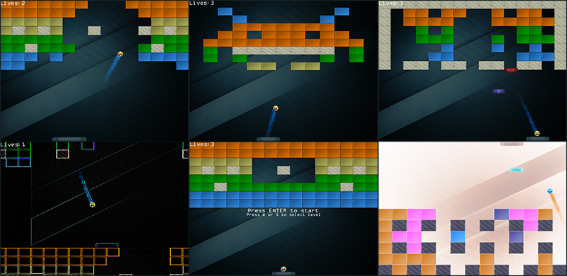

# Breakout

Из этих глав мы узнали о внутренней работе OpenGL и о том, как мы можем использовать их для создания красивой графики. Однако, помимо множества технических демонстраций, мы не рассматривали практического применения OpenGL. Это введение в большую главу о создании относительно простой 2D-игры с использованием OpenGL. В следующих главах будет продемонстрировано, как мы можем использовании OpenGL в более крупных и сложных проетах. Обратите внимание, что глава не обязательно представляет новые концепции OpenGL, но более или менее показывает, как мы можем применить эти концепции к большому целому.

Поскольку мы предпочитаем не усложнять ситуацию, мы собираемся основывать нашу 2D-игру на уже существующей аркадной игре. Представляем Breakout, классическую 2D-игру, выпущенную в 1976 году на консоли Atari 2600. Целью игры является, чтобы игрок, управляющий небольшим горизонтальной платформой, уничтожил все кирпичи, отскакивая маленький шарик от каждого кирпича, не позволяя мячу упасть вниз. Как только игрок уничтожает все кирпичи, он заканчивает игру.

Ниже мы можем увидеть, как Breakout изначально выглядел на Atari 2600:

Игра имеет следующие механики:

- Небольшая платформа управляется игроком и может перемещаться только горизонтально в пределах экрана.
- мяч перемещается по экрану, и каждое столкновение приводит к тому, что шар меняет свое направление в зависимости от того, где он попал; это относится к границам экрана, кирпичам и платформе.
- Если мяч достигает нижнего края экрана, игрок либо завершает игру, либо теряет жизнь.
- Как только кирпич касается шара, кирпич разрушается.
- Игрок выигрывает, как только все кирпичи уничтожены.
- Направление мяча зависит от того, насколько далеко мяч отскакивает от центра платформы.

Поскольку время от времени шар может обнаружить небольшой разрыв, достигающий области над кирпичной стеной, он будет продолжать подпрыгивать вверх и вперед между верхним краем уровня и верхним краем кирпичного слоя. Мяч продолжает это до тех пор, пока в конце концов снова не обнаружит разрыв. Это логично, откуда игра получила свое название, поскольку мяч должен вырваться.

# OpenGL Breakout

Мы возьмем эту классическую аркадную игру за основу 2D-игры, которую мы полностью реализуем с помощью OpenGL. Эта версия Breakout будет отображать свою графику на GPU, что дает нам возможность улучшить классическую игру Breakout с некоторыми приятными дополнительными функциями.

Помимо классической механики, наша версия Breakout будет включать в себя:

- Потрясающая графика
- Частицы
- Текст
- Улучшения
- Эффекты постобработки
- Несколько \(настраиваемых\) уровней

Чтобы вы были в восторге, вы можете посмотреть, как будет выглядеть игра после того, как вы закончили следующие гчасти главы:

Части этой главы объединят большое количество концепций из предыдущих глав и продемонстрируют, как они могут работать вместе в целом. Поэтому важно, по крайней мере, закончить главу [Начало работы](../../../part%201/chapter%201/text.md) прежде чем приступить к работе над этими частями.

Кроме того, несколько частей потребуют концепций из других глав \([Кадровый буфер](../../../part%204/chapter%205/text.md) например, из раздела Продвинутые возможности OpenGL\), поэтому при необходимости перечисляются необходимые главы.

Если вы уверены, что готовы испачкать руки, переходите к [следующей части](../../chapter%203/section%202/text.md).
