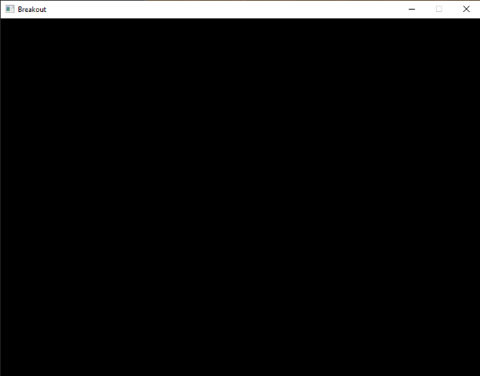

# Настройка

Перед тем как мы приступим к разработке игровой механики, для начала необходимо произвести базовые настройки игровой среды. Игра будет использовать некоторые сторонние библиотеки работа с большинством из них была описана в предыдущих главах. Там где потребуется использование новой библиотеки, работа с ней будет представлена соответствующим образом.

Для начала, мы определяем класс самой игры game который содержит весь необходимый код отрисовки и игровой логики. Идея создания такого игрового класса заключается в том. что он \(косвенно\) организует игровой движок, в то время как окно приложения разрабатывается отдельно. Таким образом, вы можете использовать один и тот же класс с совершенно разными библиотеками по созданию окна приложения \(например SDL или SFML\) без каких либо проблем.

> Существует множество способов и попыток сделать абстрактным или разделить игровой/графический код на классы и объекты. То что вы увидите в этой главе - это всего лишь один \(относительно простой\) способ решения этой задачи. Если вы считаете что есть более правильный подход, то постарайтесть придумать свою версию как реализовать эту задачу лучше.

Класс game содержит в себе функции: инициализации, обновления, обработки ввода, а также функцию отрисовки \(рендера\):

```cpp
class Game
{
    public:
        // состояние игрового процесса
        GameState    State;	
        bool         Keys[1024];
        unsigned int Width, Height;
        // конструктор/деструктор
        Game(unsigned int width, unsigned int height);
        ~Game();
        // инициализация игрового процесса (загрузка всех шейдеров/текструр/уровней)
        void Init();
        // игровой цикл
        void ProcessInput(float dt);
        void Update(float dt);
        void Render();
};
```

Класс содержит в себе все то что вы можете ожидать от игрового класса. Мы инициализируем ширину и высоту \(игровое разрешение\) а также используем *Init* функцию для загрузки шейдеров, текстур и  инициализации всего игрового процесса. Мы можем считывать нажатие кнопок клавиатуры по средствам вызова функции *ProcessInput*, и обрабатывать все игровые события \(например движение игрока\/шара\) в функции *Update*. В конечном итоге, мы рисуем игру по средствам вызова функции *Render*. Учтите что логика движения идет отдельно от логики отрисовки (рендера).

Класс *Game* также содержит так называемые переменные состояния которым присваивается тип GameState как показано ниже:

```cpp
// Представляет текущее состояние игры
enum GameState {
    GAME_ACTIVE,
    GAME_MENU,
    GAME_WIN
}; 
```

Это позволяет нам отслеживать в каком текущем состоянии находится игра. таким оразом, мы можем производить настройку рендера и\/или обрабатывать события основываясь на текущем состоянии игры \(мы рендерим и обрабатываем различные предметы когда например находимся в игровом меню\).

На данный момент, функции игрового класса полностью пустые поскольку нам еще предстоит написать сам код игры, но здесь уже есть заголовочные файлы класса "Game": [заголовок](game.h) and [код реализации](game.cpp).

## Утилиты

Поскольку мы создаем большое приложение нам часто придется повторно использовать некоторые концепты OpenGL, такие как текстуры и шейдеры. Таким образом имеет смысл создать более простой в использовании интерфейс для этих двух элементов по аналогии как мы делали это в предыдущих главах где создавали класс самого шейдера.

Мы определяем класс шейдера который генерирует откомпилированный шейдер \(или генерирует код ошибки\) из двух или трех строк \(если присутствует геометрический шейдер\). Класс шейдера также содержит в себе множество полезных вспомогательных функций  для быстрой установки значений юниформ. Мы также определяем класс текстуры  который генерирует 2D изображение \(на основе свойств\) из байтового массива и заданной ширины и высоты. Класс текстуры также содержит в себе вспомогательные функции.

Мы не бужем погружаться в детали создания классов поскольку к этому моменту вы должны понимать как они работают. Для этого вы можете посмотреть на код заголовочного и файла реализации , полностью с комментариями, ниже:

- Shader: [header](shader.h), [code](shader.cpp).
- Texture: [header](texture.h), [code](texture.cpp).

Учтите что текущий класс текстуры едва ли учитывает все требования к реализации только 2D текстур, но может быть легко доработан для альтернативных типов текстур.

## Управление ресурсами

В то время как классы текстур и шейдеров работают сами по себе, они действительно требуется массив байтов или список строк для инициализации. Мы можем с легкостью добавить функционал загрузки файла в сами классы, но это несколько нарушает принцип единного подхода к реализации. Лучше мы сфокусируемся на разработке самих текстур или шейдеров соответственно, не затрагивая механизм их файловой загрузки.

По этой причине зачастую считается более рациональным создание единного компонента направленного на загрузку игровых ресурсов называемого - менеджером ресурсов. Существует несколько способов создания менеджера ресурсов; в этой главе мы решили использовать метод singleton static resource manager который \(в связи со своим статическим происхождением\) доступен во всем проекте и в целом содержит все загруженные ресурсы и связанный с ними функционал. 

>Singleton - порождающий шаблон проектирования, гарантирующий что в однопроцессном приложении будет единственный экземпляр некторого класса. Прим. переводчика

Использование однопроцессного singleton класса в совокупности со статическим функционалом дает некоторые преимущества и недостатки, к недостаткам можно отнести по большей части потерю некоторых свойств ООП и меньший контроль над конструктором\/деструктором класса. Как бы то не было, для такого небольшого проекта как этот с этим будет легко работать.

По аналогии с другими классами, файлы класса менеджера ресурсов представлены здесь:

- Resource Manager: [header](resource_manager.h), [code](resource_manager.cpp).

Используя менеджер ресурсов, мы можем с легкостью загрузить шейдеры в программу как показано ниже:

```cpp
Shader shader = ResourceManager::LoadShader("vertex.vs", "fragment.vs", nullptr, "test");
// затем использовать их
shader.Use();
// или
ResourceManager::GetShader("test").Use();
```

Определенный класс *Game* вместе с менеджером ресурсов и лего управляемыми классами *Shader* и *Texture2D*, определяют базу для последующих глав так как мы будем широко использовать эти классы для реализации "Арканоида".

## Программа 

Нам все еще остается нужным окно для вывода представления игры и установки некоторых начальных OpenGL состояний по мере использования функций [смешивания](../../../part%204/chapter%203/text.md). Мы не используем проверку глубины, поскольку игра полностью в 2D. Все вершины определены с одним и тем же параметром z-value таким образом включение  опции проверки глубины не повлияет на результат отображения и может вызвать дополнительные ошибки.

Код инициализации игры "Арканоид" относительно простой: мы создаем GLFW окно, регистрируем некоторые функции обратного вызова, создаем объект класса *Game*, и передаем весь необходимый функционал в класс игры. Код представлен ниже:

- Program: [code](program.cpp).

После запуска кода вы должны получить следующий результат:



На данный момент у нас есть прочная основа для последующих уроков; мы будем постоянно совершенствовать игровой класс добавляя в него новый функционал. Переходите к  [следующей главе](../../chapter%203/section%203/text.md) как только будите готовы.
