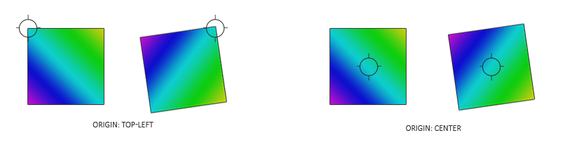
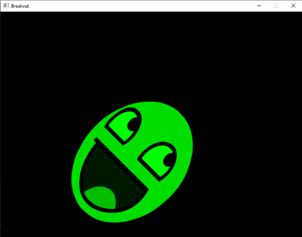

# Rendering Sprites

To bring some life to the currently black abyss of our game world, we will render sprites to fill the void. A sprite has many definitions, but it's effectively not much more than a 2D image used together with some data to position it in a larger world \(e.g. position, rotation, and size\). Basically, sprites are the render-able image\/texture objects we use in a 2D game.

We can, just like we did in previous chapters, create a 2D shape out of vertex data, pass all data to the GPU, and transform it all by hand. However, in a larger application like this we rather have some abstractions on rendering 2D shapes. If we were to manually define these shapes and transformations for each object, it'll quickly get messy.

In this chapter we'll define a rendering class that allows us to render a large amount of unique sprites with a minimal amount of code. This way, we're abstracting the gameplay code from the gritty OpenGL rendering code as is commonly done in larger projects. First, we have to set up a proper projection matrix though.

## 2D projection matrix

We know from the [coordinate systems](../../../part%201/chapter%208/text.md) chapter that a projection matrix converts all view-space coordinates to clip-space \(and then to normalized device\) coordinates. By generating the appropriate projection matrix we can work with different coordinates that are easier to work with, compared to directly specifying all coordinates as normalized device coordinates.

We don't need any perspective applied to the coordinates, since the game is entirely in 2D, so an orthographic projection matrix would suit the rendering quite well. Because an orthographic projection matrix directly transforms all coordinates to normalized device coordinates, we can choose to specify the world coordinates as screen coordinates by defining the projection matrix as follows:

```cpp
glm::mat4 projection = glm::ortho(0.0f, 800.0f, 600.0f, 0.0f, -1.0f, 1.0f);  
```

The first four arguments specify in order the left, right, bottom, and top part of the projection frustum. This projection matrix transforms all x coordinates between 0 and 800 to -1 and 1, and all y coordinates between 0 and 600 to -1 and 1. Here we specified that the top of the frustum has a y coordinate of 0, while the bottom has a y coordinate of 600. The result is that the top-left coordinate of the scene will be at \(0,0\) and the bottom-right part of the screen is at coordinate \(800,600\), just like screen coordinates; the world-space coordinates directly correspond to the resulting pixel coordinates.


This allows us to specify all vertex coordinates equal to the pixel coordinates they end up in on the screen, which is rather intuitive for 2D games.

## Rendering sprites

Rendering an actual sprite shouldn't be too complicated. We create a textured quad that we can transform with a model matrix, after which we project it using the previously defined orthographic projection matrix.

> Since Breakout is a single-scene game, there is no need for a view/camera matrix. Using the projection matrix we can directly transform the world-space coordinates to normalized device coordinates.

To transform a sprite, we use the following vertex shader:

```glsl
#version 330 core
layout (location = 0) in vec4 vertex; // <vec2 position, vec2 texCoords>

out vec2 TexCoords;

uniform mat4 model;
uniform mat4 projection;

void main()
{
    TexCoords = vertex.zw;
    gl_Position = projection * model * vec4(vertex.xy, 0.0, 1.0);
}
```

Note that we store both the position and texture-coordinate data in a single *vec4* variable. Because both the position and texture coordinates contain two floats, we can combine them in a single vertex attribute.

The fragment shader is relatively straightforward as well. We take a texture and a color vector that both affect the final color of the fragment. By having a uniform color vector, we can easily change the color of sprites from the game-code:

```glsl
#version 330 core
in vec2 TexCoords;
out vec4 color;

uniform sampler2D image;
uniform vec3 spriteColor;

void main()
{    
    color = vec4(spriteColor, 1.0) * texture(image, TexCoords);
}  
```

To make the rendering of sprites more organized, we define a *SpriteRenderer* class that is able to render a sprite with just a single function. Its definition is as follows:

```cpp
class SpriteRenderer
{
    public:
        SpriteRenderer(Shader &shader);
        ~SpriteRenderer();

        void DrawSprite(Texture2D &texture, glm::vec2 position, 
            glm::vec2 size = glm::vec2(10.0f, 10.0f), float rotate = 0.0f, 
            glm::vec3 color = glm::vec3(1.0f));
    private:
        Shader       shader; 
        unsigned int quadVAO;

        void initRenderData();
};
```

The SpriteRenderer class hosts a shader object, a single vertex array object, and a render and initialization function. Its constructor takes a shader object that it uses for all future rendering.

### Initialization

First, let's delve into the *initRenderData* function that configures the quadVAO:

```cpp
void SpriteRenderer::initRenderData()
{
    // configure VAO/VBO
    unsigned int VBO;
    float vertices[] = { 
        // pos      // tex
        0.0f, 1.0f, 0.0f, 1.0f,
        1.0f, 0.0f, 1.0f, 0.0f,
        0.0f, 0.0f, 0.0f, 0.0f, 
    
        0.0f, 1.0f, 0.0f, 1.0f,
        1.0f, 1.0f, 1.0f, 1.0f,
        1.0f, 0.0f, 1.0f, 0.0f
    };

    glGenVertexArrays(1, &this->quadVAO);
    glGenBuffers(1, &VBO);
    
    glBindBuffer(GL_ARRAY_BUFFER, VBO);
    glBufferData(GL_ARRAY_BUFFER, sizeof(vertices), vertices, GL_STATIC_DRAW);

    glBindVertexArray(this->quadVAO);
    glEnableVertexAttribArray(0);
    glVertexAttribPointer(0, 4, GL_FLOAT, GL_FALSE, 4 * sizeof(float), (void*)0);
    glBindBuffer(GL_ARRAY_BUFFER, 0);  
    glBindVertexArray(0);
}
```

Here we first define a set of vertices with \(0,0\) being the top-left corner of the quad. This means that when we apply translation or scaling transformations on the quad, they're transformed from the top-left position of the quad. This is commonly accepted in 2D graphics and/or GUI systems where elements' positions correspond to the top-left corner of the elements.

Next we simply sent the vertices to the GPU and configure the vertex attributes, which in this case is a single vertex attribute. We only have to define a single VAO for the sprite renderer since all sprites share the same vertex data.

### Rendering

Rendering sprites is not too difficult; we use the sprite renderer's shader, configure a model matrix, and set the relevant uniforms. What is important here is the order of transformations:

```cpp
void SpriteRenderer::DrawSprite(Texture2D &texture, glm::vec2 position, 
  glm::vec2 size, float rotate, glm::vec3 color)
{
    // prepare transformations
    this->shader.Use();
    glm::mat4 model = glm::mat4(1.0f);
    model = glm::translate(model, glm::vec3(position, 0.0f));  

    model = glm::translate(model, glm::vec3(0.5f * size.x, 0.5f * size.y, 0.0f)); 
    model = glm::rotate(model, glm::radians(rotate), glm::vec3(0.0f, 0.0f, 1.0f)); 
    model = glm::translate(model, glm::vec3(-0.5f * size.x, -0.5f * size.y, 0.0f));

    model = glm::scale(model, glm::vec3(size, 1.0f)); 
  
    this->shader.SetMatrix4("model", model);
    this->shader.SetVector3f("spriteColor", color);
  
    glActiveTexture(GL_TEXTURE0);
    texture.Bind();

    glBindVertexArray(this->quadVAO);
    glDrawArrays(GL_TRIANGLES, 0, 6);
    glBindVertexArray(0);
}  
```

When trying to position objects somewhere in a scene with rotation and scaling transformations, it is advised to first scale, then rotate, and finally translate the object. Because multiplying matrices occurs from right to left, we transform the matrix in reverse order: translate, rotate, and then scale.

The rotation transformation may still seem a bit daunting. We know from the [transformations](../../../part%201/chapter%208/text.md) chapter that rotations always revolve around the origin \(0,0\). Because we specified the quad's vertices with \(0,0\) as the top-left coordinate, all rotations will rotate around this point of \(0,0\). The origin of rotation is at the top-left of the quad, which produces undesirable results. What we want to do is move the origin of rotation to the center of the quad so the quad neatly rotates around this origin, instead of rotating around the top-left of the quad. We solve this by translating the quad by half its size first, so its center is at coordinate \(0,0\) before rotating.



Since we first scale the quad, we have to take the size of the sprite into account when translating to the sprite's center, which is why we multiply with the sprite's size vector. Once the rotation transformation is applied, we reverse the previous translation.

Combining all these transformations, we can position, scale, and rotate each sprite in any way we like. Below you can find the complete source code of the sprite renderer:

- SpriteRenderer: [header](sprite_renderer.h), [code](sprite_renderer.cpp)

## Hello sprite

With the *SpriteRenderer* class we finally have the ability to render actual images to the screen! Let's initialize one within the game code and load our favorite [texture](awesomeface.png) while we're at it:

```cpp
SpriteRenderer  *Renderer;
  
void Game::Init()
{
    // load shaders
    ResourceManager::LoadShader("shaders/sprite.vs", "shaders/sprite.frag", nullptr, "sprite");
    // configure shaders
    glm::mat4 projection = glm::ortho(0.0f, static_cast<float>(this->Width), 
        static_cast<float>(this->Height), 0.0f, -1.0f, 1.0f);
    ResourceManager::GetShader("sprite").Use().SetInteger("image", 0);
    ResourceManager::GetShader("sprite").SetMatrix4("projection", projection);
    // set render-specific controls
    Renderer = new SpriteRenderer(ResourceManager::GetShader("sprite"));
    // load textures
    ResourceManager::LoadTexture("textures/awesomeface.png", true, "face");
}
```

Then within the render function we can render our beloved mascot to see if everything works as it should:

```cpp
void Game::Render()
{
    Renderer->DrawSprite(ResourceManager::GetTexture("face"), 
        glm::vec2(200.0f, 200.0f), glm::vec2(300.0f, 400.0f), 45.0f, glm::vec3(0.0f, 1.0f, 0.0f));
}  
```

Here we position the sprite somewhat close to the center of the screen with its height being slightly larger than its width. We also rotate it by 45 degrees and give it a green color. Note that the position we give the sprite equals the top-left vertex of the sprite's quad.

If you did everything right you should get the following output:



You can find the updated game class's source code [here](game.cpp).

Now that we got the render systems working, we can put it to good use in the [next chapter](../../chapter%203/section%204/text.md) where we'll work on building the game's levels.
