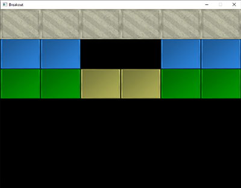
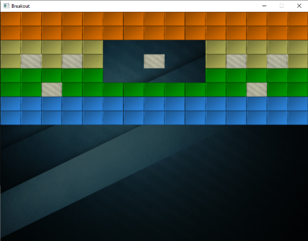
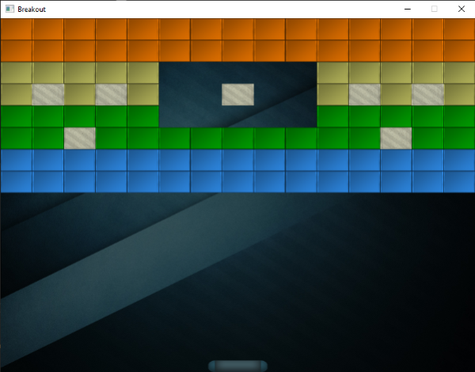

# Levels

Breakout is unfortunately not just about a single happy green face, but contains complete levels with a lot of playfully colored bricks. We want these levels to be configurable such that they can support any number of rows and\/or columns, we want the levels to have solid bricks \(that cannot be destroyed\), we want the levels to support multiple brick colors, and we want them to be stored externally in \(text\) files.

In this chapter we'll briefly walk through the code of a game level object that is used to manage a large amount of bricks. We first have to define what an actual brick is though.

We create a component called a game object that acts as the base representation of an object inside the game. Such a game object holds state data like its position, size, and velocity. It holds a color, a rotation component, whether it is solid and\/or destroyed, and it also stores a *Texture2D* variable as its sprite.

Each object in the game is represented as a *GameObject* or a derivative of this class. You can find the code of the *GameObject* class below:

- GameObject: [header](game_object.h), [code](game_object.cpp)

A level in Breakout consists entirely of bricks so we can represent a level by exactly that: a collection of bricks. Because a brick requires the same state as a game object, we're going to represent each brick of the level as a *GameObject*. The declaration of the *GameLevel* class then looks as follows:

```cpp
class GameLevel
{
public:
    // level state
    std::vector<GameObject> Bricks;
    // constructor
    GameLevel() { }
    // loads level from file
    void Load(const char *file, unsigned int levelWidth, unsigned int levelHeight);
    // render level
    void Draw(SpriteRenderer &renderer);
    // check if the level is completed (all non-solid tiles are destroyed)
    bool IsCompleted();
private:
    // initialize level from tile data
    void init(std::vector<std::vector<unsigned int>> tileData, 
              unsigned int levelWidth, unsigned int levelHeight);
};  
```

Since a level is loaded from an external \(text\) file, we need to propose some kind of level structure. Here is an example of what a game level may look like in a text file:

```
1 1 1 1 1 1 
2 2 0 0 2 2
3 3 4 4 3 3
```

A level is stored in a matrix-like structure where each number represents a type of brick, each one separated by a space. Within the level code we can then assign what each number represents. We have chosen the following representation:

- A number of 0: no brick, an empty space within the level.
- A number of 1: a solid brick, a brick that cannot be destroyed.
- A number higher than 1: a destroyable brick; each subsequent number only differs in color.

The example level listed above would, after being processed by *GameLevel*, look like this:



The *GameLevel* class uses two functions to generate a level from file. It first loads all the numbers in a two-dimensional vector within its *Load* function that then processes these numbers \(to create all game objects\) in its *init* function.

```cpp
void GameLevel::Load(const char *file, unsigned int levelWidth, unsigned int levelHeight)
{
    // clear old data
    this->Bricks.clear();
    // load from file
    unsigned int tileCode;
    GameLevel level;
    std::string line;
    std::ifstream fstream(file);
    std::vector<std::vector<unsigned int>> tileData;
    if (fstream)
    {
        while (std::getline(fstream, line)) // read each line from level file
        {
            std::istringstream sstream(line);
            std::vector<unsigned int> row;
            while (sstream >> tileCode) // read each word separated by spaces
                row.push_back(tileCode);
            tileData.push_back(row);
        }
        if (tileData.size() > 0)
            this->init(tileData, levelWidth, levelHeight);
    }
} 
```

The loaded tileData is then passed to the game level's *init* function:

```cpp
void GameLevel::init(std::vector<std::vector<unsigned int>> tileData, 
                     unsigned int lvlWidth, unsigned int lvlHeight)
{
    // calculate dimensions
    unsigned int height = tileData.size();
    unsigned int width  = tileData[0].size();
    float unit_width    = lvlWidth / static_cast<float>(width);
    float unit_height   = lvlHeight / height;
    // initialize level tiles based on tileData		
    for (unsigned int y = 0; y < height; ++y)
    {
        for (unsigned int x = 0; x < width; ++x)
        {
            // check block type from level data (2D level array)
            if (tileData[y][x] == 1) // solid
            {
                glm::vec2 pos(unit_width * x, unit_height * y);
                glm::vec2 size(unit_width, unit_height);
                GameObject obj(pos, size, 
                    ResourceManager::GetTexture("block_solid"), 
                    glm::vec3(0.8f, 0.8f, 0.7f)
                );
                obj.IsSolid = true;
                this->Bricks.push_back(obj);
            }
            else if (tileData[y][x] > 1)	
            {
                glm::vec3 color = glm::vec3(1.0f); // original: white
                if (tileData[y][x] == 2)
                    color = glm::vec3(0.2f, 0.6f, 1.0f);
                else if (tileData[y][x] == 3)
                    color = glm::vec3(0.0f, 0.7f, 0.0f);
                else if (tileData[y][x] == 4)
                    color = glm::vec3(0.8f, 0.8f, 0.4f);
                else if (tileData[y][x] == 5)
                    color = glm::vec3(1.0f, 0.5f, 0.0f);

                glm::vec2 pos(unit_width * x, unit_height * y);
                glm::vec2 size(unit_width, unit_height);
                this->Bricks.push_back(
                    GameObject(pos, size, ResourceManager::GetTexture("block"), color)
                );
            }
        }
    }  
}
```

The *init* function iterates through each of the loaded numbers and adds a *GameObject* to the level's Bricks vector based on the processed number. The size of each brick is automatically calculated \(unit_width and unit_height\) based on the total number of bricks so that each brick perfectly fits within the screen bounds.

Here we load the game objects with two new textures, a [block](block.png) texture and a [solid block](block_solid.png) texture.


A nice little trick here is that these textures are completely in gray-scale. The effect is that we can neatly manipulate their colors within the game-code by multiplying their grayscale colors with a defined color vector; exactly as we did within the *SpriteRenderer*. This way, customizing the appearance of their colors doesn't look too weird or unbalanced.

The *GameLevel* class also houses a few other functions, like rendering all non-destroyed bricks, or validating if all non-solid bricks are destroyed. You can find the source code of the *GameLevel* class below:

- GameLevel: [header](game_level.h), [code](game_level.cpp)

The game level class gives us a lot of flexibility since any amount of rows and columns are supported and a user could easily create his/her own levels by modifying the level files.

## Within the game

We would like to support multiple levels in the Breakout game so we'll have to extend the game class a little by adding a vector that holds variables of type *GameLevel*. We'll also store the currently active level while we're at it:

```cpp
class Game
{
    [...]
    std::vector<GameLevel> Levels;
    unsigned int           Level;
    [...]  
};
```

This series' version of the Breakout game features a total of 4 levels:

- [Standard](one.lvl)
- [A few small gaps](two.lvl)
- [Space invader](three.lvl)
- [Bounce galore](four.lvl)

Each of the textures and levels are then initialized within the game class's *Init* function:

```cpp
void Game::Init()
{
    [...]
    // load textures
    ResourceManager::LoadTexture("textures/background.jpg", false, "background");
    ResourceManager::LoadTexture("textures/awesomeface.png", true, "face");
    ResourceManager::LoadTexture("textures/block.png", false, "block");
    ResourceManager::LoadTexture("textures/block_solid.png", false, "block_solid");
    // load levels
    GameLevel one; one.Load("levels/one.lvl", this->Width, this->Height / 2);
    GameLevel two; two.Load("levels/two.lvl", this->Width, this->Height / 2);
    GameLevel three; three.Load("levels/three.lvl", this->Width, this->Height / 2);
    GameLevel four; four.Load("levels/four.lvl", this->Width, this->Height / 2);
    this->Levels.push_back(one);
    this->Levels.push_back(two);
    this->Levels.push_back(three);
    this->Levels.push_back(four);
    this->Level = 0;
}  
```

Now all that is left to do, is actually render the level. We accomplish this by calling the currently active level's *Draw* function that in turn calls each *GameObject*'s *Draw* function using the given sprite renderer. Next to the level, we'll also render the scene with a nice [background image](background.jpg) \(courtesy of Tenha\):

```cpp
void Game::Render()
{
    if(this->State == GAME_ACTIVE)
    {
        // draw background
        Renderer->DrawSprite(ResourceManager::GetTexture("background"), 
            glm::vec2(0.0f, 0.0f), glm::vec2(this->Width, this->Height), 0.0f
        );
        // draw level
        this->Levels[this->Level].Draw(*Renderer);
    }
}
```

The result is then a nicely rendered level that really starts to make the game feel more alive:



### The player paddle

While we're at it, we may just as well introduce a paddle at the bottom of the scene that is controlled by the player. The paddle only allows for horizontal movement and whenever it touches any of the scene's edges, its movement should halt. For the player paddle we're going to use the [following](paddle.png) texture:


A paddle object will have a position, a size, and a sprite texture, so it makes sense to define the paddle as a *GameObject* as well:

```cpp
// Initial size of the player paddle
const glm::vec2 PLAYER_SIZE(100.0f, 20.0f);
// Initial velocity of the player paddle
const float PLAYER_VELOCITY(500.0f);

GameObject      *Player;
  
void Game::Init()
{
    [...]    
    ResourceManager::LoadTexture("textures/paddle.png", true, "paddle");
    [...]
    glm::vec2 playerPos = glm::vec2(
        this->Width / 2.0f - PLAYER_SIZE.x / 2.0f, 
        this->Height - PLAYER_SIZE.y
    );
    Player = new GameObject(playerPos, PLAYER_SIZE, ResourceManager::GetTexture("paddle"));
}
```

Here we defined several constant values that define the paddle's size and speed. Within the Game's *Init* function we calculate the starting position of the paddle within the scene. We make sure the player paddle's center is aligned with the horizontal center of the scene.

With the player paddle initialized, we also need to add a statement to the Game's *Render* function:

```cpp
Player->Draw(*Renderer);
```

If you'd start the game now, you would not only see the level, but also a fancy player paddle aligned to the bottom edge of the scene. As of now, it doesn't really do anything so we're going to delve into the Game's *ProcessInput* function to horizontally move the paddle whenever the user presses the A or D key:

```cpp
void Game::ProcessInput(float dt)
{
    if (this->State == GAME_ACTIVE)
    {
        float velocity = PLAYER_VELOCITY * dt;
        // move playerboard
        if (this->Keys[GLFW_KEY_A])
        {
            if (Player->Position.x >= 0.0f)
                Player->Position.x -= velocity;
        }
        if (this->Keys[GLFW_KEY_D])
        {
            if (Player->Position.x <= this->Width - Player->Size.x)
                Player->Position.x += velocity;
        }
    }
} 
```

Here we move the player paddle either in the left or right direction based on which key the user pressed \(note how we multiply the velocity with the deltatime variable\). If the paddle's x value would be less than 0 it would've moved outside the left edge, so we only move the paddle to the left if the paddle's x value is higher than the left edge's x position \(0.0\). We do the same for when the paddle breaches the right edge, but we have to compare the right edge's position with the right edge of the paddle \(subtract the paddle's width from the right edge's x position\).

Now running the game gives us a player paddle that we can move all across the bottom edge:



You can find the updated code of the Game class here:

- Game: [header](game.h), [code](game.cpp)
