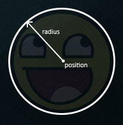

# Collision detection

When trying to determine if a collision occurs between two objects, we generally do not use the vertex data of the objects themselves since these objects often have complicated shapes; this in turn makes the collision detection complicated. For this reason, it is a common practice to use more simple shapes (that usually have a nice mathematical definition) for collision detection that we overlay on top of the original object. We then check for collisions based on these simple shapes; this makes the code easier and saves a lot of performance. A few examples of such collision shapes are circles, spheres, rectangles, and boxes; these are a lot simpler to work with compared to arbitrary meshes with hundreds of triangles.

While the simple shapes do give us easier and more efficient collision detection algorithms, they share a common disadvantage in that these shapes usually do not fully surround the object. The effect is that a collision may be detected that didn't really collide with the actual object; one should always keep in mind that these shapes are just approximations of the real shapes.

## AABB - AABB collisions

AABB stands for axis-aligned bounding box, a rectangular collision shape aligned to the base axes of the scene, which in 2D aligns to the x and y axis. Being axis-aligned means the rectangular box has no rotation and its edges are parallel to the base axes of the scene \(e.g. left and right edge are parallel to the y axis\). The fact that these boxes are always aligned to the axes of the scene makes calculations easier. Here we surround the ball object with an AABB:


Almost all the objects in Breakout are rectangular based objects, so it makes perfect sense to use axis aligned bounding boxes for detecting collisions. This is exactly what we're going to do.

Axis aligned bounding boxes can be defined in several ways. One of them is to define an AABB by a top-left and a bottom-right position. The *GameObject* class that we defined already contains a top-left position \(its Position vector\), and we can easily calculate its bottom-right position by adding its size to the top-left position vector \(Position + Size\). Effectively, each *GameObject* contains an AABB that we can use for collisions.

So how do we check for collisions? A collision occurs when two collision shapes enter each other's regions e.g. the shape that determines the first object is in some way inside the shape of the second object. For AABBs this is quite easy to determine due to the fact that they're aligned to the scene's axes: we check for each axis if the two object' edges on that axis overlap. So we check if the horizontal edges overlap, and if the vertical edges overlap of both objects. If both the horizontal **and** vertical edges overlap we have a collision.


Translating this concept to code is relatively straightforward. We check for overlap on both axes and if so, return a collision:

```cpp
bool CheckCollision(GameObject &one, GameObject &two) // AABB - AABB collision
{
    // collision x-axis?
    bool collisionX = one.Position.x + one.Size.x >= two.Position.x &&
        two.Position.x + two.Size.x >= one.Position.x;
    // collision y-axis?
    bool collisionY = one.Position.y + one.Size.y >= two.Position.y &&
        two.Position.y + two.Size.y >= one.Position.y;
    // collision only if on both axes
    return collisionX && collisionY;
}  
```

We check if the right side of the first object is greater than the left side of the second object and if the second object's right side is greater than the first object's left side; similarly for the vertical axis. If you have trouble visualizing this, try to draw the edges/rectangles on paper and determine this for yourself.

To keep the collision code a bit more organized we add an extra function to the *Game* class:

```cpp
class Game
{
    public:
        [...]
        void DoCollisions();
};
```

Within *DoCollisions*, we check for collisions between the ball object and each brick of the level. If we detect a collision, we set the brick's Destroyed property to true, which instantly stops the level from rendering this brick:

```cpp
void Game::DoCollisions()
{
    for (GameObject &box : this->Levels[this->Level].Bricks)
    {
        if (!box.Destroyed)
        {
            if (CheckCollision(*Ball, box))
            {
                if (!box.IsSolid)
                    box.Destroyed = true;
            }
        }
    }
}  
```

Then we also need to update the game's *Update* function:

```cpp
void Game::Update(float dt)
{
    // update objects
    Ball->Move(dt, this->Width);
    // check for collisions
    this->DoCollisions();
}  
```

If we run the code now, the ball should detect collisions with each of the bricks and if the brick is not solid, the brick is destroyed. If you run the game now it'll look something like this:

[collisions.mp4](collisions.mp4)

While the collision detection does work, it's not very precise since the ball's rectangular collision shape collides with most of the bricks without the ball directly touching them. Let's see if we can figure out a more precise collision detection technique.

## AABB - Circle collision detection

Beacuse the ball is a circle-like object, an AABB is probably not the best choice for the ball's collision shape. The collision code thinks the ball is a rectangular box, so the ball often collides with a brick even though the ball sprite itself isn't yet touching the brick.


It makes much more sense to represent the ball with a circle collision shape instead of an AABB. For this reason we included a Radius variable within the ball object. To define a circle collision shape, all we need is a position vector and a radius.



This does mean we have to update the detection algorithm since it currently only works between two AABBs. Detecting collisions between a circle and a rectangle is a bit more complicated, but the trick is as follows: we find the point on the AABB that is closest to the circle, and if the distance from the circle to this point is less than its radius, we have a collision.

The difficult part is getting this closest point P on the AABB. The following image shows how we can calculate this point for any arbitrary AABB and circle:


We first need to get the difference vector between the ball's center C and the AABB's center B to obtain D. What we then need to do is clamp this vector D to the AABB's half-extents w and h¯ and add it to B. The half-extents of a rectangle are the distances between the rectangle's center and its edges: its size divided by two. This returns a position vector that is always located somewhere at the edge of the AABB (unless the circle's center is inside the AABB).

> A clamp operation **clamps** a value to a value within a given range. This is often expressed as:
> 
> ```cpp
> float clamp(float value, float min, float max) {
>     return std::max(min, std::min(max, value));
> }  
> ```
>
> For example, a value of 42.0f is clamped to 6.0f with a range of 3.0f to 6.0f, and a value of 4.20f would be clamped to 4.20f.
> Clamping a 2D vector means we clamp both its x and its y component within the given range.

This clamped vector P is then the closest point from the AABB to the circle. What we then need to do is calculate a new difference vector D that is the difference between the circle's center C and the vector P.


Now that we have the vector D, we can compare its length to the radius of the circle. If the length of D is less than the circle's radius, we have a collision.

This is all expressed in code as follows:

```cpp
bool CheckCollision(BallObject &one, GameObject &two) // AABB - Circle collision
{
    // get center point circle first 
    glm::vec2 center(one.Position + one.Radius);
    // calculate AABB info (center, half-extents)
    glm::vec2 aabb_half_extents(two.Size.x / 2.0f, two.Size.y / 2.0f);
    glm::vec2 aabb_center(
        two.Position.x + aabb_half_extents.x, 
        two.Position.y + aabb_half_extents.y
    );
    // get difference vector between both centers
    glm::vec2 difference = center - aabb_center;
    glm::vec2 clamped = glm::clamp(difference, -aabb_half_extents, aabb_half_extents);
    // add clamped value to AABB_center and we get the value of box closest to circle
    glm::vec2 closest = aabb_center + clamped;
    // retrieve vector between center circle and closest point AABB and check if length <= radius
    difference = closest - center;
    return glm::length(difference) < one.Radius;
}      
```

We create an overloaded function for *CheckCollision* that specifically deals with the case between a *BallObject* and a *GameObject*. Because we did not store the collision shape information in the objects themselves we have to calculate them: first the center of the ball is calculated, then the AABB's half-extents and its center.

Using these collision shape attributes we calculate vector D as difference that we clamp to clamped and add to the AABB's center to get point P as closest. Then we calculate the difference vector D between center and closest and return whether the two shapes collided or not.

Since we previously called *CheckCollision* with the ball object as its first argument, we do not have to change any code since the overloaded version of *CheckCollision* now automatically applies. The result is now a much more precise collision detection algorithm:

[collisions_circle.mp4](collisions_circle.mp4)

It seems to work, but still, something is off. We properly do all the collision detection, but the ball does not react in any way to the collisions. We need to update the ball's position and/or velocity whenever a collision occurs. This is the topic of the [next](../paragraph%203/text.md) chapter. 
