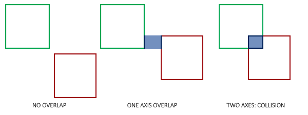
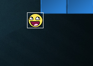

# Определение коллизий

В момент определения коллизии между двумя объектами, мы в основном не используем вершинные данные самих объектов поскольку эти объекты часто имеют сложные формы; это в свою очередь делает механизм определения коллизий достаточно сложным. По этой причине, общепринятой практикой является использование более простых форм \(на это обычно есть математическое тому объяснение\) для определения коллизий поверх основных объектов. Затем мы проверяем коллизии на основе этих простых форм;это делает код проще и улучшает производительность. Некоторые примеры таких коллизий: круги, сферы, квадраты, и кубы; с ними гораздо проще работать по сравнению с произвольными сетками с сотнями треугольников.

В то время как простые формы дают нам более простые и эффективные алгоритмы обнаружения коллизий, они имеют общий недостаток в том, что эти формы обычно не полностью окружают объект. Эффект заключается в том, что можно обнаружить коллизии, которые на самом деле не столкнулось с фактическим объектом; следует всегда иметь в виду, что эти формы являются лишь приближениями реальных фигур.

## AABB - AABB коллизии

AABB означает выравниваемый по оси ограничивающий бокс, прямоугольную форму коллизии, выравниваемую по базовым осям сцены, которая в 2D выравнивается по оси x и y. Выравнивание по осям означает, что прямоугольный ящик не имеет поворота, а его рёбра параллельны базовым осям сцены \(например. левое и правое ребро параллельны оси у\). Тот факт, что эти коробки всегда выравниваются по осям сцены, облегчает вычисления. Здесь мы реализуем объект шара с помощью AABB:


Почти все объекты в Арканоиде - это объекты с прямоугольной базой, так что для обнаружения коллизий вполне целесообразно использовать решетки ограничения на оси. Именно это мы и сделаем.

Ограничивающие поля, выровненные по осям, могут быть определены несколькими способами. Один из них заключается в определении AABB по положению top-left и buttom-right. Класс *GameObject* который мы уже определили содержит top-left положение \(вектор положения\), и мы можем легко рассчитать его правое нижнее положение, добавив его размер к левому верхнему вектору положения \(Положение + Размер\). Фактически, каждый объект класса *GameObject* содержит AABB который мы можем использовать для коллизий.

Итак, как мы проверяем коллизии? Коллизия происходит, когда две формы столкновения входят в области друг друга, т.е. форма, определяющая первый объект, в некотором роде находится внутри формы второго объекта. Для AABB это довольно легко определить из-за того, что они выравниваются по осям сцены: мы проверяем каждую ось, перекрываются ли рёбра двух объектов на этой оси. Мы проверяем, перекрываются ли горизонтальные края и перекрывают ли оба объекта вертикальные края. Если оба края горизонтальный **и** вертикальный перекрываются значит мы получаем коллизию.



Перевод этой концепции в код относительно прост. Мы проверяем перекрытие на обеих осях и, если это так, возвращаем коллизию:

```cpp
bool CheckCollision(GameObject &one, GameObject &two) // AABB - AABB collision
{
    // collision x-axis?
    bool collisionX = one.Position.x + one.Size.x >= two.Position.x &&
        two.Position.x + two.Size.x >= one.Position.x;
    // collision y-axis?
    bool collisionY = one.Position.y + one.Size.y >= two.Position.y &&
        two.Position.y + two.Size.y >= one.Position.y;
    // collision only if on both axes
    return collisionX && collisionY;
}  
```

Мы проверяем, больше ли правая сторона первого объекта левой стороны второго объекта и больше ли правая сторона второго объекта левой стороны; аналогично вертикальной оси. Если у вас возникли проблемы с визуализацией, попробуйте нарисовать рёбра\/прямоугольники на бумаге и посмотреть как это выглядит.

Чтобы сохранить код коллизии немного более организованным, мы добавляем дополнительную функцию в класс *Game* :

```cpp
class Game
{
    public:
        [...]
        void DoCollisions();
};
```

В *Docollisions*, мы проверяем коллизии между объектом мяча и каждым кирпичом уровня. Если мы обнаружим коллизию, то установим свойство кирпича destroyed в true, что немедленно остановит уровень от рендеринга этого кирпича:

```cpp
void Game::DoCollisions()
{
    for (GameObject &box : this->Levels[this->Level].Bricks)
    {
        if (!box.Destroyed)
        {
            if (CheckCollision(*Ball, box))
            {
                if (!box.IsSolid)
                    box.Destroyed = true;
            }
        }
    }
}  
```

Тогда нам также нужно обновить функцию игры *Update* :

```cpp
void Game::Update(float dt)
{
    // update objects
    Ball->Move(dt, this->Width);
    // check for collisions
    this->DoCollisions();
}  
```

Если мы запустим код сейчас, мяч должен обнаружить коллизию с каждым кирпичом, и если кирпич не имеет свойства solid (неразрушаемый), кирпич будет уничтожен. Если запустить игру, это будет выглядеть примерно так:

[collisions.mp4](collisions.mp4)

Хотя обнаружение столкновения работает, оно не очень точное, так как прямоугольная форма столкновения шара сталкивается с большинством кирпичей без прямого соприкосновения мяча. Посмотрим, сможем ли мы найти более точный метод обнаружения коллизий.

## AABB - Обнаружение коллизий круга

Мяч является круглым объектом, AABB, вероятно, не лучший выбор для формы обнаружения коллизий для мяча. Код столкновения думает, что мяч является прямоугольником, поэтому мяч часто сталкивается с кирпичом, хотя сам спрайт еще не касается кирпича.



Гораздо более логично представить мяч с формой коллизии круга вместо AABB. По этой причине мы включили переменную radius в объект мяча. Чтобы определить форму столкновения окружности, нам нужен только вектор положения и радиус.


Это означает, что мы должны обновить алгоритм обнаружения, поскольку в настоящее время он работает только между двумя AABB. Обнаружение столкновений между окружностью и прямоугольником несколько сложнее, но суть в следующем: мы находим точку на AABB, которая ближе всего к окружности, и если расстояние от окружности до этой точки меньше ее радиуса, мы имеем столкновение.

Самое сложное - это получить эту ближайшую точку Р в AABB. Следующее изображение показывает, как мы можем рассчитать эту точку для любого произвольного AABB и окружности:


Сначала нам нужно получить вектор разности между центром шара С и центром В AABB, чтобы получить D. Что нам нужно сделать, так это привести этот вектор D к AABB w и h и добавить его к B. Половина прямоугольника - это расстояния между центром прямоугольника и его рёбрами: его размер делится на два. Это возвращает вектор положения, который всегда находится где-то на краю AABB \(если только центр окружности не находится внутри AABB\).

> Функция **clamps** для преобразования значения к значению в определенном диапазоне. Это выглядит так:
> 
> ```cpp
> float clamp(float value, float min, float max) {
>     return std::max(min, std::min(max, value));
> }  
> ```
>
> например, значение 42.0f приводится к значению 6.0f в диапазоне от 3.0f до 6.0f, а значение 4.20f к 4.20f.
> преобразование 2D вектора означает что мы преобразуем обе компонеты x и y внутри диапазона.

Этот преобразованный вектор Р является ближайшей точкой от AABB до окружности. Тогда нам нужно вычислить новый вектор D, который является разностью между центром окружности С и вектором Р.


Теперь, когда у нас есть вектор D, мы можем сравнить его длину с радиусом круга. Если длина D меньше радиуса круга, происходит коллизия.

В коде это будет выглядеть так:

```cpp
bool CheckCollision(BallObject &one, GameObject &two) // AABB - круг коллизии
{
    // сначала получаем центр круга 
    glm::vec2 center(one.Position + one.Radius);
    // рассчитываем AABB информацию (центр, половинные размеры)
    glm::vec2 aabb_half_extents(two.Size.x / 2.0f, two.Size.y / 2.0f);
    glm::vec2 aabb_center(
        two.Position.x + aabb_half_extents.x, 
        two.Position.y + aabb_half_extents.y
    );
    // получаем вектор разницы между обоими центрами
    glm::vec2 difference = center - aabb_center;
    glm::vec2 clamped = glm::clamp(difference, -aabb_half_extents, aabb_half_extents);
    // добавляем фиксированное значение к AABB_center и получаем значение поля, ближайшего к кругу
    glm::vec2 closest = aabb_center + clamped;
    // получаем вектор между центральным кругом и ближайшей точкой AABB и проверяем, если длина <= радиус
    difference = closest - center;
    return glm::length(difference) < one.Radius;
}      
```

Перегружаем функцию *CheckCollision* которая выступает связующим между *BallObject* и *GameObject*. Поскольку мы не хранили информацию о форме коллизий в самих объектах, мы должны рассчитать их: сначала рассчитывается центр мяча, затем полурасширение AABB и его центр.

Используя эти атрибуты формы коллизии, мы рассчитываем вектор D как разность, которую  добавляем в центр AABB, чтобы получить точку P как ближайшую. Затем мы вычисляем вектор D между центром и ближайшим и возвращаем значение функции независимо от того, столкнутся эти две фигуры или нет.

ак как ранее мы вызывали *Checkcollision* с объектом мяча в качестве первого аргумента, нам не нужно изменять какой-либо код, так как перегруженная версия *Checkcollision* теперь применяется автоматически. В настоящее время результатом является более точный алгоритм обнаружения столкновений:

[collisions_circle.mp4](collisions_circle.mp4)

Кажется, это работает, но все же что-то не так. Мы правильно делаем все обнаружение коллизии, но шар никак не реагирует на столкновения. Нам нужно обновить положение шара и\/или скорость при столкновении. Но это уже тема [следующей](../paragraph%203/text.md) главы. 
