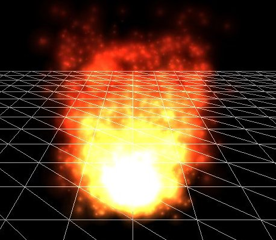

# Particles

A particle, as seen from OpenGL's perspective, is a tiny 2D quad that is always facing the camera (billboarding) and (usually) contains a texture with large parts of the sprite being transparent. A particle by itself is effectively just a sprite as we've been using extensively so far. However, when you put together hundreds or even thousands of these particles together you can create amazing effects.

When working with particles, there is usually an object called a particle emitter or particle generator that, from its location, continously spawns new particles that decay over time. If such a particle emitter would for example spawn tiny particles with a smoke-like texture, color them less bright the larger the distance from the emitter, and give them a glowy appearance, you'd get a fire-like effect:



A single particle often has a life variable that slowly decays once it's spawned. Once its life is less than a certain threshold \(usually 0\), we kill the particle so it can be replaced with a new particle when the next particle spawns. A particle emitter controls all its spawned particles and changes their behavior based on their attributes. A particle generally has the following attributes:

```cpp
struct Particle {
    glm::vec2 Position, Velocity;
    glm::vec4 Color;
    float     Life;
  
    Particle() 
      : Position(0.0f), Velocity(0.0f), Color(1.0f), Life(0.0f) { }
};    
```

Looking at the fire example, the particle emitter probably spawns each particle with a position close to the emitter and with an upwards velocity. It seems to have 3 different regions, so it probably gives some particles a higher velocity than others. We can also see that the higher the y position of the particle, the less *yellow* or *bright* its color becomes. After the particles have reached a certain height, their life is depleted and the particles are killed; never reaching the stars.

You can imagine that with systems like these we can create interesting effects like fire, smoke, fog, magic effects, gunfire residue etc. In Breakout, we're going to add a simple particle generator that follows the ball to make it all look just a bit more interesting. It'll look something like this:

[particles.mp4](particles.mp4)

Here, the particle generator spawns each particle at the ball's position, gives it a velocity equal to a fraction of the ball's velocity, and changes the color of the particle based on how long it lived.

For rendering the particles we'll be using a different set of shaders:

```glsl
#version 330 core
layout (location = 0) in vec4 vertex; // <vec2 position, vec2 texCoords>

out vec2 TexCoords;
out vec4 ParticleColor;

uniform mat4 projection;
uniform vec2 offset;
uniform vec4 color;

void main()
{
    float scale = 10.0f;
    TexCoords = vertex.zw;
    ParticleColor = color;
    gl_Position = projection * vec4((vertex.xy * scale) + offset, 0.0, 1.0);
}
```

And the fragment shader:

```glsl
#version 330 core
in vec2 TexCoords;
in vec4 ParticleColor;
out vec4 color;

uniform sampler2D sprite;

void main()
{
    color = (texture(sprite, TexCoords) * ParticleColor);
}  
```

We take the standard position and texture attributes per particle and also accept an offset and a color uniform for changing the outcome per particle. Note that in the vertex shader we scale the particle quad by 10.0f; you can also set the scale as a uniform and control this individually per particle.

First, we need a list of particles that we instantiate with default *Particle* structs:

```cpp
unsigned int nr_particles = 500;
std::vector<Particle> particles;
  
for (unsigned int i = 0; i < nr_particles; ++i)
    particles.push_back(Particle());
```

Then in each frame, we spawn several new particles with starting values. For each particle that is \(still\) alive we also update their values:

```cpp
unsigned int nr_new_particles = 2;
// add new particles
for (unsigned int i = 0; i < nr_new_particles; ++i)
{
    int unusedParticle = FirstUnusedParticle();
    RespawnParticle(particles[unusedParticle], object, offset);
}
// update all particles
for (unsigned int i = 0; i < nr_particles; ++i)
{
    Particle &p = particles[i];
    p.Life -= dt; // reduce life
    if (p.Life > 0.0f)
    {	// particle is alive, thus update
        p.Position -= p.Velocity * dt;
        p.Color.a -= dt * 2.5f;
    }
}  
```

The first loop may look a little daunting. As particles die over time we want to spawn nr_new_particles particles each frame, but since we don't want to infinitely keep spawning new particles \(we'll quickly run out of memory this way\) we only spawn up to a max of nr_particles. If were to push all new particles to the end of the list we'll quickly get a list filled with thousands of particles. This isn't really efficient considering only a small portion of that list has particles that are alive.

What we want is to find the first particle that is dead \(life \< 0.0f\) and update that particle as a new respawned particle.

The function *FirstUnusedParticle* tries to find the first particle that is dead and returns its index to the caller.

```cpp
unsigned int lastUsedParticle = 0;
unsigned int FirstUnusedParticle()
{
    // search from last used particle, this will usually return almost instantly
    for (unsigned int i = lastUsedParticle; i < nr_particles; ++i) {
        if (particles[i].Life <= 0.0f){
            lastUsedParticle = i;
            return i;
        }
    }
    // otherwise, do a linear search
    for (unsigned int i = 0; i < lastUsedParticle; ++i) {
        if (particles[i].Life <= 0.0f){
            lastUsedParticle = i;
            return i;
        }
    }
    // override first particle if all others are alive
    lastUsedParticle = 0;
    return 0;
}  
```

The function stores the index of the last dead particle it found. Since the next dead particle will most likely be right after the last particle index, we first search from this stored index. If we found no dead particles this way, we simply do a slower linear search. If no particles are dead, it will return index 0 which results in the first particle being overwritten. Note that if it reaches this last case, it means your particles are alive for too long; you'd need to spawn less particles per frame and/or reserve a larger number of particles.

Then, once the first dead particle in the list is found, we update its values by calling *RespawnParticle* that takes the particle, a *GameObject*, and an offset vector:

```cpp
void RespawnParticle(Particle &particle, GameObject &object, glm::vec2 offset)
{
    float random = ((rand() % 100) - 50) / 10.0f;
    float rColor = 0.5f + ((rand() % 100) / 100.0f);
    particle.Position = object.Position + random + offset;
    particle.Color = glm::vec4(rColor, rColor, rColor, 1.0f);
    particle.Life = 1.0f;
    particle.Velocity = object.Velocity * 0.1f;
}  
```

This function simply resets the particle's life to 1.0f, randomly gives it a brightness \(via the color vector\) starting from 0.5, and assigns a \(slightly random\) position and velocity based on the game object's data.

The second particle loop within the update function loops over all particles and for each particle reduces their life by the delta time variable; this way, each particle's life corresponds to exactly the second\(s\) it's allowed to live multiplied by some scalar. Then we check if the particle is alive and if so, update its position and color attributes. We also slowly reduce the alpha component of each particle so it looks like they're slowly disappearing over time.

Then what's left to do is render the particles:

```cpp
glBlendFunc(GL_SRC_ALPHA, GL_ONE);
particleShader.Use();
for (Particle particle : particles)
{
    if (particle.Life > 0.0f)
    {
        particleShader.SetVector2f("offset", particle.Position);
        particleShader.SetVector4f("color", particle.Color);
        particleTexture.Bind();
        glBindVertexArray(particleVAO);
        glDrawArrays(GL_TRIANGLES, 0, 6);
        glBindVertexArray(0);
    } 
} 
glBlendFunc(GL_SRC_ALPHA, GL_ONE_MINUS_SRC_ALPHA);
```

Here, for each particle, we set their offset and color uniform values, bind the texture, and render the 2D quad. What's interesting to note here are the two calls to `glBlendFunc`. When rendering the particles, instead of the default destination blend mode of `GL_ONE_MINUS_SRC_ALPHA`, we use the `GL_ONE` \(additive\) blend mode that gives the particles a very neat glow effect when stacked onto each other. This is also likely the blend mode used when rendering the fire at the top of the chapter, since the fire is more 'glowy' at the center where most of the particles are.

Because we \(like most other parts of the Breakout chapters\) like to keep things organized, we create another class called *ParticleGenerator* that hosts all the functionality we just described. You can find the source code below:

- [header](particle_generator.h), [code](particle_generator.cpp)

Within the game code, we create a particle generator and initialize it with [this](particle.png) texture.

```cpp
ParticleGenerator   *Particles; 

void Game::Init()
{
    [...]
    ResourceManager::LoadShader("shaders/particle.vs", "shaders/particle.frag", nullptr, "particle");
    [...]
    ResourceManager::LoadTexture("textures/particle.png", true, "particle"); 
    [...]
    Particles = new ParticleGenerator(
        ResourceManager::GetShader("particle"), 
        ResourceManager::GetTexture("particle"), 
        500
    );
}
```

Then we change the game class's *Update* function by adding an update statement for the particle generator:

```cpp
void Game::Update(float dt)
{
    [...]
    // update particles
    Particles->Update(dt, *Ball, 2, glm::vec2(Ball->Radius / 2.0f));
    [...]
}
```

Each of the particles will use the game object properties from the ball object, spawn 2 particles each frame, and their positions will be offset towards the center of the ball. Last up is rendering the particles:

```cpp
void Game::Render()
{
    if (this->State == GAME_ACTIVE)
    {
        [...]
        // draw player
        Player->Draw(*Renderer);
        // draw particles	
        Particles->Draw();
        // draw ball
        Ball->Draw(*Renderer);
    }
}  
```

Note that we render the particles before we render the ball. This way, the particles end up rendered in front of all other objects, but behind the ball. You can find the updated game class code [here](game.cpp).

If you'd now compile and run your application you should see a trail of particles following the ball, just like at the beginning of the chapter, giving the game a more modern look. The system can also easily be extended to host more advanced effects, so feel free to experiment with the particle generation and see if you can come up with your own creative effects.
