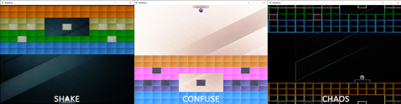

# Postprocessing

Wouldn't it be fun if we could completely spice up the visuals of the Breakout game with just a few postprocessing effects? We could create a blurry shake effect, inverse all the colors of the scene, do crazy vertex movement, and/or make use of other interesting effects with relative ease thanks to OpenGL's framebuffers.

> This chapters makes extensive use of concepts from the [framebuffers](../../../part%204/chapter%205/text.md) and [anti-aliasing](../../../part%204/chapter%2011/text.md) chapters.

In the framebuffers chapter we demonstrated how we could use postprocessing to achieve interesting effects using just a single texture. In Breakout we're going to do something similar: we're going to create a framebuffer object with a multisampled renderbuffer object attached as its color attachment. All the game's render code should render to this multisampled framebuffer that then blits its content to a different framebuffer with a texture attachment as its color buffer. This texture contains the rendered anti-aliased image of the game that we'll render to a full-screen 2D quad with zero or more postprocessing effects applied.

So to summarize, the rendering steps are:

1. Bind to multisampled framebuffer.
2. Render game as normal.
3. Blit multisampled framebuffer to normal framebuffer with texture attachment.
4. Unbind framebuffer \(use default framebuffer\).
5. Use color buffer texture from normal framebuffer in postprocessing shader.
6. Render quad of screen-size as output of postprocessing shader.

The postprocessing shader allows for three type of effects: shake, confuse, and chaos.

- **shake**: slightly shakes the scene with a small blur.
- **confuse**: inverses the colors of the scene, but also the x and y axis.
- **chaos**: makes use of an edge detection kernel to create interesting visuals and also moves the textured image in a circular fashion for an interesting chaotic effect.

Below is a glimpse of what these effects are going to look like:



Operating on a 2D quad, the vertex shader looks as follows:

```glsl
#version 330 core
layout (location = 0) in vec4 vertex; // <vec2 position, vec2 texCoords>

out vec2 TexCoords;

uniform bool  chaos;
uniform bool  confuse;
uniform bool  shake;
uniform float time;

void main()
{
    gl_Position = vec4(vertex.xy, 0.0f, 1.0f); 
    vec2 texture = vertex.zw;
    if (chaos)
    {
        float strength = 0.3;
        vec2 pos = vec2(texture.x + sin(time) * strength, texture.y + cos(time) * strength);        
        TexCoords = pos;
    }
    else if (confuse)
    {
        TexCoords = vec2(1.0 - texture.x, 1.0 - texture.y);
    }
    else
    {
        TexCoords = texture;
    }
    if (shake)
    {
        float strength = 0.01;
        gl_Position.x += cos(time * 10) * strength;        
        gl_Position.y += cos(time * 15) * strength;        
    }
}  
```

Based on whatever uniform is set to true, the vertex shader takes different paths. If either chaos or confuse is set to true, the vertex shader will manipulate the texture coordinates to move the scene around \(either translate texture coordinates in a circle-like fashion, or inverse them\). Because we set the texture wrapping methods to *GL_REPEAT*, the chaos effect will cause the scene to repeat itself at various parts of the quad. Additionally if shake is set to true, it will move the vertex positions around by a small amount, as if the screen shakes. Note that chaos and confuse shouldn't be true at the same time while shake is able to work with any of the other effects on.

In addition to offsetting the vertex positions or texture coordinates, we'd also like to create some visual change as soon as any of the effects are active. We can accomplish this within the fragment shader:

```glsl
#version 330 core
in  vec2  TexCoords;
out vec4  color;
  
uniform sampler2D scene;
uniform vec2      offsets[9];
uniform int       edge_kernel[9];
uniform float     blur_kernel[9];

uniform bool chaos;
uniform bool confuse;
uniform bool shake;

void main()
{
    color = vec4(0.0f);
    vec3 sample[9];
    // sample from texture offsets if using convolution matrix
    if(chaos || shake)
        for(int i = 0; i < 9; i++)
            sample[i] = vec3(texture(scene, TexCoords.st + offsets[i]));

    // process effects
    if (chaos)
    {           
        for(int i = 0; i < 9; i++)
            color += vec4(sample[i] * edge_kernel[i], 0.0f);
        color.a = 1.0f;
    }
    else if (confuse)
    {
        color = vec4(1.0 - texture(scene, TexCoords).rgb, 1.0);
    }
    else if (shake)
    {
        for(int i = 0; i < 9; i++)
            color += vec4(sample[i] * blur_kernel[i], 0.0f);
        color.a = 1.0f;
    }
    else
    {
        color =  texture(scene, TexCoords);
    }
}
```

This long shader almost directly builds upon the fragment shader from the framebuffers chapter and processes several postprocessing effects based on the effect type activated. This time though, the offset matrix and convolution kernels are defined as a uniform that we set from the OpenGL code. The advantage is that we only have to set this once, instead of recalculating these matrices each fragment shader run. For example, the offsets matrix is configured as follows:

```cpp
float offset = 1.0f / 300.0f;
float offsets[9][2] = {
    { -offset,  offset  },  // top-left
    {  0.0f,    offset  },  // top-center
    {  offset,  offset  },  // top-right
    { -offset,  0.0f    },  // center-left
    {  0.0f,    0.0f    },  // center-center
    {  offset,  0.0f    },  // center - right
    { -offset, -offset  },  // bottom-left
    {  0.0f,   -offset  },  // bottom-center
    {  offset, -offset  }   // bottom-right    
};
glUniform2fv(glGetUniformLocation(shader.ID, "offsets"), 9, (float*)offsets);  
```

Since all of the concepts of managing \(multisampled\) framebuffers were already extensively discussed in earlier chapters, I won't delve into the details this time. Below you'll find the code of a *PostProcessor* class that manages initialization, writing/reading the framebuffers, and rendering a screen quad. You should be able to understand the code if you understood the framebuffers and anti-aliasing chapter:

- PostProcessor: [header](post_processor.h), [code](post_processor.cpp).

What is interesting to note here are the *BeginRender* and *EndRender* functions. Since we have to render the entire game scene into the framebuffer we can conventiently call `BeginRender()` and `EndRender()` before and after the scene's rendering code respectively. The class will then handle the behind-the-scenes framebuffer operations. For example, using the *PostProcessor* class will look like this within the game's *Render* function:

```cpp
PostProcessor   *Effects;
  
void Game::Render()
{
    if (this->State == GAME_ACTIVE)
    {
        Effects->BeginRender();
            // draw background
            // draw level
            // draw player
            // draw particles	
            // draw ball
        Effects->EndRender();
        Effects->Render(glfwGetTime());
    }
}
```
Wherever we want, we can now conveniently set the required effect property of the postprocessing class to true and its effect will be immediately active.

### Shake it

As a \(practical\) demonstration of these effects we'll emulate the visual impact of the ball when it hits a solid concrete block. By enabling the shake effect for a short period of time wherever a solid collision occurs, it'll look like the collision had a stronger impact.

We want to enable the screen shake effect only over a small period of time. We can get this to work by creating a variable called ShakeTime that manages the duration the shake effect is supposed to be active. Wherever a solid collision occurs, we reset this variable to a specific duration:

```cpp
float ShakeTime = 0.0f;  

void Game::DoCollisions()
{
    for (GameObject &box : this->Levels[this->Level].Bricks)
    {
        if (!box.Destroyed)
        {
            Collision collision = CheckCollision(*Ball, box);
            if (std::get<0>(collision)) // if collision is true
            {
                // destroy block if not solid
                if (!box.IsSolid)
                    box.Destroyed = true;
                else
                {   // if block is solid, enable shake effect
                    ShakeTime = 0.05f;
                    Effects->Shake = true;
                }
                [...]
            }
        }    
    }
    [...]
}  
```

Then within the game's *Update* function, we decrease the ShakeTime variable until it's 0.0 after which we disable the shake effect:

```cpp
void Game::Update(float dt)
{
    [...]
    if (ShakeTime > 0.0f)
    {
        ShakeTime -= dt;
        if (ShakeTime <= 0.0f)
            Effects->Shake = false;
    }
}  
```

Then each time we hit a solid block, the screen briefly starts to shake and blur, giving the player some visual feedback the ball collided with a solid object.

[postprocessing_shake.mp4](postprocessing_shake.mp4)

You can find the updated source code of the game class [here](game.cpp).

In the next chapter about powerups we'll bring the other two postprocessing effects to good use.
